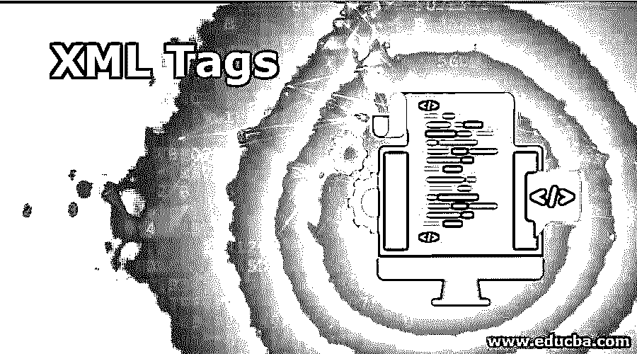
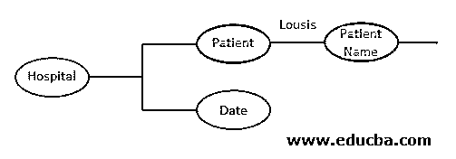
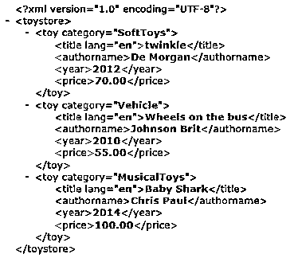
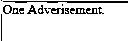
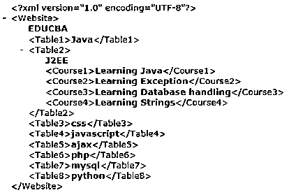

# XML 标签

> 原文：<https://www.educba.com/xml-tags/>




## XML 标记简介

XML 可扩展标记语言标签完全不同于 HTML 标签，因为它们没有预定义的标签，而是 XML 启动用户定义的标签，并被命名为 XML 的可识别特性。在 XML 中，标签是基础，被定义为元素的范围。为了指示哪个元素属于各自的内容，引入了标签。在这里，用户必须根据自己的规范创建自己的标签，并且所有指定的标签都应该与结束标签匹配。明确地说，XML 标签是用户定义的标记语言。XML 标签是使用模式或文档类型定义(DTD)专门定义的，被认为是可扩展的标签。

XML 标记以("")字符开始，用于表示元素的开始和结束，但它不是元素的一部分。在开始和结束标记之间所做的一切都被专门称为内容。元素的内容是公开确定的，可以是字符数据、元素或注释。在此过程中，我们被允许创建新的 XML 标记。XML 部分中的标签区分大小写，这意味着<location>、<location>和</location>这两个标签完全不同，在 Xml 文件中有不同的用途。因为小写和大写的内容在元素名称中是不同的。确切地说，我们应该在一个方面保持一致。</location>

<small>网页开发、编程语言、软件测试&其他</small>

对于中的 to 标记，它们具有一些属性，如下所示:

### XML 标记的属性

下面是 XML 标记的属性:

**1。**XML 中的每个文档都应该有一个特定的根标记，可以用任何用户定义的标记命名，并且应该用正确的根标记名结束。

**举例:**

```
<Hospital>
<patient>
<patient name>lousis Dawn </patient name>
</patient>
<date>   " 29- 10-2019 " </date>
</Hospital>
```

在上面的语句中，它创建了最小的 XML 文档。同时，<hospital>是 XML 文档中的根标签。我们将看到有树的插图。上面的例子有三个元素。X 树就是从上面的例子中画出来的。</hospital>




**2。**开始标签或开始标签应该与结束标签同名。

**3。**如上所述，标签必须区分大小写。

**4。**关闭标签的顺序很明显，外部标签应该在内部标签之后关闭。

```
<root>
<child>
<sub child>
</sub child>
</child>
</root>
```

XML 有三种类型的标签。它们是:

1.  openjtag
2.  关闭标签
3.  空标签

#### 1.打开/开始标签

开始标记表示 Xml 文件中任何非空 XML 元素的开始，并以文本内容和其他元素继续。请始终注意，元素名称应该紧跟在“

**合适的标签:**

```
<mobile1> 99995555 </mobile1>     // numerals are used at the last.
```

**标签不正确**

```
<1abc> britt </1abc>   // as Numerals can’t be a first character.
```

标签之间使用的内容可以是任何字母数字字符。

下面的例子突出显示了标签，以给出文本之间的区别。

**元素含量:**

```
<employee> Suchitra Ben </employee>
<age>    23 </age>
<dob> August 21 </dob>
```

甚至在用(= " ")声明的标记中也使用了属性。对于 XML，属性值不应该省略引号。XML 中不允许不正确的标签嵌套，这在代码中没有什么意义。示例代码如下所示。

```
<Supermarket>
<product category="children">
<pname>Pediacure </pname>
<Mfd>2005</Mfd>
<price>39.54</price>
</product>
</Supermarket>
```

#### 2.结束标签/结束标签

一旦我们从开始标签开始，就必须以结束标签结束，如下图所示。在 xml 中，与 html 不同，默认情况下结束标记必须是关闭的。相同 like 开始标记结束标记不应在字符“/”后用空格描述。

```
<PersonalInfo>
<Fullname>Jane Smith</Fullname>
<Organization>L & T</Organization>
<mobile>(412) 666-4762</mobile>
</PersonalInfo>
```

#### 3.空标签

任何标记之间没有内容的标记都被认为是

空标签。通俗地说，省略元素的描述部分是通过一个名为 empty tag 的简化标记实现的。它可以通过两种方式应用:一种是通过单个元素以开始。

```
<bookname>
</bookname>
```

空标签的完整语法如下所示:

标签末尾的字符“/”告诉 XML 解析器标签中的元素在这里开始和结束。这是一个灵活的简化实现，可以简单方便地标记空元素。

```
<Bookname/>
```

### 例子

以下是 XML 标记的示例:

#### 示例#1

**代码:**

```
<?xml version="1.0" encoding="UTF-8"?>
<toystore>
<toy category="SoftToys">
<title lang="en">twinkle</title>
<authorname>De Morgan</authorname>
<year>2012</year>
<price>70.00</price>
</toy>
<toy category="Vehicle">
<title lang="en">Wheels on the bus</title>
<authorname>Johnson Brit</authorname>
<year>2010</year>
<price>55.00</price>
</toy>
<toy category="MusicalToys">
<title lang="en">Baby Shark</title>
<authorname>Chris Paul</authorname>
<year>2014</year>
<price>100.00</price>
</toy>
</toystore>
```

在上面的代码中<toystore>是根节点，后面跟着子标签。</toystore>

**输出:**




#### 实施例 2

**代码:**

```
<?xml version="1.0" encoding="UTF-8"?>
<pass>One Adverisement.</pass>
<hr></hr>
<hor>This is another Advertisement which is good compared to the second one.</hor>
```

使用

* * *

标签分隔内容并不能包裹全部内容。

**输出:**




#### 实施例 3

```
<?xml version="1.0" encoding="UTF-8"?>
<Website> EDUCBA
<Table1>Java</Table1>
<Table2> J2EE
<Course1>Learning Java</Course1>
<Course2>Learning Exception</Course2>
<Course3>Learning Database handling</Course3>
<Course4>Learning Strings</Course4>
</Table2>
<Table3>css</Table3>
<Table4>javascript</Table4>
<Table5>ajax</Table5>
<Table6>php</Table6>
<Table7>mysql</Table7>
<Table8>python</Table8>
</Website>
```

**输出:**




### 结论–XML 标签

最后，我们已经描述了这篇文章，它给出了 XML 标签和元素的基本解释。通过这种方式，可以阅读和理解 XML 文档在浏览器中的工作方式，并通过一个简单且定义明确的路径提供一个示例。我们在所有的例子中都看到，XML 文档的设计者按照他们的要求使用了元素的名称。

### 推荐文章

这是 XML 标签的指南。在这里，我们讨论 XML 标签及其属性和类型的介绍。您也可以浏览我们推荐的其他文章，了解更多信息——

1.  [卡夫卡的另类|前 5 名](https://www.educba.com/kafka-alternatives/)
2.  [rabbit MQ vs Kafka——最大差异](https://www.educba.com/rabbitmq-vs-kafka/)
3.  [Kafka 工具简介](https://www.educba.com/kafka-tools/)
4.  [10 个最好的卡夫卡面试问题](https://www.educba.com/kafka-interview-questions/)


