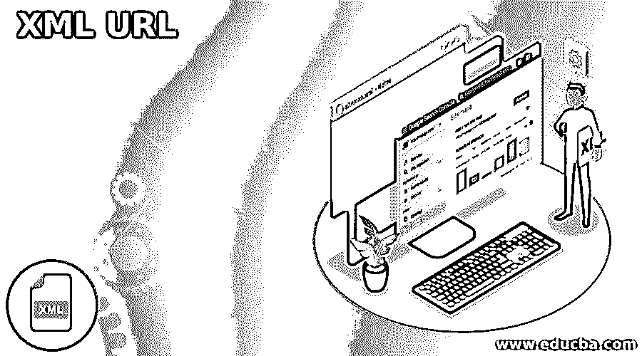
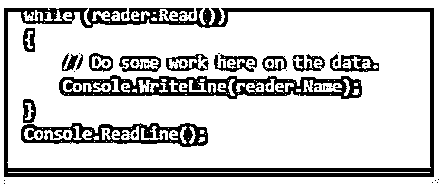
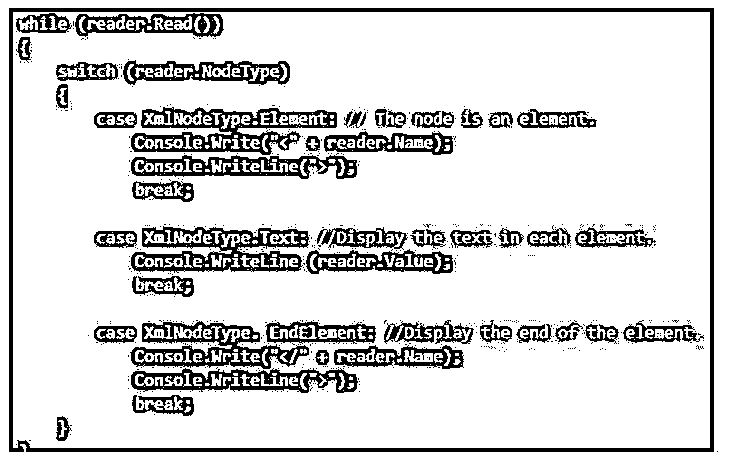
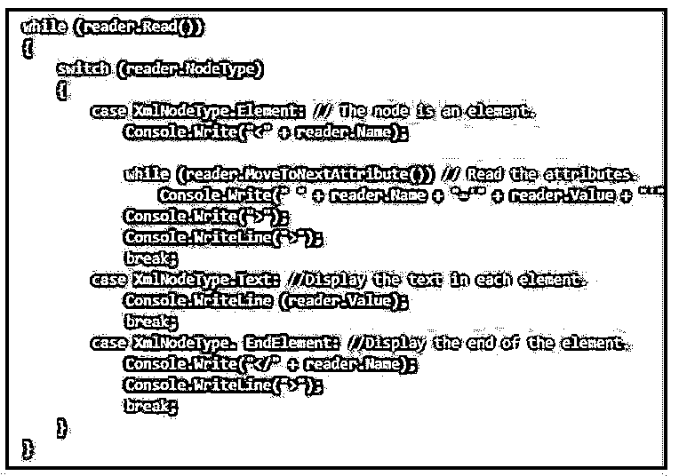

# XML URL

> 原文：<https://www.educba.com/xml-url/>

## XML URL 简介

XML 被扩展为可扩展标记语言，这是一个简单的文本文件，保存了特定网站的所有 URL 细节。它还包含每个 URL 的附加元数据，以及更多信息，如文件最近更新的时间、优先级和其他可用版本。它还用于查找文件是否是用其他语言编写的。每个过程都是为了支持搜索引擎更有效地抓取网站，使用户能够直接输入内容，当添加新文件时，旧文件将被删除。

### 什么是 XML URL？

可扩展标记语言缩写为 XML，它以简单的文本格式保存细节，以表示结构化数据，如文档、配置细节、发票细节、交易细节、元数据和其他基本细节。它是从旧的标准格式 SGML 中提取出来的，更适合 web 使用。这些信息支持搜索引擎在网站上创建有效的爬行。它允许直接进行更改，包括添加新页面和删除旧页面。此外，XML 设置将抓取页面并索引搜索引擎，以增加一般内部链接的机会，这与所有网站页面无关。

<small>网页开发、编程语言、软件测试&其他</small>

如果用户已经熟悉 HTML，他也会在 XML 中看到同样熟悉的特性。XML 语法是标准的，这些工具对文件不起作用，这些文件由错误组成，但当用户试图修复它们时会给出错误值。它标志着所有的 XML 文档都可以由计算机软件可靠地处理。

### 如何使用 XML URL？

XML 广泛用于在本地连接和其他网络中的人、程序和计算机之间共享结构化数据。它有多种优势，因为它可以在不同的格式下工作。用户可以选择他需要的格式，这个过程可以像特定的编辑和搜索工具可以定制，这是广泛可用的。

创建一个新的控制台 C#应用程序，继续列出分步构建应用程序的完整代码。system.xml 中提到了该指令，因此用户不希望在 xml 文本读取器内的类声明中指定。在处理另一个声明之前，用户必须编译一个指令。

在 URL 中检索 XML 流，这些流用于提供设备的可靠性。如果流中的任何源被改变，则不需要改变程序。用户可以在提到的 URL 中声明一个常量，他应该在默认类中执行示例代码。

用户应该在 XmlTextReader 类中创建一个实例，并提供 URL。XmlTextReader 是隐式的，应该在没有文档对象模型干预的情况下访问原始数据。它提供了处理 XML 的快速机制，而 XMLtextreader 类应该在 XML 数据位置的不同构造函数中指定。textreader 的对象应该从 URL 传递给构造函数类。加载后，XmlTextreader 执行顺序方法在 XML 中导航，以使用 read 方法并处理下一条记录。如果没有找到记录，read 方法将返回值 false。应该对 XML 数据进行节点检查，每个记录都有一个由优先级决定的节点类型。value 和 name 属性应该将节点的名称和属性返回到节点值，并且应该根据节点的类型进行枚举。

应该对节点类型进行属性检查，以包括与其相关的属性节点列表。例如，movetonext 属性是一个按顺序移动元素中每个属性的选项。用户使用其属性来测试节点是否有任何其他属性，其中属性计数属性选项执行来自当前节点的属性计数。

### XML URL 的优势

与其他格式相比，XML 有许多优点，而且每个版本都有更好的格式。用户应该为训练和 XML 编辑的格式转换和处理付费，搜索工具现在立即可用。XML 的优点是自描述、冗余、XML 承诺和网络效应。XML 标记是冗长的，每个标记都有描述和例子。它捕捉常见的错误，如不正确的嵌套。XML 的可读性有属性名，人们处理 XML 文档并定期更新它以便更好地理解。

XML 工具的读取和处理应该在 XML 解析器中进行。XML 中的新文档增强了其他相关 XML 文档的价值；因此，该工具的版本和功能每隔一天更新一次。这种广泛使用的格式在全世界都适用。隐含了通用商业语言中的基本标准，这些标准用于文字处理工具和家用电器，如 ODF 和 OOXML。它还用于格式化 web 服务和 XMLRPC 并与之通信。它还支持从所有服务器到小型手机的计算机编程语言。如果用户点击计算机桌面，桌面上有从一个组件到另一个组件的 XML 消息。计算机引擎传输 XML 来诊断机械系统。可以创建和定制该文件，该文件也用作。NET 软件包，并且可以在任何时候下载有关创建的 XML 代码的内容。

### 结论

因此，这些是 XML URL 的基础，可以随时下载。URL 功能是定制的，可以根据需要实现。

### 推荐文章

这是一个 XML URL 的指南。这里我们讨论一下入门，如何使用 XML URL？以及更好理解的优势。您也可以看看以下文章，了解更多信息–

1.  [XML 标签](https://www.educba.com/xml-tags/)
2.  [Scala XML](https://www.educba.com/scala-xml/)
3.  [XML 前缀](https://www.educba.com/prolog-xml/)
4.  [Tomcat server.xml](https://www.educba.com/tomcat-server-xml/)

