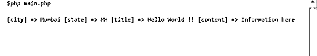

# XML 解析 php

> 原文：<https://www.educba.com/xml-parsing-php/>


## XML 解析 php 简介

XML 是由名称、数据、属性和其他标记组成的文档。它总是有根标签，所有其他标签都存在于它的内部，XML 中的数据作为文本内容存在。如果我们知道 xml 的。所以 php 为我们提供了 SimpleXMl 扩展，帮助我们读取 XMl 文件。通过使用 SimpleXMl，我们也可以轻松地操作 XMl。通过使用 SimpleXML，我们可以轻松地将 XML 转换成代码中可读的对象，并使用任何数据结构迭代它们。在本教程的下一节中，我们将更仔细地研究创建 xml 和从中读取数据的语法，以便初学者更好地理解它。在这个主题中，我们将学习 php 的 XML 解析。

### 安装 xml 解析 php

如果我们想在 php 中读取 xml 文件，那么如果这个库存在于核心 php 本身中，我们就不需要下载或安装任何第三方依赖项。我们可以使用 php 核心提供的 SimpleXML，在这种情况下不需要安装或下载依赖项，因此 php 使得在代码中处理 XML 解析变得很容易。

<small>网页开发、编程语言、软件测试&其他</small>

### 如何用 PHP 读取 XML？

为了读取 cml 文件，我们将使用 SimpleXML 解析器，它是 php 核心的一部分。为了使用它，我们可以简单地提供 xml 文件并使用它的函数来解析它。但是为了继续使用 Simplexml 解析器读取 XML，我们首先必须理解 XML 文件的基本结构。所以在这一节我们将首先讨论基本结构，然后我们将开始使用 SimpleXML 阅读它，所以让我们开始看下面；

**基本结构:**

```
<?xml version='1.0' encoding='UTF-8'?>
<root node>
<child tag 1> one </child tag 1>
<child tag 2> two </child tag 2>
// and so on .. //
</root node>
```

正如我们在上面的语法中看到的，我们可以创建包含根元素的 xml。为了更好地理解，让我们仔细看看语法的细节，见下文；

1)首先，它将包含 xml 文档的版本和编码部分。

2)后跟根元素，这只是其中所有对象的父类。

3)之后我们可以定义呈现它的子对象，也可以包含表示数据列表的列表或数组。

4)记住所有打开的标签应该在适当的位置关闭；否则它会给我们错误。

5)如果 xml 结构不正确，那么将它解析为 pojo 对象时会给我们一个错误。

现在，我们可以使用 SimpleXML 解析器提供的函数来读取 php xml 文件，让我们来详细了解一下这个函数，如下所示；

**a)simplexml _ load _ string():**这个函数用于读取由 Simplexml 解析器提供的 php 中的 XML。这个函数将 xml 作为参数，然后它将尝试解析它。所以我们可以传递我们的变量，这个变量包含了这个 xml。

请参阅参考代码，以便更好地理解以下内容；

**例如:**

```
$myXml=simplexml_load_string($xmlContent)
```

这样我们就可以用它来解析 xml 数据。

### 如何用 PHP 创建 XML？

在这一节中，我们将看到如何使用 php SimpleXml 解析器创建 XMl 文件，让我们仔细看看。为此，我们可以简单地使用一个变量来保存 xml 文档，下面的代码将帮助您理解这一点，见下文；

**语法:**

```
$varibale_name = " xml content here ";
```

正如您在上面的语法中看到的，我们正试图将 xml 内容保存在变量中，为此我们还将看到一个创建它的引用代码。

1)创建保存 xml 的变量

2)如前一部分所讨论的那样，用根元素、属性和关于元素的信息创建 xml。

3)每个开始标签也将有一个结束标签，如果没有将发生错误。

**例如:**

```
$xmlContent =
"<?xml version='1.0' encoding='UTF-8'?>
<demo>
<city>Mumbai</city>
<state> MH </state>
<title> Hello </title>
<content> some information here ..// </content>
</demo>";
```

这样，我们可以创建易于使用和创建的 xml。在下一节中，我们将仔细研究在 php 中使用 SimpleXml 的实践示例，并运行程序以更好地理解附带的输出。

### PHP SimpleXML 从文件中读取

在上一节中，我们已经讨论了使用 SimpleXML 创建和读取文件，在本节中，我们将更仔细地看一下实践示例，以便更好地理解。让我们来看看下面的内容。

1)在下面的例子中，我们将看到从 php 核心提供的 SimpleXMl 解析器中创建和读取一个 xml 文件。我们使用它的函数来读取文件，绕过我们的 xml 作为这里的参数。最后我们转载了 xml 的结果，

**例如:**

```
<?php
// preparing the xml content for document.
$xmlContent =
"<?xml version='1.0' encoding='UTF-8'?>
<demo>
<city> Mumbai </city>
<state> MH </city>
<title> Hello world!! </title>
<content> Information here ..// /< content >
</demo>";
// reading the file using SimpleXML load string function by passing the value.
$result=simplexml_load_string($xmlContent);
// printing the result here ,//
print_r($result);
?>
```

**输出:**




### 结论

在 php 中，解析 xml 内容很容易，因为它为我们提供了一个 SimpleXML 库，它只存在于核心 PHP 中，所以我们不需要从外部安装或下载任何库来实现这个功能。对于开发人员来说，它易于使用、开发、阅读和维护。

### 推荐文章

这是一个 PHP 的 XML 解析指南。这里我们为初学者讨论创建 xml 和从中读取数据的语法。您也可以看看以下文章，了解更多信息–

1.  [XML 使用](https://www.educba.com/xml-uses/)
2.  [XML 浏览器](https://www.educba.com/xml-viewer/)
3.  [XML 保留字符](https://www.educba.com/xml-reserved-characters/)
4.  [XML 生成器](https://www.educba.com/xml-generator/)


