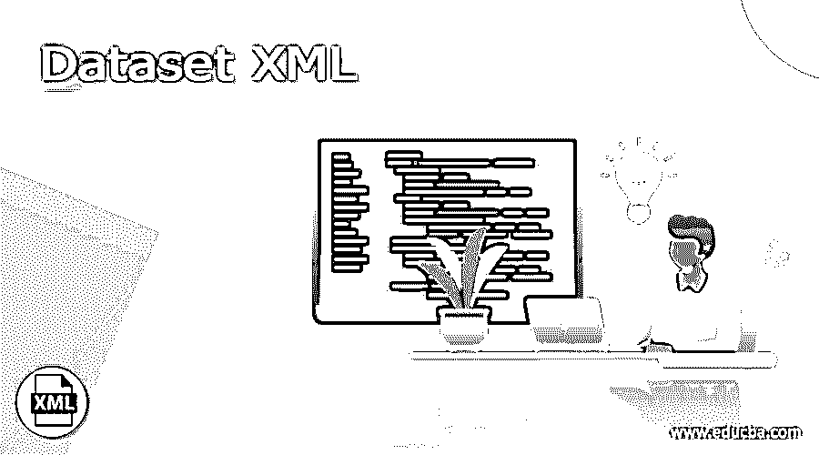
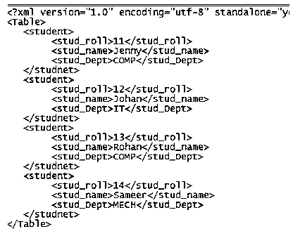
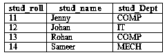

# 数据集 XML

> 原文：<https://www.educba.com/dataset-xml/>

## 数据集 XML 的定义

XML 的意思是可扩展标记语言，基本上，它通过使用基于 ODM 的 XML 技术提供了与不同类型的研究应用程序交换数据的功能，它还帮助我们根据用户要求实现研究之间的通信。通常，XML 允许我们将表格数据交换到两个不同的实体中，这意味着根据用户需求，我们可以将表格数据中的数据交换到不同的实体中。当我们以内联方式编写 XML 模式时，我们可以通过使用模式定义语言来编写 XML 模式，并且模式包含数据集以及关系约束。

### 1.什么是数据集 XML？

这是一篇非常非排他性的文章，它能够以非常熟练的方式存储数据集的保留信息。它独立于 System::Data 命名空间。

<small>网页开发、编程语言、软件测试&其他</small>

一个明确的问题是:何时利用数据集？事实上，恰当的回答是:视情况而定。你应该把它看作是内存中存储信息的分类。因此，在以下情况下很好利用:

您正在处理大量孤立的表或来自不同信息源的表。

您正在与另一个应用程序交换信息，例如 Web 服务。

您对信息库中的记录进行广泛的处理。如果您在每次需要更改某些内容时都使用 SQL 问题，那么准备每个记录可能会导致关联保持打开，这可能会影响执行。您需要对信息执行 XML/XSLT 程序。

### 2.方法

现在让我们来看看不同的方法有什么不同:

*   GetXml():用于从单个字符串中检索数据。
*   GetXmlSchema():将 XML 的 XSD 模式恢复为一个单独的字符串。不返回任何信息。
*   ReadXml():它用于读取 Xml 文件并将其用作数据集。
*   ReadXmlSchema():从文档或 TextReader、XmlReader 或流文章中仔细阅读 XML 蓝图，并使用它来设计(例如，创建约束和 DataColumn 对象)。
*   WriteXml():用于将内容写入文件。我们可以说 TextWriter、XmlWriter 等等。我们还可以选择内联模式选项。
*   WriteXmlSchema():只将描述物质的 XSD 映射写入记录或 TextWriter、XmlWriter 或 Stream 对象。
*   InferXmlSchema():它用于构造 XML 文件，并且可以应用。

### 3.如何从数据集创建 XML 文件

现在让我们看看如何创建 XML 文件，如下所示。

XML 是一种基于标签的语言，这意味着档案由包含数据的标签组成。我们可以录几次。

我们正在制作一个唱片。利用 ADO.NET 数据集的 XML。为此，我们需要首先创建一个数据表并添加信息。数据表中的 XML 记录。然后，在此时添加数据表。调用 Dataset 的策略 WriteXml 并传递文档名。xml 作为争用。

`using System;
using System. Data;
using System.Windows.Forms;
using System.Xml;
namespace WindowsApplication_demo
{
public partial class Form_sample: Form
{
DataTable dt_obj;
public Form_sample()
{
InitializeComponent();
}
private void button1_submit(object sender, EventArgs e_obj)
{
DataSet ds_obj = new DataSet();
dt_obj = new DataTable();
dt_obj.Columns.Add(newDataColumn("stud_roll",Type.GetType("System.Int32")));
dt_obj.Columns.Add(newDataColumn("stud_name",Type.GetType("System.String")));
dt_obj.Columns.Add(newDataColumn("stud_Dept",Type.GetType("System.String")));
fillRows(11, "Jenny", "COMP");
fillRows(12, "Johan", "IT");
fillRows(13, "Rohan", "COMP");
fillRows(14, "Sameer", "MECH");
ds_obj.Tables.Add(dt_obj);
ds_obj.Tables[0].TableName = "stud";
ds_obj.WriteXml("stud.xml");
MessageBox .Show ("Successfully Done");
}
private void fillRows(int sr, string Sname, string sdept)
{
DataRow dr_obj ;
dr_obj = dt_obj.NewRow();
dr_obj["stud_roll "] = sr;
dr_obj["stud_name "] = Sname;
dr_obj["stud_Dept "] = sdepte;
dt_obj.Rows.Add(dr_obj);
}
}
}`

**解释**

在上面的例子中，我们首先手动创建了一个表，然后我们试图将它转换成一个 XML 文件，即 stud.xml 文件。上面程序的最终输出我们用下面的截图来说明。

### 4.XML 文件到数据集

现在让我们看看如何转换 XML 文件数据集，如下所示。

在这个结构中，我们将使用一个已经创建的 XML 文件 stud.xml 来转换为一个数据集，这里我们将创建一个 web 应用程序，添加一个网页，并编写下面提到的代码，如下所示。

`using System;
usingSystem.Collections.Generic;
usingSystem.Data;
usingSystem.Linq;
usingSystem.Web;
usingSystem.Web.UI;
usingSystem.Web.UI.WebControls;
namespaceConvertDatatabletoXMLString
{
public partial class xmltodataset: System.Web.UI.Page
{
protected void Load(object sender, EventArgs e_obj)
{
if (!Page.IsPostBack)
{
ConvertXMLtoDataSet();
}
}
protected void xmltodataset ()
{
ds_obj;
stringstrFileName = string.Empty;
try
{
strFile_Name = Server.MapPath("stud.xml");
datasetobj = new DataSet();
datasetobj.ReadXml(strFile_Name);
Grddata.DataSource = datasetobj;
Grddata.DataBind();
}
catch (Exception Ex)
{
throw Ex;
}
finally
{
datasetobj = null;
strFile_Name = string.Empty;
}
}
}
}`

**解释**

通过使用上面的程序，我们尝试将 XML 转换成数据集，在这个例子中，我们使用一个已经创建的 XML 文件。上面程序的最终输出我们用下面的截图来说明。

### 5.XML 文件结构

现在让我们看看文件结构如下。

该文件由一个带有文档开始标记的根元素组成，并且包含了我们想要的所有元素。

例子

`<Table>
<Student>
<Stud_name></stud_name>
<Stud_dept></stud_dept>
</Student>
</Table>`

XML 文档总是以 prolog 开头，这意味着它有关于 XML 文档的元数据；它包括 XML 文件的版本和编码。

### 6.服务器数据集

该定义描述了它的属性和行为，包括数据集 ID、节标题、结构连接、分布以及从那里开始的限制。尽管如此，它并不存储数据集信息。您可以通过下载数据集定义和信息、从服务器中删除数据集、更改数据集定义，然后重新传输定义和信息来更改员工。

在这些变化中，您唯一的选择是利用其 XML 记录来改变工人数据集:

添加大量分布映射的级数

更改 ID(在下面的场景 1 中讨论)

更改各部分的要求

删除不需要的部分

### 结论

我们希望通过这篇文章，您能够了解更多关于 XML 数据集的知识。从上面的文章中，我们已经理解了 XML 数据集的基本思想，我们还看到了 XML 数据集的表示。从本文中，我们了解了如何以及何时使用 XML 数据集。

### 推荐文章

这是数据集 XML 的指南。这里我们分别讨论什么是数据集 XML，数据集 XML 方法，如何从数据集创建 XML 文件。您也可以看看以下文章，了解更多信息–

1.  [XML 数组](https://www.educba.com/xml-array/)
2.  [XML 保留字符](https://www.educba.com/xml-reserved-characters/)
3.  [Java XML 解析器](https://www.educba.com/java-xml-parser/)
4.  [XML 浏览器](https://www.educba.com/xml-viewer/)

