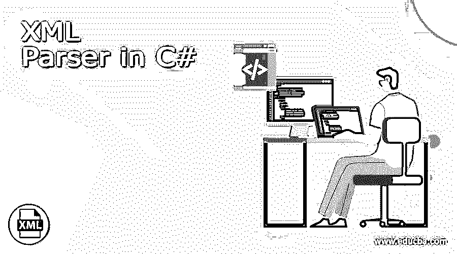

# C#中的 XML 解析器

> 原文：<https://www.educba.com/xml-parser-in-c-sharp/>




## C#中 XML 解析器的定义

XML 解析器被定义为一个软件包或库，它为客户端应用程序提供操作 XML 文档的接口或平台。它确保 XML 文档的正确布局，并认可这些 XML 文档。最近，浏览器是在 XML 解析器上开发的。为了使过程更简单，市场上很少有商业产品可以促进 XML 文档的分离或划分，以获得更有成效的结果。XML 文档的小块有助于用户理解每个概念，因此他可以有效地应用它。

### c#中的 XML 解析是什么？

在 C#中，XML 是一种自我解释的语言，它提供数据和规则来检索它所保存的数据。C#中使用最多的 XML 短语是 MSXML、Saxon、Xerces、Sytem。Xml.document 和 Java 内置解析器。

<small>网页开发、编程语言、软件测试&其他</small>

标准的 XML 工具集在微软核心 XML 服务(MSXML)中可用，它还包括一个解析器。NET 库在系统中是可用的。Xml.document 包含几个与 Xml 相关联的操作类。
该库是在 java 内置解析器中开发的，它有自己的 Java 库，可以借助来自 Saxon 或 Apache 的 Xerces 替代 Java 内置解析器的外部实现。

Saxon 提供了 XML 查询、转换和解析工具

Xerces 在 Java 中被认为是最好的 XML 解析工具，由 Apache source 提供，它是一个开放源码。读取 XML 文件意味着读取 XML 文件中 XML 标签中的数据。根据依赖关系，可以用多种方式读取 XML 文件。该程序可以根据需要以任何方式编译。代码以节点方式读取数据，通过使用 XMLDataDoc 类，用户可以读取适当的 XML 文件。

为了打开和解析 XML 文件，使用了快速且消耗最小内存的 XML 阅读器。它使用户能够一次通过 XML 字符串元素运行，并允许用户查看值，然后他可以继续下一个 XML 元素。它提供了 XML 文件结构的底层抽象。

XMLtextreader 提供 XML 的直接标记化和解析，并执行从 W3C 提取的 XML 值中的 XML 值和名称空间。该类 XMLtextreader 提供只读访问，以转发和流式传输 XML 数据。

### 如何在 c#文件中解析 XML？

C#中的 XML 文件由以下源代码组成。

```
using System;
using System. Data;
using System.Windows.Forms;
using System.Xml;
namespace Edureka
{
public partial class Form1: Form
{
public Form1()
{
InitializeComponent();
}
private void button1_Click(object Edureka, EventArgs e)
{
XmlTextWriter writer = new XmlTextWriter("product.xml", System.Text.Encoding.UTF8);
writer.WriteStartDocument(true);
writer.Formatting = Formatting.Indented;
writer.Indentation = 2;
writer.WriteStartElement("Table");
createNode("1", "Product 1", "100", writer);
createNode("2", "Product 2", "200", writer);
createNode("3", "Product 3", "300", writer);
writer.WriteEndElement();
writer.WriteEndDocument();
writer.Close();
MessageBox.Show("XML File created ! ");
}
private void createNode(course, course_id, courseName, Price, XmlTextWriter writer)
{
writer.WriteStartElement("course");
writer.WriteStartElement("course_id");
writer.WriteString(pID);
writer.WriteEndElement();
writer.WriteStartElement("courseName");
writer.WriteString(pName);
writer.WriteEndElement();
writer.WriteStartElement("price");
writer.WriteString(Price);
writer.WriteEndElement();
writer.WriteEndElement();
}
}
}
```

**c#中的命令 XML 解析**

所有 XML 文档都应该有一个强制的根元素，它应该是所有其他元素的父元素。所有的元素都应该有一个结束标签。如果命令没有结束标记，这是非法的或者会导致错误。

```
<root>
<child>
<data>….<\data>
<\child>
<\root>
```

**XML 开始或序言:**

XML prolog 或开始语法不是必需的。如果它存在，那么它应该在命令的顶部。它也可以包含像法语或挪威语这样的外国字符。为了避免错误，用户应该提到所使用的编码，并以 UTF 8 格式保存 XML 文件。因为它是编码 XML 文档的默认字符。

XML 的标签区分大小写

标签<message>与标签<message>不同。两者服务于不同的目的，不代表相同的意思。结束和开始标记应该用相同的大小写表示。</message></message>

<letter>这个表述是正确的。</letter>

结束和开始标记称为结束和开始标记。它可以在用户喜欢的任何时候应用。

XML 中的元素应该是完全嵌套的。

在 HTML 中，我们会遇到很多不恰当的嵌套数据。但是在 XML 中，所有的元素都得到了适当的关注，并与其他元素嵌套在一起。所以所有的都被正确封装了。

举个例子，

```
<a><b> The subject is a and b <\b><\a>
```

在这里，它是适当嵌套的，这意味着 b 是一个在元素内部打开的元素，而它在元素中是关闭的。所有的 XML 元素都有各自的名称、属性和值对。XML 的属性应该被引用。

XML 的一些字符有一些特殊的含义。例子，

*   &lt 表示小于符号
*   >表示大于一个符号
*   &amp 表示&符号
*   '表示撇号符号
*   &quot 表示引用符号

符号&和带有>符号的< are illegal and it’s strictly not used. But it is a healthy habit to replace >。

XML 在编写注释时使用的注释和 HTML 是一样的。不鼓励在评论中间加两个斜线。最好的例子就是

空白或空白保留在 XML 中，不会缩短多个空格。多个空白可以被截断成单个空白或空白。

在 XML 中，新行保存为 LF。mac 和 Unix 操作系统使用 LF。以前的 mac 版本使用 CR，新的 XML 将新的输入行保存为 LF

XML 文档遵循 XML 中定义良好或格式良好的文档所表示的语法规则。________________________________________

### 结论

因此，这些是 XML 解析 C#中使用的几个命令。通过使用软件包，它充当了客户产品与 XML 文档操作的接口。

### 推荐文章

这是一个用 C#编写的 XML 解析器的指南。这里我们讨论一下什么是 c#中的 XML 解析，如何在 c#文件中进行 XML 解析？分别是。您也可以看看以下文章，了解更多信息–

1.  [XML 使用](https://www.educba.com/xml-uses/)
2.  [XML 特殊字符](https://www.educba.com/xml-special-characters/)
3.  [XML 生成器](https://www.educba.com/xml-generator/)
4.  [C#对象发送方](https://www.educba.com/c-sharp-object-sender/)