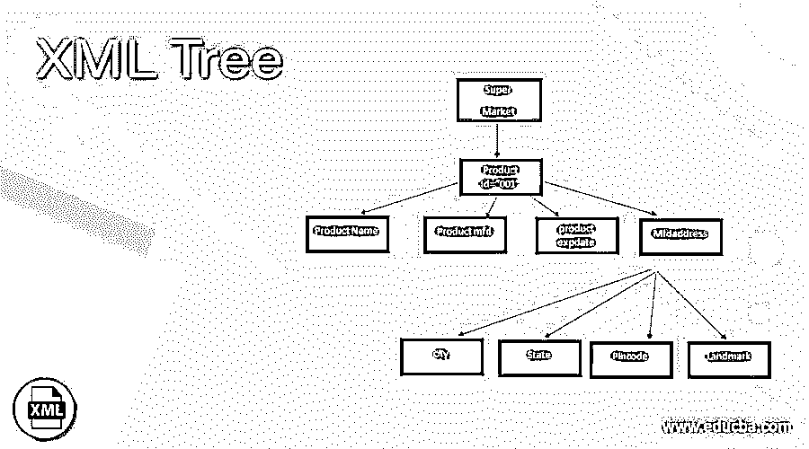
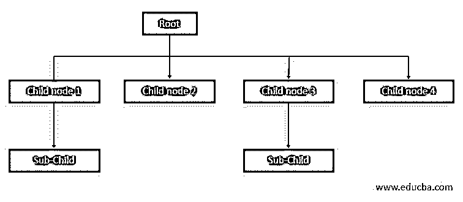
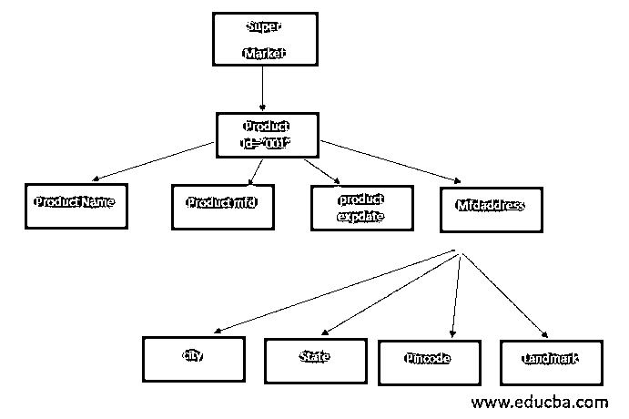
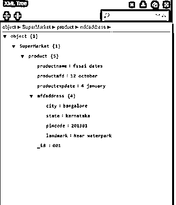
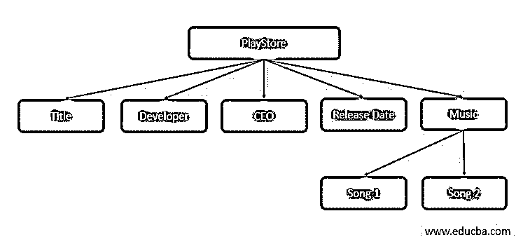
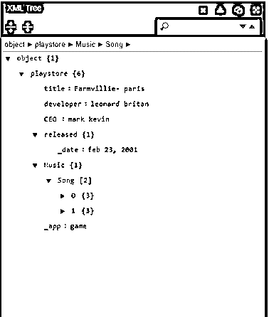
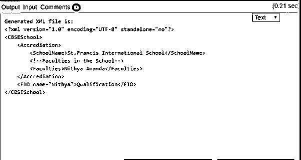

# XML 树

> 原文：<https://www.educba.com/xml-tree/>

## XML 树简介

树结构也称为 XML 树模型或分层模型。它可以被定义为一种分层数据结构，具有两个额外的好处:列表和属性通过在需要时提供对文档所有部分的完全可信的访问，简化了 XML 文档的处理。这个树结构数据模型是节点元素的图形表示，用来表达它们与树模式的关系。与其他树不同，XML 不会立即显示内容；仅示出了结构。树结构有根元素，后跟子元素和子元素。要挑选单个节点或一组节点，使用 Xpath 是最好的。XML 树结构为 python、C#语言的实现提供了帮助。

**语法**

<small>网页开发、编程语言、软件测试&其他</small>

基本语法结构如下图所示:

### 树的加工

树的结构类似于连接树枝和树叶的树；底层的树结构形成了祖先和后代的关系。在这种情况下，顶层元素被放在根元素上，子元素连接到根元素上，并形成元素树。因为树有任意数量的子节点(意味着任何元素都可以有子元素)。同样，特定的子节点可以表现为根节点，根节点可以有任意数量的子节点，依此类推，直到深度。树形结构使用户能够读取 XML 格式的数据。为了理解树结构，有必要阅读基本的 XML 术语和 XML 结构。

### 如何用 XML 设计一棵树？

首先，我们将看到一个 XML 文档，并以此为基础；我们可以设计一个树形结构，因为树形结构是 XML 语言的最佳支持，它具有导出位置的能力，有力地组合了层次格式。我们有一些规则来设计 XML 文档中两个元素之间的结构和关系。规则陈述如下:

**规则 1–后代:**如果 XML 元素‘X’包含在另一个元素‘Y’中，那么 X 就是 Y 的后代。

**规则 2——祖先:**如果 XML 元素‘X’有元素‘Y’，那么 Y 就是 X 的祖先。

**规则 3—**节数据中标签的名称应该是相对的。

### XML 文档的示例

让我们首先看看 XML 文档中的例子

#### 示例#1

`<?xml version="1.0" encoding="UTF-8"?>
<SuperMarket>
<product id="001">
<productname>fssai dates</productname>
<productmfd> 12 october</productmfd>
<productexpdate> 4 january</productexpdate>
<mfdaddress>
<city>bangalore</city>
<state>karnataka</state>
<pincode>201301</pincode>
<landmark>Near waterpark</landmark>
</mfdaddress>
</product>
</SuperMarket>`

在这个例子中，第一行声明 XML 文档的版本为“1.0”。所以，这里的<supermarket>是根元素，后面跟着很多子元素。</supermarket>

**XML 树**

上述 xml 文档的树形结构如下所示:其中根节点为<supermarket>，子元素为<productname>、<product mfd="">、< productexpdate>、<mfdaddress>，对应的子子元素为<city>、<state>、<pincode>、<landmark>。</landmark></pincode></state></city></mfdaddress></product></productname></supermarket>

**计算机在 XML 查看器中生成的 XML 树**

当您单击向下箭头时，它会详细显示树的子树。

#### 实施例 2

用 Xml 文档中的属性和值实现。

`<?xml version="1.0" encoding="UTF-8"?>
<playstore app="game">
<title>Farmvillie- paris</title>
<developer>leonard britan</developer>
<CEO>mark kevin</CEO>
<released date="feb 23, 2001"></released>
<Music>
<Song no="1" duration="15:22">Wheels on the buse</Song>
<Song no="2" duration="16:25">Baby Shark</Song>
</Music>
</playstore>`

在上面的代码中，<playstore>是根节点，category type =" game "是节点属性，year date=" Feb 23 2001 "是节点值。在这里，游戏 id 和歌曲编号都包含文本，被称为文本节点。以树形格式表示上述信息，如:</playstore>

**结果:**

#### 实施例 3

该树的示例实现，通过 Java 进行解析。

这里，我们使用几种方法来创建元素节点、子节点、文本节点和注释节点，如 createElement()、appenrChild()、create TextNode()在文本文件中创建。

`import java.io.*;
import org.w3c.dom.*;
import javax.xml.parsers.*;
import javax.xml.transform.*;
import javax.xml.transform.dom.*;
import javax.xml.transform.stream.*;
public class Main {
public static void main(String[] args) throws Exception {
DocumentBuilderFactory builderFactory =
DocumentBuilderFactory.newInstance();
DocumentBuilder docBuilder =
builderFactory.newDocumentBuilder();
Document dt = docBuilder.newDocument();
new Main().createXmlTree(dt);
}
public void createXmlTree(Document dt) throws Exception {
Element root = dt.createElement("CBSESchool");
dt.appendChild(root);
Element child = dt.createElement("Accrediation");
root.appendChild(child);
Element child1 = dt.createElement("SchoolName");
child.appendChild(child1);
Text text = dt.createTextNode("St.Francis International School");
child1.appendChild(text);
Comment comment = dt.createComment("Faculties in the School");
child.appendChild(comment);
Element element = dt.createElement("Faculties");
child.appendChild(element);
Text text1 = dt.createTextNode("Nithya Ananda");
element.appendChild(text1);
Element chilE = dt.createElement("FID");
chilE.setAttribute("name", "Nithya");
root.appendChild(chilE);
// adding a text element to the child
Text text12 = dt.createTextNode("Qualification");
chilE.appendChild(text12);
TransformerFactory factory = TransformerFactory.newInstance();
Transformer transformer = factory.newTransformer();
transformer.setOutputProperty(OutputKeys.INDENT, "yes");
StringWriter stw = new StringWriter();
StreamResult res = new StreamResult(stw);
DOMSource src = new DOMSource(dt);
transformer.transform(src, res);
String xmlString = stw.toString();
File file = new File("samplexml.xml");
BufferedWriter buf = new BufferedWriter
(new OutputStreamWriter(new FileOutputStream(file)));
buf.write(xmlString);
buf.flush();
buf.close();
System.out.println("Generated XML file is:\n"
+ xmlString);
}
}`

**结果:**

### 结论

因此，我们浏览了树，这是一个系谱树，它提供了以灵活方式操纵树中数据的简单访问，因为它在需要时提供了对 XML 文档中的值的完全访问。它们为今天互联网上使用的各种数据奠定了巨大的基础。XML 文件保存程序控件非常方便，这个树提供了读取 XML 文档的强大功能。如果树的结构是不变的，那么完整的 XML 树就是结构化的。

### 推荐文章

这是一个 XML 树的指南。这里我们讨论如何用 XML 设计一棵树，以及 XML 文档的工作和例子。您也可以看看以下文章，了解更多信息–

1.  [XML 名称空间](https://www.educba.com/xml-namespaces/)
2.  [XML 注释](https://www.educba.com/xml-comments/)
3.  [XML DTD](https://www.educba.com/xml-dtd/)
4.  [XML 版本](https://www.educba.com/xml-versions/)

