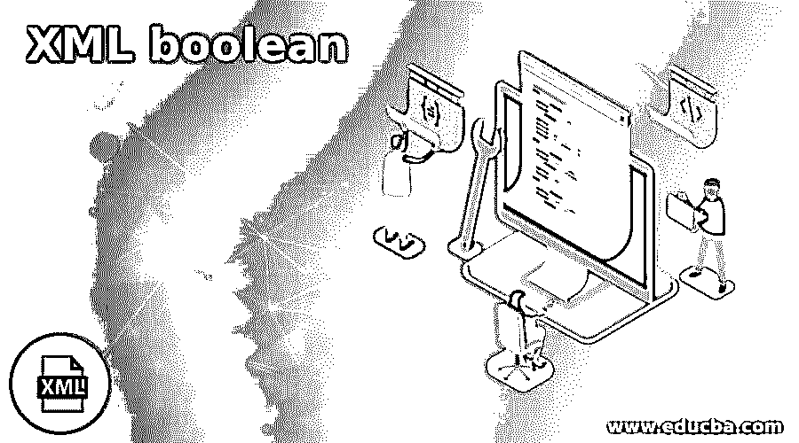
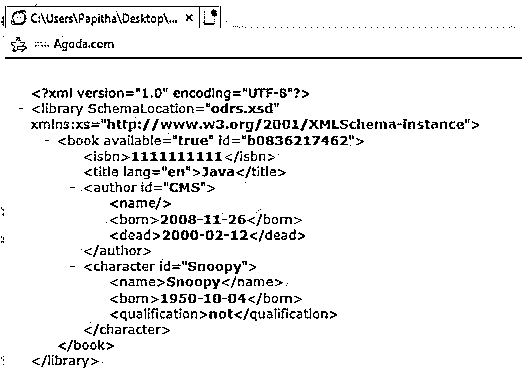
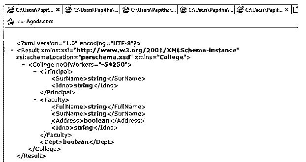

# XML 布尔值

> 原文：<https://www.educba.com/xml-boolean/>

## XML 布尔型简介

XML 布尔类型是一种 XSD 简单数据类型，它将 true 或 false 或 Yes / No 值表示为其类型，并为 False 赋值 0，为 True 赋值 1。关键字 bool 定义了它，它是一个简单的资源，在 name 属性中被引用。在单个 XML 文件下，我们可以组合许多 bool 资源。按照 W3C XML schema 的定义，所有的标准数据类型都在这里定义；一个简短的例子是 xsd: boolean。

**XML 布尔语法**

<small>网页开发、编程语言、软件测试&其他</small>

一般结构如下所示:

`<?xml version="1.0" encoding="utf-8"?>
<resources>
<bool
name="b_name"
>[true | false]</bool>
</resources>`

下面是模式中的布尔声明。

`<xsd: attribute name = “Age” type=:xsd: Boolean”/>`

或者

`Xsd : boolean`

布尔值是一个整数值，其值为“0”和“1”，代表逻辑“是”或“否”。避免使用大写字母。

### 布尔类型在 XML 中如何工作？

此类型是从带有值空格的简单数据类型派生而来的。布尔数据类型主要用于二进制逻辑。这属于杂项数据类型。

布尔值的逻辑模式定义如下:

`<xsd:attribute name="service" type="xsd:boolean"/`

下面是 XML 文档中的一个示例，该属性显示为带有元素:

`<Employee service="false">
< Employee_name >Mac mike</ Employee_ name>
</ Employee>`

对模式定义对象或用户定义模式的任何修改都应该使用这种类型的数据。此处不支持多值布尔属性；仅使用单值。

android 应用程序下的 Xml 文件可以定义为:

`<?xml version="1.0" encoding="utf-8"?>
<resources>
<bool name="display_screen">true</bool>
<bool name="resolution adjust">true</bool>
</resources>
<xsd:simpleType name="trueOrFalse">
<xsd:restriction base="xsd:boolean">
<xsd:pattern value="true" />
<xsd:pattern value="false" />
</xsd:restriction>
</xsd:simpleType>`

xml 中的元素可能如下所示:

`<prize pattern="true"> 850 </prize>`

另一种模式是这样的:

`<xs:simpleType name="boolean" id=”Boolean”>
<xs:restriction base="xs:anySimpleType">
<xs:whitespace="true" />
</xs:restriction>
</xs:simpleType>`

在 XML 样式表的情况下，它被指定为:

`<xsl:template match="Items">

Items in the stock:
<xsl:text> </xsl:text>
<xsl:value-of select="fn:boolean(@Item Numbers)"/>

</xsl:template`

在 XML 模式中，类似于布尔的是-否属性被放置，并且布尔值的表达式受到限制。下面显示了简单数据类型枚举概念的格式。

`<xs:simpleType name="y-n">
<xs:annotation>
<xs:documentation>in case of XSD yes-no format is used for values not an expressions.</xs:documentation>
</xs:annotation>
<xs:restriction base="xs:token">
<xs:enumeration value="yes" />
<xs:enumeration value="no" />
</xs:restriction>
</xs:simpleType>`

在 API 的情况下，很少有字段条目被定义为布尔数据类型，它可以被重新定义为 int 值或带有列表的枚举。当我们有更多对或错的选择时，就会发生这种情况。在这种情况下，最好为应用程序使用一个兼容级别。

具有 nillable 属性的架构定义。

`<xsd:element name="conversion" type="xsd:boolean" nillable="true" default="false">
<xsd:annotation>
<xsd:documentation>Conversion of the type</xsd:documentation>
</xsd:annotation>
</xsd:element>`

### XML 布尔值的示例

下面给出了对 XML 文档格式良好的输入值进行类型检查的示例。这里，数据值被映射到 XML 元素。

#### 示例#1

**odrs.xsd**

**代码:**

`<?xml version="1.0"?>
<xs:schema xmlns:xs="http://www.w3.org/2001/XMLSchema">
<xs:element name="name" type="xs:token"/>
<xs:element name="qualification" type="xs:token"/>
<xs:element name="born" type="xs:date"/>
<xs:element name="dead" type="xs:date"/>
<xs:element name="isbn" type="xs:NMTOKEN"/>
<xs:attribute name="id" type="xs:ID"/>
<xs:attribute name="available" type="xs:boolean"/>
<xs:attribute name="lang" type="xs:language"/>
<xs:element name="title">
<xs:complexType>
<xs:simpleContent>
<xs:extension base="xs:token">
<xs:attribute ref="lang"/>
</xs:extension>
</xs:simpleContent>
</xs:complexType>
</xs:element>
<xs:element name="library">
<xs:complexType>
<xs:sequence>
<xs:element ref="book" maxOccurs="unbounded"/>
</xs:sequence>
</xs:complexType>
</xs:element>
<xs:element name="author">
<xs:complexType>
<xs:sequence>
<xs:element ref="name"/>
<xs:element ref="born"/>
<xs:element ref="dead" minOccurs="0"/>
</xs:sequence>
<xs:attribute ref="id"/>
</xs:complexType>
</xs:element>
<xs:element name="book">
<xs:complexType>
<xs:sequence>
<xs:element ref="isbn"/>
<xs:element ref="title"/>
<xs:element ref="author" minOccurs="0" maxOccurs="unbounded"/>
<xs:element ref="character" minOccurs="0"
maxOccurs="unbounded"/>
</xs:sequence>
<xs:attribute ref="id"/>
<xs:attribute ref="available"/>
</xs:complexType>
</xs:element>
<xs:element name="character">
<xs:complexType>
<xs:sequence>
<xs:element ref="name"/>
<xs:element ref="born"/>
<xs:element ref="qualification"/>
</xs:sequence>
<xs:attribute ref="id"/>
</xs:complexType>
</xs:element>
</xs:schema>`

**字. xml**

`<?xml version="1.0" encoding="UTF-8"?>
<libraryxmlns:xs="http://www.w3.org/2001/XMLSchema-instance" SchemaLocation="odrs.xsd">
<book id="b0836217462" available="true">
<isbn>1111111111</isbn>
<title lang="en">Java</title>
<author id="CMS">
<name></name>
<born>2008-11-26</born>
<dead>2000-02-12</dead>
</author>
<character id="Snoopy">
<name>Snoopy</name>
<born>1950-10-04</born>
<qualification>not</qualification>
</character>
</book>
</library>`

**说明:**

*   在上面的例子中，布尔值用属性类型“name”编码为 true 或 false。
*   当我们执行一个 XML 文件时，我们在输出中得到以下类型的 Boolean。

**输出:**

**

** 

#### 实施例 2

**perchema.xsd**

**代码:**

`<?xml version="1.0" encoding="UTF-8"?>
<xs:schema xmlns:xs="http://www.w3.org/2001/XMLSchema" targetNamespace="College" elementFormDefault="qualified" attributeFormDefault="unqualified">
<xs:element name="Faculty" type="FacultyType"/>
<xs:element name="Result">
<xs:complexType>
<xs:sequence>
<xs:element ref="College" maxOccurs="unbounded"/>
</xs:sequence>
</xs:complexType>
</xs:element>
<xs:element name="College">
<xs:complexType>
<xs:sequence>
<xs:choice maxOccurs="unbounded">
<xs:element name="Faculty" type="FacultyType"/>
<xs:element name="Principal" type="FacultyType"/>
</xs:choice>
<xs:element name="Dept" type="xs:boolean" maxOccurs="unbounded"/>
</xs:sequence>
<xs:attribute name="noOfWorkers" type="xs:int"/>
</xs:complexType>
</xs:element>
<xs:complexType name="FacultyType">
<xs:sequence>
<xs:element name="FullName" type="xs:string" minOccurs="0"/>
<xs:element name="SurName" type="xs:string" minOccurs="0"/>
<xs:element name="Address" type="xs:boolean" minOccurs="0"/>
<xs:element name="Idno" type="xs:string"/>
<xs:element name="YearsOfExperience" type="xs:int" minOccurs="0"/>
</xs:sequence>
</xs:complexType>
</xs:schema>`

**per.xml**

**代码:**

`<?xml version="1.0" encoding="utf-8"?>
<Result xsi:schemaLocation="perschema.xsd" xmlns:xsi="http://www.w3.org/2001/XMLSchema-instance">
<College noOfWorkers="-54250">
<Principal>
<SurName>string</SurName>
<Idno>string</Idno>
</Principal>
<Faculty>
<FullName>string</FullName>
<SurName>string</SurName>
<Address>boolean</Address>
<Idno>string</Idno>
</Faculty>
<Dept>boolean</Dept>
</College>
</Result>`

**说明:**

*   为学院文件中的地址标记元素指定的布尔值“是”或“否”。模式部分定义了地址元素的类型。

**输出:**

**

** 

#### 实施例 3

航空系统。

**air.xsd**

**代码:**

`<xs:schema attributeFormDefault="unqualified" elementFormDefault="qualified" xmlns:xs="http://www.w3.org/2001/XMLSchema">
<xs:element name="Backoff">
<xs:complexType>
<xs:sequence>
<xs:element name="Airlines">
<xs:complexType>
<xs:sequence>
<xs:element name="Airline" maxOccurs="unbounded" minOccurs="0">
<xs:complexType>
<xs:sequence>
<xs:element name="Flight" maxOccurs="unbounded" minOccurs="0">
<xs:complexType>
<xs:sequence>
<xs:element type="xs:int" name="Ano"/>
<xs:element type="xs:short" name="Acode"/>
<xs:element type="xs:float" name="rREAL64" minOccurs="0"/>
<xs:element type="xs:string" name="sSTRING"/>
<xs:element type="xs:string" name="bBOOL"/>
<xs:element type="xs:short" name="Adev"/>
</xs:sequence>
<xs:attribute type="xs:byte" name="Instance" use="optional"/>
</xs:complexType>
</xs:element>
<xs:element name="Flight2" maxOccurs="unbounded" minOccurs="0">
<xs:complexType>
<xs:sequence>
<xs:element type="xs:string" name="sSTRING"/>
<xs:element type="xs:string" name="bBOOL"/>
<xs:element type="xs:byte" name="Adev"/>
</xs:sequence>
<xs:attribute type="xs:byte" name="Instance" use="optional"/>
</xs:complexType>
</xs:element>
</xs:sequence>
<xs:attribute type="xs:string" name="Name" use="optional"/>
</xs:complexType>
</xs:element>
</xs:sequence>
</xs:complexType>
</xs:element>
</xs:sequence>
</xs:complexType>
</xs:element>
</xs:schema>`

**Airline.xml**

`<?xml version = "1.0" encoding="utf-8" ?>
<Backoff>
<Airlines>
<Airline Name=" Western">
<Flight Instance="1">
<Ano>123456789</Ano>
<Acode>5425</Acode>
<sSTRING>This is Adria Airways</sSTRING>
<bBOOL>true</bBOOL>
<Adev>200</Adev>
</Flight>
<Flight Instance="2">
<Ano>44582351</Ano>
<Acode>20215</Acode>
<rREAL64>234.56789</rREAL64>
<sSTRING>This is Air France</sSTRING>
<bBOOL>false</bBOOL>
<Adev>-10</Adev>
</Flight>
<Flight Instance="3">
<Ano>345678901</Ano>
<Acode>3456</Acode>
<sSTRING>This is Delta Airlines</sSTRING>
<bBOOL>true</bBOOL>
<Adev>250</Adev>
</Flight>
</Airline>
<Airline Name="Asia">
<Flight2 Instance="1">
<sSTRING>This is Emirates Airlines</sSTRING>
<bBOOL>false</bBOOL>
<Adev>-88</Adev>
</Flight2>
<Flight2 Instance="2">
<sSTRING>This is Malaysia Airlines</sSTRING>
<bBOOL>true</bBOOL>
<Adev>-19</Adev>
</Flight2>
</Airline>
</Airlines>
</Backoff>`

**说明:**

*   以上示例为元素标记 flight 选择了 bool 值，值为“true”或“false”。

### 结论

希望本文中关于 XML Boolean 的信息给出了关于二进制逻辑的很好的想法，并给出了不同模式类型的准确方向。我们在这里看到的数据类型与 XML 模式名称空间相关联。这个概念很容易理解读者可以探索的其他特性。

### 推荐文章

这是一个 XML 布尔的指南。在这里我们讨论一下导论，布尔类型在 XML 中是如何工作的？和示例。您也可以看看以下文章，了解更多信息–

1.  [XML 元素](https://www.educba.com/xml-element/)
2.  [XML 模式](https://www.educba.com/xml-schema/)
3.  [XML 属性](https://www.educba.com/xml-attributes/)
4.  [XML 错误](https://www.educba.com/xml-error/)

