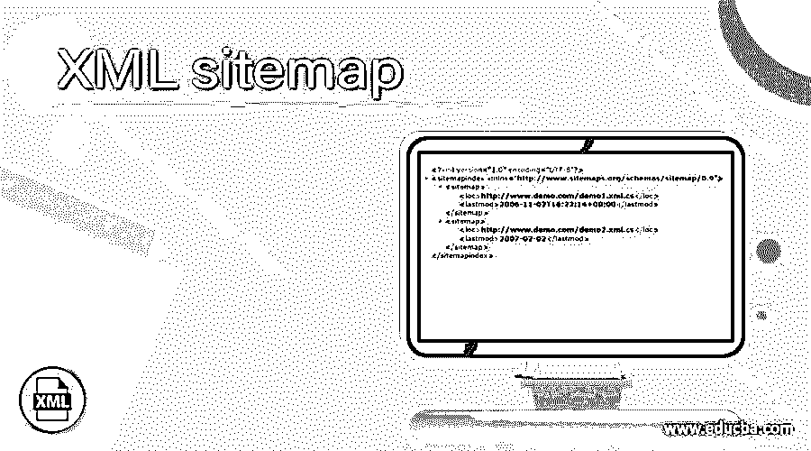
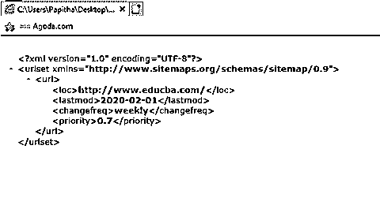
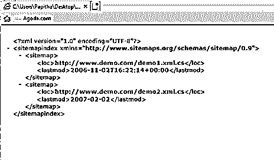
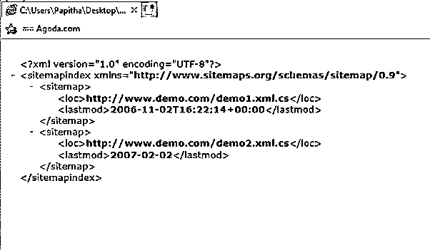

# XML 站点地图

> 原文：<https://www.educba.com/xml-sitemap/>

## XML 站点地图简介

网站地图被定义为一个 XML 文件，一个特殊的文档，其中包含所有网站的 URL 列表或添加在每个 URL 的元数据上的不同网页的链接。它是一个驻留在 web 服务器中的代码文件，帮助 web 引擎爬虫评估网站的排名，在 SEO 中起着重要的作用。它是专门为所有搜索引擎设计的，比如 google 和 Bing，用来查找相关网页，并告诉搜索引擎哪个网站更优先。它被塑造成 XML 文件的形式，包含带有标签的标记。

**语法**

<small>网页开发、编程语言、软件测试&其他</small>

一般格式如下:

`<? XML Declaration>
<urlset>
<url>
<loc>
</url>
</loc>
</
urlset>`

第一行是一个 XML 声明，告诉搜索引擎它正在读取 XML 文件，版本是 1.0。第二行是所有 URL 的容器；所有的网站地图都有一个标准的 0.90。第三行是每个 URL 的父标签。这个标签包含可选的属性，这将在下面讨论。

### 站点地图在 XML 中是如何工作的？

网站地图包括网站的小信息，如它们的版本，最后更新，也使爬虫灵活有效地搜索。所以，工作流程很简单。让我们以 google 这样的实时场景为例，没有 Google maps 同样很难找到一个目的地，而且 Google 有时很难在没有 Sitemap 的情况下搜索相应网站的网页。将带有站点地图的 XML 文件放在浏览器上分别决定了如何搜索网页以及在相应的页面中存在什么，并有助于抓取页面。例如，Google 提供 Google Sitemap 来查找动态网页。XML sitemap 切断内部链接来查找网页。

当一个网站比较大，或者一个网站有大量的链接，并且外部链接也包括媒体链接的时候，就使用站点地图。XML 站点地图对用户不可见，大小包括 10MB 的文件大小。如上所述，XML 站点地图可以很好地处理 XML 标记，最重要的组件包括

*   **< urlset > :** 每个站点地图都以这个元素的开始标签开始，以结束标签结束。这指定了到相应协议标准的链接。
*   **< url > :** 它决定了子链接页面的开始和结束。
*   **< loc > :** 它指定了指定 URL 中的各个网页，还定义了字符的最大长度。

包含的文本文件包含如下条目:

http://www.demo.com/catalog?item=20

上面的语句说，文本文件应该每行只有一个 URL，并且应该以“http”开头，在 XML 声明中使用 UTF-8 编码。XML sitemap 最多有 50，000 个 URL。所有的 URL 都使用一个索引文件来指定，该索引文件可选地指定为 **<** sitemapindex >。其他标签包括 changefreq 和 priority。使用 URL 中的实体转义使 web 服务器能够读取和编码位置。

单个 URL 的定义如下

`<url>
<loc>https://www.nationalparkdc.com/</loc>
<lastmod>2019-04-12T16:55:20+03:00</lastmod> </url>`

**放置 XmlSite**

正常的 URL 是 sitemap.xml 另一种情况，我们可以在 robots.txt 文件中引用。

**网站地图的类型包括**

*   **图片网站地图:**用于浏览托管网站中的所有图片
*   **视频网站地图:**帮助谷歌搜索网页上的视频内容
*   **新闻网站地图:**查找博客和新闻，并帮助谷歌使之变得容易。
*   移动网站地图。

一旦我们有了组织良好的网站，它负责技术团队创建一个 XML 网站地图，并提供给网络服务器，最后分发到不同的搜索引擎。当我们创建一个博客时，网站地图是非常有益的，因为新的案例没有反向链接。这也是 sitemap 需要提交站长工具的原因。

### 任何网站使用网站地图的好处

*   帮助设置 URL 的优先级，这有利于搜索引擎。
*   这有利于爬虫高效地抓取和发现网页。
*   放置优先级设置和最近修改的术语显示页面最近更新的时间。
*   如果任何商业或个人网站都不应该被索引，强烈推荐使用网站地图。

**限制**

*   文件大小有限。
*   设置了 URL 计数的最大数量。
*   制作最新的。

**注意:**推荐使用 XML Sitemap 生成器，现在很少有工具可以自行创建。有几个付费的 XML 网站支付容纳 500 个网址。

### 例子

这里我们讨论下面提到的例子

#### 示例 1–带有可选标签的简单示例

**sitemap.xml**

`<?xml version="1.0" encoding="UTF-8"?>
<urlset >
<url>
<loc>http://www.educba.com/</loc>
<lastmod>2020-02-01</lastmod>
<changefreq>weekly</changefreq>
<priority>0.7</priority>
</url>
</urlset>`

**解释**

这就是一个简单的站点地图是如何用不同的标签实现的。上面的代码指定了一种 XML sitemap 格式，搜索引擎在其中寻找子页的链接。在上面的例子中，我们使用了一个 URL 和一组不同的可选参数。

**输出:**

#### 例子# 2–使用许多 URL

**site2.xml**

`<?xml version="1.0" encoding="UTF-8"?>
<urlset >
<url>
<loc>http://www.google.com/</loc>
<lastmod>2009-02-06</lastmod>
<changefreq>monthly</changefreq>
<priority>0.9</priority>
</url>
<url>
<loc>https://www.google.com/search?q=europecountry+article&oq=europe&aqs</loc>
<changefreq>day</changefreq>
</url>
<url>
<loc>https://www.google.com/search?q=europecountry+article&oq=europe&aqs</loc>
<lastmod>2010-11-20</lastmod>
<changefreq>weekly</changefreq>
</url>
<url>
<loc>https://www.zoho.com/writer/collaborative-writing.html</loc>
<lastmod>2006-11-21T16:00:13+00:00</lastmod>
<priority>0.4</priority>
</url>
<url>
<loc>http://www.example.com/catalog?item=83&amp;desc=vacation_usa</loc>
<lastmod>2006-10-23</lastmod>
</url>
</urlset>`

**解释**

上面的代码使用了许多 URL 来展示站点地图的概念，我们也添加了一些实体转义字符。

**输出:**

#### 实施例 3

**site3.xml**

`<?xml version="1.0" encoding="UTF-8"?>
<sitemapindex >
<sitemap>
<loc>http://www.demo.com/demo1.xml.cs</loc>
<lastmod>2006-11-02T16:22:14+00:00</lastmod>
</sitemap>
<sitemap>
<loc>http://www.demo.com/demo2.xml.cs</loc>
<lastmod>2007-02-02</lastmod>
</sitemap>
</sitemapindex>`

**解释**

上面的代码解释了包含两个站点地图条目的站点地图索引文件。这个文件存储在服务器的目录中，然后提交给搜索引擎。由于网站本质上是动态变化的，XML 文件应该是结构化的。

**输出:**

### 结论

在本文中，我们看到了如何为所有网站使用 XML 站点地图。第一步是使用 Yoast SEO 插件，它可以自动更新。网上也有插件可以使用 XML Sitemap。用它我们可以把网站地图分成几个小的网站地图。这个站点地图帮助搜索引擎根据相关性对站点进行排序。因此，最后的想法是，我们已经了解了网站地图的基本知识，它们的用途和创建，以及每种类型的示例。

### 推荐文章

这是 XML 网站地图的指南。在这里，我们讨论了站点地图如何在 XML 中工作，以及为任何网站使用站点地图的好处。您也可以看看以下文章，了解更多信息–

1.  [XML 模式](https://www.educba.com/xml-schema/)
2.  [XML 注释](https://www.educba.com/xml-comments/)
3.  [XML 编码](https://www.educba.com/xml-encoding/)
4.  [带 CSS 的 XML](https://www.educba.com/xml-with-css/)

