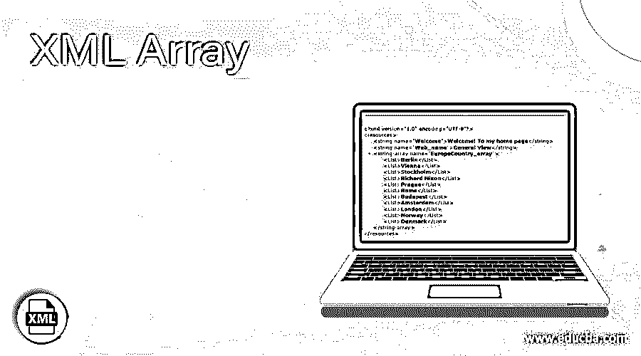
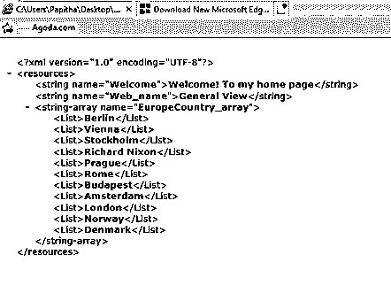
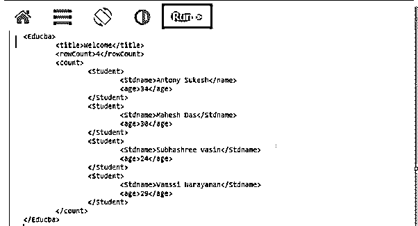
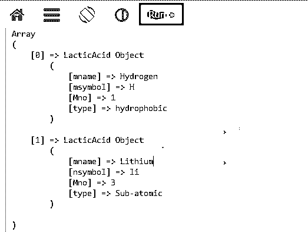

# XML 数组

> 原文：<https://www.educba.com/xml-array/>

## XML 数组简介

XML 数组定义为一个变量数组，将列表中的相同项组合在一起，并包含一个或多个子项。数组是用相同名称声明的元素序列。为元素集合创建多维数组。数组是通过成对创建函数来完成的。每一对中都收集了许多元素。DOM 用参数 attribNamesArray 和值数组创建一个 XML 元素数组。

**语法**

<small>网页开发、编程语言、软件测试&其他</small>

通用语法如下所示:

`<?xml version="1.0" encoding="utf-8"?>
<resources>
<array
name="integer_array_name">
<item>resource</item>
</array>
</resources> `

数组是使用包含数据值的数组元素来指定的。在上面的语法中，array 元素有一个 name 元素，并用 item 标记括起来。这样，我们可以在任何编程语言中实现数组类型。

### XML 中数组是如何工作的？

Array 与 C# Serialize 一起在 XML 中工作良好，C # Serialize 将属性添加到数组元素中。换句话说，我们可以说，在序列化之后添加对象。在本文中，我们解释了如何使用 C#和 PHP 编程概念来处理 XML 数组。假设一个数组的规格如下:

一个 XML 可能看起来像这样

类型:数组<cds>‘MP2’</cds>

列表:<cds>‘MP3’</cds>

类型:字符串<cds>‘MP4’</cds>

示例:

*   mp2 '
*   ' mp3 '
*   mp4 '

让我们用一个小的示例代码来理解这个概念。首先是我们的 XML 文件生成:

`<Courses count= “3”>
<Java>little rat</ Java >
<XML>old rat</ XML >
</Courses>`

对应的 C#代码是

`[XmlType(“Courses”)] public class Courses
{
[XmlAttribute(“count”)] public int Count {get; set; }
[XmlElement(“Courses”)] // now the array element will be as same as the object element Rats.
public string[]Courses { get; set;}`

接下来，在 PHP 中将 XML 文件文档转换为数组结构:为此，我们需要一些函数来执行下面列出的任务:

1.  **file_get_contents ()** :它读取文件，因为字符串类型有助于读取 XML 文件的内容。
2.  **simplexml_load_string ()** :解析 xml 文件以获取相关信息，因为我们在网站中有更多的 API。
3.  **json_ encode** :编码后返回 json 值。
4.  **json_decode** :返回解码后的值。

在单个数组中使用多个文件

`<?PHP
foreach ($fil as $file) {
$xmlf= simplexml_load_file($file);
XMLToArrayFlat($xmlf, $xmlarray, $fil.':', true);
}
?>`

最后，在下面所有的例子中，我们应用了一个声明为数组的属性。有时，集合会修改外部元素，最后对对象应用序列化。

### 例子

接下来的部分将详细讨论用 Serializable 和 PHP 语言实现的 XML 数组和属性。

#### 示例#1

**android.xml**

`<?xml version="1.0" encoding="utf-8"?>
<resources>
<string name="Welcome">Welcome! To my home page</string>
<string name="Web_name">General View</string>
<string-array name="EuropeCountry_array">
<List>Berlin</List>
<List>Vienna</List>
<List>Stockholm</List>
<List>Richard Nixon</List>
<List>Prague</List>
<List>Rome</List>
<List>Budapest</List>
<List>Amsterdam</List>
<List>London</List>
<List>Norway</List>
<List>Denmark</List>
</string-array>
</resources>`

**解释**

下面是一个简单的例子，在 Android 应用程序中有一个不同国家的数组列表。

**输出:**

#### 示例 2–使用 PHP 的数组

**new.php**

`<?php
libxml_use_internal_errors(TRUE);
$objDoc = simplexml_load_file("lib.xml");
if ($objDoc === FALSE) {
echo "Gives an error in the XML file.\n";
foreach(libxml_get_errors() as $error) {
echo $error->message;
}
exit;
}
$objJsonDoc = json_encode($objDoc);
$arrOutput = json_decode($objJsonDoc, TRUE);
echo "<pre>";
print_r($arrOutput);
?>`

**lib.xml**

`?xml version='1.0'?>
<Library>
<Department id="1">
<Bookname>XML Introduction</Bookname>
<author>O'reilla</author>
<address>
<Door>4201  Greenland Avenue</Door>
<city>New York</city>
<Country>United States</Country>
</address>
</Department>
<Department id="2">
<Bookname>Data Warehouse</Bookname>
<author>Mac meihelline</author>
<address>
<Door>5840  texas House</Door>
<city>Dallas</city>
<Country> Canada</Country>
</address>
</Department>
</Library>`

**解释**

在上面的代码中，我们使用了一个函数库来支持用户处理错误。这允许我们捕捉 XML 错误。接下来是 XML 加载文件，它加载一个 XML 文件，相应的路径在。如果解析成功，则返回 True，否则返回 False。在这一行之后，下一个语句 JSON 将 XML 对象转换成 JSON 格式。因此，最终的输出将是这样的。

**输出:**

#### 示例 3–将多维数组转换为 XML 文件

`$array = array (
'School' => 'Bostin Secondary School',
'Student' => array (
'0' => array (
'Stdname' => 'Antony Sukesh',
'age' => '18'
),
'1' => array (
'Stdname' => 'Mahesh Das',
'age' => '20'
),
'2' => array (
'Stdname' => 'Subhashree vasin',
'age' => '19'
),
'3' => array (
'Stdname' => 'Vamssi Narayanan',
'age' => '21'
)
)
);`

**PHP 类中的函数生成**

`function doXML($info) {
$head = $info['School'];
$rcount = count($info['Student']);
$xdc = new DOMDocument();
$root = $xdc -> appendChild($xdc ->
createElement("EDUCBA"));
$root -> appendChild($xdc ->
createElement("Welcome", $Welcome));
$root -> appendChild($xdc ->
createElement("No.of Std", $rcount));
$tabU = $root -> appendChild($xdc ->
createElement('count educba'));
foreach($info['Student'] as $uu) {
if (!empty($uu)) {
$tabU = $tabU -> appendChild($xdc ->
createElement('Student'));
foreach($uu as $kk => $val) {
$tabU -> appendChild($xdc ->
createElement($kk, $val));
}
}
}
$xdc -> formatOutput = true;
$fi_name = str_replace(' ', '_', $welcome) . '.xml';
$xdc -> save($fi_name);
return $fi_name;
}`

**解释**

这里我们绕过参数设置根元素，默认情况下，数组的所有键名都用下划线命名。执行这段代码后，结果将如下所示:

**输出:**

#### 实施例 4

**mol.xml**

`<?xml version="1.0"?>
<Chemical>
<molSubstance>
<mname>Hydrogen</mname>
<msymbol>H</msymbol>
<Mno> 1 </Mno>
<type>hydrophobic</type>
</molSubstance>
<molSubstance>
<mname>Lithium</mname>
<msymbol>li</msymbol>
<Mno>3</Mno>
<type>Sub-atomic</type>
</molSubstance>
</Chemical>`

**PHP 文件解析数组**

`<?php
class LacticAcid {
var $mname;
var $msymbol;
var $Mno;
var $type;
function LacticAcid ($la)
{
foreach ($la as $l=>$vi)
$this->$l = $la[$l];
}
}
function readDb($filename)
{
$dt = implode("", file($filename));
$par = xml_parser_create();
xml_parser_set_option($par, XML_OPTION_CASE_FOLDING, 0);
xml_parser_set_option($par, XML_OPTION_SKIP_WHITE, 1);
xml_parse_into_struct($par, $dt, $val, $tags);
xml_parser_free($par);
foreach ($tags as $kk=>$val) {
if ($kk == "molecule") {
$molrang = $val;
for ($k=0; $k < count($molrang); $k+=2) {
$offset = $molrang[$k] + 1;
$leng = $molrang[$k + 1] - $offset;
$tdb[] = parseMol(array_slice($val, $offset, $leng));
}
} else {
continue;
}
}
return $tdb;
}
function parse($mval)
{
for ($k=0; $k < count($mval); $k++) {
$mol[$mval[$k]["tag"]] = $mval[$k]["value"];
}
return new LacticAcid($mol);
}
$dba = readDatabase("mol.xml");
echo "** Database of LacticAcid objects:\n";
print_r($dba);
?>`

**解释**

上述代码脚本的输出如下所示:

**输出:**

### 结论

本文通过简单的编程示例讨论了如何在 XML 文件中使用数组。这在解析和处理 XML 文档时非常有用。来到字符串数组，它们更强大，android 应用程序利用它将字符串数据存储在资源文件中。

### 推荐文章

这是一个 XML 数组的指南。在这里，我们通过简单的编程示例和输出来讨论如何在 XML 文件中使用数组。您也可以阅读以下文章，了解更多信息——

1.  [XML XSD](https://www.educba.com/xml-xsd/)
2.  [XML 注释](https://www.educba.com/xml-comments/)
3.  [XML 数据库](https://www.educba.com/xml-database/)
4.  [XML DTD](https://www.educba.com/xml-dtd/)

