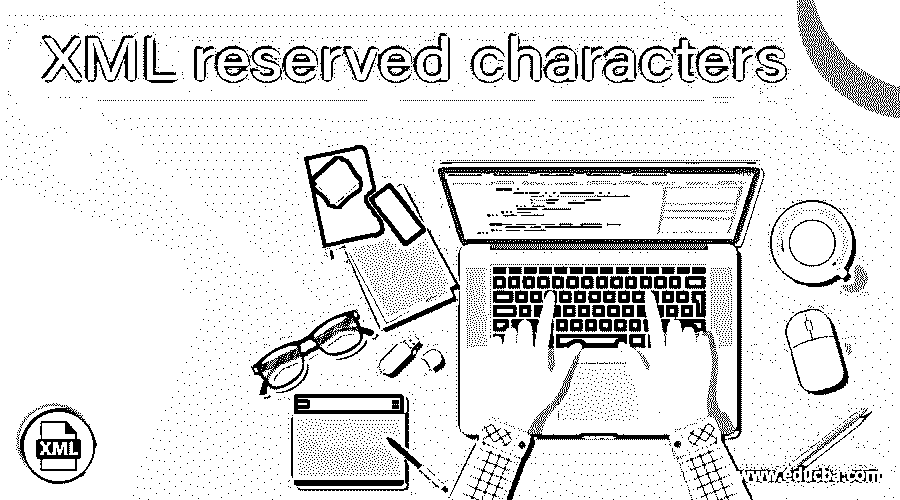
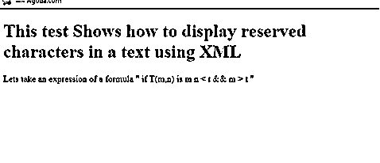
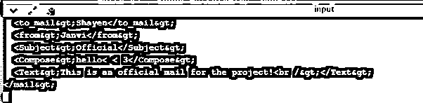
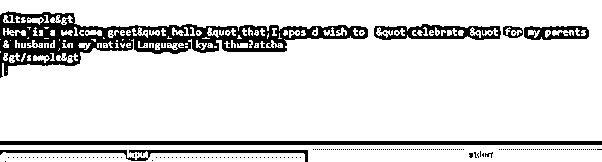

# XML 保留字符

> 原文：<https://www.educba.com/xml-reserved-characters/>

## XML 保留字符介绍

XML 保留字符被定义为 CDATA 节中使用的特殊字符。XML 处理器解析这些保留字符，因为 XML 在具有挑战性的任务中使用标签和表示实体的树状结构。为了自定义 XML 文件中的任何字符串，使用了这些保留字符符号。这个保留字符在编辑查询和向 XML 文件输入 SQL 代码时提供帮助。由于 XML 标签对标签元素和属性使用很少的字符，所以在 XML 标签中避免使用这些字符；相反，在 XML 文件中使用数字字符引用。

**语法**

<small>网页开发、编程语言、软件测试&其他</small>

保留字符分配如下，或者替换实体已用于任何属性数据中。下面给出了保留字符的语法:

使用' & '保留字符

`attributeName="This is &quot;made&quot;"`

使用 apos 保留字符

`attributeName='She  replied "OK"'`

为了在 XML 中使用大于号，我们提供了>一个符号名。在示例部分，我们将看到如何在内容数据中使用&符号。

处理 XML 是一项具有挑战性的任务，尤其是使用&和大于号会导致 XML 解析器失败，给出不正确的结果。在上面的语法中，我们对内容使用了单引号。

### 如何在 XML 中使用保留字符？

XML 解析器遇到像左括号(这样的符号，它假设一个新元素标记即将开始。这些是表示 XML 标签的元字符，所以基本上，它们是用实体来表示的。内容中的一些实体被替换为字符引用。这些实体用于表示 XML 文档中的数据项，而不是使用数据本身。在编写 XML 文档时，很少有符号会忽略 XML 验证，在处理指令时，很少有 XML 编辑器会自动替换文字。下面列出了五个预定义的保留字符，这个字符表应该进行编码，并且最好在 URL 和其他字符串方法中使用。

| **Sno** | **实体** | **描述** |
| One | &lt | 它在字符数据中指定小于' |
| Two | > | 它在字符数据中指定大于“”。这结束了一个标签。 |
| Three | &amp | 在字符数据中指定' & '符号。这将启动实体标记。 |
| Four | ' | 在字符数据中指定' ' '符号。 |
| Five | &quot | 在字符数据中指定' " '符号。 |

这些实体是明确的表达字符，用于在 XML 中分隔标签。为了混淆标签和标记，一个简单的解决方案是对字符进行转义，以便解析器将它们视为数据而不是标记。上述实体被用作 XML 文档中的属性、文本和元素。还有，这样的实体很难阅读；因此，可以使用 CDATA 节。XML 处理器解释这些字符来分析源。这些都是由 XML 实体授权的，可以仔细输入。

XML 语法的一个特殊优势是很少的字符是出于语言目的而保留的，需要进行转义。

让我们看一个使用 XML Query 的 XML 文档示例:

`select xmlextract("/",
"<x atr='&gt; &amp;'> &gt; &amp; </x>“)`

此处显示的输出没有 apos:

`<x atr="&gt; &amp;"> &gt; &amp; </x>`

### 例子

在这一节中，我们将看到如何通过转义特性来使用编程语言中的字符。让我们开始吧。

#### 示例#1

在数学函数中使用实体

**res.xml**
 `<html >
<head>
<title> Reserved Characters in Mathematical functions. </title>
</head>
<body>
<h1><b> This test Shows how to display reserved  characters in a text using XML </b></h1>

<![CDATA[
Lets take an expression of a formula " if T(m,n) is m n < t && m > t "
]]>

</body>
</html>`

**解释**

上面的代码使用了 CDATA 部分，其中使用了像>或

**输出:**

#### 实施例 2

使用 C#的 Xml:

`using System;
using System.Text.RegularExpressions;
class Res
{
static void Main()
{
string xmlre = @"
<?xml version='1.0' encoding='ISO-8859-1'?>
<mail>
<to_mail>Shayen</to_mail>
<from>Janvi</from>
<Subject>Official</Subject>
<Compose>hello~ < 3</Compose>
<Text>This is an official mail for the project! </Text>
</mail>";
string regE = @"</(\w+)>";
MatchCollection ma = Regex.Matches(xmlre, regE);
foreach(Match x in ma)
{
string val1 = x.Groups[1].Value;
string regE2 = "<" + val1 + "( |>)";
Match x2 = Regex.Match(xmlre, regE2);
if (x2.Success)
{
char[] ch = xmlre.ToCharArray();
ch[x2.Index] = '~';
xmlre = new string(ch);
xmlre = Regex.Replace(xmlre, @"</" + val1 + ">", "~/" + val1 + ">");
}
xmlre = Regex.Replace(xmlre, @"<\?", @"~?"); // declarations
xmlre = Regex.Replace(xmlre, @"<!", @"~!");   // comments
}
string regE3 = @"<\w+\s?/>";
Match x3  = Regex.Match(xmlre, regE3);
if (x3.Success)
{
char[] ch = xmlre.ToCharArray();
ch[x3.Index] = '~';
xmlre = new string(ch);
}
xmlre = Regex.Replace(xmlre, ">", "&gt;");
xmlre = Regex.Replace(xmlre, "~", "<");
Console.WriteLine(xmlre);
Console.ReadKey();
}
}`

**解释**

在上面的代码中，我们使用 C#使用正则表达式将 XML 中的一些字符替换为字符引用。最后，我们可以在输出中看到一个 XML 文件，如下所示:

**输出:**

#### 实施例 3

使用 java 对字符串进行转义

**Xmlres.java**

`package demo;
import java.io.File;
import org.apache.commons.io.FileUtils;
import org.apache.commons.lang.StringEscapeUtils;
public class Xmlres {
public static void main(String[] args) throws Exception {
String ss1 = FileUtils.readFileToString(new File("fligh.txt"));
String res = StringEscapeUtils.escapeXml(ss1);
System.out.println(res);
}
}`

fligh . txt

`<sample>
Here is a welcome greet "hello" that I'd wish to  "celebrate" for my parents
& husband in my native Language: kya. thum? atcha.
</sample>`

**解释**

这个 java 示例展示了如何使用 apache escape 对字符进行转义。控制台的结果如下所示:

**输出:**

### 结论

本文演示了 XML 的保留字符，它有五个实体。这里我们已经探讨了一个例子；他们展示了如何对这个 XML 实体进行转义，以便对测试过程进行编码。使用 JSON 和 java 可以删除 XML 中的特殊字符。因此，当我们决定从任何具有这些保留字符的输入源创建 XML 时，应该小心，因为更多的客户不会对使用这些字符感兴趣。所谓的特殊字符在 XML 中有一些特殊的含义。

### 推荐文章

这是 XML 保留字符的指南。在这里，我们将讨论如何在 XML 和示例中使用保留字符，以及代码和输出。您也可以阅读以下文章，了解更多信息——

1.  [PHP XML 解析器](https://www.educba.com/php-xml-parser/)
2.  [XML CDATA](https://www.educba.com/xml-cdata/)
3.  [XML 属性](https://www.educba.com/xml-attributes/)
4.  [XML 技术](https://www.educba.com/xml-technologies/)

