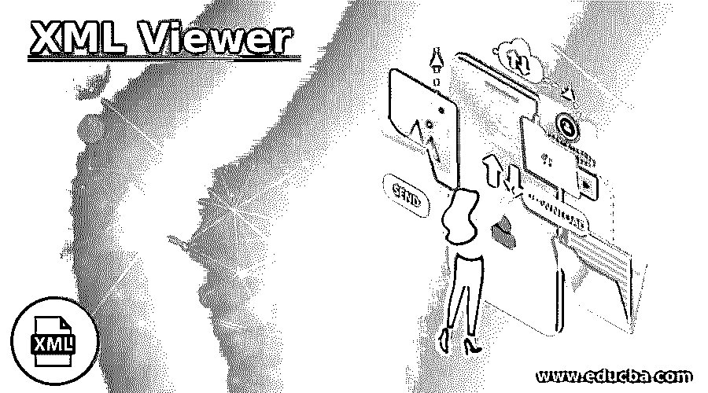
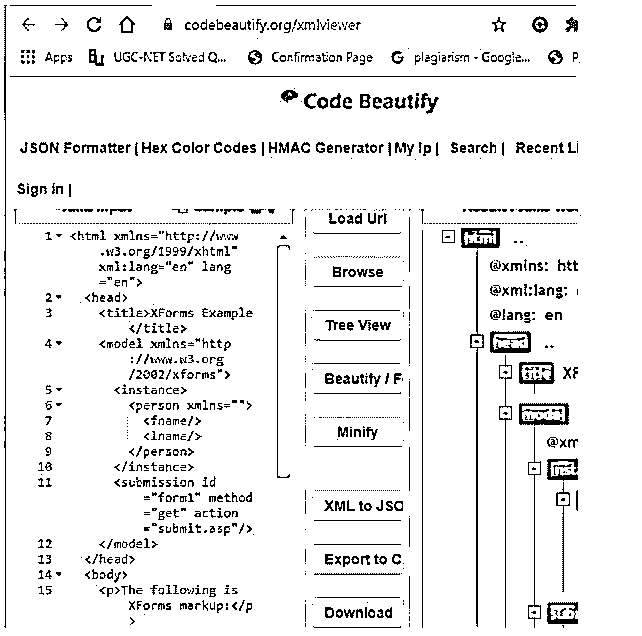
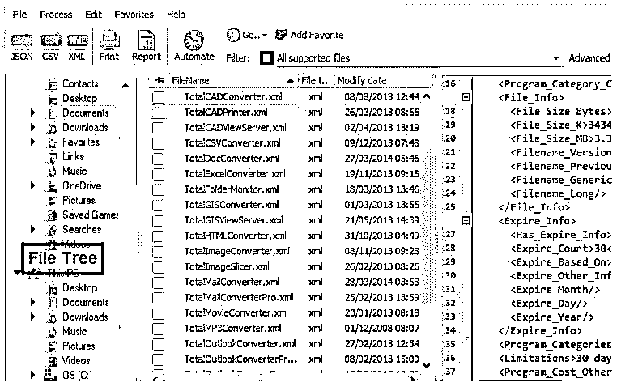
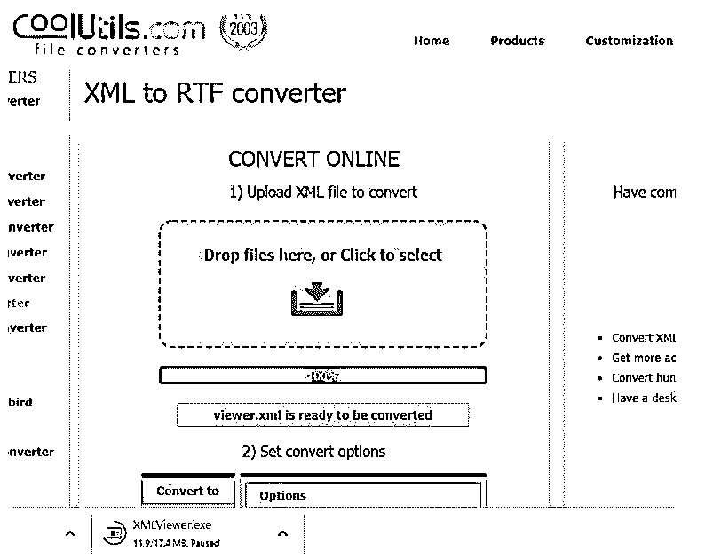
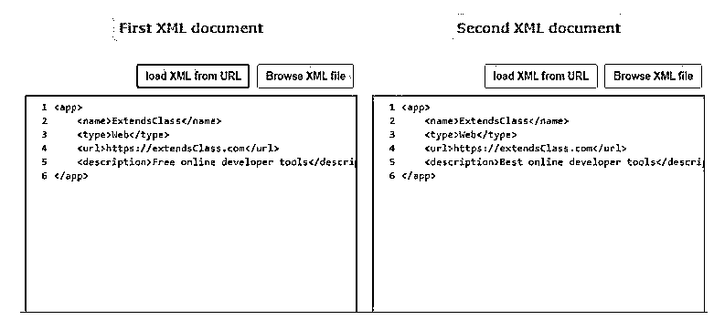
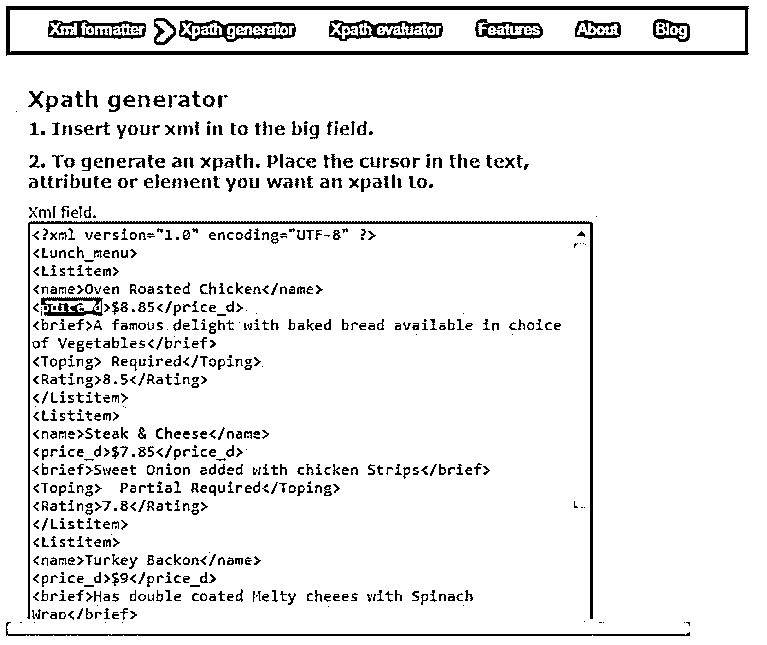
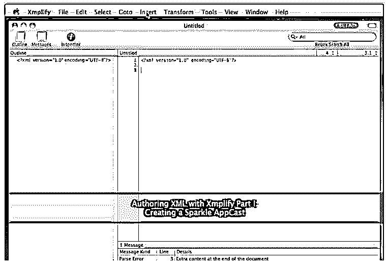
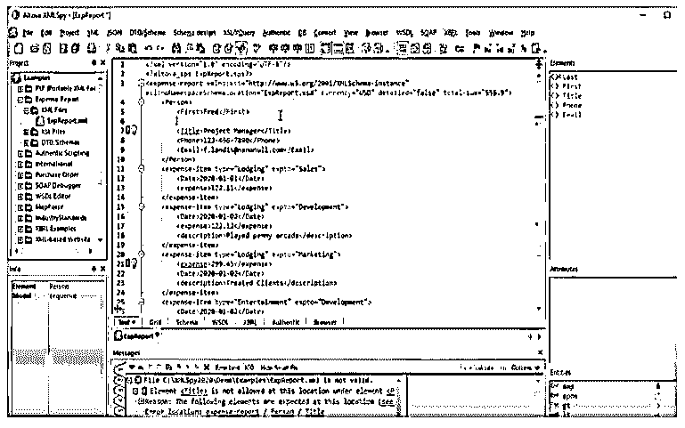

# XML 查看器

> 原文：<https://www.educba.com/xml-viewer/>

## XML 查看器简介

XML 查看器帮助在线编辑或查看 XML 文档。XML 是网络世界中最强大的数据存储和传输方式。它可以在 Chrome、Firefox 和 Opera 等许多浏览器上免费观看。XML 文件的创建独立于工具，无论是硬件[还是软件](https://www.educba.com/hardware-vs-software/)。为了查看结构化数据，XML 文件的默认查看器是 Web 浏览器，我们可以偶尔查看它们。通过使用在线查看器，我们可以验证和检查 XML 文档以及任何突出显示错误的非结构化文档。

### XML 查看器列表

XML 本身不能做任何处理；相反，他们需要使用软件来存储和读取数据，尽管它们在显示点上与 HTML 非常相似。要将 XML 文件转换成任何其他格式，我们需要一个文本编辑器并在新文件下命名。很少有查看器在需要时阅读和编辑 XML 文件。

<small>网页开发、编程语言、软件测试&其他</small>

#### 1.代码美化

该查看器有助于格式化 XML，并提供了一种在树结构或树视图中显示 XML 文件的方法。这个查看器有三个部分，即一个样例工作部件，可供选择的选项，最后是 XML 树。美化功能是我们可以缩小 XML 文件，并可以作为一个 XML 编辑器。在另一部分中，我们有直接加载 URL、验证文档和显示文件错误的按钮。它支持上传 XML 文件，最后还支持将 XML 转换成 JSON 的选项。我们甚至可以下载修改过的 XML 文件，并把它们转换成不同的格式。在结果窗格中，它显示在快速阅读行中。

下面是带有上传 XML 文件选项的查看器的好看视图。

**

** 

#### 2.酷实用程序 XML 查看器

这个浏览器是用户友好的免费 XML 文件。这个简单的浏览器只有很少的文件转换器。这可以按名称、大小对文件进行分类。这是一件很酷的事情，因为它节省了很多时间。这里提供了一个完整的 XML 转换器用于数据交换和评估。

考虑以下 XML 文件:

**viewer.xml**

**代码:**

`<?xml version="1.0" encoding="UTF-8" ?>
<Lunch_menu>
<Listitem>
<name>Oven Roasted Chicken</name>
<price_d>$8.85</price_d>
<brief>A famous delight with baked bread available in choice of Vegetables</brief>
<Toping> Required</Toping>
<Rating>8.5</Rating>
</Listitem>
<Listitem>
<name>Steak & Cheese</name>
<price_d>$7.85</price_d>
<brief>Sweet Onion added with chicken Strips</brief>
<Toping>  Partial Required</Toping>
<Rating>7.8</Rating>
</Listitem>
<Listitem>
<name>Turkey Backon</name>
<price_d>$9</price_d>
<brief>Has double coated Melty cheees with Spinach Wrap</brief>
<Toping> No</Toping>
<Rating>6.5</Rating>
</Listitem>
<Listitem>
<name>Italian B.M.T</name>
<price_d>$9.10</price_d>
<brief>A famous delight with baked bread available in choice of Vegetables</brief>
<Toping> Required</Toping>
<Rating>8.5</Rating>
</Listitem>
<Listitem>
<name>Veggie Delight</name>
<price_d>$7.85</price_d>
<brief>A famous delight with baked bread available in choice of Vegetables</brief>
<Toping> Required</Toping>
<Rating>7.5</Rating>
</Listitem>
</Lunch_menu>`

上述代码在下面的查看器中查看，快照如下所示:

#### 3.GroupDocs 查看器

由于 XML 语法已被广泛用作 Microsoft office 中的默认程序，Apple 的很少部分在注册表实现中使用 XML。

这些步骤包括:

*   选择/拖动 XML 文件进行查看。
*   文件由服务器处理，不需要任何插件。

这个软件是独特和紧凑的，并命名为一个简单的工具，其灵活性。

#### 4.打开 XML 文档查看器

该查看器指定开放 XML 格式规范，通过删除节点或向当前元素添加节点来帮助修改 XML。这个工具让我们检查一个 XML 文件，它有拖放功能，只需点击一下就可以轻松完成。它还包括各种文档主题，并且是微软许可的开源。

#### 5.XML 比较查看器

这描述了用于比较可用文档或两个文档的许多特征。这个查看器讲述了加载文档的工具。工具栏显示了如何添加/删除文档，以及在过程完成或取消后操作的消息或按钮。下面的演示展示了两个用于比较的 XML 文档。

#### 6.XML 工具箱

这个查看器获取一个 XML 文件，你可以在其中获取一个大的 XML 文件。这个格式化程序是客户端生成的应用程序，不需要等待后端。它会生成一个自动 Xpath 来查看相同类型的 XML 值。这里对一个 XML 文件进行评估，结果显示在文本区域中。

#### 7.XMPLIFY

这是一个功能强大的 MAC OS XML 编辑器，为基于 DTD、XSLT、XPath 模式的过程提供了一个空间环境来编辑 XML 文件。这是一个为 XML 编辑环境构建的 64 位应用程序。这种查看器广泛应用于商业和更多的个人领域，如教育和研究中心。

这些功能包括:

*   审查文件的大纲。
*   自动完成文档相关性的 DTD。
*   节点文档来指定节点的最新当前上下文。
*   有 Web 预览选项来查看 XHTML 文档，还支持 XPath 和正则表达式模式。

这款 XMILFY 运行在英特尔上，需要 MACs 10 版本。在上面的查看器中，我们可以在顶部看到许多主题，当选择 Outline 图标时，我们可以通过这些主题添加元素、属性、转换、Xpath 和其他规范。这确实编辑文件，并具有自动完成功能。我们可以在编辑 XML 文档时实时更新。

#### 8.XMLSpy(阿尔托瓦语)

XMLSpy 可用于 JSON 和 XML 的验证过程。它可以充当应用程序的跨平台。它有一个特性集，比如代码生成器和编辑功能。XML 图表创建可以在 XMLSpy 中执行，这是以各种格式导出 XML 文档所必需的。XMLSpy 可以通过集成包与 Visual Studio 集成。我们可以在构建器中找到如何使用 XPath 和 XQuery。

编辑器应该是这样的:

### 结论

作为一个用户友好的工具，这在表示用户输入的文本时非常有用。所有这些 XML 查看器都是许多商业组织的首选，有了这个有用的特性，组织就可以下载许多文件。因此，在本文中，我们看到各种 XML 查看器在线或付费编辑 XML 文件，这对各种应用程序和 web 服务非常有用。

### 推荐文章

这是 XML 查看器的指南。为了更好地理解，我们在这里讨论 XML 查看器的介绍和列表。您也可以看看以下文章，了解更多信息–

1.  [XML 元素](https://www.educba.com/xml-element/)
2.  [XML XSD](https://www.educba.com/xml-xsd/)
3.  [XML 模式](https://www.educba.com/xml-schema/)
4.  [XML 编码](https://www.educba.com/xml-encoding/)

