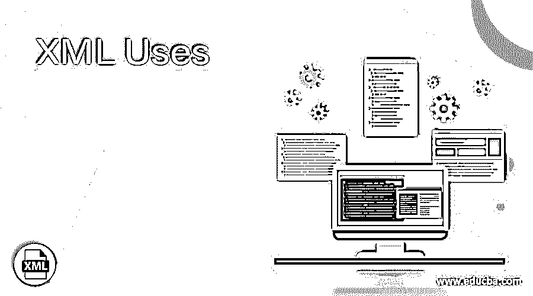

# XML 使用

> 原文：<https://www.educba.com/xml-uses/>

## XML 用途介绍

XML 已经被定义为通用数据交换和跨平台，有助于数据的传输，并且它们的标签不是预定义的，因此 web 开发人员可以在不受限制的情况下进行标记。它们在许多方面用于通过 web 分发数据。最重要的是，主要用途是处理和构建我们的 web 表单，以便很好地生成。另一个用途是我们可以快速地将 XML 直接添加到网页中。在应用程序中使用 XML 是很好的，因为它已经被用作基于 XML 的语言，几种满足其特定需求的新语言都是基于 XML 的。在本文中，我们将讨论 XML 使用的最流行的应用程序。我们还将了解 XML 的这些应用如何扩大了标记语言的范围。

### XML 在各个领域的使用

总的来说，XML 在 web 中扮演着重要的角色。下面我们将给出一些使用 XML 应用的具体领域。

<small>网页开发、编程语言、软件测试&其他</small>

XML 在 Web、电子商务和移动应用程序等领域有多种用途。很少有基于 XML 的语言包括 XHTML、RSS、SMIL、WSDL、WAP 和 SOAP。XML 文件用于开发数据库驱动的类型。由于其灵活性，他们可以在公司数据库之间传输数据而不会丢失描述性信息。很少有像 XML 企业对企业应用程序这样的例子，在买方和卖方之间以电子方式共享信息。对于包含少量数据的交换格式，这是一个很好的选择。

以下是 XML 对其有益的一些应用:

1.  在 Web 发布中起主要作用的是做交互式网页，增强客户定制网页的能力，并帮助优雅地创建电子商务应用程序。XML 的美妙之处在于，一旦存储了数据，不同的用户或远程设备就可以通过使用可扩展样式表的样式表概念来呈现数据。
2.  XML 让我们能够搜索和自动化任务。像机器人、网络搜索器或蜘蛛这样的网络代理能非常有效地给出可靠的结果。例如，[使用 HTML](https://www.educba.com/what-is-html/) 时，内容也是这样显示的，但是使用 XML 时，仅包含在标记元素中的一条信息就返回结果。
3.  我们可以在一般应用程序中使用 XML，因为它是一种标准格式，可以在任何地方或任何类型的设备上访问和检索信息，以便应用程序显示数据。
4.  电子商务应用程序也使用 XML 来存储产品详细信息，这些信息也用于业务处理。
5.  很好的利用 XML 来开发内容管理系统。文档手册用于生成 XML 文档。
6.  由于它们的可伸缩性和可靠性，XML 的概念被用于 Android 来编写 UI 代码以设计完美的用户界面。这些 XML 文件是布局、字符串 XML、样式和尺寸。
7.  XML 解析器有助于在许多技术中访问数据或修改数据。
8.  XML 用于处理元数据的技术家族中，在服务器端处理中扮演着重要的角色。它有助于为分销和运输开辟新的可能性。
9.  XML 的其他用途包括简单对象访问协议，一种方法调用。对于表单控件，它有助于分离表单上的数据。
10.  XML 技术的使用有助于构建新技术，如 Web 服务、语音 XML 和其他无线功能。

XML 使得在实现电子数据交换(EDI)以交换数据信息和企业对企业的交易时变得更加容易。它还以可重用的格式提供了更容易和简单的可移植元数据。它像个人数字和移动电话一样，为普及计算打下了有趣的基础。

### 如今，很少有 XML 的应用是最大的

HTML 是第一种标记语言，它利用 HTML 作为后端服务，在处理大型网站时以纯文本形式存储数据。一般不单独使用 XML 它与新的编程语言协调一致。许多行业已经为 XML 文档创建了自己的标准。

XHTML:XML 和 HTML 的组合，它只是在 Web 浏览器中显示 XML 文档。下面显示了一个示例。

`<?xml version="1.0"?>
<!DOCTYPE html PUBLIC "-//W3C//DTD XHTML 1.0 Transitional//EN"
"http://www.w3.org/TR/xhtml1/DTD/xhtml1-transitional.dtd">
<html xml:lang="en" lang="en">
<head>
<title>
This a New Web Page for EDUCBA Management!
</title>
</head>
<body>
<h1>
Welcome to The Home Page!
</h1>

This is well Oragnized Online Courses tied up With International Universities.

Here's a New Courses Available!

</body>
</html>`

**可缩放矢量图形**

利用这一点，我们可以使用 XML 标记制作二维图形来支持动画。它支持样式和脚本概念，通过这些概念可以对图像进行动画和编辑。

**矢量标记语言(VML)**

这种标记利用了网络上的矢量图形，并以矢量格式制作图像。如果使用 XML 语法编写 XML 的子集，则对象(即矩形、椭圆形)可以调整大小和着色。并且它支持通用图形。

**安卓应用**

android 的布局是用 XML 编写的。额外的文件内容资源被添加到它们中。

**使用 XML 的示例 Android 代码**

`<resources>
<string name="new_name">My Example</string>
<string name="Welcome">Hello Users!</string>
<string name="Page_settings">View Cahnges</string>
<string name="login_id">User name </string>
// Definition of a String.
</resources>`

**在 SQL Server 中创建 XML 结构**

这是基于一个模式。这里，我们收到了一个请求，请求从创建的表中创建一个 XML 文档。服务器提供了一个选项。

`SELECT BID,
User name,
profile,
FName,
MName,
LName,
FROM User.User
WHERE BID = 12545
FOR XML AUTO, ELEMENTS
GO`

**结果 XML 输出**

`<User.User>
< BID> 12545 </BID>
<profile>  Permanent  <profile>
<FName> Dorai     <FName>
<MName>  padma      <MName>
<LName> sankar     <LName>
</User.User>`

### 结论

存在许多 XML 应用程序；在本文中，我们只讨论了几个应用程序，只讨论了它们的目标和在最近的 Web 技术中的其他影响。我们可以在互联网上随处看到 XML 实现。因此，有了坚实的 XML 基础，就可以用 XML 编写应用程序。Xml 在 web 开发中被广泛用于数据共享，这在科学和工业领域是不可思议的。

### 推荐文章

这是 XML 使用指南。在这里，我们讨论 XML 在各个领域中的应用，以及当今最大的几个 XML 应用。您也可以看看以下文章，了解更多信息–

1.  [XML HttpRequest](https://www.educba.com/xml-httprequest/)
2.  [XML 元素](https://www.educba.com/xml-element/)
3.  [XML 注释](https://www.educba.com/xml-comments/)
4.  [XML 验证](https://www.educba.com/xml-validation/)

