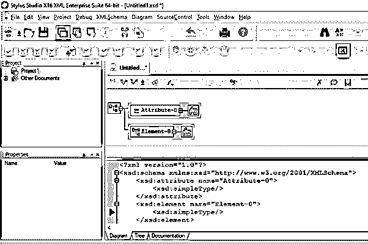
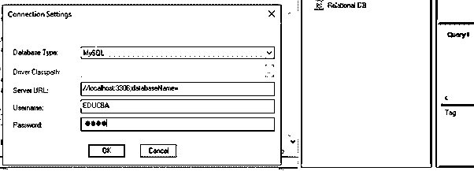
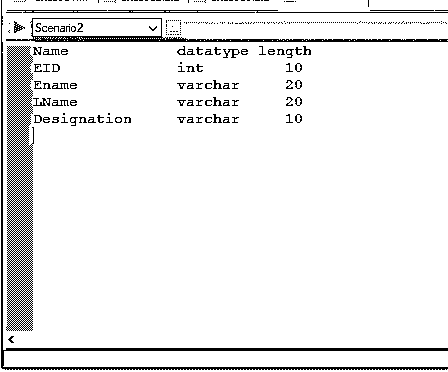
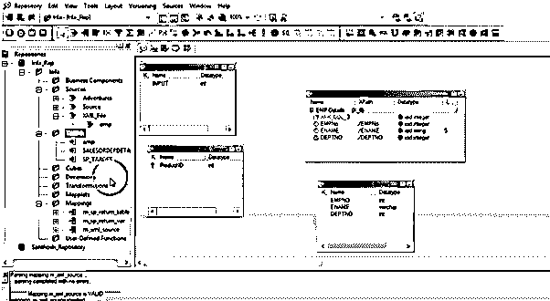

# XML 生成器

> 原文：<https://www.educba.com/xml-generator/>

## XML 生成器简介

XML Generator 是一个基于 XSD(模式定义)定义和生成大量 XML 文档的工具。生成的 XML 文件是根据用户的偏好定制的，它提供了一个有效的、格式良好的 XML。生成器将输入作为 XSD 中定义的元素。数据值在模式中定义。

**语法**

<small>网页开发、编程语言、软件测试&其他</small>

CSharp 中包含带有对象的 XML 字符串的类被定义为

`Public datatype GetXML(object name)
{
// String variable declaration;
XmlGenerator x=new XmlGenerator();
Xmldoc=();
}`

### XML 中的生成器是如何工作的？

XML 在现代应用和开发中起着至关重要的作用。有一种情况，我们需要通过一些商业工具来转换 XML 文档或 XSD。它是一个类文件，对于任何对象，它都会根据所使用的属性生成一个 XML。例如，在下面的部分中，我们使用了 Employee 类并包含了关于雇员的详细信息。通过这种转换生成的 XML 被用作 XML 模板的基础。当它没有合适的有效文档时，生成器会提供一个有效的 XML 文档。

### 从模式文件创建 XML 数据的步骤

1.第一个过程是加载 XSD 文件从路径或直接/链接访问互联网。

2.按下生成器框以生成 XML 数据。

3.通过单击选项，默认值将被更改。

XML Generator 在 java 中有两个生成器来完成这一任务。

*   DTD 生成器类
*   XML 模式生成器

XML 模式类生成器

这为提供简单和复杂类型的全局元素的顶层元素创建了一个类。创建一个新的类生成器，并输入 generate()方法，这有助于创建 XML 文档。使用 getDocType()方法返回架构的对象。

使用 DTD 生成器的类

它将 XML 文档作为输入，并在手写笔生成器中生成 DTD 作为输出。

**Altova XML Spy**

XML Spy 允许自动生成 XML，XSD，并支持 DTD 到 XSD 和 JSON 的转换。

**铁笔工作室**

这个 Stylus Studio XML 生成格式良好且有效的 XML，因为它生成组织良好的模式关联，并允许根据模式定义或任何验证 XML 解析器进行验证。甚至可以预测生成的 XML 节点的深度，这有助于设置子节点。

**XML 生成器-信息**

这个生成器对于在管道概念中或从数据库表中生成 XML 文件非常有帮助。第一步是创建一个记录表，如

`USE [ Source] GO
SELECT [ EID] ,[Ename] ,[LName],[Designation] FROM Employee`

我们将使用 SQL DB 生成一个 XML 文件。

创建的表显示在 SQL 中。

下一个过程是导入 XML 定义，这将创建一个映射，从源文件夹中拖放记录源。从选项中选择本地 XSD 文件。

类似地，我们可以使用 Oxygen XML editor 生成示例 XML 文件，其中的选项卡包括 URL、名称空间和其他导入和导出设置。

### 例子

在这一节中，我们将看到如何在 Informatica 和 Stylus Studio 中处理和验证 XML 和 DTD 文档，以生成格式良好的文档。

#### 示例#1

**代码:**

`import java.util.ArrayList;
import java.util.List;
public class XMLSample extends Base {
protected Mapping map = null;
protected Source s = null;
protected Target t = null;
protected void create() {
s = createOracleJobSource("O_Source");
folder.addSource(s);
}
protected void createTargets() {
t = this.Relational(s.Oracle, "Ora_t");
}
protected void createMap() throws Exception {
mapping = new Mapping("XMLParserGeneratorTransformation", "XMLParserGeneratorTransformation", "Mapping for XMLParserGeneratorTransformation");
setMapFileName(mapping);
TransformHelper help = new TransformHelper(mapping);
RowSet rs = (RowSet) helper.sourceQualifier(this.s).getRowSets().get(0);
OutputSet of = (OutputSet) helper.xmlParser(rs, "XML_Parser_Transformation","amples\\employee.xsd");
RowSet or = (RowSet) of.getRowSets().get(0);
OutputSet oGen = (OutputSet) helper.xmlGenerator(outputTarget, "XML_Generator_Transformation", "amples\\employee.xsd");
RowSet Target = (RowSet) outGen.getRowSets(). get(0);
mapping.writeTarget(Target, this.t);
folder.addMapping(mapping);
}
protected void createSession() throws Exception {
sessionm = new Sessionms ("Job for C Active", "Work for C", "This is work process of Session");
session.setMapping(mapping);
}
protected void createWorkflow() throws Exception {
workflow = new Workflows("Workf", "Workf", "This flow process of Custom Transformation");
workflow.addSession(session);
folder.addWorkFlow(workflow);
}
protected Source createOracleJobSource(String dbN) {
Source jo = null;
List<Fi> fields = new ArrayList<Fi>();
Field jobID = new Field ("JOB_ID", "JOB_ID", "", NativeDataTypes.Oracle. VARCHAR2, "12", "0", FieldKeyType.PRIMARY_KEY, FieldType.jo, true);
fields.add(jobID);
ConnectionInfo in = getRelationalConnInfo(SourceTargetType.Oracle, dbN);
jobSource = new Source("JOBS", "JOBS", "This is employee table", "JOBS", in);
jobSource.setFields(fields);
return jobSource;
}
public static void main(String[] args) {
try {
XMLParserGeneratorSample cus = new XMLParserGeneratorSample();
if (args.length > 0) {
if (cus.validateRunMode(args[0])) {
cus.execute();
}
} else {
customActive.printUsage();
}
} catch (Exception e1) {
e1.printStackTrace();
System.err.println("Exception created is: " + e1.getMessage());
}
}
}`

**说明:**

上面的代码解析一个 XML 文档，通过映射转换与数据源建立连接。并解析数据库中的值。

**输出:**

#### 实施例 2

XML DTD

`<?xml version="1.0" encoding="UTF-8"?>
<!DOCTYPE bookdb [
<!ELEMENT bookstore (book+)>
<!ELEMENT book (title, author+, category*, language?, year?, edition?, price)>
<!ATTLIST book ISBN CDATA #REQUIRED>
<!ELEMENT title    (#PCDATA)>
<!ELEMENT author   (#PCDATA)>
<!ELEMENT category (#PCDATA)>
<!ELEMENT language (#PCDATA)>
<!ELEMENT year     (#PCDATA)>
<!ELEMENT edition  (#PCDATA)>
<!ELEMENT price    (#PCDATA)>
]>
<bookdb>
<book ISBN="03001">
<title>Java For Dummies</title>
<author>Tan Ah Teck</author>
<category>Programming</category>
<year>2001</year>
<edition>7</edition>
<price>19.99</price>
</book>
<book ISBN="6002">
<title>More Java For Dummies</title>
<author>Tan Ah Teck</author>
<category>Programming</category>
<year>2001</year>
<price>25.99</price>
</book>
<book ISBN="012">
<title>The Complete Guide to Fishing</title>
<author>Bill Jones</author>
<author>James Cook</author>
<author>Mary Turing</author>
<category>Fishing</category>
<category>Leisure</category>
<language>French</language>
<year>2020</year>
<edition>2</edition>
<price>49.99</price>
</book>
</bookdb>`

**解释**

这是使用 Stylus Studio 验证的生成的 XML 文档。输出显示了格式良好的文档。

**输出:**

### 特征

1.  能够手动或通过 XSD 导入 XML 文档结构。
2.  定义 XML 结构并将其组合成单一输出格式。
3.  工程设计的良好舒适性。为数据创建提供了强大的数据生成引擎。
4.  通过处理元素组和重复元素，在定制 XML 文档方面具有良好的灵活性。

### 结论–XML 生成器

在这篇文章的结尾，我们享受了学习 XML 文档生成的过程，也理解了它们的用法和概念。这个工具通过允许现有的 XML 模式高效地生成实例文档，在加速 XML 开发方面非常强大。

### 推荐文章

这是 XML 生成器的指南。这里我们讨论生成器如何在 XML 中工作，以及从模式文件创建 XML 数据的步骤。您也可以看看以下文章，了解更多信息–

1.  [XML 映射](https://www.educba.com/xml-mapping/)
2.  [XML 模式](https://www.educba.com/xml-schema/)
3.  [XML 元素](https://www.educba.com/xml-element/)
4.  [XML CDATA](https://www.educba.com/xml-cdata/)

