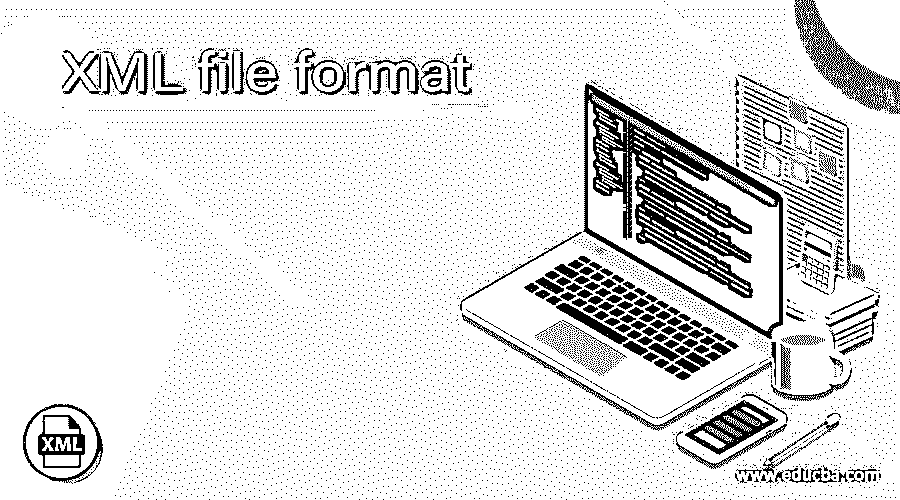
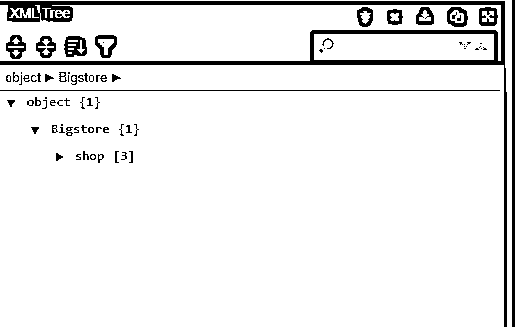
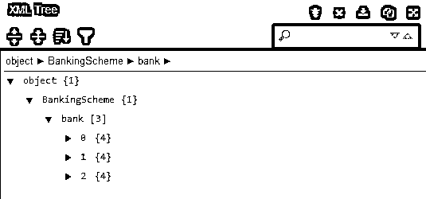
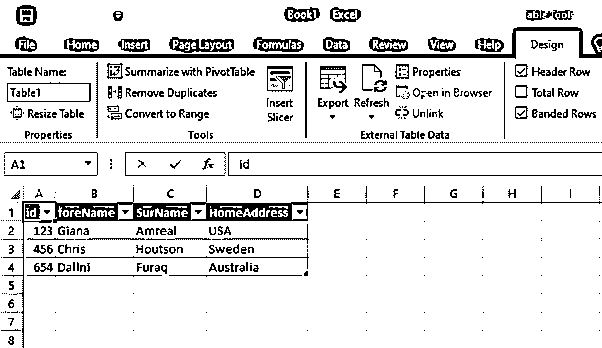
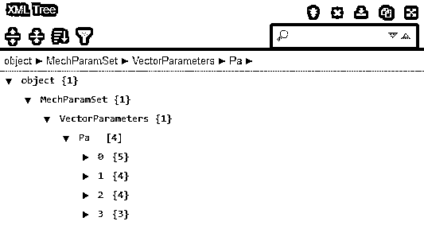
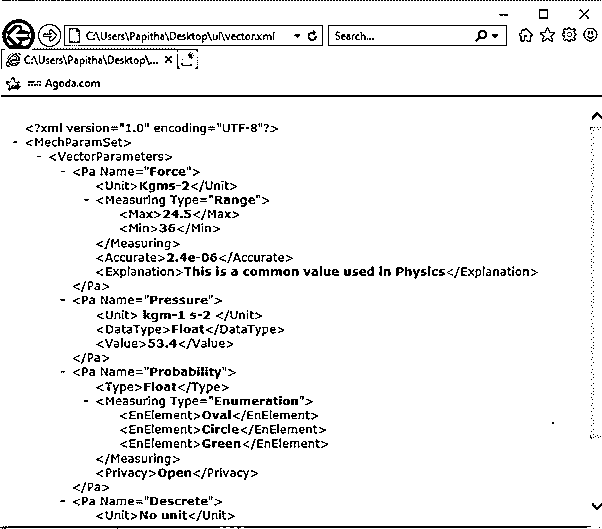
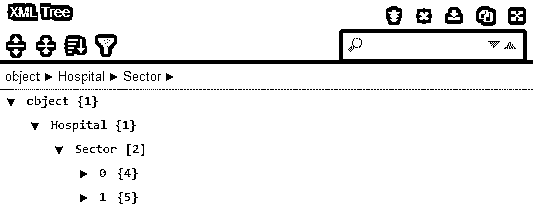
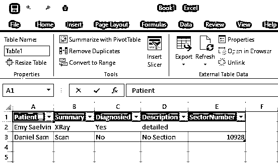

# XML 文件格式

> 原文：<https://www.educba.com/xml-file-format/>

## XML 文件格式介绍

XML 文件格式是一种工具，被定义为信息交换者，描述数据并包含元数据。该工具将 XML 文件转换成其他格式，如 PDF 或任何其他具有少量缩进级别的应用程序，从而使 XML 文件更加优雅。XML 文件是正式结构化的，用于数据文件；同时，XML 文件不能存储在平面文件中。文件格式在定义构造块以满足用户需求方面发挥作用。在 XML 中，我们可以定义一个定制的标记元素并遵循一定的规则，但不支持和处理有问题的 XML 文档。

### 详细解释 XML 文件格式

通常，文件格式是以特定格式存储文件的标准方式。xml 文件是一个纯文本文档，为了识别它们，它以文件扩展名. XML 存储。XML 文件格式是人类或机器可读的，旨在通过互联网传输数据，并可以在计算中处理数百条记录。大多数编程语言使用 XML 库来完成解析工作。将 XML 文件转换成其他所需格式的过程称为向下转换。XML 被用作其他描述语言的格式，如 RSS、DOCX 格式、XSL、Microsoft dotnet。这个 XML 文件可以直接用文本编辑器 notepad++打开。有多种文件组织来处理文件类型；我们需要他们之间的一些对话。XML 仅仅是数据和网页所需的一种组织。接下来，为了偶尔查看文件，可以双击浏览器(文件的默认查看器)。XML 文件格式包含三类。

<small>网页开发、编程语言、软件测试&其他</small>

*   第一节文件识别
*   文档内容
*   具有字段和方面的元数据。

结构组件简单地由与属性相关联的元素来表示。第一节文档结构表现为具有不同的风格。文档标识包括根元素，它是 XML 文档的主要部分。开发人员需要将二进制文件转换成 XML 格式。新的文件格式解释如下，称为 office open formats。在这里，我们创建一个打开的文档，并为指定的格式提供一个实现。主要目标是格式应被所有官方文件接受，如电子表格，演示文稿也允许用户重新获得所有权。它被指定为

*   XML 文件格式规范
*   DTD 文件格式

XML 代码表示为

`<office:document>`

该文档类型包含具有类和版本等特征的子文档。

文档正文如下所示

`<office: body>`

随着字段和数据赶上样式和表单

`<office:document>
<office:meta>
<office:styles>
…// style structures including family , automatic and parent styles
</office:styles>
On forms
<office:forms>`

下面给出了一个简单的 XML 格式示例

`<DOCSET NAME=” ”>
<FIELD NAME=” hdhsd” > xxxxx</FIELD>
GROUP NAME =” ” NAME=”DOCNAME “
<FORM NAME =” hhhhh”>
<FIELD NAME >
< SECTION NAME =”jjdscj”>`

对于多个页面部分，DAP 选项适用于 XML。各种文件格式被用来形成这种树状结构，以嵌入文件 XHTML、SVG。

下面给出了标记和数据的 XML 文件的一般格式

标签的格式为

`<Tag>
<Tagname> password</Tagname>
<Description> Strong Length </Description>
</Tag>`

后续消息定义为

`<MessageList>
<Data>
<Stamp> 1:00:13 </Stamp>
</MessageList>`

XML 作为一种数据存储方式，在数据库通信中起着至关重要的作用，尤其是在小范围的应用中。XMLs 的简单性质允许文件格式有助于扩展序列化对象内容。例如，Manifold 将他们的信息写入一个. xml 文件，同时导出他们的绘图和图像。这种文件格式包含元数据中的所有信息。

`<?xml version="1.0" encoding="UTF-8"?>
<info>
<Co-Sytem>
// Description tags
</Co-System></info>`

**注:**

如果 Xml 在导入文件时使用不同的格式，则可以使用可扩展样式表。

### 例子

本节介绍如何构建 XML 文件，并让它们在在线提供的 XML 格式化程序中执行。

#### 示例#1

`<?xml version="1.0" encoding="UTF-8"?>
<Bigstore>
<shop category="HouseHold">
<Model lang="en">HD3352</Model>
<Company>Samsung</Company>
<year>2014</year>
<ownat>120.00</ownat>
</shop>
<shop category="HouseHold">
<Model lang="en">JH3648</Model>
<Company>Redmi</Company>
<year>2016</year>
<ownat>110.00</ownat>
</shop>
<shop category="HouseHold">
<Model lang="en">OKH8234</Model>
<Company>Ziami</Company>
<year>2012</year>
<ownat>130.00</ownat>
</shop>
</Bigstore>`

**说明:**

不同文件格式的简单 XML 文件在联机格式化程序中完成；因此，输出显示为二叉树结构。

**输出:**

#### 实施例 2

使用 Excel-易于导入表格

**Bank.xml:**

`<BankingScheme>
<bank id="321">
<foreName>George</foreName>
<SurName>Amreal</SurName>
<HomeAddress>Texas</HomeAddress>
</bank>
<bank id="541">
<foreName>Alex</foreName>
<SurName>Houtson</SurName>
<HomeAddress>Sweden</HomeAddress>
</bank>
<bank id="125">
<foreName>Dally</foreName>
<SurName>Furaq</SurName>
<HomeAddress>Australia</HomeAddress>
</bank>
</BankingScheme>`

**说明:**

上面的代码片段解释了银行凭证。在本例中，文件格式被导入到 Excel 表中。第一个快照展示了如何通过 Excel(外部源)导入 XML 文件。接下来，Snapshot 展示了 XML 数据如何存储在一个友好的表中。

**输出:**

#### 实施例 3

传感器值的 XML 文件格式

**Measure.xml:**

`<?xml version="1.0" encoding="UTF-8"?>
<MechParamSet>
<VectorParameters>
<Pa Name="Force">
<Unit>Kgms-2</Unit>
<Measuring Type="Range">
<Max>24.5</Max>
<Min>36</Min>
</Measuring>
<Accurate>2.4e-06</Accurate>
<Explanation>This is a common value used in Physics</Explanation>
</Pa>
<Pa Name="Pressure">
<Unit> kgm-1 s-2 </Unit>
<DataType>Float</DataType>
<Value>53.4</Value>
</Pa>
<Pa Name="Probability">
<Type>Float</Type>
<Measuring Type="Enumeration">
<EnElement>Oval</EnElement>
<EnElement>Circle</EnElement>
<EnElement>Green</EnElement>
</Measuring>
<Privacy>Open</Privacy>
</Pa>
<Pa Name="Descrete">
<Unit>No unit</Unit>
<Accurate>1.01e-06</Accurate>
</Pa>
</VectorParameters>
</MechParamSet>`

**说明:**

以上代码创建了用于机械计算的科学参数。结果如图所示。

**输出:**

#### 实施例 4

`<?xml version="1.0"?>
<Hospital>
<Sector>
<Patient>Emy Saelvin</Patient>

XRay

<Diagnosied>Yes</Diagnosied>
<Description> detailed</Description>
</Sector>
<Sector>
<SectorNumber>10928</SectorNumber>
<Patient>Daniel Sam</Patient>

Scan

<Diagnosied>No</Diagnosied>
<Description> No Section</Description>
</Sector>
</Hospital>`

**说明:**

以上医院管理代码通过 XML 导入到 Excel 表中。XML 在数据结构格式中使用得很好，尤其是 web 服务。

**输出:**

### 结论

因此，任何应用程序开发人员都必须知道在现实生活中要挑战的文件格式。在最近的技术中，众多的开发人员需要一些专业的工作场所，在这种情况下，XML 文件有助于指导技术开发工作场所。因此，XML 文件格式在结构上非常容易处理，有助于转换成各种文件格式。市场上很少有 XML 工具包可以在各种应用程序中导入和导出 XML 文件。

### 推荐文章

这是一个 XML 文件格式的指南。在这里，我们将详细讨论 XML 文件格式的解释，以及示例和输出。您也可以看看以下文章，了解更多信息–

1.  [XML 映射](https://www.educba.com/xml-mapping/)
2.  [PHP XML 阅读器](https://www.educba.com/php-xml-reader/)
3.  [C#对象到 XML](https://www.educba.com/c-sharp-object-to-xml/)
4.  [XML 验证](https://www.educba.com/xml-validation/)

