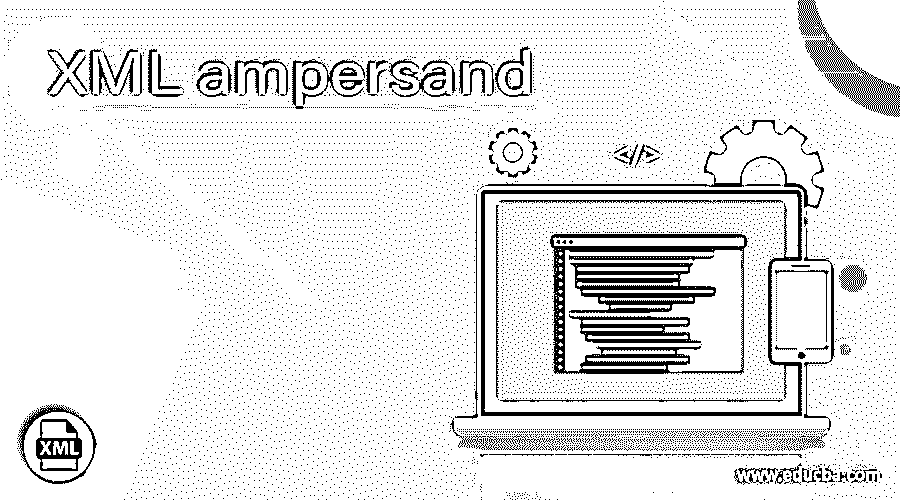
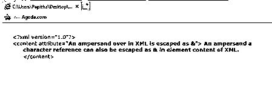
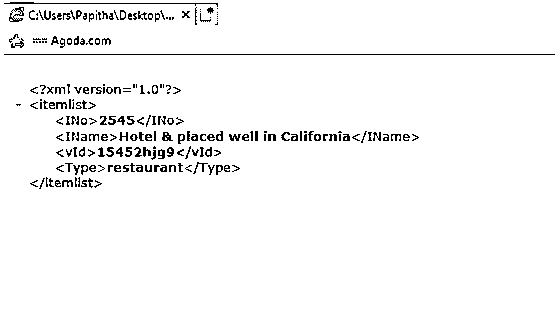
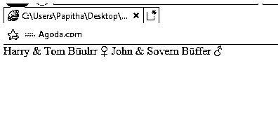
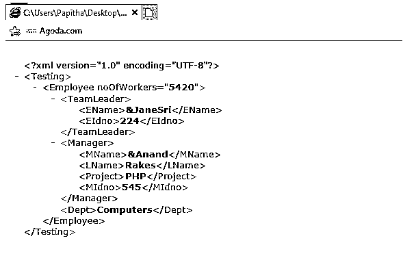
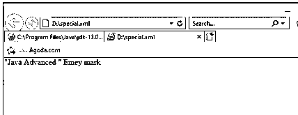

# XML 符号

> 原文：<https://www.educba.com/xml-ampersand/>

## XML 符号的定义

XML &符号被定义为一个特殊字符，我们必须在 XML 文档中对它进行转义，以免导致解析错误。它们可能以非转义格式出现在 CDATA 部分和 comments 部分中。它们在标记语言中有特殊的含义，因此它们是作为实体引用引入的，如小于单引号。当在 XML 中使用&amp 时，它显示为&amp，而在 HTML 中，它呈现为' & '。根据 W3C 的建议，XML 文档中的一些实体和其他分隔符被替换。

**语法:**

<small>网页开发、编程语言、软件测试&其他</small>

通用语法定义如下

`enter &paste;
In API call it is used as %26amp;`

要在 XML 文档中使用&符号，可以将它与实体名称一起分配，后面跟一个分号，如上所示。本文解释了如何通过替换特殊实体来指定 XSLT 和 XML 中的字符实体。

### XML 中的&符号是如何工作的？

通常，与其他字符相比，XML 在文档中采用不同的&符号。在属性值或元素内部赋值时，严格禁止使用这种字符引用。XML 解析器解析配置文件中未转义的&符号，该符号表示它是一个需要被解析为其他引用的实体。当我们在没有任何描述性字符或者重要的是没有分号的情况下分配&符号时，解析器会给出一个错误。实际上，它们是有效的，解析对于任何新的编程语言都是不可或缺的。对于 XML 中的&符号，转义序列中的起始字符是另一个&符号，称为转义机制。我们的 XML 库对于创建 SAX 应用程序有一定的标准。使用这个 API，我们可以处理这些不可转义的字符。它们在元素内容或属性内容中被转义。例如，让我们看一个 XML 代码

`from xml.sax.saxutils import escape, unescape
myx = "<ele>Hickory & Dickory &Dock; Spot</ele1>"
myx= unescape(myx)
myx= escape(myx)
print(myx)`

**让我们看看另一个样品**

`<?xml version="1.0" encoding="UTF-8"?>
<book>
<body> Q&ecirc;Rs &amp; ghf&ccedil;&xtilde;</body>
</book>`

当您验证此 XML 代码时，它在第 3 行抛出一个错误，指出实体' &ecirc '未定义。

为了处理这个解析器，它内置了 XMLHttpRequest，并返回一个字符串作为值。

在 android 字符串中，XML &字符像 HTML 编码一样实现，而不是直接使用 XML 语法，因为它违反了验证。要插入带“与”符号的文本，可通过以下方式完成:

`<string name="my demo">This is my sample test with &amp; ampersand</string>`

在其他情况下，比如 XML 到 XML 的转换，我们需要偏好特殊字符，比如实体。如果我们只是在 XSL 中的 XML 中需要' & '的地方这样做，如下所示。在 XSLT 中，我们不能在标签或属性之间使用&符号。当这些字符使用不当时，转换引擎会抛出错误。

`<xsl:text>&amp;#</xsl:text>
<xsl:value-of select="$empID" />
<xsl:text>;</xsl:text>`

这给出了如下 XML 输出

`'`

让我们以 DOCTYPE 样式表的另一个场景为例，其中使用' & '演示了本地语言的特殊字符。

`<!DOCTYPE stylesheet [
<!ENTITY new
"<xsl:text disable-output-escaping='yes'>&amp;new;</xsl:text>">
]>
<xsl:stylesheet xmlns:xsl="http://www.w3.org/1999/XSL/Transform"
version="1.0">
<xsl:output doctype-system="samplet.dtd"/>
<xsl:template match="exam">
<example>
The native word for "Norgen" is "Espa&ntilde;a".
<xsl:apply-templates/>
</example>
</xsl:template>
</xsl:stylesheet>`

模板测试如下所示，用于处理 URL 中的撇号和&号。

`<xsl:template name="formStructure">
<xsl:param name="text" />
<xsl:variable name="new">&amp;#39;</xsl:variable>
<xsl:variable name="new2">&amp;amp;</xsl:variable>
<xsl:variable name="new3">%27</xsl:variable>
<xsl:variable name="new4">%26</xsl:variable>
<xsl:choose>
<xsl:when test="contains($text, $apos)">
<xsl:variable name="before" select="substring-before($text,$apos)">
</xsl:variable>
<xsl:variable name="after" select="substring-after($text,$apos)">
</xsl:variable>
<xsl:call-template name="formStructure">
<xsl:with-param name="text" select="$before" />
</xsl:call-template>
<xsl:value-of select="$new3" />
<xsl:call-template name="formStructure">
<xsl:with-param name="text" select="$after" />
</xsl:call-template>
</xsl:when>
<xsl:when test="contains($text, $amp)">
<xsl:variable name="before" select="substring-before($text,$amp)">
</xsl:variable>
<xsl:variable name="after" select="substring-after($text,$amp)">
</xsl:variable>`

在下一节中，我们将看到一些使用 XML 代码和 XSLT 表的 XML &符号演示。所以让我们开始吧。

### 例子

让我们讨论 XML 符号的例子。

#### 示例 1:带有&符号的简单 XML 代码

`<?xml version="1.0"?>
<content attribute="An ampersand over in XML is escaped as &amp;">
An ampersand a character reference can also be escaped as &amp; in element content of XML.
</content>`

**解释**

这里我们创建了一个带有角色实体的属性。当我们执行上面的代码时，我们得到的输出如下

**输出:**

#### 实施例 2

`<?xml version="1.0"?>
<itemlist>
<INo>2545</INo>
<IName>Hotel &amp; placed well in California</IName>
<vId>15452hjg9</vId>
<Type>restaurant</Type>
</itemlist>`

**解释**

同样，这是一个没有属性值的 XML 元素的简单例子。

**输出:**

#### 示例 3:使用 XSLT XML 样式表

`<?xml version="1.0" encoding="UTF-8"?>
<?xml-stylesheet href="lang.css" type="text/css"?>
<lang xml:lang="ta">
<LName>
<norskname>Harry &amp; Tom</norskname>
<Hetername>Büulrr</Hetername>
<Location>♀</Location></LName>
<LName>
<norskname>John &amp; Sovern</norskname>
<Hetername>Büffer</Hetername>
<Location>♂</Location>
</LName>
</lang>`

**解释**

在上面的代码中，特殊字符和&amp。

**输出:**

#### 实施例 4

`<?xml version="1.0" encoding="utf-8"?>
<Testing>
<Employee noOfWorkers="5420">
<TeamLeader>
<EName>&amp;JaneSri</EName>
<EIdno>224</EIdno>
</TeamLeader>
<Manager>
<MName>&Anand</MName>
<LName>Rakes</LName>
<Project>PHP</Project>
<MIdno>545</MIdno>
</Manager>
<Dept>Computers</Dept>
</Employee>
</Testing>`

**输出:**

#### 实施例 5

**co.xml**

`<?xml version="1.0" encoding="UTF-8"?>
<Western>
<Europe>
<EName>Poland</EName>
<Capital>Warsaw t</Capital>
<SubRegion>Eastern</SubRegion>
<company>Microsoft</company>
<Currency>Polish</Currency>
</Europe>
<Europe>
<EName>Spain</EName>
<Capital>Madrid S</Capital>
<SubRegion>Western</SubRegion>
<company>Amazon</company>
<Currency>Euro</Currency>
</Europe>
<Europe>
<EName>Italy</EName>
<Capital>Rome</Capital>
<SubRegion>Southern</SubRegion>
<company>Verizon</company>
<Currency>Euro</Currency>
</Europe>
<Europe>
<EName>Sweden</EName>
<Capital>Stochkolm</Capital>
<SubRegion>Eastern</SubRegion>
<company>TCS</company>
<Currency>Krona</Currency>
</Europe>
<Europe>
<EName>Netherland</EName>
<Capital>Amsterdam</Capital>
<SubRegion>Western</SubRegion>
<company>Columbia</company>
<Currency>Euro</Currency>
</Europe>
<Europe>
<EName>Norway</EName>
<Capital>Oslo</Capital>
<SubRegion>Western</SubRegion>
<company>Crayon</company>
<Currency>krone</Currency>
</Europe>
<Europe>
<EName>Sweden</EName>
<Capital>Bob Dylan</Capital>
<SubRegion>USA</SubRegion>
<company>Columbia</company>
<Currency>10.90</Currency>
</Europe>
</Western>`

**co.xsl**

`<?xml version="1.0" encoding="UTF-8"?>
<xsl:stylesheet version="1.0" xmlns:xsl="http://www.w3.org/1999/XSL/Transform">
<xsl:template match="/"
<xsl:value-of select="translate(EName, '&amp;', '')" />
<html>
<body>
<h1>European Countries:</h1>
<table border="2">
<tr bgcolor="brown">
<th>EName</th>
<th>Capital</th>
</tr>
<tr>
<td><xsl:value-of select="translate(EName, '&amp;', '')" /></td>
<td><xsl:value-of select="translate(EName, '&amp;', '')" /></td>
</tr>
</table>
</body>
</html>
</xsl:template>
</xsl:stylesheet>`

**说明:**

这里创建了两个文件，一个用于 XML，另一个用于 XSL。选择值并为其分配&符号。所以当我们执行上面的代码片段时，我们得到的输出是

**输出:**

#### 示例#6:使用' & '

`<?xml version="1.0" encoding="UTF-8"?>
<bookstore>
<book ISBN="586954">
<title>&quot;Java Advanced &quot;</title>
<author>Emey mark</author>
<category>Programming & Analysis</category>
<edition>1</edition>
<price> &lt;29.99 &gt;</price>
</book>
<book ISBN="56858">
<title>&quot;More for Python &quot;</title>
<author>&amp;Hebrew manni</author>
<category>Programming</category>
<price>15.99</price>
</book>
<book ISBN="66547">
<title>&quot;The Complete Guide to Animals &quot;</title>
<author>joe emacul</author>
<author>sheeba david</author>
<author>Jacob ethen</author>
<category>Wild</category>
<category>Teresstial</category>
<language>French</language>
<edition>5</edition>
<price>31.99</price>
</book>
</bookstore>`

**解释**

上面的代码使用了简单的“&”号和特殊字符。

**输出:**

### 结论

总之，这个主题演示了如何在各种场景中使用这些实体字符，我们也看到了它在一些 XML 语言中是如何无效的。许多组织在他们的应用程序中对开发人员的产品名称和引用使用了&符号。他们的威胁被视为不同的管理，它是分配使用实体标记。这可能会在解析它时突出显示一个红色标记。

### 推荐文章

这是 XML 符号的指南。这里我们讨论定义，XML 中的&符号是如何工作的？，以及代码实现示例。您也可以浏览我们推荐的其他文章，了解更多信息——

1.  [XML 映射](https://www.educba.com/xml-mapping/)
2.  [XML HttpRequest](https://www.educba.com/xml-httprequest/)
3.  [XML 元素](https://www.educba.com/xml-element/)
4.  [XML HttpRequest](https://www.educba.com/xml-httprequest/)

