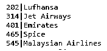

# XML 映射

> 原文：<https://www.educba.com/xml-mapping/>

## XML 映射的定义

XML 映射被定义为一个编辑器，用于将一个或多个 XML 文档映射到一个公共的 XML 文件。这样，我们可以在定义映射后生成一个转换文档。映射不做删除、编辑或任何持久的工作。对象的关系通常在 XML 中定义，因此 XML 文件指示 hibernate 显示类如何映射到表。映射文档以 classname.hbm.xml 格式保存，即 hibernate 映射文件。

**语法:**

<small>网页开发、编程语言、软件测试&其他</small>

使用 Hibernate 映射元素的类。

`<class name="Event" table="EVENTS">
...
</class>`

在休眠模式下，它看起来像:

`<persistence-unit name="externalMapping" transaction-type="Reserved">
<provider>org </provider>
<mapping-file>file:///path// orm</mapping-file>
<properties>
<property name="xxx" value=""/>
</property name>`

在下一节中，让我们更详细地看看 XML 映射的性能。首先，我们可以用注释或者在 XML 文件中定义它们。

### 如何在 XML 中进行映射？

为了执行映射，我们需要三种类型的文件，即

*   XML 文件
*   XML 模式
*   文档类型定义

这里我们使用 Hibernate(一个 java 程序)进行数据操作，access 也为 java 程序执行对象-关系映射工具。在其他情况下，XML 模式注释通过映射来确定表。在 XSD 的情况下，执行从源 XML 模式到目标 XML 的文件映射。

为了对 XML 表示执行映射，我们定义了一个类，如下所示。下面的代码显示了关于映射的示例注释。默认情况下，Hibernate 加载 orm.xml 文件。

`@XmlRootElement(name="client", namespace="http://educba.org/demo")
public class client {
private String cname;
@XmlElement(namespace="http://educba.org/demo")
public String getName() {
return cname;}
public void setName(String cname) {
this.cname = cname;
}
}`

接下来是执行 XML 对象

`<?xml version="1.0" encoding="UTF-8"?>
<client >
<cname>Kennelly van</cname>
</client>`

`import static org.educba.spin.Spin.XML;
String inxml = "<?xml version="1.0" encoding="UTF-8"?>
<client >
<cname>Kennelly van</cname>
</client>";
Client ce = XML(inxml).mapTo(Client.class);`

当映射属性被更新为完整的 XML 时，文件被解析，必要的属性被应用到元素。有效的 XML 文件映射需要属性、名称空间和模式标识符的列表。接下来，应该将一个全局参数添加到 XML 文件中。

### 类型

让我们讨论 XML 映射的类型。

**1。直接映射**

这个映射使用 Java 属性执行到 XML 文本节点的映射。直接映射在以下情况下执行:

文本节点、属性、列表字段和联合。

**2。XML 复合材料**

这个映射执行文件到 XML 文本节点的集合。

**3。XML 转换映射**

这将执行自定义映射，其中 XML 节点创建要存储在 java 类文件中的对象。

**4。XML 对象映射**

将单个属性映射到 XML 文档中的元素。

在本文中，我们将看到如何使用 XML 通过框架 Hibernate 与 java 对象和数据库表来映射一对多的关联。

**第一步:**第一步，在 Mysql 中创建一个数据库，创建一个表。

**步骤 2:** 休眠类

**步骤 3:** 映射两个 XML 文件

**注意:**为了从 XML 文件的树形结构中检索数据，我们需要使用 SAS XML Map 指定表之间的映射。它包括拖放功能。

### 例子

#### 示例#1

考虑一个需要使用下面的 RDBMS 表存储和检索的对象。

**使用 SQL 创建数据库**

`CREATE TABLE Airline(AId integer PRIMARY KEY, AName text);
INSERT INTO Airline VALUES(401,'Emirates');
INSERT INTO Airline VALUES(202,'Lufhansa');
INSERT INTO Airline VALUES(314,'Jet Airways');
INSERT INTO Airline VALUES(465,'Spice');
INSERT INTO Airline VALUES(545,'Malaysian Airlines');
COMMIT;
SELECT * FROM Airline;`

**Airline.java**

`package net.codejava.hibernate;
import java.util.Set;
public class Airline {
private long Aid;
private String Aname;
private Set<Fuels> fuel;
public Airline() {
}
public Airline(String Aname) {
this.Aname = Aname;
}
}`

**Manufacturing.java**

`package net.educba.hibernate;
public class Manufacturing {
private long Mid;
private String Mname;
private String Desc;
private float Amount;
private Airline airline;
public Manufacturing() {
}
public Manufacturing(String Mname, String Desc, float Amount,
Airline airline) {
this.Mname = Mname;
this.Desc = Desc;
this.Amount = Amount;
this.Airline = Airline;
}
}`

**创建两个用于映射文件的 XML 文件**

基于定义的实体，创建一个映射文件，该映射文件表示类和数据库表。制作两个休眠马平文件。这里我们有一个一对多的关联。

**Airline.hbm.xml**

`<?xml version="1.0" encoding="UTF-8"?>
<!DOCTYPE hibernate-mapping PUBLIC
"-//Hibernate/Hibernate Mapping DTD 3.0//EN"
"http://www.hibernate.org/dtd/hibernate-mapping-3.0.dtd">
<hibernate-mapping package="net.educba.hibernate">
<class name="Airline" table="Airline">
<id name="Aid" column="Section_ID">
<generator class="native"/>
</id>
<property name="Aname" column="ANAME" />
<set name="manufacturing" inverse="true" cascade="all">
<key column="Section_ID" not-null="true" />
<one-to-many class="Manufacturing"/>
</set>
</class>
</hibernate-mapping>`

**Manufacturing.hbm.xml**

`<?xml version="1.0" encoding="UTF-8"?>
<!DOCTYPE hibernate-mapping PUBLIC
"-//Hibernate/Hibernate Mapping DTD 3.0//EN"
"http://www.hibernate.org/dtd/hibernate-mapping-3.0.dtd">
<hibernate-mapping package="net.educba.hibernate">
<class name="Manufacturing" table="MANUFACTURING">
<id name="Mid" column="M_ID">
<generator class="native"/>
</id>
<property name="Mname" column="MNAME" />
<property name="desc" column="DESC" />
<property name="amt" column="Amt" type="float" />
<many-to-one name="Airline" class="Airline"
column="M_ID" not-null="true"/>
</class>
</hibernate-mapping>`

**测试编码**

`package net.EDUCBA.hibernate;
import java.util.HashSet;
import java.util.Set;
import org.hibernate.Session;
import org.hibernate.SessionFactory;
import org.hibernate.cfg.Configuration;
import org.hibernate.service.ServiceRegistry;
import org.hibernate.service.ServiceRegistryBuilder;
public class AirlineManager {
public static void main(String[] args) {
Configuration cf = new Configuration().cf();
ServiceRegistryBuilder reg = new ServiceRegistryBuilder();
reg.applySettings(cf.getProperties());
ServiceRegistry sr = reg.buildServiceRegistry();
SessionFactory sf = configuration.buildSessionFactory(sr);
Session sess = sf.openSession();
sess.beginTransaction();
Airline airline = new airline("");
Manufacturing engine = new Product("ABX", "Partial core PC", 1000, Airline);
Manufacturing Elevator = new Product("XXX", "High-end", 5000,Airline);
Manufacturing Alirones = new Product("YYY", "Low-end", 465,Airline);
Manufacturing Tass = new Product("XYXZ", "High High End", 1578, Airline);
Set<Manufacturing> Manufacturings = new HashSet<Manufacturing>();
Manufacturings.add(engine);
Manufacturings.add( Elevator);
Manufacturings.add( Alirones);
Manufacturings.add(Tass);
Airline.setProducts(id);
sess.save(Airline);
sess.getTransaction().commit();
sess.close();
}
}`

**解释**

如上面的例子所示，我们必须无限制地将 XML 映射包含到一个类中。在这里，一个航空公司可能包含一个或多个制造商。当我们执行它时，hibernate 会在数据库表中插入一行。

**输出:**

### 结论

最后，Hibernate 中的 XML 文件映射允许在任何可以访问映射文件 URL 的地方存储映射文件。XML Mapper 是一个使用 SAS 读取 XML 文件的有用工具，并且非常容易使用。这越来越有价值，因为它可以通过拖放功能交换各种各样的数据。随着对技术进步需求的增加，学习新的最佳解决方案是有好处的。

### 推荐文章

这是 XML 映射的指南。这里我们讨论如何在 XML 中执行映射？带有示例及其代码实现。您也可以看看以下文章，了解更多信息–

1.  [XML HttpRequest](https://www.educba.com/xml-httprequest/)
2.  [XML XSD](https://www.educba.com/xml-xsd/)
3.  [XML 名称空间](https://www.educba.com/xml-namespaces/)
4.  [XML 注释](https://www.educba.com/xml-comments/)

