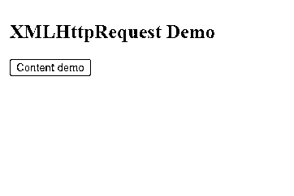
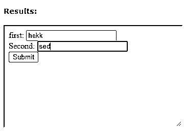
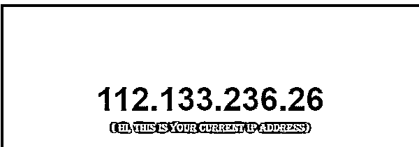
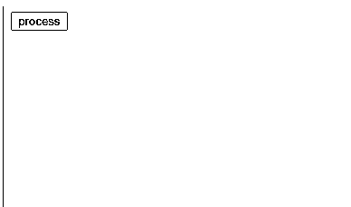
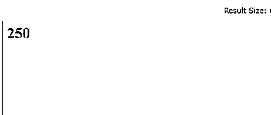

# XML HttpRequest

> 原文：<https://www.educba.com/xml-httprequest/>

## XML HttpRequest 的定义

XML HTTP 请求(XHR)被定义为一个内置的对象，用 JavaScript 在服务器上发出 HTTP 请求。我们可以轻松地上传和下载文件，因为它可以从服务器获取可靠的信息。它提供了客户端和服务器之间的通信路径。在两种操作模式(如同步和异步模式)的帮助下，请求过程得以完成。无需刷新整个页面，该关键字有助于从 URL 中检索数据。XHR 的好处是不用刷新整个页面就能更新网页，它还负责所有低级别的 API，比如缓存、连接建立。

**语法:**

<small>网页开发、编程语言、软件测试&其他</small>

一个简单的语法看起来像创建一个构造函数

`Var xmlh=new XMLHttpRequest ();`

### HttpRequest 方法在 XML 中是如何工作的？

HTTP 请求在 web 浏览器和服务器之间交换数据，服务器反过来返回任何信息，不仅是 XML，还是 web 应用程序的构建块。使用 XHR 发送 HTTP 请求的第一步是打开一个连接到指定的 URL 并执行一个发送请求。浏览器处理请求并完成连接过程的整个生命周期。同时，响应与响应正文和状态代码一起发送。XHR 减少了网页的工作流程，因为它是在完全控制下异步完成的。XHR 拥有高性能的传输通信，能够实现实时传输。XHR 可以传输二进制和文本文件，因为它们有自动编码和解码的数据类型。在本文中，我们使用了 JSON 数据结构来表示 Java Script 对象。

**步骤包括:**

1.  创建构造函数来创建对象。

`Var xmlh=new XMLHttpRequest ();`

*   在 HTML 文档中导入上述内容。
*   导入下面给出的方法。

XHR 要求暂停以完成提出的请求。它指定几毫秒来完成或等待应用程序执行该过程。

`Xr.timeout=4000;`

设置为处理请求的两个侦听器是 open()和 send()。我们可以加载 XML，HTML 文件。

在这一节中，我们将介绍 XML HTTP 请求的一些方法及其属性。下面我们列出了这些方法:

*   **abort()–**该方法丢弃当前的请求进度。它中止获取信息。
*   **open (method，URL)–**该方法通过指定 GET 或 POST 以及 URL 方案来打开请求。
*   **open (method，URL，async)–**该方法指定异步通信。
*   **getresponse Header()–**这个方法返回一个包含 HTTP 对象响应头的字符串。

其他方法有:

*   **send()–**帮助发送请求。
*   **setRequestHeader(label，value)–**它在发送时将这两个参数添加到 HTTP 头中。

XHR 包括状态和州等属性，它只有很少的状态值，如 0、1、2、3 和 4。状态的属性包括 200 have ok 和 404 is page，not found-error。

该请求是这样提出的:

`Var xh =new XMLHttpRequest ();xhr.open('GET', '/doc.file.php');
xhr.responseType = 'blob';
xhr.onload = function() {
if (this.status == 200) {
};
Xhr.send();`

在这里，我们将图像发送到浏览器中的页面，而不需要 URIs 数据。请求是用“GET”发出的。

接下来，通过 XHR 上传数据。

`Var xh=new XMLHttpRequest;
Xh=open(‘POST’, ‘upload’);`

### 例子

在这一节中，我们将通过几个 JavaScript 演示来测试一些代码。创建新的 HTTP 请求并加载一些数据。

#### 示例#1

**代码:**

`<!DOCTYPE html>
<html>
<body>
<h2> XMLHttpRequest Demo</h2>

<button type="button" onclick="functionreq()">Content demo</button>

</body>
</html>`

**说明:**

如果页面不可用，上面的代码显示状态代码。

**输出:**

#### 实施例 2

**代码:**

`<form id='trial-form'>
first: <input name='first'> 
Second: <input name='Second'> 
<input type='submit'>
</form>
`

**说明:**

这里，目标 URL 通过发送 POST 方法来执行访问。上面的代码使用两个输入按钮获取一个值，并等待服务器的响应。输出如下所示，显示了一个表单数据

**输出:**

#### 实施例 3

**代码:**

`<!DOCTYPE html>
<html>
<head>
<title>Showing Computer IP Address</title>

</head>
<body>
<h1 id=ipadd></h1>

( Hi, this is your Current IP address)

</body>
</html>`

**说明:**

上面的代码片段用 addEventListener 打印了状态的 IP 地址。

**输出:**

#### 实施例 4

**代码:**

`<!DOCTYPE HTML>
<html>
<head>
<meta charset="UTF-8">

<title>XMLHttpRequest using methods</title>
</head>
<body>
<button id="btnStart">process</button>

</body>
</html>`

**说明:**

上面的代码生成了一个 Http 对象。在构造函数的帮助下，它生成一个对象。如果页面成功，它将生成正文内容。如果失败，它会产生“Http 无法加载”。

**输出:**

#### 实施例 5

**代码:**

`<html>
<body>

</body>
</html`

**说明:**

XHR 触发未发送、已打开、正在加载和完成等状态。上面的代码使用旧版本的浏览器来打印它们的状态代码。

**输出:**

### 结论

如今，在新的浏览器中，用 HTTP 请求编写一些代码变得非常简单。我们请求页面返回的带有一条信息的数据通常是通过 request get 过程完成的。本文主要关注 XMLHTTP 请求和获取方法。两个常见的用途包括表单提交和检索内容。

### 推荐文章

这是一个 XML HttpRequest 的指南。这里我们讨论 HttpRequest 方法如何在 XML 中工作？带有示例及其代码实现。您也可以看看以下文章，了解更多信息–

1.  [XML 元素](https://www.educba.com/xml-element/)
2.  [XML XSD](https://www.educba.com/xml-xsd/)
3.  [XML 名称空间](https://www.educba.com/xml-namespaces/)
4.  [XML 注释](https://www.educba.com/xml-comments/)

