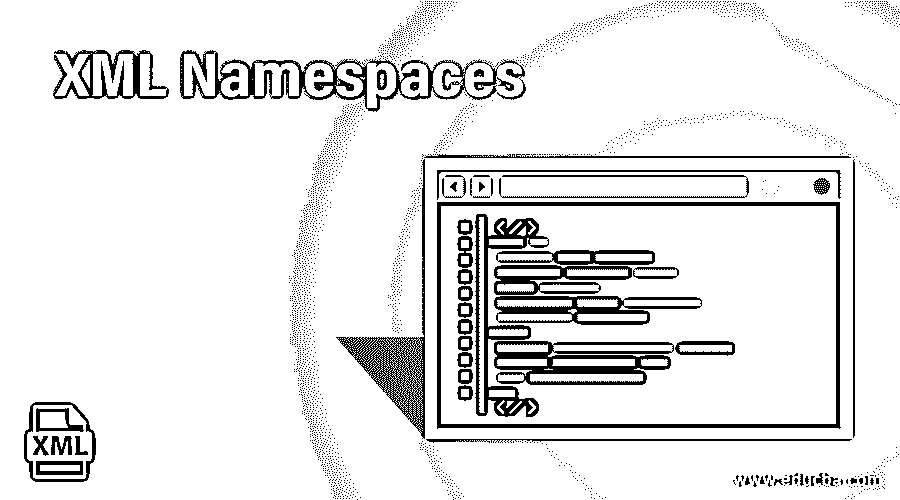
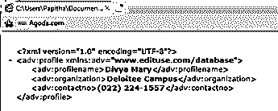
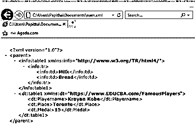
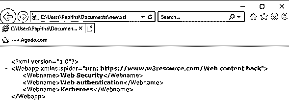
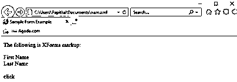

# XML 名称空间

> 原文：<https://www.educba.com/xml-namespaces/>

## XML 名称空间简介

名称空间可以定义为一种简单的机制，通过这种机制可以在 XML 文档中区分名称，W3C 推荐使用这种机制，它附带了几对本地名称和名称空间。使用名称空间，可以将元素和属性名称分配给一个组。命名空间由 W3C 决定，以通过 URI(统一资源标识符)引用/URL 以及它们在全球范围内执行的本地名称进行标识，这有时要求元素具有唯一的全局名称，主要目的是避免名称冲突，因为 XML 文档具有相同的名称，但具有不同的定义(不同的词汇表具有不同的含义)。它是作为一个特别保留的属性放在 XML 标记中的。前缀属性以“xmlns:”的形式给出，它可以用于带有元素和属性的名称。

**语法:**

<small>网页开发、编程语言、软件测试&其他</small>

XML 文档中命名空间的声明非常重要，这是通过使用一系列保留属性来完成的。并且这些属性可以直接放在路上或者默认在下面的描述方法中:

`<element namexmlns: prefix name = “ URI”>`

在语法中，名称空间以带有(:)的关键字“prefix”开头，名称是前缀名称，URI 是名称空间标识符。本地名称和名称空间混合在一起形成通用名称。它们是在开始标签中定义的。命名空间的声明依赖于直接或默认提供的属性系列。例如，对于前缀='xmlns:'名称空间名称

默认的属性名是“xmlns”

下面用前缀 HTML 和命名空间 URI 声明了 XHTML 的命名空间标准:

**xmlns:html = http://www . w3 . org/1999/XHTML**

URI:它提供了全球唯一的标识符，这可以包括字符。

前缀:XML 文档中的通用名称是使用附加到本地名称的可选前缀来声明的，这称为限定名或 qname。

Qname::=(前缀':')

限定名的例子有 XHTML: title，discount: sale，xlink: fit。这里我们有 xhtml，折扣，链接有前缀和标题，销售，适合有本地部分。

### 名称空间在 XML 中是如何工作的？

名称空间是 XML 中的难点，因为元素和属性的名称是由开发人员定义的，所以会出现冲突。此外，它们被称为词汇表，因为它是定义和名称的集合。名称空间的作用域从开始标记开始，以相应的结束标记结束，而空标记作用域是自己声明的。因为它是特定模式中的一组元素、属性、类型。名称空间需要两个基本要素，如下所述:

*   它区分两个名称相似的元素，以避免不同标记语言中使用的名称之间的冲突。

下面用不同的场景解释工作原理

**尝试- 1:** 用于具有多个前缀的单个名称空间。示例如下:

`<x:studentxmlns:x='urn:oxford:ns'>Grade8</x:student>
<y:studentxmlns:y='urn:oxford:ns'>Grade 10</y:student>
</sch>`

这里 x，y 是两个不同的前缀，有一个名称空间“urn”。

**尝试–2:**两个不同名称空间的相同前缀 m 和 n 是带有两个 urn 名称空间的两个前缀。

`<schxmlns:m='urn:Oxford:ns' xmlns:n='urn:osford:ns'>
<m:Teacher>Computer Science</m:Teacher>
<n:Teacher>Science and humanities</n:Teacher>
</sch>`

**尝试–3:**在没有前缀的根元素中声明名称空间。根元素 lib 的命名空间为。

`<lib xmlns='urn:hadvardlibrary:ns' xmlns:html='http://www.w3.org/1999/xhtml'>
<html:body>
Anantomy Books <html:b> Introduction to the concept</html:b>
</html:body>
</lib>`
现在，在下一节中，我们将看到上述所有场景的实现和结果。

### 实现 XML 名称空间的示例

以下是 XML 中命名空间的示例:

#### 示例#1

这里，名称空间前缀是 adv，URI 是[www.edituse.com/](http://www.edituse.com/)

**代码:**

`<?xml version="1.0" encoding="UTF-8"?>
<adv:profilexmlns:adv="www.edituse.com/database">
<adv:profilename>Divya Mary</adv:profilename>
<adv:organization>Deloitee Campus</adv:organization>
<adv:contactno>(022) 224-1557</adv:contactno>
</adv:profile>`

**输出:**

#### 实施例 2

使用前缀作为名称空间以避免冲突。这里我们有两个表，但是名称空间不同，分别是 info 和 dt。

**代码:**

`<parent>
<info:table1 xmlns:info="http://www.w3.org/TR/html4/">
<info:tr>
<info:td>Milk</info:td>
<info:td>Bread</info:td>
</info:tr>
</info:table1>
<dt:table1 xmlns:dt="https://www.EDUCBA.com/FamousPlayers">
<dt:Playername>Krayan Kobe</dt:Playername>
<dt:Place>Toronto</dt:Place>
<dt:Medal>15</dt:Medal>
</dt:table1>
</parent>`

**输出:**

#### 实施例 3

使用默认名称空间，不使用前缀。同一个文档可以定义多个名称空间。下面的所有元素都可以使用这个名称空间，并且这些元素不会直接应用于属性。下面给出一个例子:

**代码:**

`<?xml version="1.0" ?>
<Webappxmlns:spider='urn: https://www.w3resource.com/Web content hack'>
<Webname>Web Security</Webname>
<Webname>Web authentication</Webname>
<Webname>Kerberoes</Webname>
</Webapp>`

**输出:**

#### 实施例 4

使用两个命名空间实现，并重写默认命名空间。以下概念说明了:

**代码:**

`<html xml:lang="en" lang="en">
<head>
<title>Sample Form Example</title>
<blueprint >
<employee>
<candidate xmlns="">
<firstname/>
<lastname/>
</candidate>
</employee>
<load id="frm1" method="get" action="click.asp"/>
</blueprint>
</head>
<body>

The following is XFormsmarkup:

<input ref="frstname" >
<label>First Name</label>
</input>
 
<input ref="laname" >
<label>Last Name</label>
</input>
 
 
<submit submission="frm1" >
<label>click</label>
</submit>
</body>
</html>`

**输出:**

#### 实施例 5

使用模式命名空间“xs:

**代码:**

`<?xml version="1.0"?>
<xs:schematargetNamespace="http://www.educba.com/Artist"
xmlns:xs="http://www.w3.org/2001/XMLSchema"
>
<xs:element name="Article" type="xs:string"/>
<xs:element name="Topic Name" type="xs:string"/>
<xs:element name="Programming Languages" type="xs:string"/>
<xs:element name="WriterName">
<xs:complexType>
<xs:sequence>
<xs:element ref="Article"/>
<xs:element ref="Topic Name"/>
<xs:element ref="Programming Languages"/>
</xs:sequence>
</xs:complexType>
</xs:element>
<xs:elementWritername="Article">
<xs:complexType>
<xs:sequence>
<xs:element ref="Name"/>
</xs:sequence>
<xs:attributeWriterName="Vidhya Tagoor" type="xs:Experience" use="required"/>
</xs:complexType>
</xs:element>
</xs:schema>`

如果名称空间“Http://www.educba/Article”被删除，上述模式代码可能无效，因为 name 和 Article 元素赋值具有引用模式中元素的子元素。这里，复杂类型元素定义了一系列其他后续元素。

### XML 中名称空间的优势

以下是 XML 名称空间的优点:

1.  它避免了在 XML 文档中定义重复的元素名称和属性，其中在一个组织产品中定义的 XML 元素可能与另一个组织产品冲突。冲突的主要原因是当我们在不同的应用过程中使用 XML 文档时。
2.  带有名称空间的元素和属性可以在其他文档或模式中正确地重用。
3.  它增强了可读性，并且它们的声明可以放在 XML 文档中的任何地方。尽管名称空间在 XML 中是一个非常有争议的部分，但它仍然被用作 XML 信息架构中解决不同问题的一种方法。
4.  另一个优点是可重用性，它有单独的软件应用程序来做，重用元素。它还具有良好的模块化和可扩展性。

### 结论

因此，本文清楚地解释了为什么 XML 文档中需要名称空间，我们也可以在 XML 文档中使用自己的名称空间。使用名称空间的最主要的概念是学习如何保持这些原则。任何人都可以通过描述元素类型和属性来创建 XML 名称空间。唯一没有命名空间的概念是 CSS，预计它会更早提出。

### 推荐文章

这是 XML 名称空间的指南。在这里，我们讨论 XML 名称空间的介绍和它的不同优点，以及它的例子和代码实现。您也可以浏览我们推荐的其他文章，了解更多信息——

1.  XML 解析器是如何工作的？
2.  [XML 版本介绍](https://www.educba.com/xml-versions/)
3.  [XML 特性|前 13 名](https://www.educba.com/xml-features/)