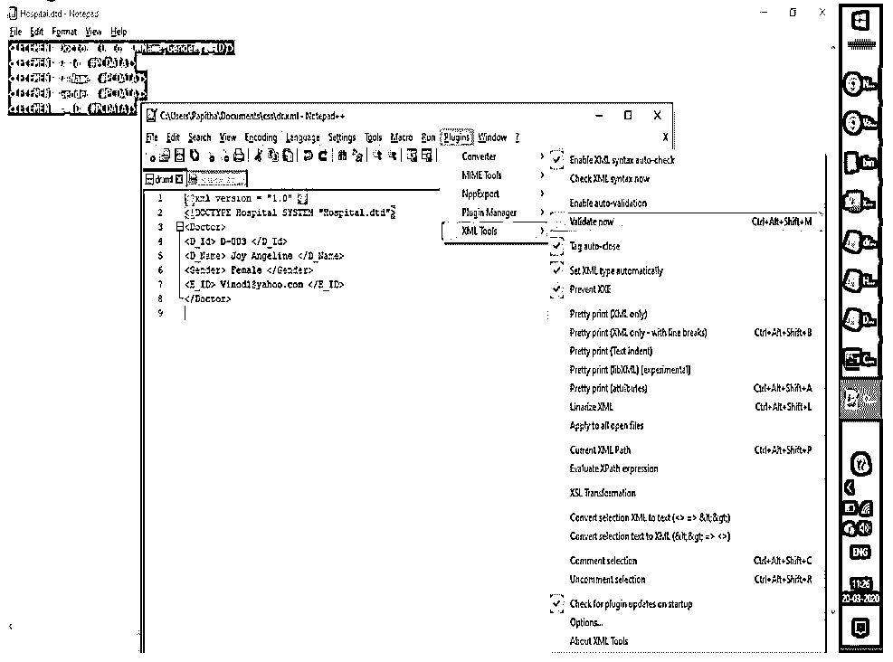
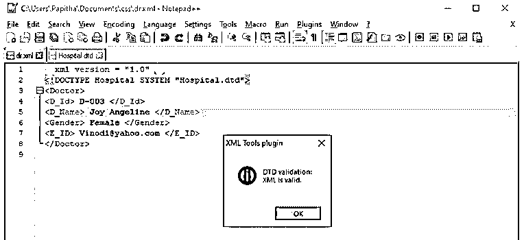
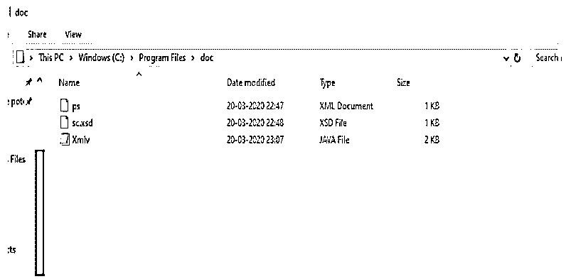
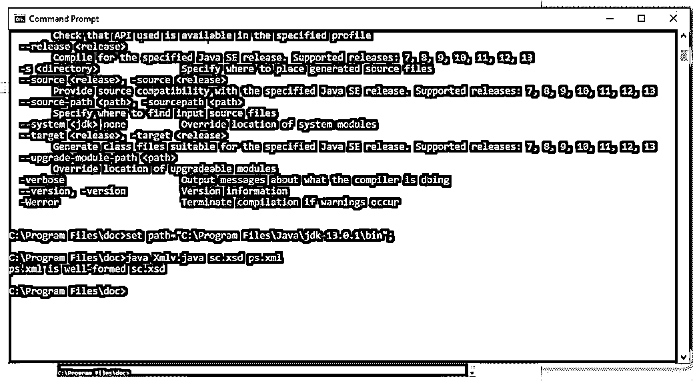

# XML 验证

> 原文：<https://www.educba.com/xml-validation/>

## XML 验证简介

XML 验证是一个检查 XML 文档中语法错误的过程，以确保使用 DTD 或 schema 按照标准规则编写文档。一个完整的 XML 文件被认为是有效的 XML 文档，除非其中定义了正确的语法和约束。为了检查验证文档类型定义，遵循两个模式，并且检查是否做得很好，因此不需要考虑 XML 文档的数据和结构。例如，如果数据是位置和名字，那么如果提供了相应的值而没有非空，则验证有效。最好进行验证，以确保 XML 文件在客户端和提供正确确认的 web 服务的服务器之间发送。

**语法:**

<small>网页开发、编程语言、软件测试&其他</small>

**1。用于 DTD 验证代码**

`<?xml version="1.0" encoding="UTF-8"?>
<!ELEMENT name (child elements, *)>
<!ELEMENT
<!ATTLIST
Att name       CDATA   #REQUIRED
Att name       CDATA   #IMPLIED
>`

**2。对于 XSD**

`<?xml version="1.0" encoding="UTF-8">
<xsd:schemaxmlns:xs="http://www.w3.org/2001/XMLSchema">
<xsd:element name="">
<xsd:complexType>
<xsd:sequence>
</xsd:sequence>
</xsd:complexType>
</xsd:element>`

### XML 中的验证是如何工作的？

*   XML 解析器以两种不同的方式处理验证过程。
*   一个是定义良好的 XML 文档，另一个是有效的 XML 文档。
*   验证是可选的，但是当涉及到数据完整性时，强烈建议进行验证。
*   在大多数情况下，XML 的验证是通过模式完成的，而不是通过 DTD。
*   XML 解析器在验证中起主要作用，它有两类，验证和非验证。
*   前者根据 DTD 验证，而后者不根据 DTD 验证 XML。

### 将 XML 文档与 DTD 相关联

用正确的语法完成的 XML 文档被称为是格式良好的，它应该用文档类型定义(DTD)进行适当的验证。)它检查词汇和语法规则。使用 XML 文档的应用程序应该将数据与相应的定义相匹配，验证依赖于后处理。可以使用 IDE 之类的验证工具或者通过在线验证器来执行验证。

使用 DTD 验证 XML 文件需要:

*   XML 文件
*   DTD 文档，其中 DTD 是元素和属性的集合。

一旦完成以上两个过程，就需要使用函数 parser()解析 xml 文件，该函数使用 java 中的 DOM API 自动生成文档对象树。这个解析器在验证处理结束时报告警告消息。接下来是将 setvalidating()方法启用为“TRUE”。我们还可以使用 NetBean 来验证该文件。因为 DTS 不支持名称空间，这是 XML DTD 验证的一个基本缺点。为了克服这种 XML，使用模式验证是有好处的。

### 将 XML 文档与 XML 模式相关联

XML 模式也称为 XML 模式定义，它定义了一种新的验证 XML 片段的方法。将 XML 文档的结构传输到机器时，模式是必需的。验证意味着运行一个过程来确保 XML 文档遵循标准模式定义的规则。

说起来，由于检查所需信息的数据完整性，模式被验证，元素和属性的数据结构像子元素的顺序一样被校正。此外，业界发布了一些工具来执行这些重要的检查。尽管在某些情况下模式是有效的，但这并不简单。在某些情况下，它可能通过验证，但会留下警告消息。

### XML 验证的示例

下面是提到的例子:

#### 示例#1

在这里，我们将为医院编写 XML 文件，并将该文件保存为 dr.xml。

**代码:**

**dr.xml**

`<?xml version = "1.0" ?>
<!DOCTYPE Hospital SYSTEM "Hospital.dtd">
<Doctor>
<D_Id> D-003 </D_Id>
<D_Name> Joy Angeline </D_Name>
<Gender> Female </Gender>
<E_ID> Vinod1@yahoo.com </E_ID>
</Doctor>`

接下来，为上面的 XML 文件生成 DTD 文件，其中文档以开始。

**Hospital.dtd**

`<!ELEMENT Doctor (D_Id, D_Name,Gender,E_ID)>
<!ELEMENT D_Id (#PCDATA)>
<!ELEMENT D_Name (#PCDATA)>
<!ELEMENT Gender (#PCDATA)>
<!ELEMENT E_ID (#PCDATA)>`

如果验证未成功完成，则有必要修改 XML 文档以生成格式良好的 XML 文档。

**Note:** In this example, we have used Notepad++ for dtd validation. Before executing follow the steps to plugins xml tool. Go to notepad++ -> click plugins ->Plugin Manager -> generate XML tool (automatically updates in the list)and click ok button. Then in the toolbar, you could see plugins-> XML tools, right-click and click validate now. The DTD is validated for the corresponding xml file. (create dr.xml and Hospital.dtd in the notepad++) then click xml file and follow the above procedure to check for validation.

**输出:**

**插件安装**

**验证后**

#### 实施例 2

使用 Java XML 文件和 XSD 进行验证。

**代码:**

**ps.xml**

`<?xml version = "1.0"?>
<grade>
<stud id = "435">
<firstname>joseph</firstname>
<lastname>raj</lastname>
<score>75</score>
</stud>
<stud id = "355">
<firstname>Vani</firstname>
<lastname>Neelakandan</lastname>
<score>95</score>
</stud>
<stud id= "555">
<firstname>Vinothalin</firstname>
<lastname>Stefen</lastname>
<score>88</score>
</stud>
</grade`

**sc.xsd**

`<xs:schemaattributeFormDefault="unqualified" elementFormDefault="qualified" xmlns:xs="http://www.w3.org/2001/XMLSchema">
<xs:element name="grade">
<xs:complexType><xs:sequence><xs:element name="stud" maxOccurs="unbounded" minOccurs="0">
<xs:complexType><xs:sequence>
<xs:element type="xs:string" name="firstname"/>
<xs:element type="xs:string" name="lastname"/>
<xs:element type="xs:byte" name="score"/>
</xs:sequence>
<xs:attribute type="xs:short" name="id" use="optional"/>
</xs:complexType>
</xs:element>
</xs:sequence>
</xs:complexType>
</xs:element></xs:schema>`

**Xmlv.java**

`import java.io.File;
import java.io.IOException;
import javax.xml.XMLConstants;
import javax.xml.transform.stream.StreamSource;
import javax.xml.validation.Schema;
import javax.xml.validation.SchemaFactory;
import javax.xml.validation.Validator;
import org.xml.sax.SAXException;
public class Xmlv {
public static void main(String[] args) {
if(args.length !=2){
System.out.println( "XSDValidator<fname.xsd><fname.xml>" );
} else {
booleanisV = validateXMLSchema(args[0],args[1]);
if(isV){
System.out.println(args[1] + " is well-formed " + args[0]);
} else {
System.out.println(args[1] + " is not well-formed  " + args[0]);
}
}
}
public static booleanvalidateXMLSchema(String xsdP, String xmlP){
try {
SchemaFactory factory =
SchemaFactory.newInstance(XMLConstants.W3C_XML_SCHEMA_NS_URI);
Schema s = factory.newSchema(new File(xsdP));
Validator validator = s.newValidator();
validator.validate(new StreamSource(new File(xmlP)));
} catch (IOException e1){
System.out.println("Exception: "+e1.getMessage());
return false;
}catch(SAXException e2){
System.out.println("SAX Exception: "+e2.getMessage());
return false;
}
return true;
}
}`

将所有三个文件保存在同一个文件夹中，并在 javajdk 中执行。(示例 e:\java\javac 文件名)。

**输出:**

### 在 XML 中使用验证的优势

下面给出了一些优点:

*   如果没有验证，则无法清楚地查看相应的文件。使用验证时，可以清楚地查看数据集之间的不匹配或缺失信息。
*   一致性和完整性。
*   XML 模式验证比 DTD 验证更受青睐，原因可能是模式定义了内容的规则，而 XSD 文档本身是用 XML 编写的，这与 DTD 语法不同。
*   使用 XML 解析器和 XML Dom 通过验证来解决错误。
*   此外，它还有助于匹配编译模式的名称空间和 xmlns 名称空间。

### 结论

因此，在本文中，我们看到了 xml 验证机制，也看到了 XML DTD 结构和模式。如果 XML 验证很大，那就相当困难。使用 XML 进行验证时，建议查看特定的值和数据关系。架构验证工具仅提供一致的结果，因此建议使用经过验证的工具。选择使用 DTD 还是模式总是取决于您对 XML 的处理。一些新技术，尤其是 web 服务，取决于模式。

### 推荐文章

这是 XML 验证的指南。在这里，我们讨论 XML 验证的介绍，以及验证是如何工作的，将 XML 文档与 DTD 相关联，以及它的优点。您也可以看看以下文章，了解更多信息–

1.  [XML 特性](https://www.educba.com/xml-features/)
2.  [Excel 中的 XML](https://www.educba.com/xml-excel/)
3.  [XML 版本](https://www.educba.com/xml-versions/)
4.  [带 CSS 的 XML](https://www.educba.com/xml-with-css/)