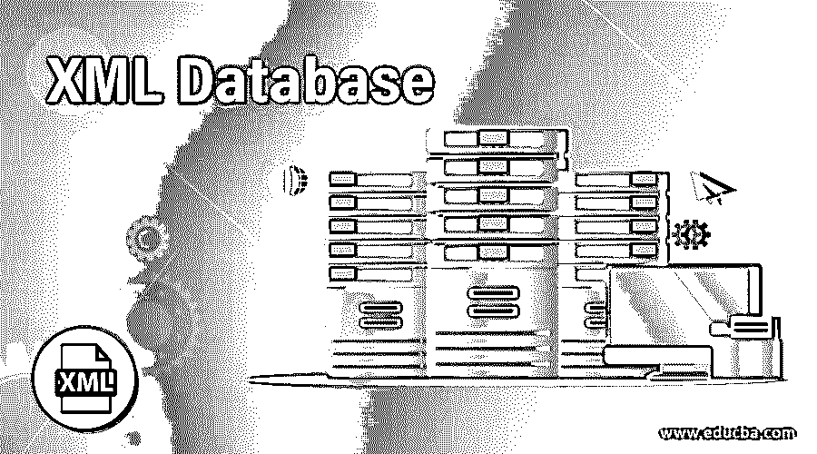
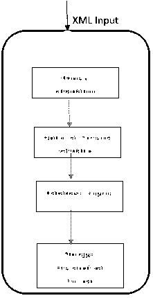
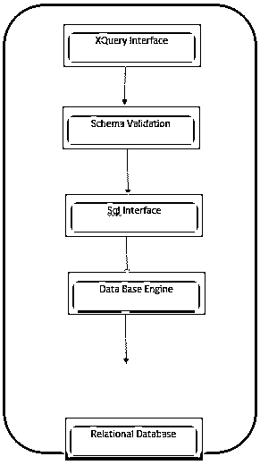
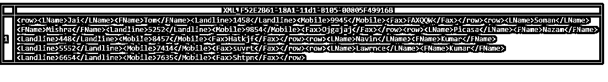
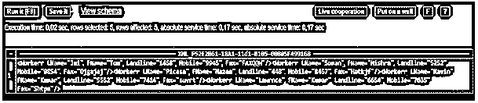
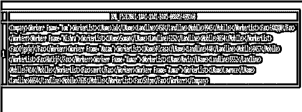

# XML 数据库

> 原文：<https://www.educba.com/xml-database/>

## XML 数据库的定义

XML 数据库的实际定义是将 XML 存储在数据库中，该数据库包含表和容器，可以被查询、序列化为任何不同的格式，还可以在 XML 文档中构建模型并将它们映射到数据库。XML 数据模型的结构是具有有序节点的树模型，许多企业商业组织使用 XML 来存储其所有有价值的内部数据，因为它适合内存并提供舒适的。XML 数据库的另一个目标是在插入时为索引和解析提供一个绝对的解决方案。该模型必须包括基本机制，如属性、元素、PCDATA 和文档的顺序。由于这一领域是新近发展起来的，许多公司将其用于医疗存储目的，目录。

### XML 数据库的类型及示例

如果数据集很小，使用 XML 作为数据库非常好。数据管理和其他专业人员在管理 XML 和关系结构之间的数据时总是会遇到一些问题。为了克服这个问题，有两种策略可以帮助在 XML 文档中传递数据。在许多情况下使用这两种方法是基于特定的应用程序和 XML 文档格式。

<small>网页开发、编程语言、软件测试&其他</small>

有两种主要类型的 XML 数据库，它们是:

#### 1.原生 XML

原生 XML(NXDs)遵循 XML 数据模型来存储 XML 数据，并且优先于启用 XML 的，因为它们完全控制 XML。它指定了通用结构并使用了 XML 文档。由于诸如 XML 查询语言之类的功能，对原生 XML 的偏好得以实现。原生 XML 数据库不以表的形式存储数据，而是用容器来存储。容器负责处理大量 XML 数据以及它们之间的关系。另一个好处是 XML 数据在这里不是固定的。原生 XML 数据库的一个这样的服务提供者是 XML4Pharma。他们用 X 路径表达式代替 SQL 语句作为查询的全球标准。

本地数据库有一个额外的优势，可以进行更新和删除，同时该数据库支持事务。它们还提供了 API，并提供了往返过程的最佳能力，通过该过程我们可以取回存储的相同文档。一些本地数据库包括 X-hive、Base X、DB XML。

##### 例子

`//LibraryData/ContentData[@ContentKey="011"]//Entry Record[Login date and time<"2020-01-12T01:02:00"] The above statement states that select all the content with Library data where the Content Data element has a primary key with the value of “011” and Entry record element which has login date and time. Therefore, with X-Path expressions only selected field is selected like Entry Record which has been created on January 12th 2020\. Note that a complete XML document is not retrieved.`

**原生数据库工作流程概述:**

该表在 XML 文件中表示为:
`<Client id = "3">
<name> Amazon Pharma </name>
<Usecases>
<usecase id = "1" name="Hydro"/>
<usecase id = "2" name="acroym"/>
<Usecases>
</Client>`

XQuery 被写成给出输出。查询表达式创建一个客户端元素。
`for $c in $Clinet/row
return
<Client id="{$c/ClientID}">
<name>{string ($c/name) } </name>
<Usecases>
{
for $p im $use/row
where $p/usecaseid = $c/ClientID
return
<Usecases id="{$p/Client id}" name="{$p/name}"/>
}
</Usecases>
</Client>`

#### 2.支持 XML(XEDB)

这种最新开发的 XML 数据库是一种关系数据库或面向对象的数据库，它由带有行和列的表组成。表格格式由一组包含字段的记录组成。它们在本地处理 XML 文档，这种文档被构造成一种混合体。XML-enabled 使用模式特定的格式，并在设计过程中映射到 XML 文档。该数据库具有由第三方提供的映射部分。XEDB 的基本存储部分取决于通过 XPATH 或 DOM 进行数据操作的位置。

**支持 XML 的数据库工作概述:**

支持 XML 的数据库比其他类型的数据库有更多的处理时间，在其他类型的数据库中，大部分工作都是在映射、解析文件上完成的。有两种映射方案用于将 XML 映射到数据库模式。它们是基于表的映射、对象关系映射。表数据库的映射过程使用规范映射或虚拟 XML 视图。分解是一个将 XML 文档转换成行的概念。

##### 例子

让我们首先在 SQL 查询中创建一个表

`CREATE TABLE Workerr
(
LName varchar(100),
FName varchar(100),
Landline int ,
Mobile int ,
Fax varchar(20)
);
insert into Workerr( LName , FName,Landline , Mobile, Fax)
VALUES ('Jai','Tom',1458, 9945,'FAXQQW'),
('Soman','Mishra',5252, 9854,'Ojgajaj'),
('Picasa','Nazam',0448, 8457,'Hatkjf'),
('Navin','Kumar',5552, 7414,'suvrt'),
('Lawrnce','Kumar',6654,7635,'Shtpn');`

因此，我们创建了一个具有五个属性的表 worker。下一步是将 SQL 表转换成 XML，这在 SQL Server 中完成，如下所示:

子句 XMLAUTO 将每一列转换成 XML 格式的属性，这在输出中给出。

`SELECT * FROM Workerr
FOR XML AUTO`

**输出:**

这里默认情况下，根元素被命名为“Row”。

接下来使用 XMLPath 来说明元素是如何嵌套的。

`SELECT * FROM Workerr
FOR XML PATH`

**输出:**

`SELECT * FROM Workerr
FOR XML PATH (‘Workerr’)`

**输出:**

要获得格式良好的 XML 文档，必须命名根元素，因此我们使用:

`SELECT  FName as [@Fname],
LName  AS [WorkerList/LName],
Landline [WorkerList/Landline],
Mobile [WorkerList/Mobile],
Fax
FROM Workerr
FOR XML PATH ('Workerr'), ROOT('Company')`

**输出:**

XML 数据库的一个最常见的例子是 EMC Documentum Store，它是为需要高级数据库管理和内部应用程序存储功能的软件专业人员开发的。它们包括 XML 标准。

### 结论

结束时，本文向世界介绍了 XML 以及处理数据库的挑战。因此，从上面的证据可以清楚地看出，XML 数据库的类型不太容易在特定的应用程序中使用。由于异构数据存储，它们被广泛用于金融、电子学习和更多数字图书馆等领域。总之，XML 数据库已经对行集合进行了排序，关系是通过分层和嵌套格式完成的。

### 推荐文章

这是一个 XML 数据库指南。这里我们还讨论了 XML 数据库的定义和类型，以及不同的例子和代码实现。您也可以看看以下文章，了解更多信息–

1.  [XML 解析器](https://www.educba.com/xml-parsers/)
2.  [带 CSS 的 XML](https://www.educba.com/xml-with-css/)
3.  [XML 特性](https://www.educba.com/xml-features/)
4.  [XML 命令](https://www.educba.com/xml-commands/)