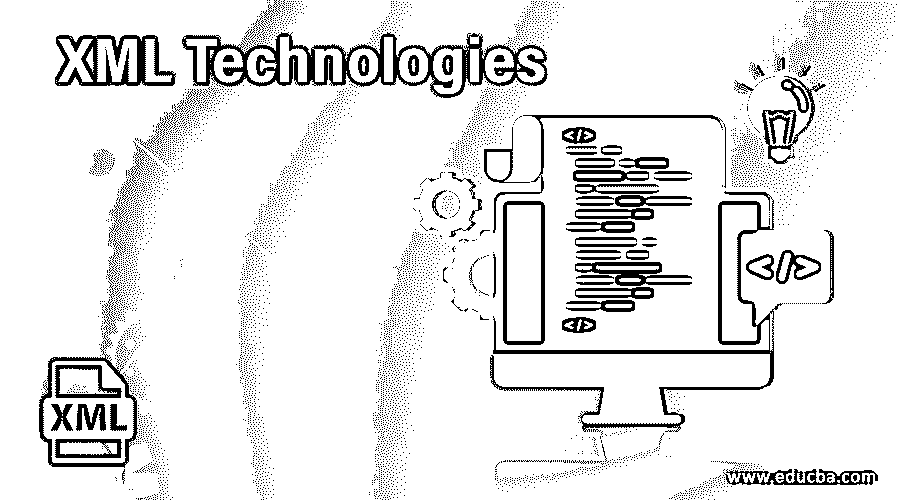

# XML 技术

> 原文：<https://www.educba.com/xml-technologies/>

## XML 技术的定义

XML 技术被定义为处理 XML 应用程序，并且为了构建 web，在 XML 文档中使用不同的 XML 变体来处理活动。可扩展标记语言(XML)是一种与平台无关的现代标记语言，这也是它适应新技术并支持各种应用程序而广受欢迎的原因。主要原因是 XML 支持 Unicode，因为如果用人类语言编写，它很容易交流。通过高效的数据共享，任何新的编程语言都可以读取和处理 XML 文件。

### 各种 XML 技术及其示例

在这一节中，我们将看到 XML 相关技术的概述。以下是技术列表:

<small>网页开发、编程语言、软件测试&其他</small>

#### 1.文档类型定义

DTD 声明具有定义 XML 文档的内联和外部引用。使用 DTD 的主要目的是在共享时验证数据，因为 XML 提供了一种在应用程序中共享数据的依赖方式。示例如下:

`<?XML version="1.0"?>
<!DOCTYPE  project [
<!ELEMENT project    (Name,Type,country,description>
<!ELEMENT Name      (#PCDATA)>
<!ELEMENT Type    (#PCDATA)>
<!ELEMENT country (#PCDATA)>
<!ELEMENT  description   (#PCDATA)>
]>
<project>
<Name> Claw-toe</Name>
<Type>App</Type>
<country>Germany</country>
< description >Have a fun !</ description >
</project>`

#### 2.可扩展 HTML

它与 HTML 非常相似，但有一些高级限制。它们是格式良好的，文档是用 XML 解析的，不像 HTML，所有的标签和属性都应该用小写字母书写。XHTML 的主要好处是它有更严格的语法规则和更好的可访问性。XHTML 文档包括 doctype、body 和 head。示例如下:

`<?xml version="1.0" encoding="UTF-8"?>
<!DOCTYPE html
PUBLIC "-//W3C//DTD XHTML 1.0 Strict//EN"
"DTD/xhtml1-strict.dtd">
<html xml:lang="en" lang="en">
<head>
<title> XHTML Example </title>
</head>
<body>
……….
</body>
</html>`

#### 3.XML 模式定义

架构为 XML 文件提供了一个模板。在 XML 的上下文中，模式描述了 XML 文件中的元素和属性应该是什么类型的格式。XML schema 克服了 DTD 缺乏名称空间和丰富数据类型的限制。文件使用后缀保存。xsd 扩展。它们定义简单和复杂的类型。一些应用程序，如电子商务，通过使用 XSD 模式变得更加简单。示例如下:

`<?xml version = "1.0" encoding = "UTF-8"?>
<xs:schema xmlns:xs = "http://www.w3.org/2001/XMLSchema">
<xs:element name = "banking">
<xs:complexType>
<xs:sequence>
<xs:element name = "sector name" type = "xs:string" />
<xs:element name = "branch" type = "xs:string" />
<xs:element name = "contact" type = "xs:int" />
</xs:sequence>
</xs:complexType>
</xs:element>
</xs:schema>`

#### 4.可扩展样式表语言转换(XSLT)

XSLT 是用 XML(一种类似 html 中 CSS 的样式语言)编写的，负责将 XML 文档转换成其他格式。拥有这个 UI 脚本更容易维护。示例如下:

`<?xml version="1.0" ?>
<xsl:stylesheet version="1.0" xmlns:xsl="http://www.w3.org/1999/XSL/Transform">
<xsl:template match="hi ">
</xsl:template>
………
</xsl:stylesheet>`

#### 5.XML DOM

文档对象模型是 XML 的标准编程 API，通过它，编程语言可以连接到网页，并以树形层次结构定义文档，在该结构中，文档由对象(窗口、表单、链接)设计。使用类似 COM 的接口创建 Xml 解析器。下面给出了示例 **:**

`<html>
<body>

</body>
</html>`

#### 6.x 路径

X-path 使用路径表达式，该表达式允许产生字符串等值的计算，从而告诉 XML 数据文件的路径和地址布尔也计算值。Xpath 促进了 XSLT 和 Xpointer 之间的语法共享，并通过树导航来选择特定方向上的各个节点，以满足某些属性，使用(/)来遍历节点。

`Database/empname/empid/@sal`

#### 7.XSl-FO

这是一个 XSl 格式化对象，定义为样式表应用程序，用于格式化输出的 XML 数据。示例如下:

`<fo:block space-after="3pt">
<fo:wrapper font-size="10pt" font-weight="bold">
Cream with choclates
</fo:wrapper>
</fo:block>`

#### 8.X-Link

Xml 链接语言主要用于 XML 文档中的超链接功能。它们用元素、类型、href 来表示。

`<?xml     version = "1.0"    encoding = "utf-8" ?>
<cafed    xmlns:xlink = "http://www.w3.org/1999/xlink" >
<cafe       name = "bdown" >
<description
xlink:type = "action"
xlink:href = "http://cafe.com/cafed/bdown.avi" >
</description>
</cafe>`

#### 9.x 指针

xml 指针语言使用超链接指出 XML 文档的某些部分。它们通常通过链接处理 xml 部件媒体。用 Xpointer 表达式来指出一个特定部分包含(#)符号。

`xlink:href = "http://www.cafed.com/cafedata.xml#xpointer(id('php'))"`

#### 10.x 形

它用于描述数据的形式，并对形式进行操作和验证。

`<?xml version="1.0" encoding="UTF-8"?>
<html
xmlns:xf="http://www.w3.org/2002/xforms">
<head>
<title> Form demo XML</title>
<xf:model>
<xf:submission action="http://localhost/"
method="get" id="press"/>
</xf:model>`

#### 11.x 查询

它定义了 XML 文档的查询集合。它采用 XPath+SQL 之类的查询语言。XML 需要一个数据模型来表达复杂的查询。使用 FLWR 表达式。

`for $x in doc("cafed.xml")/cafe/menu
where $x/item>30
return $x/food`

#### 12.简单对象访问协议

它是一种用于 XML 消息传递的通信协议。重点在于通过 HTTP 广播消息的远程过程调用。SOAP 在 java、web 服务和. net 中广泛使用。因此，SOAP 被定义为一种借助 XML 和 HTTP 进行信息交换的机制，即程序从一个操作系统到另一个操作系统的通信。它的工作非常简单，因为 SOAP 请求/响应是通过 HTTP 协议完成的，通过该协议，客户机请求与 XML 消息一起发送到服务器，XML 响应被发送回客户机，在客户机上解析并返回值。示例如下:

`<?xml version="1.0"?>
<SOAP-ENV:Envelope xmlns:SOAP-ENV="http://www.w3.org/2001/12/soap-envelope" SOAP-ENV:encodingStyle=" http://www.w3.org/2001/12/soap-encoding">
<soap:Body>
<SOAPSample >
<Tutorialweb>int</Tutorialweb>
</ SOAPSample >
</soap:Body>
</SOAP-ENV:Envelope>`

#### 13.WSDL ( (Web 服务描述语言))

Web 服务描述语言是基于 XML 的文件，用于描述 web 服务。示例如下:

`<definitionsname="Welcome to E-Service"targetNamespace=http://example.org/math/xmlns=http://schemas.xmlsoap.org/wsdl/><!-- abstract definitions --><types> ...//element names<message> ..// message and part names<portType> ...//operations,I/O. <!-- concrete definitions --><binding> ...//binding name<service> ...//name and documentation</definition>`

### 结论

万维网有许多信息流，并且有数据的交互和交换，因此为了从当前的网络中检索数据，文档应该像 XML 一样被很好地结构化。这些 XML 技术提供了基本的基础。因此，本文获得了一些关于各种 x 类型和链接、样式表以及在 XML 文档上指向链接的基础知识。因此，您应该检查 web 应用程序的不同方面。

### 推荐文章

这是 XML 技术指南。在这里，我们还将讨论 xml 的定义和各种 XML 技术，以及示例和代码实现。您也可以看看以下文章，了解更多信息–

1.  [XML 特性](https://www.educba.com/xml-features/)
2.  [XML 模式](https://www.educba.com/xml-schema/)
3.  [HTML vs XML](https://www.educba.com/html-vs-xml/)
4.  [XML 名称空间](https://www.educba.com/xml-namespaces/)