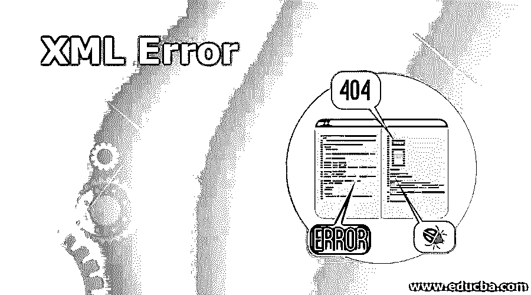
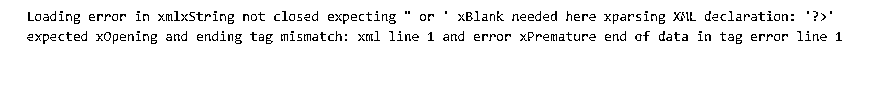
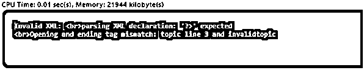
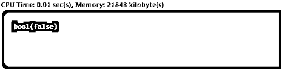
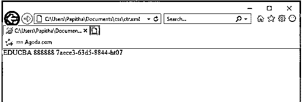

# XML 错误

> 原文：<https://www.educba.com/xml-error/>

## XML 错误的定义

XML 在其规范中定义了错误和警告，XML 使用 XML 错误处理程序来处理它们，而 XML 错误处理程序又使用 SAX 协议。一般来说，XML 文档被广泛应用于各种应用中来存储结构化数据，这些数据可能包括缺失的元素、错误的格式甚至是不匹配的值。即使是格式良好的 XML 文档也有语法上正确的错误，但这可能是由于缺少属性等原因造成的。这些处理程序在打开和关闭 XML 数据源时被很好地定义，因为一旦 XMLParser 发出警告，XML 就会定义错误类。

### 语法和参数

下面是 PHP 用来检测函数中错误的不同函数:

<small>网页开发、编程语言、软件测试&其他</small>

web.xml 文件在其 android 应用程序中使用以下结构来为每个指定的元素指定错误页面。这里使用了<error-page>元素标签。</error-page>

`<web-app>
<error-page>
<exception-type>What type of exceptions throwed(java.x)</exception-type>
<location>error web page- failed(error.filename)</location>
</error-page>
</web-app>`

`enum xmlErrorLevel {
XML_ERR_NONE = 0
XML_ERR_WARNING = 1
XML_ERR_ERROR = 2
XML_ERR_FATAL = 3
};`

*   这个函数有三个参数和相应的值。

**函数:**PHP for XML 中的 libxml 错误处理程序。

`libxml_get_errors (void): array`

*   这个函数返回缓冲区中的一个错误数组

**xmlGeneric**

`void     xmlGenericErrorFunc             (void * ctx,
const char * msg,
... ...)
Here ctx denotes  parsing context,
Msg is the error message.`

**xmlCopyError**

`int        xmlCopyError                          (xmlErrorPtr from,
xmlErrorPtr to)`

在这里复制一个错误，如果没有错误，这个函数返回 0，如果有错误，返回-1。这里 from 是源误差，to 是目的误差。为了显示验证错误并解决它，我们使用 XSR _ 获取 _ 解析 _ 诊断来获取详细的错误信息。

`<?xml version="1.0" encoding="UTF-8"?>

<name>Apache Spark Architecture</name>
<month>december</month>
<author name="kay vennisla"/>
<reviews lang=""/>
<feedback > high rating</feedback>
<reviews lang="de">The best content with diagrams</reviews>

`

模式文件 XSD 使用 XSR 函数作为:

`CALL XSR_GET_PARSING_DIAGNOSTICS(
blob('<?xml version="1.0"?>

<Name>Thomas</Name>
<Month>Watson</Month>
</Name>
<Author>30x</Author>
<reviews />

'),'','','',1,?,?)@`

### XML 中的错误函数是如何工作的？

语法错误由解析器识别。当它被识别时，它会生成 XML 异常，并提供以下特定信息:

为了有效地处理错误，应该使用解析器语句和特殊寄存器来执行处理步骤。

*   注册 XML_EVENT 有“异常”
*   XML_CODE 有数字异常代码。在处理异常时，它被设置为零。如果没有输入代码阶段，则控制返回到 XML_Parser，现在 XML_Code 被设置为零。
*   XML_TEXT 具有在文本中检测到错误的点。

解析器抛出的错误消息是

`an error: (domain_definition):6: Start Tag: invalid element name
<vcpu>2</vcpu><`

上面的语句有三行语句。第一条语句指定了缓存的错误消息，接下来的两行包含保存错误的 XML 文档的描述上下文，以及指向确切错误的指定指针。此消息中的关键字解释如下:

*   **(domain_definition):** 提供包含错误的 xml 文件名。括号内指定的文件名称为本地文件。
*   **number:** 给出错误所在的行号。
*   **开始标记:**XML 文件的 DOC 元素中的元素名无效。

XML 规范规定了三种类型的错误，它们是:

*   **致命错误:**在 XML 文档中引入致命错误的一个简单方法是删除结束标签，以创建一种没有相应结束标签的情况。范围为 1- 49 的异常被认为是致命错误，即使处理了异常，解析器也不会进行正常的解析。
*   **错误:**这是一个简单的可恢复错误。
*   **警告信息:**简单的一般警告。

上述类型的错误在 java 中实现，以解析 XML 中的错误文件。示例功能部分如下所示:

`class Xmlerr implements ErrorHandler {
public void fun_warning (SAXParseException e1) throws SAXException {
show ("Warning message", e1);
throw (e1);
}
public void fun_error(SAXParseException e) throws SAXException {
show (" Prompt Error", e2);
throw (e2);
}
public void func_fatalError(SAXParseException e3) throws SAXException {
show (" prompt Fatal Error", e3);
throw (e3);
}
private void display(String t, SAXParseException e) {
System.out.println(t+ ": " + e.getMessage());
System.out.println("LNO of file " + e.getLineNumber() + " CNo"
+ e.getColumnNumber());
System.out.println(" ID: " + e.getSystemId());
}
}`

xml_parse()函数在解析 xml 文档时返回错误，并发出消息 RNX0351。这为确定的错误提供了相应的错误代码，还显示了发现错误的偏移。对每个 XML 请求进行验证，以便对格式良好的文档进行全面检查。如果它生成任何语法错误，则不会返回任何响应，同时调用此解析器函数。

### XML 错误的示例

使用 PHP——通过 XML 文件的简单字符串加载，让我们看看如何使用 XML function _get_errors()在 PHP 中解析错误。

#### 示例# 1–使用 _get_errors()

**代码:**

`<?php
libxml_use_internal_errors(true);
$fd = simplexml_load_string("<?xml version='1.0><error><xml></error>");
if ($fd === false) {
echo "Loading error in xml";
foreach(libxml_get_errors() as $error) {
echo "x", $error->message;
}
}
?>`

上面的代码显示的输出类似于在指定数据结束的行中抛出错误，因为我在 xml 声明中错过了一个引号。

**输出:**

#### 示例 2–使用内部错误

**代码:**

`<?php
libxml_use_internal_errors(true);
$myXMLData =
"<?xml version='1.0' encoding='UTF-8'>

<topic>SAAS-Introduction</invalidtopic>
<author>Maclay John</author>
";
$x = simplexml_load_string($myXMLData);
if ($x === false) {
echo "Invalid XML: ";
foreach(libxml_get_errors() as $error) {
echo " ", $error->message;
}
} else {
print_r($x);
}
?>`

**输出:**

#### 示例# 3—**处理内部错误**

**代码:**

`<?php
// This statement implies error handling
var_dump(libxml_use_internal_errors(true));
// DOM Document of XML file is been loaded
$d = new DOMDocument;
if (!$d->load('ff.xml')) {
foreach (libxml_get_errors() as $error) {
//  and here the function handle errors
}
libxml_clear_errors();
}
?>`

**输出:**

#### 示例 4–请求和响应

客户端对服务器应用程序的请求和响应消息的实现。

**代码:**

`<?xml version="1.0" encoding="UTF-8"?>
<request>
<control>
<senderid>EDUCBA</senderid>
<password>888888</password>
<controlid>7aece3-63d5-8844-ht07</controlid>
<control>
<errormessage>
<error>
<errorno>XL01000003</errorno>
<description>No XML File</description>
<correction> immediate call to admin to give services. </correction>
</error>
</errormessage>
</request>`

**输出:**

### 结论

因此，我们看到了各种编程语言中的错误。上面简单介绍的函数在结果中的消息将报告的地方最大限度地总结错误代码和行号。综上所述，我们可以成功地避免 XML 文件中的问题。

### 推荐文章

这是一个 XML 错误指南。这里我们还讨论了 xml 中错误函数的定义和工作原理。以及不同的示例及其代码实现。您也可以看看以下文章，了解更多信息–

1.  [带 CSS 的 XML](https://www.educba.com/xml-with-css/)
2.  [XML 版本](https://www.educba.com/xml-versions/)
3.  [XML 模式](https://www.educba.com/xml-schema/)
4.  [XML 名称空间](https://www.educba.com/xml-namespaces/)