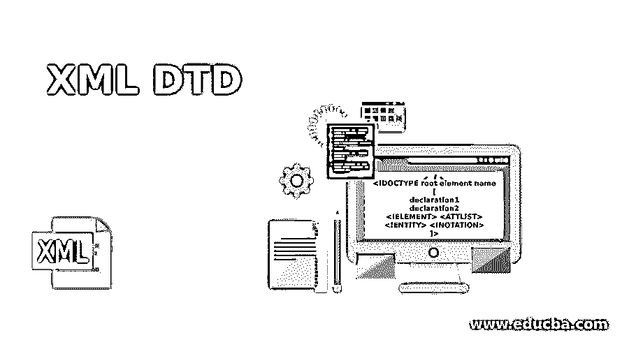
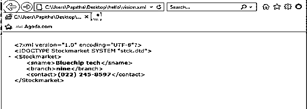
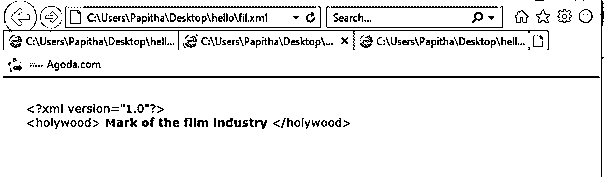
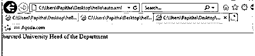
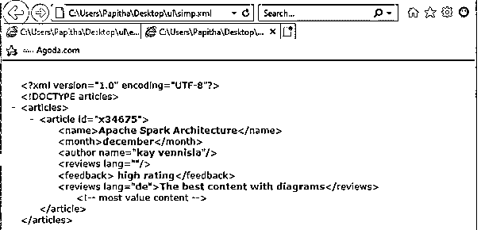
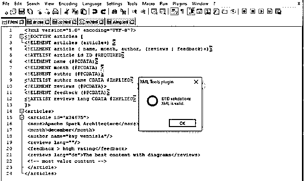

# XML DTD

> 原文：<https://www.educba.com/xml-dtd/>

## XML DTD 的定义

文档类型定义(DTD)定义了 XML 文档的模式，其中包括元素和属性。如果 XML 文档符合 DTD 格式，那么它是有效的，并且它被用在企业对企业的应用程序中，在这些应用程序中，XML 文档被交换，其中它们是使用扩展的 Backus-Naur 格式定义的。多个文档和不同的应用程序共享 DTDS 也定义了元素的顺序。DTD 是用声明在文档中定义的，每个 XML 文档包含一个 DTD。

### DTD 在 XML 中是如何工作的？

DTD 也是标记语言中首选的模式语言。一般语法如下所示:

<small>网页开发、编程语言、软件测试&其他</small>

`<!DOCTYPE root element name
[
declaration1
declaration2
<!ELEMENT> <ATTLIST> <!ENTITY> <!NOTATION>
]>`

在上面的语法中，DTD 名称是根元素名称，后面是表示模式和类型的选项。关键词！DOCTYPE 应该是大写的。让我们看看元素声明。

DTD 的工作是通过以下步骤执行的:

*   首先，为相应的 XML 文档创建一个 DTD 文件。
*   接下来概述文档的结构。
*   从与 DOCTYPE 相同的根节点开始。您可以创建内部或外部引用的 DTD。
*   包括文件的所有元素、属性和实体。解析器消除了空元素。

### 元素声明

元素规格及其元素顺序如下所示

`<!ELEMENT name (seq of elements)>`

例如: //这个语句通常被称为通用标识符。

此外，元素使用(+、*、？).

*   **+** 符号表示两个或多个频率
*   ***** 表示该元素可以出现更多次。
*   **？**表示元素只能出现一次。

以下声明是

`<!ELEMENT pizza (onion? Cheese*((veg|noveg) + |topping))>`

上面的语句意味着 pizza 元素可以有一个洋葱元素，后跟一个或多个奶酪，依此类推。

相应的 XML 文件可以是

`<pizza>
<onion> fried </onion>
<cheese> thin </cheese>
<cheese> thick </cheese>
<topping>oregano </topping>
</pizza>`

#### 1.属性声明

给定元素的属性由以下规则设计:

`<!ATTLIST element name   attribute names 1    attribute type   restriction/Default >
Ex:`

在这里，属性是使用关键字 ATTLIST 指定的，除非是可选的，否则将包含各个属性的元素名称。属性类型包括 PCDATA、令牌、实体和符号。最后是限制/默认，它们根据值的出现次数进行放置。属性 default 包括#IMPLIED、#REQUIRED 和#FIXED。implied 表示属性值不出现，required 表示属性值存在，fixed 表示常数值。

#### 2.定义实体

实体用于指定特殊字符。实体声明是

`<!ENTITY entity_name  SYSTEM "URL path">
Ex:
<!ENTITY  SYSTEM "http://www. ckjd.com/pot.dtd">`

因为 DTD 是 XML 文档的模型，所以它讨论所使用的元素、属性，这些元素、属性是基本的和可选的，因为它们易于验证文档，并且有两种类型的 DTD，即，

*   内部 DTD
*   外部 DTD

#### 3.内部 DTD

这种类型的 DTD 在 XML 文档中声明。它被声明为。

`<!DOCTYPE root name [DTD related specification]>
Ex: <!DOCTYPE healthcare [
<!ELEMENT healthcare (#PCDATA)>
]>`

方括号内的内容被认为是内部子集。还有关键词！元素是元素声明，PCDATA 是 XML 解析器解析的解析字符数据。

#### 4.外部 DTD

这种类型的 DTD 在 XML 文件之外用一个单独的文件声明。外部 DTD 用于多个 XML 文档，在该文件中进行的更新会影响所有 XML 文档，这在更改输入文件时非常容易。在外部 DTD 中,“独立”关键字被设置为“否”。使用关键字“PUBLIC”和“SYSTEM”指定外部内容。public 关键字用在 XML 文档之外，后跟一个 URL(指定路径)。

**注意:**允许多个 dtd，其中外部和内部 dtd 都被组合。

`<!DOCTYPE root-name SYSTEM " XML file-name">`

有两种类型的外部 DTD:私有的和公共的。

### 用 XML 实现 DTD 的例子

以下是 xml 中 dtd 的示例:

#### 示例# 1–外部 DTD

这里，DTD 文件是在外部创建的，并保存为 stck.dtd，相应的元素名在单独的 XML 文件中声明。

stck . dtd

`<?xml version="1.0"?>
<!ELEMENT Stockmarket (sname,branch,contact)>
<!ELEMENT sname (#PCDATA)>
<!ELEMENT branch (#PCDATA)>
<!ELEMENT contact (#PCDATA)>`

XML 文件

**vision.xml**

`<?xml version = "1.0" encoding = "UTF-8" standalone = "no" ?>
<!DOCTYPE Stockmarket SYSTEM "stck.dtd">
<Stockmarket>
<sname>Bluechip tech</sname>
<branch>nine</branch>
<contact>(022) 245-8597</contact>
</Stockmarket>`

**输出:**

#### 示例 2–使用实体

**actor.xml**

`<?xml version="1.0" encoding="UTF-8" standalone="no"?>
<!DOCTYPE Actor [
<!ELEMENT Actor ((aname)+, hollywood)>
<!ELEMENT aname (fname, lname)>
<!ELEMENT fname (#PCDATA)>
<!ELEMENT lname (#PCDATA)>
<!ELEMENT hollywood (#PCDATA)>
<!ENTITY UofT SYSTEM "fil.xml">
]>
<Actor>
<aname>
<fname>Markdev</fname>
<lname>carylon</lname>
</aname>
&UofT;
</Actor>`

**fil.xml**

`<holywood>
Mark of the film industry
</holywood>`

**输出:**

#### 实施例 3

下面是一个 XML 文件，其中声明了 DTD——嵌入在关键字 DOCTYPE 中的内部 DTD。在下面的例子中，元素节点大学有三个字段，它们被声明为 PCDATA 类型。

**auto.xml**

`<?XML version="1.0" standalone="yes"?>
<!DOCTYPE University [
<!ELEMENT University (collegename, type, email)>
<!ATTLIST University
id CDATA #REQUIRED>
<!ELEMENT collegename (#PCDATA)>
<!ELEMENT type (#PCDATA)>
<!ATTLIST University
department CDATA #IMPLIED>
<!ELEMENT email (#PCDATA)>
]>
<University id="02">
<collegename>Harvard University</collegename>
<type department="Science and Humanities" >Head of the Department</type>
<email>yhkhi12@myhotmail.com</email>
</University >`

**输出:**

#### 示例# 4–内部 DTD

simp . XML

`<?xml version="1.0" encoding="UTF-8"?>
<!DOCTYPE articles [
<!ELEMENT articles (Movie+) >
<!ELEMENT article ( name, month, author, (reviews | feedback)+)>
<!ATTLIST article id ID #REQUIRED>
<!ELEMENT name (#PCDATA)>
<!ELEMENT month (#PCDATA) >
<!ELEMENT author (#PCDATA)>
<!ATTLIST author name CDATA #IMPLIED>
<!ELEMENT reviews (#PCDATA)>
<!ELEMENT feedback (#PCDATA)>
<!ATTLIST reviews lang CDATA #IMPLIED>
]>

<name>Apache Spark Architecture</name>
<month>december</month>
<author name="kay vennisla"/>
<reviews lang=""/>
<feedback > high rating</feedback>
<reviews lang="de">The best content with diagrams</reviews>
<!-- most value content -->

`

**输出:**

**验证检查器**

有许多工具可以根据 DTD 来验证 XML 文档

### 结论

因此，我们已经看到了 DTD 在 XML 中是如何工作的。许多应用程序使用标准 DTD 来验证从外部来源接收的有效数据，然后再将其发送给其他客户端。因此，在将 xml 文件提交给业务流程之前检查/测试它是 DTD 的一个关键组成部分。

### 推荐文章

这是 XML DTD 的指南。这里我们还讨论了定义以及 dtd 在 xml 中是如何工作的？以及不同的示例及其代码实现。您也可以看看以下文章，了解更多信息–

1.  [带 CSS 的 XML](https://www.educba.com/xml-with-css/)
2.  [XML 版本](https://www.educba.com/xml-versions/)
3.  [XML 命令](https://www.educba.com/xml-commands/)
4.  [XML 错误](https://www.educba.com/xml-error/)