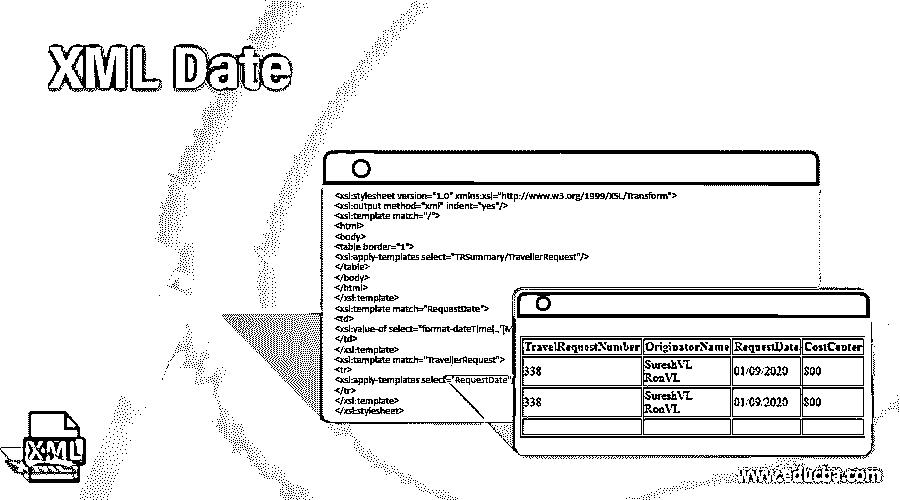
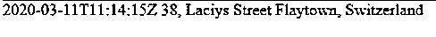
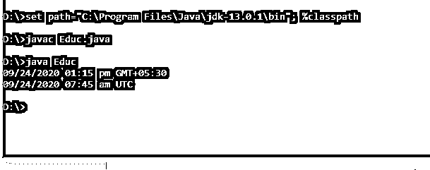
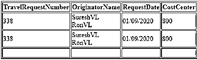
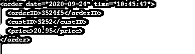

# XML 日期

> 原文：<https://www.educba.com/xml-date/>




## XML 日期的定义

XML 日期被定义为在 XML 文档中指定日期的数据类型。根据 W3C XML Schema，日期是其时区中的一天。日期规则可以根据需求定制，有时需要执行一些日期操作或将日期解析为特定格式，前提是如果不使用本地时间，则应指定时区。日期格式由日期模式字符串通过从 A 到 z 分配字母来定义

在本文中，我们将 XML Gregorian Calendar 类用于数据实用程序。

<small>网页开发、编程语言、软件测试&其他</small>

**语法**

日期的 XML 格式以下列格式给出

```
CCYY-MM-DD
```

模式中的形式结构如下所示:

```
<xsd : date>
```

其中数据类型指定年、月和日。它是一个有限长度的字符序列，带有 yy-mm-dd。四位数字代表年份，负值受限制，0000 年被忽略。并且在这种格式之间有一个符号'-'分隔符；最后，两位数字表示月份和日期。

元素声明如下所示

```
<xs: element name ="dob"; type = " xs:date"/>
```

Xpath 上的当前日期定义为

```
xs:date fn:current-date()
```

### XML 中的日期函数是如何工作的？

通常，这个日期函数包括如下数据类型

*   xs:dateTime(CCYY-MM-ddth:MM:ss)
*   xs:date(年-月-日)
*   分秒:时间(时:分:秒)
*   xs:gYearMonth (CCYY-MM)
*   xs:gYear (CCYY)
*   xs:gMonthDay(–MM-DD)
*   xs:gMonth(–MM –)
*   xs:gDay (—DD)

而 XML formatter 更喜欢使用简单的日期格式，它不是线程安全的。此外，并非所有本地文件都支持此构造函数。格式是这样的:

```
public SimpleDateFormat(String pattern, DateFormatSymbols formatSymbols)
```

公历被指定为

```
<xsd:simpleType name="date" id="da">
<xsd:restriction base="xsd:anySimpleType">
<xsd:whiteSpace value="hello" fixed="true"/>
</xsd:restriction>
</xsd:simpleType>
```

<date>的有效值是</date>

2011-11-21

2011-11-21 +02:00

2011 年 11 月 21 日

2011-11-21+00:00

2011-11-21

2011-02-03

给定的 datetime 值由 XML 解析器解析，该解析器将输入 XML 中声明的 datetime 值转换为本地时区格式的值。因此，甚至可以选择日光节约时间。

使用 Current date()函数显示当天的当前日期。调用该函数时不传递任何参数。因此，它返回根据系统时间处理的日期，即给出一个常数值。让我们看看 XSD 文件的简单工作代码。

```
<?xml version="1.0" encoding="utf-8"?>
<xsl: stylesheet version="2.0"
xmlns:xsl="http://www.w3.org/1999/XSL/Transform">
<xsl: template match="/">
<html>
<body>
<h3>Display Date</h3>
The current date today is:
<xsl:value-of select="current-date ()" />
<br />
</body>
</html>
</xsl: template>
</xsl: stylesheet>
```

在 Xpath 中，我们有

```
<xf:output value="exf:format-datetime(currentdate,'d')" />
<xf:output value="exf:format-datetime(fn:current-date(),'D')" />
```

关于日期的函数有 dateTime()、year-from-dateTime()、year-from-date(日期)、month-from-date(日期)、day-from-date(日期)。

接下来，对于示例 XML 模式，XML 日期和时间的定制被指定为

```
<?xml version="1.0" encoding="UTF-8"?>
<xsd:schema xmlns:xsd="http://www.w3.org/2001/XMLSchema">
<xsd:element name="divya Ro">
<xsd:complexType>
<xsd:sequence>
<xsd:element name="dOB" type="xsd:date" minOccurs="0"/>
</xsd:sequence>
</xsd:complexType>
</xsd:element>
</xsd:schema>
```

现在，在 java 文件中，出生日期是 gregorgian 日历的一部分

```
public class Client {
@XmlElement(name = "dob")
@XmlSchemaType(name = "date")
protected XMLGregorianCalendar dateOfBirth;
public XMLGregorianCalendar getDateOfBirth()
{return dateOfBirth;}
public void setDateOfBirth(XMLGregorianCalendar value)
{this.dateOfBirth = value;
}
}
```

### 例子

现在让我们看看这个函数在 XSLT 和 java 中是如何工作的。

#### 示例 1–简单的 XML 文件显示日期

**date.xml**

```
<?xml version="1.0" encoding="UTF-8"?>
<Client>
<Dob>2020-03-11T11:14:15Z</Dob>
<Residence>
<Line1>38, Laciys Street</Line1>
<Line2>Flaytown, Switzerland</Line2>
</Residence>
</Client>
<Goods>
<Phone>0123-67542</Phone>
<Address>
<Line1>67, Washington Street/Line1>
<Line2>Zaeooper Mark Avenue</Line2>
</Address>
</goods>
```

**输出:**




#### 实施例 2

**Educ.java**

```
import java.time.LocalDateTime;
import java.time.ZoneId;
import java.time.ZonedDateTime;
import java.time.format.DateTimeFormatter;
import java.util.Date;
import java.util.GregorianCalendar;
import javax.xml.datatype.DatatypeConfigurationException;
import javax.xml.datatype.DatatypeFactory;
import javax.xml.datatype.XMLGregorianCalendar;
public class Educ
{
private final static String TIMESTAMP_PATTERN
= "MM/dd/yyyy hh:mm a z";
private final static DateTimeFormatter DATE_TIME_FORMATTER
= DateTimeFormatter.ofPattern(TIMESTAMP_PATTERN);
public static void main(String[] args)
throws DatatypeConfigurationException
{
GregorianCalendar c = new GregorianCalendar();
c.setTime(new Date());
XMLGregorianCalendar xc = DatatypeFactory.newInstance()
.newXMLGregorianCalendar(c);
ZonedDateTime zon = xc.toGregorianCalendar().toZonedDateTime();
System.out.println( DATE_TIME_FORMATTER.format(zon) );
ZonedDateTime zond = zon.withZoneSameInstant(ZoneId.of("UTC"));
System.out.println( DATE_TIME_FORMATTER.format(zond) );
}
}
```

**说明:**

上面的代码片段使用日期时间格式化程序来显示日期。当我们执行时，输出看起来像>

**输出:**




#### 示例 3-**展示了使用公历将日期对象转换为字符串值的 java 代码**

**Rule.java**

```
import java.time.LocalDateTime;
import java.time.ZoneId;
import java.time.ZonedDateTime;
import java.time.format.DateTimeFormatter;
import java.util.Date;
import java.text.DateFormat;
import java.text.SimpleDateFormat;
import java.util.GregorianCalendar;
import javax.xml.datatype.DatatypeConfigurationException;
import javax.xml.datatype.DatatypeFactory;
import javax.xml.datatype.XMLGregorianCalendar;
public class Rule {
public static void main(String[] args) throws DatatypeConfigurationException
{
GregorianCalendar gca = new GregorianCalendar();
gca.setTime(new Date());
XMLGregorianCalendar xgc = DatatypeFactory.newInstance().newXMLGregorianCalendar(gca);
System.out.println(convertXmlGregorianToString(xgc));
}
public static String convertXmlGregorianToString(XMLGregorianCalendar xgc)
{
DateFormat datef = new SimpleDateFormat("MM/dd/yyyy hh:mm a z");
GregorianCalendar gCalendar = xgc.toGregorianCalendar();
Date dd = gCalendar.getTime();
String dStr = datef.format(dd);
return dStr;
}
}
```

**说明:**

上面的 java 代码通过将数据对象转换为显示日期，将 XML 文件文档转换为 java 代码。它使用简单的包，如日期格式和简单日期格式。

**输出:**


#### 示例 4–**使用样式表给出日期。**

**。xsl**

```
<xsl:stylesheet version="1.0" xmlns:xsl="http://www.w3.org/1999/XSL/Transform">
<xsl:output method="xml" indent="yes"/>
<xsl:template match="/">
<html>
<body>
<table border="1">
<xsl:apply-templates select="TRSummary/TravellerRequest"/>
</table>
</body>
</html>
</xsl:template>
<xsl:template match="RequestDate">
<td>
<xsl:value-of select="format-dateTime(.,'[M01]/[D01]/[Y0001]')" />
</td>
</xsl:template>
<xsl:template match="TravellerRequest">
<tr>
<xsl:apply-templates select="RequestDate"/>
</tr>
</xsl:template>
</xsl:stylesheet>
```

**tester.xml**

```
<?xml version="1.0"?>
<TRSummary>
<TravellerRequest>
<TravelRequestNumber>338</TravelRequestNumber>
<OriginatorName>SureshVL RonVL</OriginatorName>
<RequestDate>2020-01-09T17:51:01.67+05:30</RequestDate>
<CostCenter>800</CostCenter>
<ProjectManagerName>Prasannavl Athinavl Athinavl</ProjectManagerName>
<JobNumber>1524</JobNumber>
<ElementNumber>1454</ElementNumber>
<Remarks>remarks</Remarks>
<ExpectedTravelCost>1500</ExpectedTravelCost>
<PMC>Industry international</PMC>
</TravellerRequest>
<TravellerRequest>
<TravelRequestNumber>338</TravelRequestNumber>
<OriginatorName>SureshVL RonVL</OriginatorName>
<RequestDate>2020-01-09T17:51:01.67+05:30</RequestDate>
<CostCenter>800</CostCenter>
<ProjectManagerName>Prasannavl Athinavl Athinavl</ProjectManagerName>
<JobNumber>1234</JobNumber>
<ElementNumber>1234</ElementNumber>
<Remarks>remarks</Remarks>
<ExpectedTravelCost>1500</ExpectedTravelCost>
<PMC>Industry international</PMC>
</TravellerRequest>
</TRSummary>
```

**说明:**

这里我们使用了一个包含各种元素的 XML 文件，并创建了 XSLT，

**输出:**




#### 示例 5–**使用 C#的 Xml 日期**

**代码:**

```
using System;
using System.IO;
using System.Xml;
public class test
{
public static void Main()
{
Int16 cid = 3252;
String oID = "3524f5";
DateTime orderDate = new DateTime();
orderDate = DateTime.Now;
Double price = 20.95;
XmlTextWriter writer = new XmlTextWriter (Console.Out);
writer.Formatting = Formatting.Indented;
writer.WriteStartElement("order");
writer.WriteAttributeString("date", XmlConvert.ToString(orderDate, "yyyy-MM-dd"));
writer.WriteAttributeString("time", XmlConvert.ToString(orderDate, "HH:mm:ss"));
writer.WriteElementString("orderID", oID);
writer.WriteElementString("custID", XmlConvert.ToString(cid));
writer.WriteElementString("price", XmlConvert.ToString(price));
writer.WriteEndElement();
writer.Close();
}
}
```

**说明:**

上面的代码从系统中自动生成当前日期，如下所示。XML 是使用 writer 方法编写的，从根元素“order”开始。

**输出:**




### 结论

因此，本文展示了如何在 java 中应用日期格式值类型，并通过更改不同的设置(如工作部分所述)向我们传授了定制格式。

### 推荐文章

这是 XML 日期指南。这里我们讨论 XML date 函数如何在 XSLT 和 java 中很好地工作，以及不同的例子和它的代码实现。您也可以看看以下文章，了解更多信息–

1.  [什么是 XML？](https://www.educba.com/what-is-xml/)
2.  [XML 命令](https://www.educba.com/xml-commands/)
3.  [XML 特性](https://www.educba.com/xml-features/)
4.  [XML 面试问题](https://www.educba.com/xml-interview-questions/)


