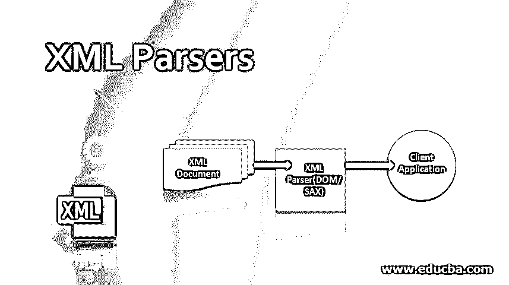
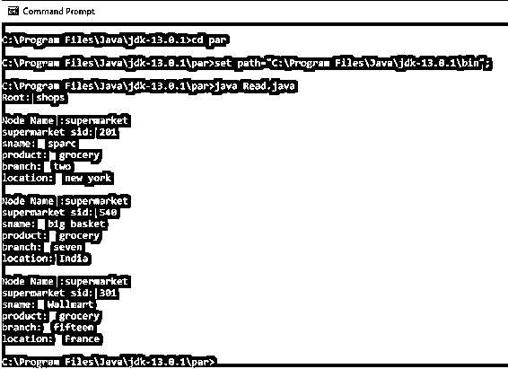
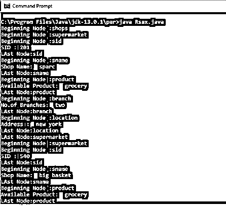

# xml 解析器

> 原文：<https://www.educba.com/xml-parsers/>

## XML 解析器的定义

XML 解析器也称为 XML 处理器，它被定义为将信息拆分成一些组成部分，即读取 XML 文件并将所有可用的函数存储在内存中以供程序代码的其余部分使用。解析器的目的是检查一个定义明确的文件的语法，它在软件中被广泛使用。如果用户只是复制一个 XML 文件，那么每个程序都必须调用解析器来读取 XML。解析器读取文档并分析文档的结构和数据属性。

### XML 解析器是如何工作的？

XML 解析器的主要工作是访问或修改文档中的数据。解析器包含客户端应用程序要与之交互的已安装软件包，还执行 XML 文档的验证过程。在这里，将组件部分与 DTD 或模式模式进行比较，以进行检查。当它在逐行解析时发现文件中的开始和结束标记时，它会触发事件。解析器包括两个部分:词法分析器和解析器。词法分析器从文件中提取输入字符，并生成标记，如(和标记名)。解析器接受这个令牌，并根据 DOM 的语法构造一个基于树的语法，读取整个文档，而在 SAX 的情况下，解析器逐节点读取并抛出解析事件。

<small>网页开发、编程语言、软件测试&其他</small>

图:XML 解析器过程

解析器可以分为验证型和非验证型

*   **验证解析器:**它需要一个文档类型声明来解析，如果相应的文档与 DTD 和约束不匹配，就会给出一个错误。
*   **非验证:**这个解析器消除 DTD，解析器检查格式良好的文档。

### XML 解析器的类型及示例

本节讨论最近在解析 XML 文档中使用的各种类型的解析器。它们是:

1.  DOM 解析器
2.  SAX 解析器
3.  JDOM 解析器
4.  stAX 分析器
5.  Xpath 解析器

最重要的类型是 DOM 和 SAX，这将在本文中详细解释。

#### 1.DOM 解析器(基于树)

文档对象模型是一个 W3C 标准，它把要解析的 XML 文档转换成一个对象集合，并使用 DOM API。它由节点集合组成，并与树中的其他节点相关联。DOM 更容易使用，因为排序和搜索过程变得更快。在 DOM 解析器中，XML 文件的内容用节点和节点列表来修改。用 java 解析所涉及的步骤:

*   获取文档生成器对象
*   以 XML 文档为输入，解析并返回类。
*   通过属性和子元素获取输入 id 的值。
*   显示结果。

首先是 XML 文件，它生成将要被解析的值，java 对象是自动构造的。

##### 例子

**new.xml**

`<?xml version="1.0"?>
<shops>
<supermarket>
<sid>201</sid>
<sname>sparc</sname>
<product> grocery</product>
<branch> two</branch>
<location> new york</location>
</supermarket>
<supermarket>
<sid>540</sid>
<sname> big basket</sname>
<product> grocery</product>
<branch> seven</branch>
<location>India</location>
</supermarket>
<supermarket>
<sid>301</sid>
<sname>Wallmart</sname>
<product> grocery</product>
<branch> fifteen</branch>
<location> France</location>
</supermarket>
</shops>`

**Read.java**

`import javax.xml.parsers.DocumentBuilderFactory;
import javax.xml.parsers.DocumentBuilder;
import org.w3c.dom.Document;
import org.w3c.dom.NodeList;
import org.w3c.dom.Node;
import org.w3c.dom.Element;
import java.io.File;
public class Read
{
public static void main(String argv[])
{
try
{
File file = new File("C:\\Program Files\\Java\\jdk-13.0.1\\par\\new.xml");
DocumentBuilderFactory docb = DocumentBuilderFactory.newInstance();
DocumentBuilder dbu = docb.newDocumentBuilder();
Document dt = dbu.parse(file);
dt.getDocumentElement().normalize();
System.out.println("Root: " + dt.getDocumentElement().getNodeName());
NodeList nd = dt.getElementsByTagName("supermarket");
for (int i = 0; i<nd.getLength(); i++)
{
Node node = nd.item(i);
System.out.println("\nNodeName :" + node.getNodeName());
if (node.getNodeType() == Node.ELEMENT_NODE)
{
Element el = (Element) node;
System.out.println("supermarket sid: "+ el.getElementsByTagName("sid").item(0).getTextContent());
System.out.println("sname: "+  el.getElementsByTagName("sname").item(0).getTextContent());
System.out.println("product: "+  el.getElementsByTagName("product").item(0).getTextContent());
System.out.println("branch: "+  el.getElementsByTagName("branch").item(0).getTextContent());
System.out.println("location: "+ el.getElementsByTagName("location").item(0).getTextContent());
}
}
}
catch (Exception e)
{
e.printStackTrace();
}
}
}`

这里显示了 XML 文件的输出。在执行期间，将 XML 和 java 文件保存在同一个文件夹中。在本文中，我使用了 java-jdk- 13.0.1 的命令提示符。将各自的文件夹保存在任意驱动器中，并设置路径。

**输出:**

#### 2.SAX 解析器

SAX 是 XML 的简单 API，意味着有推式解析器，也被认为是面向流的 XML 解析器。它用于高性能应用程序的情况，比如 XML 文件太大，采用基于社区的标准，需要较少的内存。主要任务是读取 XML 文件，并创建一个事件来执行调用函数或使用回调例程。这个解析器的工作就像 java 的事件处理器部分。有必要注册处理程序来解析文档以处理不同的事件。SAX 解析器使用三种方法 startElement()、endElement()、characters()。

*   **startElement():** 用于标识元素，开始元素被标识。
*   **endElement():** 停止示例中的超市标签。
*   **character():** 用于标识节点中的字符

下一节将展示使用 SAX 和 java 进行解析的实现。这里我们有 XML 文件 new.xml 来解析并创建一个超市对象列表。

该 xml 文件与 DOM 解析器 new.xml 和下一步生成 Rsax.java 文件中使用的文件相同

##### 例子

**Rsax.java**

`import javax.xml.parsers.SAXParser;
import javax.xml.parsers.SAXParserFactory;
import org.xml.sax.Attributes;
import org.xml.sax.SAXException;
import org.xml.sax.helpers.DefaultHandler;
public class Rsax
{
public static void main(String args[])
{
try
{
SAXParserFactory factory = SAXParserFactory.newInstance();
SAXParsersaxParser = factory.newSAXParser();
DefaultHandler handler = new DefaultHandler()
{
booleansid = false;
booleansname = false;
boolean product = false;
boolean branch = false;
boolean location = false;
public void startElement( String sg, String pp,String q, Attributes a) throws SAXException
{
System.out.println("Beginning Node :" + q);
if(q.equalsIgnoreCase("SID"))
{
sid=true;
}
if (q.equalsIgnoreCase("SNAME"))
{
sname = true;
}
if (q.equalsIgnoreCase("PRODUCT"))
{
product = true;
}
if (q.equalsIgnoreCase("BRANCH"))
{
branch = true;
}
if (q.equalsIgnoreCase("LOCATION"))
{
location = true;
}
}
public void endElement(String u, String l, String qNa) throws SAXException
{
System.out.println("LAst Node:" + qNa);
}
public void characters(char chr[], int st, int len) throws SAXException
{
if (sid)
{
System.out.println("SID : " + new String(chr, st, len));
sid = false;
}
if (sname)
{
System.out.println("Shop Name: " + new String(chr, st, len));
sname = false;
}
if (product)
{
System.out.println("Available Product: " + new String(chr, st, len));
product = false;
}
if (branch)
{
System.out.println("No.of Branches: " + new String(chr, st, len));
branch = false;
}
if (location)
{
System.out.println("Address : " + new String(chr, st, len));
location = false;
}
}
};
saxParser.parse("C:\\Program Files\\Java\\jdk-13.0.1\\par\\new.xml", handler);
}
catch (Exception ex)
{
ex.printStackTrace();
}
}
}`

**输出:**

### 结论

因此，我们发现了如何将 Java 中的 XML 解析器与应用程序中的强大 API 一起使用。此外，我们已经看到了两个使用 java 的解析器的实现。与 DOM 相比，sax 解析器使用任意大小来解析，而 DOM 需要可用内存来加载整个文档。和解析器因性能而异。

### 推荐文章

这是 XML 解析器指南。这里我们也讨论 xml 解析器是如何工作的？以及示例及其代码实现。您也可以看看以下文章，了解更多信息–

1.  [XML 命令](https://www.educba.com/xml-commands/)
2.  [XHTML 是什么？](https://www.educba.com/what-is-xhtml/)
3.  [XML 错误](https://www.educba.com/xml-error/)
4.  [XML 注释](https://www.educba.com/xml-comments/)