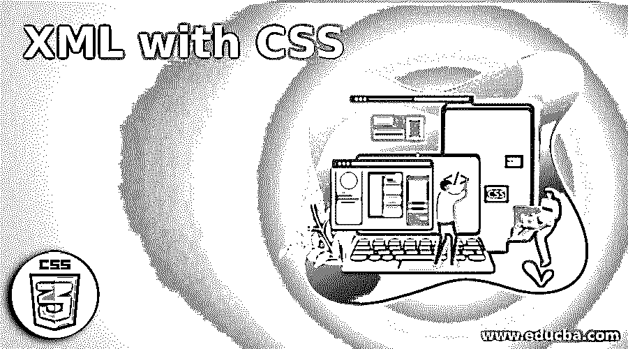
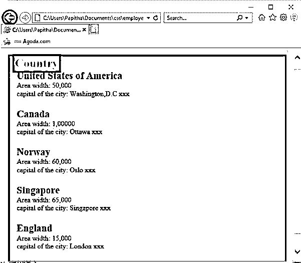
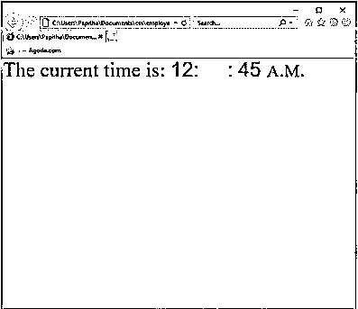

# 带有 CSS 的 XML

> 原文：<https://www.educba.com/xml-with-css/>

## 用 CSS 介绍 XML

可扩展标记语言是一种定义结构化数据的动态通用标记语言。用 XML 嵌入 CSS 样式表我们可以创建一个新的 XML 文档，清晰准确地显示在网页上。可以用 CSS 和 XSLT 两种方式显示。与 XML 中的 HTML 不同，CSS 样式不是默认包含的，而是为每个元素定义的属性。CSS 样式表提供了在根元素开始之前应用的特定样式说明，同时这个 CSS 用于我们需要定义元素大小、向文档添加内容以及在 web 上创建颜色和背景图像的场景。这样，文档中的树数据应该应用样式规则。通俗地说，在应用样式时，它不会改变 XML 结构。

### XML 和 CSS 是如何工作的？

XML 以这样一种方式构建，以存储和传输用户可读的数据。现在继续用 CSS 显示 XML 文档，有必要了解 CSS 样式，通过选择 CSS，可以更容易地在文件中包含以文本为中心的内容。据说，应该对 XML 文档进行一些样式规则，如 CSS 遵循的字体大小、颜色、边距、字体粗细的样式，即使它使标题更粗体，也是美化文档时绝对必要的形式，但不允许排序、整理文档的结构。这些规则如下所述:

<small>网页开发、编程语言、软件测试&其他</small>

1.  定义文本元素的属性，如字体大小和颜色。
2.  使用内联块的显示属性定义元素。
3.  通过微调使标题更大。

### 句法

基本语法如下所示:

`<?xml-stylesheet type="text/css" href="css Filename.css"?>`

上述语法放在任何 XML 文件的顶部，以避免错误。

XML 中 CSS 的一般语法是

`Selector {property Declaration }`

这里的选择器暗示了一个样式所应用到的标签，后面是声明中的样式规则。类似地，我们可以有多个选择器。下面给出的值可以是字符串或整数，绝对值。

**步骤:**

1.  一旦 CSS 文件链接到 XML 文件中，该文件就会将样式表附加到 XML 文档中，并根据 CSS 文件上实现的属性以样式格式显示结果。
2.  CSS 的标签应该和 XML 标签名一样。

### 用 XML 实现 CSS 的示例

为了理解这个概念，一个示例场景在使事情变得简单方面起着重要的作用。

#### 示例#1

**代码:**

**employee.xml**

`<?xml version="1.0"?>
<?xml-stylesheet type="text/css" href="emp.css"?>
<!DOCTYPE globe>
<globe>
<Country>
<name>United States of America</name>
<areawidth>50,000</areawidth>
<capital>Washington,D.C</capital>
</Country>
<Country>
<name>Canada</name>
<areawidth>1,00000</areawidth>
<capital>Ottawa</capital>
</Country>
<Country>
<name>Norway</name>
<areawidth>60,000</areawidth>
<capital>Oslo</capital>
</Country>
<Country>
<name>Singapore</name>
<areawidth>65,000</areawidth>
<capital>Singapore</capital>
</Country>
<Country>
<name>England</name>
<areawidth>15,000</areawidth>
<capital>London</capital>
</Country>
</globe>`

**emp.css**

`globe:before {
display: semi-block;
width: 9em;
font-weight: bold;
font-size: 170%;
content: "Country";
margin: -.85em 0px .35em -.35em;
padding: .2em .20em;
background-color: #FF0000;
}
globe {
display: block;
margin: 2em 1em;
border: 4px solid #B22222;
padding: 0px 1em;
background-color:  #cdf;
}
Country {
display: block;
margin-bottom: 1.5em;
}
name {
display: block;
font-weight: bold;
font-size: 140%;
}
areawidth {
display: block;
}
areawidth:before {
content: "Area width: ";
}
area:after {
content: " million km\B2";
}
depth {
display: block;
}
depth:before {
content: "Mean depth: ";
}
depth:after {
content: " m";`

**输出:**

#### 实施例 2

**代码:**

**T1**employee . XML****

`<?xml version="1.0" encoding="UTF-8"?>
<?xml-stylesheet type="text/css" href="emp.css"?>
<Topstore2020>
<Shops>Welcome To big groceries world</Shops>
<heading>Save Money and live better</heading>
<grocery>
<titlename>Spencers</titlename>
<opinion>wide varieties</opinion>
<country>India</country>
</grocery>
<grocery>
<titlename>Amazon Fresh</titlename>
<opinion>Tie up with good companies</opinion>
<country>USA , LONDON ,TOKYO</country>
</grocery>
<grocery>
<titlename>Walmart Grocery- online pick up & delivery</titlename>
<opinion>Delivery from local shops</opinion>
<country>UNited States</country>
</grocery>
<grocery>
<titlename>Insta Carts</titlename>
<opinion>Good Filtering options</opinion>
<country>Australia ,Canada</country>
</grocery>
<grocery>
<titlename>Fresh Direct- Specializes organic Food</titlename>
<opinion>chef meals with reasonable price</opinion>
<country>United Kingdom</country>
</grocery>
<grocery>
<titlename>Local Harvest</titlename>
<opinion>provides locally garden foods</opinion>
<country>Saint Louis</country>
</grocery>
<grocery>
<titlename>Safe Way- Neighborhood shopping</titlename>
<opinion>One day delivery</opinion>
<country>California</country>
</grocery>
<grocery>
<titlename>My SuperMArket</titlename>
<opinion>Very Professional</opinion>
<country>United Kingdom</country>
</grocery>
</Topstore2020>`

**emp.css**

`Topstore2020, Shops {
color: #daff00;
background-color:#5490fe;
width: 100%;
}
heading {
color: #888888;
background-color: #ffa500;
font-size: 41px;
font-weight: bold;
}
Shops {
color:#6a0241;
font-size: 33px;
font-weight: bold;
}
heading, grocery title name, opinion, country {
font-family: sans-serif,Arial;
display: block;
}
titlename {
font-size: 16px;
font-weight: bold;
}`

#### 实施例 3

**代码:**

**clock.css**

`Clock {font-size:30pt; text-align: centre}
Clock: before {content: "The current time is: "}
timehour {font-family: sans-serif; color: blue}
timehour: after {content: ":"; color: rose}
timeminute {font-family: sans-serif; color: yellow}
timeminute:after {content: ":"; color: gray}
timesecond {font-family: sans-serif; color: gray}
timesecond:after {content: " "; color: lightblue}
timemeridian {font-variant: small-caps}`

**employee.xml**

`<?xml version="1.0" encoding="UTF-8"?>
<?xml-stylesheet href="clock.css" type="text/css"?>
<Clock timezone="GMT">
<timehour>12</timehour>
<timeminute>55</timeminute>
<timesecond>45</timesecond>
<timemeridian>a.m.</timemeridian>
</Clock>`

**输出:**

### 在 XML 中使用 CSS 的优势

*   用 CSS 或 HTML 来丰富多彩的显示网页。
*   它使网页具有一个交互式的界面，因此很容易被网络用户理解。它指定操作间距、字体大小、位置、颜色等。
*   它有助于在视觉上区分 XML 文档中的祖先元素和后代元素。就像在 HTML 中一样，CSS 在样式化 XML 中的每一个标签方面都有好处。它有助于降低复杂性和避免内容文档的重复，因为它使多个页面能够共享它们的格式，由于这是它们的页面

### 结论

因此，在这里，我们已经学会了如何使用 XML 和 CSS 文件以良好的格式显示数据。当我们不为 XML 文件寻找任何编程方法时，它是最好的选择。在任何复杂结构的情况下，使用另一个样式表 XSLT。此外，我们知道如何设计一个有个人需求的页面。因此，我们使用 CSS 以语义的方式进行了样式化。

### 推荐文章

这是一个使用 CSS 的 XML 指南。在这里，我们讨论 XML 与 CSS 的介绍，它是如何工作的，语法，代码示例，以及输出。您也可以浏览我们的其他相关文章，了解更多信息——

1.  [XML 特性](https://www.educba.com/xml-features/)
2.  [XML 命令](https://www.educba.com/xml-commands/)
3.  [CSS 溢出](https://www.educba.com/css-overflow/)
4.  [CSS z 索引](https://www.educba.com/css-z-index/)

