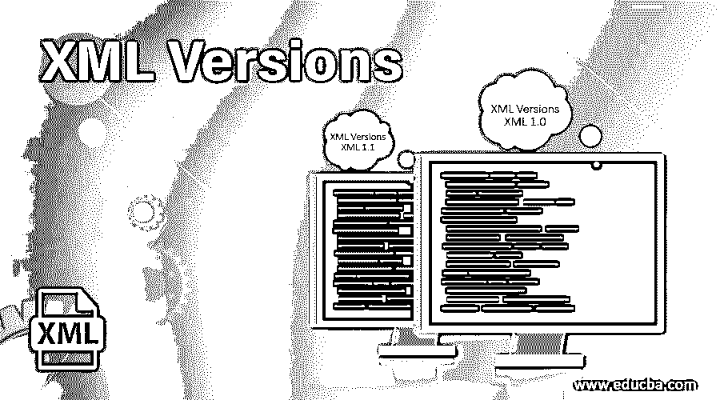

# XML 版本

> 原文：<https://www.educba.com/xml-versions/>

## XML 版本介绍

[XML 是可扩展标记语言](https://www.educba.com/what-is-xml/)的缩写，它是一种类似于 HTML 的标记语言，基本上是为传输和存储数据而设计的，它主要是自描述性的，比如它有发送方的信息，有接收方的信息，有标题，还包含带消息的正文，但 XML 什么也不做，它只是标记中包含的信息， 它不包含任何预定义的标签，即使数据发生变化，即使添加了新数据或删除了现有数据，它也应该以相同的方式工作。 在本文中，我们将讨论不同的 XML 版本。

### 各种 XML 版本

XML 有两个版本，它们是:

<small>网页开发、编程语言、软件测试&其他</small>

#### 1) XML 1.0

XML 是由万维网联盟的一个工作组在 1996 年开发的，它有几个设计目标。它们是:

*   XML 必须在互联网上直接使用。
*   XML 必须支持不同种类的应用程序。
*   XML 和 SGML 之间应该有兼容性。
*   处理 XML 文档的程序必须易于编写。
*   XML 中的可选功能应该为零。
*   XML 文档必须易于理解。
*   XML 的设计不应该花费更多的时间。
*   XML 的设计应该简洁而正式。
*   用 XML 创建的文档应该很容易。

用于构建定义和描述 XML 处理器操作的术语有:

*   必须
*   不得
*   需要
*   应该
*   不得
*   应该
*   不应
*   被推荐的
*   五月
*   可选择的
*   错误
*   致命错误
*   由用户选择
*   有效性约束
*   良构约束
*   比赛
*   为了兼容性
*   为了互操作性

格式良好的数据对象称为 XML 文档。如果一个文本对象满足以下条件，它就成为一个格式良好的 XML 文档:

*   它应该与生产中的标签文件相匹配。
*   必须满足良构的所有约束。
*   直接或间接引用的解析实体形成了一个格式良好的文档。

标记或字符数据由称为文本的字符序列表示。名称字符的混合称为 Nmtoken。如果名称由属于受限集的初始字符组成，则该名称成为 Nmtoken。规范化后被标记化的属性值的有效性可以使用名称和 Nmtokens 来定义。

文档中更高层的任何内容，如结束标记、实体的引用、字符的引用等。构成标记。可以在标记之外但在文档中任何地方的语句称为注释。应用说明包含在处理说明允许的文档中。由字符组成的一些文本块可以被识别为标记。为了避免 CDATA 节被用来转义这些文本块。

documents 类需要语法，该语法由文档类型声明中的标记声明提供。元素类型的声明、属性类型的声明、实体的声明或符号的声明称为标记声明。为了使标记具有良好的可读性，XML 中使用了空格。这些空白不会包含在交付版本的文档中。一个或多个元素存在于 XML 文档中，并且开始标签、结束标签、空标签被用于界定这些元素，并且通用标识符被用于标识每个元素。

开始标记用于指示非空 XML 元素的开始。如果一个类型的元素由子元素组成，或者也叫做子元素，那么我们说这个元素由元素内容组成。如果一个类型的元素由字符数据和子元素组成，那么我们说这个元素由混合内容组成。元素与称为属性的名称和值对相关联。XML 中有三种类型的属性。它们是接受文字值字符串的字符串类型、限制更多的标记化类型集和枚举类型。要决定一个属性是否是必需的，属性声明是必要的。在 XML 文档中，实体不仅仅是一个存储单元。

#### 2) XML 1.1

除了一些变化之外，XML 1.1 的特性与 XML 1.0 相似。这些变化是:

*   XML 1.1 中的名称是以这样一种方式设计的，即不被禁止的都是允许的。
*   NEL (#x85)是行尾字符之一，受 XML 1.1 支持。
*   #X2028 是一个行分隔符，受 XML 1.1 支持。
*   从#x1 到#x1F 的控制字符在 XML 1.0 中是不允许的，但是 XML 1.1 提供了对这些控制字符的字符引用。
*   XML 1.1 定义了一组约束，称为 XML 文档完全规范化。文档的创建者必须确保所创建的文档遵守为完全规范化而定义的约束集，并且这应该由文档的处理者进行交叉检查。
*   XML 1.0 和 XML 1.1 之间的版本差异在文档开头的 XML 声明中提供，并由版本号信息表示。
*   XML 1.0 中的所有 XML 文档在 XML 1.1 中都是格式良好的，但是 XML 1.1 中的 XML 文档在 XML 1.0 中不是格式良好的。
*   XML 1.0 支持不同的语言，如英语、荷兰语、德语等。但是如果我们使用的语言包含太多特殊字符，那么 XML 1.1 是首选。

### 结论

可扩展标记语言作为创建文档和文档系统的基础。可扩展标记语言的操作发生在两个层次，第一个层次是为文档的标记提供语法。第二层是为文档结构的声明提供的语法。可扩展标记语言的目标是 web，但是可扩展标记语言的应用超出了 web 的范围。学习 HTML 不是学习 XML 的先决条件，但是那些以前使用过 HTML 的人会发现学习可扩展标记语言更容易。

### 推荐文章

这是 XML 版本的指南。在这里，我们讨论简介和不同的 XML 版本，以及每个版本的详细解释。您也可以看看以下文章，了解更多信息–

1.  [XML 命令](https://www.educba.com/xml-commands/)
2.  [XML 注释](https://www.educba.com/xml-comments/)
3.  [XML 属性](https://www.educba.com/xml-attributes/)