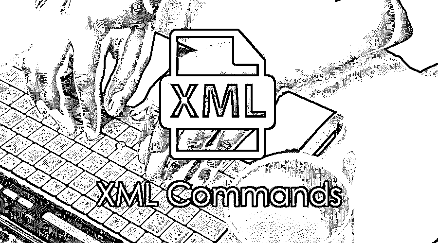

# XML 命令

> 原文：<https://www.educba.com/xml-commands/>

## XML 命令简介

XML 是一种可扩展的标记语言。它用于存储和传输数据。它是一种类似 HTML 的标记语言。XML 主要用于 [web 开发目的](https://www.educba.com/web-development-interview-questions/)。XML 命令不能用于向最终用户显示数据，但它是数据和表示之间的分离。xml 数据可以存储在扩展名为. XML 的 XML 文件中。由于 XML 将数据从 HTML 中分离出来，它可以帮助您更新 HTML 页面的内容。它主要以人类和机器可读的格式编码。

### 基本 XML 命令

基本的 XML 命令如下。

<small>网页开发、编程语言、软件测试&其他</small>

1.  **XML 声明**

`<?xml version="1.0">
<?xml version="1.0" encoding="UTF-8"?>`

2.  **元素标签:**元素名称区分大小写，应该以字母或下划线开头。它不能包含空格，但可以包含字母、数字和下划线。

**语法:**

`<element></element>`

**举例:**

`<text></text>`

3.  **根标签:**在 XML 文档或 XML 文件中只能有一个。

**语法:**

`<root> <x> </x> </root>`

**举例:**

`<Name> <<firstName></firstName> </Name>`

4.  **添加:**包含 XML 命令的节点。

**举例:**

`<add afterID=” system”> </add>`

5.  **Remove:** 用于从生成的 XML 中删除特定 id 的节点。

**举例:**

`<remove node=” system” />`

6.  **SET:** 这将改变结果 XML 中的父元素

**举例:**

`<set prop1=”name” value=” TOM” />`

7.  **Setattribute:** 在结果 xml 中更改父 XML 的属性集。

**举例:**

`<setAttributes attr1=”name” attr2=”value” />`

8.  **空标签:**命令用于显示没有内容的元素。

**举例:**

`
 
 or 
`

9.  **命名空间:**这是用来避免冲突的；使用前缀作为名称的开头。

**语法/示例:**

`<k: table> <k: name> JOHN </k: name> </k: table>
<j: table> <j: name> WRIGHT </j: name> </j: table>`

10.  XLink: 用于在 XML 文档中创建超链接。

**语法:**

`<page xmlns: xlink= http://www.ggogle.com”> </page>`

### 高级 XML 命令

高级命令如下。

11.  **XML DTD:** 这是在 XML 命令文件中有 DOCTYPE 声明的文件。它用于 XML，使其得到良好的管理，并对 XML 有效。

**举例:**

`<?xml version="1.0" encoding="UTF-8"?>
<!DOCTYPE abc SYSTEM "ABC.dtd">
<abc>
<to>John</to>
<from>TOM</from>
<heading>HI</heading>
<body>Hello, World!</body>
</abc>`

12.  **XML schema** :这个 XML 命令被用作 XML 文件中的 XS。它还定义了 XML 文件或文档的结构。它对于格式良好且有效的模式是有效的。

**举例:**

`<xs:element name="Personal">
<xs:ABC>
<xs:details>
<xs:element name="name" type="xs:string"/>
<xs:element name="location" type="xs:string"/>
<xs:element name="heading" type="xs:string"/>
<xs:element name="body" type="xs:string"/>
</xs:details>
</xs:ABC>
</xs:element>`

13.  **Xpath** :这个表达式用来选择根元素，比如/abc，它根据提供的标签选择其他元素，比如/abc/1。
14.  为了格式化 XML 文档，正在使用 XSL-FO 语言；它是一套可以将 XML 转换成 XHTML、过滤和排序 XML 数据的语言。它有助于以图片和纸张的形式显示负数和 XML 数据输出。

XML 文件如下所示:

`<?xml version="1.0" encoding="UTF-*"?>
<?xml-stylesheet type="text/xsl" href="simple.xsl"?>

<Personal>
<name>JOHN LUI</name>
<Age>28</price>
<location>USA</calories>
</Personal>

`

15.  XML 也可以用于编程，使用 java 编程文档对象模型来解析 XML。它也称为 DOM 兼容解析器。有许多其他的解析器也可以实现同样的功能。
16.  XML 也被用于 CSS，就像 HTML 被用于 CSS 一样。需要在 XML 文件中提供以下文本

`<?xml-stylesheet type="text/css" href="cd catalog.css"?>`

17.  可以在 internet explorer 或其他浏览器中查看 XML 文件，就像在浏览时查看 HTML 页面一样。

### 使用 XML 命令的提示和技巧

*   识别元素，并在所有 XML 文件中以相似的格式编写
*   要定价，而写标签的名称，因为他们是大小写敏感的。
*   应该很好地管理语法。
*   总是尝试使用不同的名称；否则，冲突会使 XML 文件不可读。
*   元素和语法的定义应该清晰。

### 结论

在存储和传输数据时，它们易于编写并用于不同的应用。它是轻量级的，主要用于几乎每个工具的配置文件中。非常好学，所有的东西主要都是用标签覆盖的。XML validator 用于验证 XML，以管理文件的格式和输出或结果 XML。

### 推荐文章

这是 XML 命令的指南。这里我们讨论了基本、中级和高级 XML 命令以及有效使用的技巧和诀窍。您也可以阅读以下文章，了解更多信息——

1.  [什么是 XPath？](https://www.educba.com/what-is-xpath/)
2.  [XML 版本](https://www.educba.com/xml-versions/)
3.  [XML 模式](https://www.educba.com/xml-schema/)
4.  [XML DTD](https://www.educba.com/xml-dtd/)

