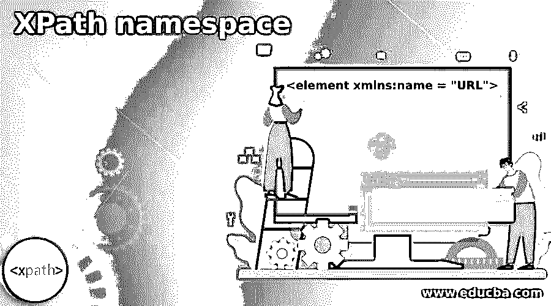
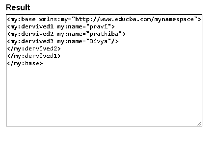
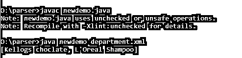

# XPath 名称空间

> 原文：<https://www.educba.com/xpath-namespace/>




## XPath 名称空间简介

在 XML 文档中，名称空间用于提供唯一命名的组件和属性。名称空间由两部分组成:前缀和 URL。这表示定义所讨论的名称空间的文档的位置。名称匹配优先考虑本地名称和单独的名称空间前缀。版本 1.3 中引入的 Namespaces helper 类使得在 XPath 表达式中使用名称空间变得很简单。

**语法:**

<small>网页开发、编程语言、软件测试&其他</small>

Xpath 名称空间语法如下所示:

```
<element xmlns:name = "URL">
```

一组保留属性用于声明名称空间。这种属性的名称必须是 xmlns 或包含 xmlns:作为前缀。与 XML 中的所有其他属性一样，这些属性可以显式指定，也可以默认指定。

### XPath 名称空间是如何工作的？

名称空间可能是使用 XPath 最不方便的方面。考虑下面的 XML 来了解原因。由于包含了默认的名称空间，它看起来与本文开头的例子非常相似。在 XPath 中没有将名称空间前缀连接到名称空间的方法。托管库可以提供这些服务。强烈建议我们利用这些特性，并根据需要创建可用于限定 XML 元素和属性名称的名称空间前缀。在 XML 节点和元素中，前缀只是对名称空间 URL 的引用。因此，几个前缀可以绑定到同一个名称空间，并且这些前缀可以在一个文档中混合使用。因此，因为所有前缀都指向同一个 URL，所以所有元素都在同一个名称空间中。

在各种文档中，相同的前缀可能被分配给不同的名称空间。

**名称空间:**

*   名称空间可以设置为默认值。
*   只有不带前缀的元素名称会受到影响。

**举例:**

```
<a:Xpathdemo xmlns:a="urn:varid:ISBN+sampledoc.org:Xpathdemo:en">
<a:comment >
<p>
Hello EDUCBA
</p>
</a:comment>
</Xpathdemo>
```

**取消命名空间声明**

```
Xmlns=""
```

Xpath 名称和命名空间包括:

*   QName 可以用在任何步骤表达式中:h: body
*   在表达式的外部，前缀绑定被定义(例如，特定于应用)。
*   用于匹配的是本地名称和命名空间名称，而不是前缀。
*   对于下面的例子，我们可以添加名称空间:

```
<book><page>One</page><page>Two</page><page>Three</page></book>
```

命名空间添加了前缀“m”“n”和“k”

```
/m:book/n:page/m:book/n:page/k:a/@href
```

针对 local-name()进行测试的谓词可以写成另一种形式:

```
*[local-name()='']/*[local-name(send)='QueryResponse']
```

这里，我们介绍一个名称空间，并演示如何修改 XPath 表达式来解释它。

使用多个名称空间的 Xpath

```
<x  xmlns:new2="uri2">
<y xmlns:new3="uri3">
<new3:m>
<text></text>
<hello></hello>
<here></here>
</new3:m>
<new3:n >
<buy></buy>
<and></and>
<sell></sell>
</new3:n>
</y>
</x>
```

我们使用了带有不同前缀的多个名称空间。以下 XPath 成功导航到节点:

```
/def:x/def:y/new3:n/def2: buy
```

名称空间感知内置于 XPath 中，节点测试匹配本地名称和名称空间。如果我们不在路径中指定一个名称空间，求值器就认为节点没有名称空间。

### 例子

这里我们讨论下面提到的例子。

#### 示例#1

```
<?xml version="1.0" encoding="UTF-8"?>
<my:base xmlns:my="http://www.educba.com/mynamespace">
<my:dervived1 my:name="pravi">
<my:dervived2 my:name="prathiba">
<my:dervived3 my:name="Divya" />
</my:dervived2>
</my:dervived1>
</my:base>
```

**XPath 表达式**

```
/*["base"=local-name()]
```

**输出:**




#### 实施例 2

在 XPath 查询中，可以指定名称空间前缀。

使用 PHP 的 Xpath

hello.php

```
<?php
$xml = <<<EOD
<shop xmlns:prod="http://example.org/prod-name">
<name>My Shopping</name>
<product id="1">
<prod:name>Chapter 1</prod:name>
<para>Lakme products can do to highlight and contour my naturally beautiful face. The colors match my complexion and we never look like having on a mask or caked up powder on my face..</para>
</product>
<product id="2">
<prod:name>Chapter 2</prod:name>
<para>Mac products can do to highlight and contour my naturally beautiful face. The colors match my complexion and we never look like  having on a mask or caked up powder on my face..</para>
</product>
</shop>
EOD;
$sxe = new SimpleXMLElement($xml);
$sxe->registerXPathNamespace('c', 'http://educba.org/product-name');
$result = $sxe->xpath('//c:name');
foreach ($result as $name) {
echo $name . "\n";
}
?>
```

**解释**

示例 XML 文档创建了一个前缀为 prod 的名称空间。考虑这种可能性，即该文档以前对同一名称空间使用了 c 前缀。作为更改的结果，XPath 查询将不再提供正确的结果，并且需要修改查询。即使提供程序更改了命名空间策略，使用 registerXPathNamespace 也可以防止将来对查询进行更改。

**输出:**


#### 实施例 3

```
<?php
$xml = <<<XML
<?xml version="1.0" standalone="yes"?>
<flights xmlns:f="http://educba.org/ns" xmlns:d="http://educba.org/demo">
<f:passenger id="1">Depthi roy</f:passenger>
<f:passenger id="2">Varma Singh</f:passenger>
</flights>
XML;
$sxe = new SimpleXMLElement($xml);
$namespaces = $sxe->getNamespaces(true);
var_dump($namespaces);
```

**解释**

上面的代码在文档中返回一个名称空间。它返回父节点和子节点中使用的 XML 文档中的所有名称空间。方法 getNamespaces 返回用它们的 URIs 指定的命名空间数组。

**输出:**


#### 实施例 4

**newdemo.java**

```
import java.io.File;
import java.io.FileInputStream;
import java.util.ArrayList;
import java.util.Iterator;
import javax.xml.XMLConstants;
import javax.xml.namespace.NamespaceContext;
import javax.xml.parsers.DocumentBuilder;
import javax.xml.parsers.DocumentBuilderFactory;
import javax.xml.xpath.XPath;
import javax.xml.xpath.XPathConstants;
import javax.xml.xpath.XPathExpression;
import javax.xml.xpath.XPathFactory;
import org.w3c.dom.Document;
import org.w3c.dom.NodeList;
public class newdemo
{
public static void main(String[] args) throws Exception
{        ArrayList<String> itemNames = new ArrayList<String>();
DocumentBuilderFactory fa = DocumentBuilderFactory.newInstance();
fa.setNamespaceAware(true);
DocumentBuilder bu= fa.newDocumentBuilder();
Document dmt = bu.parse(new FileInputStream(new File("department.xml")));
XPathFactory xpf= XPathFactory.newInstance();
XPath xp = xpf.newXPath();
xp.setNamespaceContext(new NamespaceResolver(dmt));
XPathExpression ex = xp.compile("//bs:departmentStore/bs:item/bs:itemname/text()");
Object result = ex.evaluate(dmt, XPathConstants.NODESET);
NodeList nd = (NodeList) result;
for (int k = 0; k < nd.getLength(); k++) {
itemNames.add(nd.item(k).getNodeValue());
}
System.out.println(itemNames);
}
}
class NamespaceResolver implements NamespaceContext
{
private Document sd;
public NamespaceResolver(Document dmt) {
sd = dmt;
}
public String getNamespaceURI(String prefix) {
if (prefix.equals(XMLConstants.DEFAULT_NS_PREFIX)) {
return sd.lookupNamespaceURI(null);
} else {
return sd.lookupNamespaceURI(prefix);
}
}
public String getPrefix(String namespaceURI) {
return sd.lookupPrefix(namespaceURI);
}
@SuppressWarnings("rawtypes")
public Iterator getPrefixes(String namespaceURI) {
return null;
}
}
```

**department.xml**

```
<?xml version="1.0" encoding="UTF-8"?>
<bs:departmentStore xmlns:bs="http://departmentstore.com/schemes">
<bs:item id="1">
<bs:itemname>Kellogs choclate</bs:itemname>
</bs:item>
<bs:item id="2">
<bs:itemname>L'Oreal Shampoo</bs:itemname>
</bs:item>
</bs:departmentStore>
```

**解释**

在上面的 java 示例中，我们看到了使用名称空间上下文将路径名称空间解析为 XML 文件 department.xml，该上下文具有名称空间声明和各自的用法。这个名称空间解析器可以处理任何具有名称空间定义的 XML 文件。它扫描 XML 文档中任何特定名称空间前缀的名称空间声明——作为参数传递。因此，不需要构建单独的名称空间映射。通过提取一个文本，上述源代码的输出如下所示。

**输出:**




### 结论

因此，在本文中，我们通过一个例子了解了如何使用 java 和 Php 在 Xpath 中使用名称空间。毫不奇怪，XML 库提供了实现这一点的方法。

### 推荐文章

这是 XPath 名称空间的指南。在这里，我们通过一个例子讨论如何使用 java 和 Php 在 Xpath 中使用名称空间。您也可以看看以下文章，了解更多信息–

1.  [XPath 后代](https://www.educba.com/xpath-descendant/)
2.  [XPath 相对](https://www.educba.com/xpath-relative/)
3.  [XPath 父节点](https://www.educba.com/xpath-parent/)
4.  [XPath 轴](https://www.educba.com/xpath-axes/)


