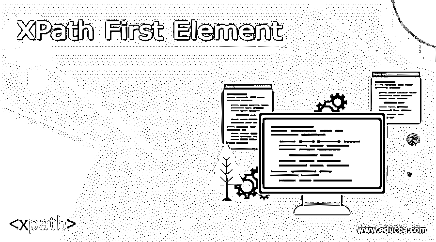
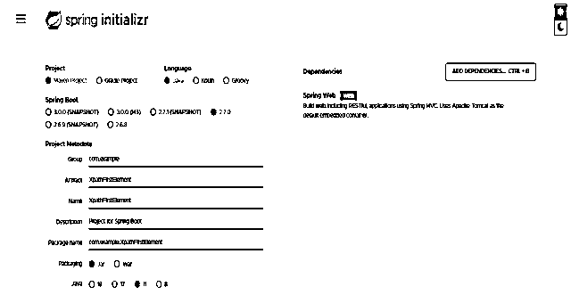
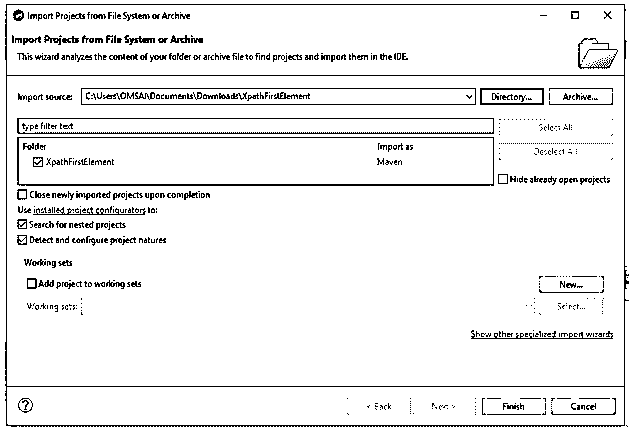
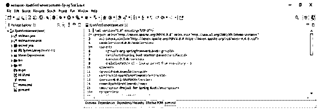
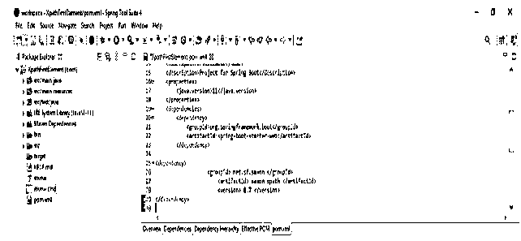
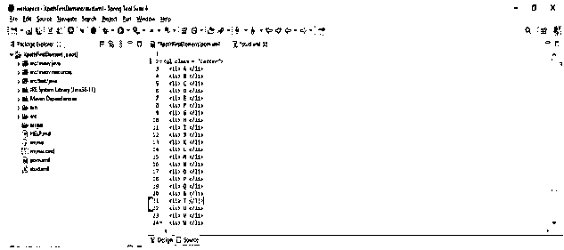
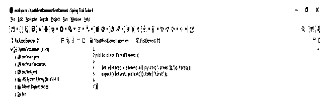
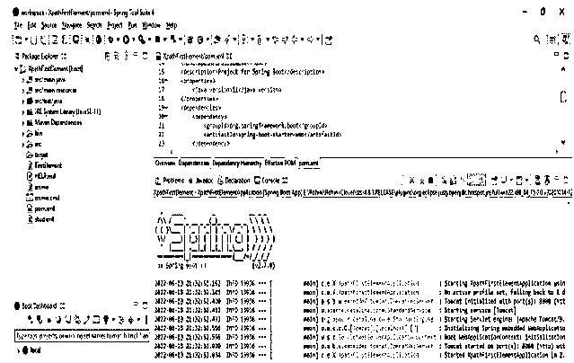
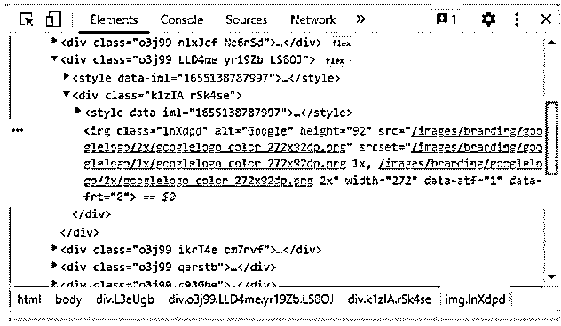
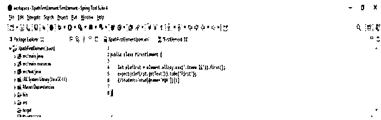

# XPath 第一个元素

> 原文：<https://www.educba.com/xpath-first-element/>




## XPath 第一个元素的定义

XPath first element 用于定位指定字符串中的第一个元素。它是 XPath 语言的预定义方法，在 XPath 语句中用于定位节点类型中第一个元素的节点。基本上，XPath 中的第一个元素方法将从所有元素中选择第一个元素，该元素出现在 XPath 的第一个元素的字符串中。

### XPath 的第一个元素是什么？

*   第一个元素从当前上下文中返回第一个元素的位置。有时，我们需要找到哪个元素先出现，哪个是下一个，为了找到集合中的第一个元素，我们使用 XPath first element。
*   第一个元素对于定义给定元素第一次出现的模板非常重要，或者对于从它所属的一组节点中的第一个节点开始测试给定节点也很有用。
*   根据表达式的上下文计算，第一个元素将从 size 返回一个数字。
*   我们可以通过使用以下不同的方法找到第一个元素如下。
*   按名称查找第一个元素。
*   通过 id 查找第一个元素。
*   通过类名找到第一个元素。
*   通过 XPath 找到第一个元素。
*   通过链接文本查找第一个元素。
*   通过 CSS 选择器找到第一个元素。
*   通过标记名查找第一个元素。
*   通过部分链接文本查找第一个元素。
*   为了获得元素的 ID 或名称的第一个元素，我们可以使用 XPath 来显示元素的第一个值。

### 如何对第一个元素进行 XPath？

*   下面的步骤展示了如何对第一个元素进行 XPath 处理，如下所示。我们将项目名称创建为 XPathFirstElement。在下面的步骤中，我们将创建 spring boot 中第一个元素的项目模板。

1.  在创建项目时，我们提供的项目组名称为 com。例如，工件名称为 XPathFirstElement，项目名称为 XPathFirstElement，选择的 java 版本为 11。我们将 spring boot 的版本定义为 2.6.7。

group–com . example

<small>网页开发、编程语言、软件测试&其他</small>

工件名称–XPathFirstElement

名称–XPathFirstElement

弹簧靴–2 . 6 . 7

项目 Maven

Java–11

包名–com . example . XPathFirstElement

项目描述 XPathFirstElement 的项目

依赖性 Spring web

包装–罐子




2.在这一步中，我们提取下载的项目，并使用 spring 工具套件打开它，如下所示。




3.在这一步中，我们将检查所有的项目结构及其文件，如下所示。此外，我们正在检查 pom.xml 文件是否已创建。假设没有创建这个文件，那么我们需要手动创建相同的文件。在下面的例子中创建了这个文件，所以我们不需要手动创建它。




4.在这一步中，我们将在第一个元素项目中添加一个依赖项。我们正在添加依赖项，如下所示。

**代码—**

```
<dependency>
<groupId> net.sf.saxon </groupId>
<artifactId> saxon-XPath </artifactId>
<version> 8.7 </version>
</dependency>
```




5.下面是元素数组查找器中第一个元素的视图。它不会检索基础元素。

**代码—**

```
<ul class = "letter">
<li> A </li>
<li> B </li>
<li> C </li>
<li> D </li>
<li> E </li>
<li> F </li>
<li> G </li>
<li> H </li>
<li> I </li>
<li> J </li>
<li> K </li>
<li> L </li>
<li> M </li>
<li> N </li>
<li> O </li>
<li> P </li>
<li> Q </li>
<li> S </li>
<li> T </li>
<li> U </li>
<li> V </li>
<li> W </li>
<li> X </li>
<li> Y </li>
<li> Z </li>
</ul>
```




6.下面是元素数组查找器中 XPath 第一个元素的代码。

**代码—**

```
public class FirstElement {
let elefirst = element.all (by.css('.items li')).first();
expect (elefirst.getText ()).toBe ('First')
}
```







### 启用 XPath 选择

*   Google chrome 提供了一个调试工具，叫做 chrome dev tools。它将包括许多方便的功能，用于评估 CSS 选择器，而没有任何第三方工具的扩展。
*   我们还可以从控制台面板执行令牌，用于验证和评估该令牌。
*   在下面的例子中，我们启用 XPath 选择，如下所示。我们在下面的例子中启用选择。




*   XPath 使用路径的表达式来选择 xml 文档中的节点。使用以下路径选择节点。下面是 XPath 选择最有用的表达式。
*   Nodename–它将选择名称为 nodename 的所有节点。
*   /–用于从根节点进行选择。
*   //–此符号用于从当前节点中选择与选择匹配的节点
*   .–用于选择当前节点。
*   @-用于选择属性。
*   我们可以使用 elements 面板中的搜索功能来评估 CSS 选择器的 XPath，还可以突出显示 DOM 中的匹配行。

### XPath 第一个元素数组

*   XPath 数组的第一个元素可以嵌套，我们可以说数组的成员可以是属性值，包括序列、函数、映射等值。数组成员包含一个空序列。
*   数组的第一个元素包含一个单项，所以它包含数组的序列。
*   按照顺序，数组的成员通过使用 1 到 n 范围内的整数来寻址。
*   XPath 的第一个元素数组是不可变的 XDM 值。在追加时，从一个数组中删除一个条目，我们将得到一个新的数组。
*   通过使用 sequence 和 maps，第一个元素数组在元素数组中没有内部类型。
*   下面是例子。

**代码—**

```
(/Students/stud[@name='PQR'])[1]
```




### 结论

XPath 第一个元素从当前上下文返回第一个元素的位置。XPath 第一个元素是 XPath 语言的预定义方法，在 XPath 语句中用于从节点类型中定位第一个元素的节点。

### 推荐文章

这是 XPath 第一个元素的指南。这里我们讨论定义，什么是 XPath 首元素，如何 XPath 首元素，分别用代码实现例子。您也可以看看以下文章，了解更多信息–

1.  [XPath 查找器](https://www.educba.com/xpath-finder/)
2.  [XPath 类](https://www.educba.com/xpath-class/)
3.  [XPath 属性](https://www.educba.com/xpath-attribute/)
4.  [XPath 文本](https://www.educba.com/xpath-text/)


