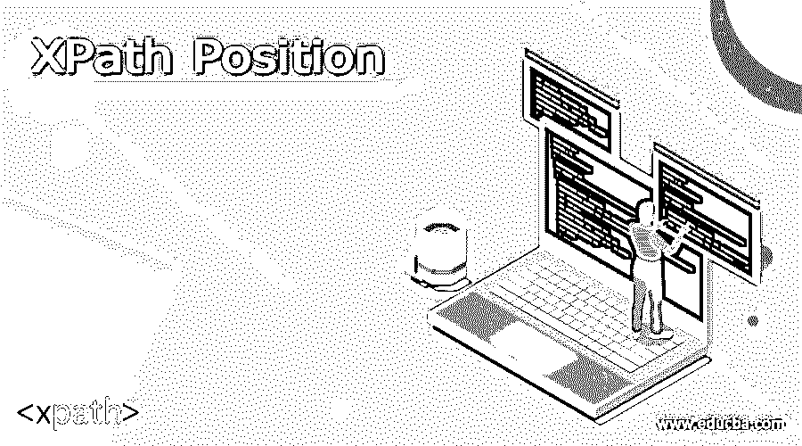
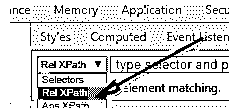
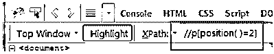
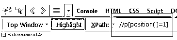
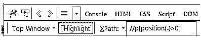
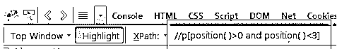

# XPath 位置

> 原文：<https://www.educba.com/xpath-position/>

## XPath 位置的定义

position 是 XPath 语言中预定义最多的方法，用于在给定节点类型的正确位置设置或跟踪元素节点。它用于执行表示上下文顺序位置的整数。这里，位置从一个节点开始，该节点被设置为给定节点集中的第一个节点，并增加到最后一个函数的值。在本文中，将简要讨论 XPath 位置的定义、用法和示例。

### XPath 的定位是什么？

如果父标签下有 n 个子标签，用于将子标签放置在与其他子标签相同的适当位置，则在 XPath 中使用 position()函数来实现。它用在一个函数中，该函数执行固定上下文节点集的整数。该位置启动第一个上下文的节点集，并增加到具有最后一个函数的值。

<small>网页开发、编程语言、软件测试&其他</small>

### 如何使用 XPath 位置函数？

下面讨论 XML 文档的根元素和简单的 XPath 位置和语法。

作为根元素的超市有五个元素节点，它们应用于整个后代::轴。

*(超市:柜台，超市:小孩，超市:杂货，超市:蔬菜，超市:衣服)*

在位置路径中，其定义如下:

*/超市:超市/后代::**

该函数设置由五个元素节点组成的节点集值，通过添加如下语法所示的谓词来帮助定位。

*/超市:超市/后代::* [position () = 3]*

帮助选择本地节点集中的第三个节点。

现在，在 position()函数的帮助下传递值，该函数应用于轴的反向和正向。在轴中，要像前面的例子一样向前移动类型，descendant::从文档中按照给定的顺序选择节点。如果用户试图反向访问轴，他应该提供适当的负值来从节点获取元素。因此，要构建位置路径，语法应该从衣服节点开始，然后定位前面的超市:柜台节点。

这里的位置路径如下图所示，

*//衣服/先验::* [position ( ) = 3]*

要以相反的顺序工作，语法应该表示为 prior #1，它从超市获取结果:衣服，对于 prior 或 ancestor #2，它从超市获取数据:蔬菜

position()函数更具强制性，这有两个原因，一是它可以在位置的任何步骤中被提及，并且可以很容易地获取值，并且它不一定要与整个 XML 文档一起传递。

*//衣服/先验::* [position ( ) = 3]*

*或//衣服/先验::* [3]*

另一个原因是在许多 XSLT 函数中，对几种节点中存在的所有第 n 个值都执行这个操作，然后转换源树。

如果用户希望选择文档中表格的每一个偶数行，那么所有奇数行都应该被删除。换句话说，可以选择所有的交替行。使用 XPath 中的函数 position()可以很容易地实现这一点，它与数值运算符 mod 配合使用效果很好。

### XPath 位置硒定位器

下面的步骤用于在 selenium 中定位 XPath 函数中的位置()。

selenium 的基本链接应该在默认的 chrome 浏览器中打开，chropath 应用程序应该在该浏览器中安装。该应用程序的链接可以在标准的 selenium 网站上找到。

在 chrome 浏览器中，选择 chropath，然后选择 Rel XPath

那么应该使用 chropath 选项中的//p 来选择 XPath 的相对表达式，并且从所选位置观察给定的细节。

用户可以使用 XPath 函数中的 position()在 XPath 可用的相对表达式中定位细节。可以定义为相对 XPath 表达式::// p [position ( ) = 3]

然后按照语法，执行 chropath 中的相对表达式。

然后，为了定位下一个选项，使用相同的语法，但是应该改变位置值。

相对 XPath 表达式::// p [position ( ) = 2]

chropath 中提供了相关的 XPath 表达式，并且应该执行给出的所有选项。

如果已经安装了 chropath 应用程序并且更新了 chrome 浏览器，那么可以在 prompt 中启动该过程。通过应用相对 XPath 表达式来使用初始输入标记

(// input) [position =1]。

如果输入标签的数量与 position()一起使用，则使用相对 XPath 表达式。

那么应该给定为相对 XPath 表达式:(// input ) [position = n]

执行上面的语法，用正确的标签代替 n 来获取所需的数据。

在 XPath 中，当应该比较和获取两个元素之间的值时，使用带有大于号或小于号的相对表达式。语法如下所示，

// p [ position () > O ]。这里，在 HTML 中选择了所有的 p 标签，并观察到获取了合适的值。

如果用户想要跟踪本地节点集中的所有元素(位于大于 0 小于 2 之间),可以通过用 position()定义函数来执行，并且可以与 position () > 2 进行比较。获取介于 0 和 2 之间的值的语法是

// p [ position ( ) > 0 且 position ( ) < 2 ]。

### 结论

因此，本文讨论了 selenium 定位器和文档中 XPath 位置的用法，并暗示用户可以轻松地从更高维度的文档中获取数据。

### 推荐文章

这是 XPath 定位指南。这里我们分别讨论定义，XPath 的位置是什么，如何使用 XPath 位置函数，以及代码实现的例子。您也可以看看以下文章，了解更多信息–

1.  [XPath 后代](https://www.educba.com/xpath-descendant/)
2.  [XPath 备忘单](https://www.educba.com/xpath-cheat-sheet/)
3.  [XPath 属性](https://www.educba.com/xpath-attribute/)
4.  [XPath 节点](https://www.educba.com/xpath-nodes/)

