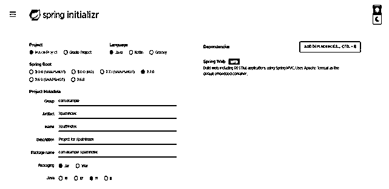
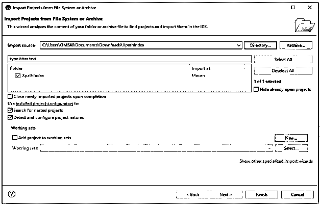
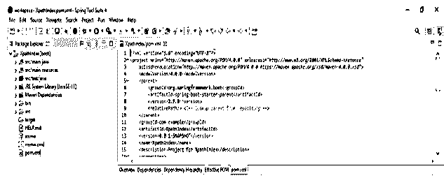
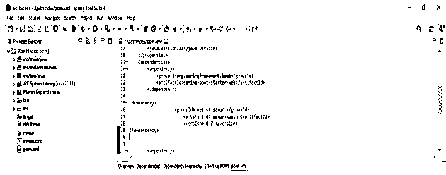

# XPath 索引

> 原文：<https://www.educba.com/xpath-index/>


## XPath 索引的定义

XPath 索引是使用 selenium webdriver 根据索引的节点集中的特定节点定义的。我们还可以借助于用[]括起来的一些索引来提到特定于索引的节点。标记名元素 UI 包含多个标记名为 li 的子元素。如果我们想确定哪个孩子是第二名，父项包含软件质量管理。

### 什么是 XPath 索引？

索引表达式用于标识父元素的第二个子元素，该父元素是使用函数名作为位置创建的。为了精确定位第二个元素，我们需要为索引追加位置 2。我们可以使用索引方法，根据我们想要定位的索引值来指定标记名。从组匹配的元素中检索元素称为组索引。在使用多个元素匹配表达式时，我们可以使用组索引。

<small>网页开发、编程语言、软件测试&其他</small>

### 如何使用 XPath 索引？

在 index 中，我们可以用大括号写表达式，然后我们可以把 index 写在大括号外面。在内部，它将首先执行表达式，并将结果存储在一个 XPath 数组中，该数组的索引从 1 开始。Last 函数用于检索数组中的最后一个元素。我们还可以使用 position 函数来检索元素位置。

以下步骤显示了如何使用索引，如下所示。我们将项目名称创建为 XPathIndex。在下面的步骤中，我们将在 spring boot 中创建 index 的项目模板。

1.  在创建项目时，我们提供项目组名为 com.example，工件名为 XPathIndex，项目名为 XPathIndex，选择的 java 版本为 11。我们将 spring boot 的版本定义为 2.6.7。

group–com . example

工件名称–XPath index

名称–XPath index

弹簧靴–2 . 6 . 7

项目 Maven

Java–11

包名–com . example . XPath index

项目描述–XPath index 项目

依赖性 Spring web

包装–罐子




2.下面我们提取项目名为 XPathIndex，并使用 java 开发工具名为 spring tool suite 打开它。




3.在这一步中，我们将检查所有的项目结构及其文件，如下所示。假设没有创建这个文件，那么我们需要手动创建相同的文件。在下面的例子中创建了这个文件，所以我们不需要手动创建它。




4.在这一步中，我们将在索引中添加一个依赖项，如下所示。

**代码—**

```
<dependency>
<groupId> net.sf.saxon </groupId>
<artifactId> saxon-XPath </artifactId>
<version> 8.7 </version>
</dependency>
```




*   在下面的例子中，我们使用索引来实现 XPath。在下面的例子中，我们将创建一个类名 XPath_index，如下所示。在下面的例子中，我们可以看到我们已经通过使用索引实现了。我们用的是 chrome 的 web 驱动。我们还将超时方法与 driver.manage 方法结合使用。我们使用 get 方法，在这个 get 方法中，我们定义了 URL。

**代码—**

```
public class XPath_index {
public static void main(String[] args) {
System.setProperty ("webdriver.chrome.driver", "chromedriver.exe");
WebServer driver = new ChromeDriver ()
driver.manage ().timeouts ().implicitlyWait (5, TimeUnit.SECONDS);
((Object) driver).get ("https://example.com/writing.htm");
WebElement t = driver.findElement (By.XPath("//ul[@class='list']/li[2]"));
System.out.println ("Element is: " + t.getText ());
driver.close ();
}
}
```

### 如何找到 index XPath 元素？

正如我们所知，有两种可用的路径，第一种是绝对路径，第二种是相对路径。我们可以使用任何一个路径来查找索引元素。对于 selenium 中的绝对路径，表达式是通过选择根节点创建的。它将从单个斜杠开始，从整个 DOM 的根开始遍历，以到达所需的元素。使用绝对路径的缺点是在路径中的开发变更时定位元素。我们还可以使用基本的 XPath 来查找索引元素。基本 XPath 是用 selenium 编写 XPath 的一种语法上非常通用的方法，selenium 是属性值和标记名的组合。下面的例子显示了如何找到索引 XPath 元素，如下所示。

**代码—**

```
public class XPath_index {
public static void main(String[] args) {
System.setProperty ("webdriver.chrome.driver", "chromedriver.exe");
WebServer XPath = new ChromeDriver ()
XPath.manage ().timeouts ().implicitlyWait (5, TimeUnit.SECONDS);
((Object) XPath).get ("https://example.com/writing.htm");
WebElement t = XPath.findElement (By.XPath ("//ul [@class='list']/li[2]"));
System.out.println ("Element is: " + t.getText ());
XPath.close ();
}
}
```

### XPath 索引组

XPath 索引组无非是从多个匹配元素中检索单个元素。我们从索引组中的多个匹配元素中检索 single。当匹配 XPath 的表达式时，我们可以使用或使用索引组。下面是语法如下。

**语法—**

```
(expression of XPath) [index]
```

在索引组的语法中，我们使用了表达式和索引的位置。在这个 x 组中，我们将表达式写在括号内。我们使用 last 和 position 函数和索引组来定义 XPath 中的索引。下面是索引组的 html 代码示例。

**代码—**

```
<html>
</head>
<body>
<table>
<tr>
<td> <input type = "text" value = "P"> </td>
<td> <input type = "text" value = "Q"> </td>
</tr>
<tr>
<td> <input type = "text" value = "R"> </td>
<td> <input type = "text" value = "A"> </td>
</tr>
</table>
</body>
</html>
```

下表显示组索引和匹配元素如下，我们使用匹配元素作为 PQRA。

| **XPath 组索引** | **匹配元素** |
| //输入 | PQRA |
| (//input)[1] | 英语字母表中第十六个字母 |
| (//input)[2] | 英语字母表中第十七个字母 |
| (//input)[3] | 英语字母表中第十八个字母 |
| (//input)[4] | 英语字母表中第一个字母 |
| (//input)[last()] | 英语字母表中第一个字母 |

### 结论

在 index 中，我们可以用大括号写 XPath 的表达式，然后我们可以在大括号外面写索引。通过使用 selenium webdriver，它被定义为 XPath 索引的节点集中的每个特定节点。

### 推荐文章

这是 XPath 索引指南。这里我们分别讨论 XPath 索引的定义、什么是 XPath 索引、如何使用 XPath 索引以及代码实现的例子。您也可以看看以下文章，了解更多信息–

1.  [XPath 后代](https://www.educba.com/xpath-descendant/)
2.  [XPath 备忘单](https://www.educba.com/xpath-cheat-sheet/)
3.  [XPath 属性](https://www.educba.com/xpath-attribute/)
4.  [XPath 节点](https://www.educba.com/xpath-nodes/)


