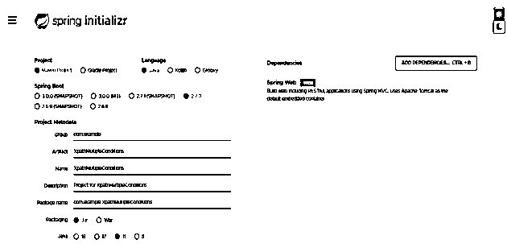
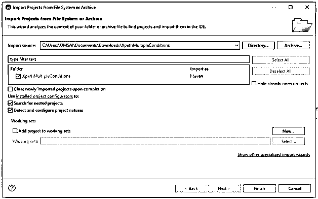
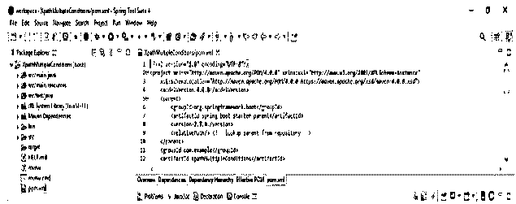
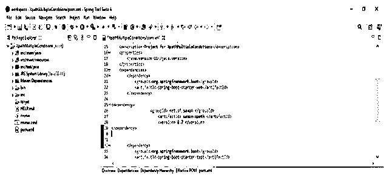
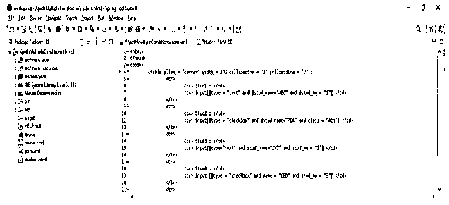
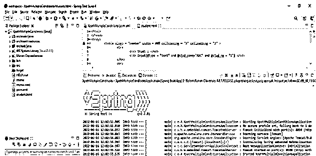
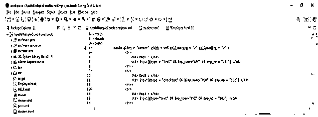
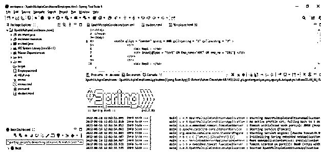
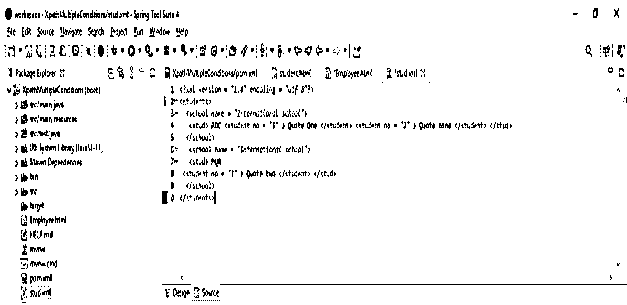
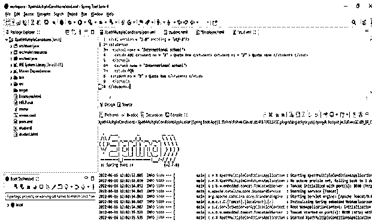

# XPath 多个条件

> 原文：<https://www.educba.com/xpath-multiple-conditions/>


## XPath 多重条件的定义

XPath 多个条件用于选择多个属性，通过在多个条件中使用 XPath，我们可以通过指定子节点来选择任何具有该属性的类别。当我们必须将消息转发到多个接口或多个接收者时，我们可以定义路径中的条件。XPath 多条件是在到达具有多个接收者或接口的服务器时选择传入的消息。

### XPath 多条件概述

*   众所周知，selenium 是一个免费的开源 web 自动化框架，用于测试跨不同浏览器和平台的应用程序。
*   为了通过使用多个条件来实现框架，我们首先需要定位 web 元素。
*   在多个条件下，我们可以使用匹配的方式，表达式中的一个值是匹配的，第二个值是执行的。
*   我们可以在处理多个条件时使用调用处理规则来设置变量跳过后面。我们还可以使用 transform 操作，通过使用多个条件将默认响应发送回客户端。
*   我们可以使用下面的语法来使用多个条件如下。

**语法:**

<small>网页开发、编程语言、软件测试&其他</small>

```
//quotes/category [@aattribute1 = val1 and attribute2 = val2]
```

```
//quotes/category [@aattribute1 = val1 and attribute2 = val2]
```

*   在上述语法中，引号或类别将定义我们在多个条件下使用的类别。在使用多个条件时，这是非常重要的参数。
*   Attribute1 和 attribute2 定义了我们在多个条件下使用的属性的数量；我们可以通过定义多个属性来使用多个条件。
*   值 1 和值 2 被定义为我们在多个条件中定义的值。我们可以根据在多个条件中使用的多个条件使用多个值。XPath 多重条件对于定义多重条件非常重要和有用。

### 如何使用 XPath 多个条件？

*   我们在使用 XPath 时使用 OR 和 and 条件多个条件如下。
*   下面的步骤显示了如何使用 XPath 多重条件如下。我们将项目名称创建为 XPathMultipleConditions。在下面的步骤中，我们将在 spring boot 中创建 XPath 多条件的项目模板。

1.在创建项目时，我们提供项目组名为 com.example，工件名为 XPathMultipleConditions，项目名为 XPathMultipleConditions，选择的 java 版本为 11。我们将 spring boot 的版本定义为 2.6.7。

group–com . example

工件名称–xpathmultiplections

名称–XPath multiple conditions

弹簧靴–2 . 6 . 7

项目 Maven

Java–11

包名–com . example . XPath multiple conditions

项目描述 XPathMultipleConditions 项目

依赖性 Spring web

包装–罐子




2.在这一步中，我们提取下载的项目，并使用 spring 工具套件打开它，如下所示。




3.在这一步，我们检查所有的项目结构和它的文件如下。此外，我们正在检查 pom.xml 文件是否已创建。假设没有创建这个文件，那么我们需要手动创建相同的文件。在下面的例子中创建了这个文件，所以我们不需要手动创建它。




4.在这一步中，我们在多个条件中添加依赖关系，我们添加的依赖关系如下。

**代码—**

```
<dependency>
<groupId> net.sf.saxon </groupId>
<artifactId> saxon-XPath </artifactId>
<version> 8.7 </version>
</dependency>
```




5.现在我们通过使用 AND 条件定义多个条件来创建 student.html，条件如下。在下面的例子中，我们也在运行这个项目。

**代码—**

```
<html>
</head>
<body>
<table align = "center" width = 80% cellspacing = "2" cellpadding = "2" >
<tr>
<td> Stud1 : </td>
<td> input[@type = "text" and @stud_name="ABC" and @stud_no = "1"] </td>
</tr>
<tr>
<td> Stud2 : </td>
<td> input[@type = "checkbox" and @stud_name="PQR" and class = "4th"] </td>
</tr>
<tr>
<td> Stud3 : </td>
<td> input[@type="text" and stud_name="XYZ" and stud_no = "2"] </td>
</tr>
<tr>
<td> Stud4 : </td>
<td> input [@type = "checkbox" and name = "CBD" and stud_no = "3"] </td>
</tr>
<tr>
<td> Stud5 : </td>
<td> input[@type="password" and class = "password" and stud_no = "4"] </td>
</tr>
</table>
</body>
</html>
```







### XPath 多个条件值

*   在 XPath 表达式中，单个属性将标识多个条件，那么我们可以在路径的表达式中使用多个属性来定位单个元素。要编写多个条件，我们可以应用 AND 和 or 条件。
*   在下面的例子中，我们通过使用多个 OR 条件来使用多个值，如下所示。

**代码—**

```
<html>
</head>
<body>
<table align = "center" width = 90% cellspacing = "2" cellpadding = "2" >
<tr>
<td> Emp1 : </td>
<td> input[@type = "text" OR Emp_name="ABC" OR emp_no = "101"] </td>
</tr>
<tr>
<td> Emp2 : </td>
<td> input[@type = "checkbox" OR @Emp_name="PQR" OR emp_no = "102"] </td>
</tr>
<tr>
<td> Emp3 : </td>
<td> input[@type="text" OR Emp_name="XYZ" OR emp_no = "103"] </td>
</tr>
<tr>
<td> Emp4 : </td>
<td> input [@type = "checkbox" OR Emp_name = "CBD" OR emp_no = "104"] </td>
</tr>
<tr>
<td> Emp5 : </td>
<td> input[@type="password" OR emp_name = "XYA" OR emp_no = "105"] </td>
</tr>
</table>
</body>
</html>
```







### XPath 多条件-xml

*   我们在 xml 中使用了多个条件。以下是多个条件的示例。我们正在创建 xml 文件名 stud.xml，如下所示。
*   在下面的例子中，我们可以看到我们使用了学生和学校标签来定义 xml 中的多个条件。

**代码—**

```
<?xml version = "1.0" encoding = "utf-8"?>
<students>
<school name = "International school">
<stud> ABC <student no = "1" > Quote One </student> <student no = "2" > Quote nine </student> </stud>
</school>
<school name = "International school">
<stud> PQR
<student no = "3" > Quote two </student> </stud>
</school>
</students>
```







### 结论

我们可以在处理多个条件时使用调用处理规则来设置变量跳过后面。它们用于选择多个属性，通过在多个条件下使用 XPath，我们可以通过指定子节点来选择任何具有属性的类别。

### 推荐文章

这是 XPath 多重条件的指南。这里我们分别讨论 XPath 多条件的定义、如何使用以及代码实现的例子。您也可以看看以下文章，了解更多信息–

1.  [XPath 位置](https://www.educba.com/xpath-position/)
2.  【JSON 的 XPath】
3.  [XPath 正则表达式](https://www.educba.com/xpath-regex/)
4.  [XPath 文本](https://www.educba.com/xpath-text/)


