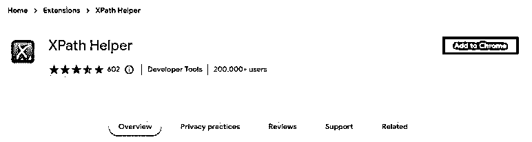
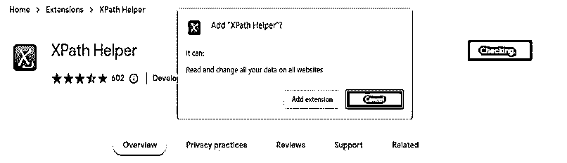
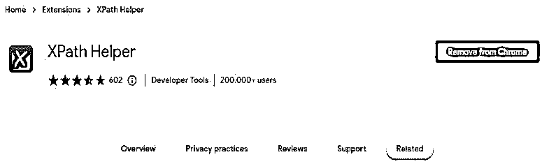
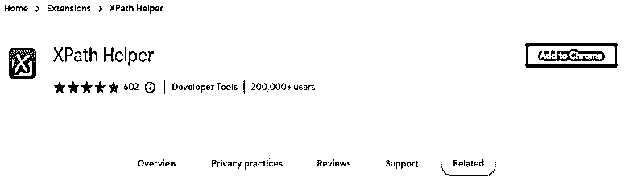
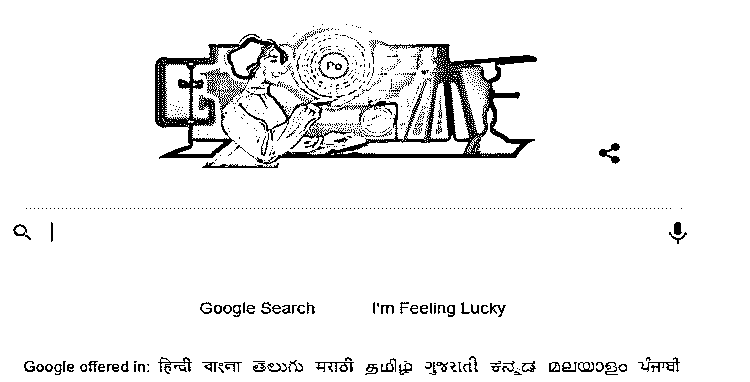
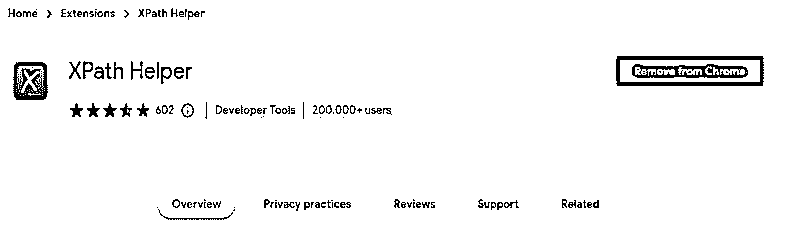
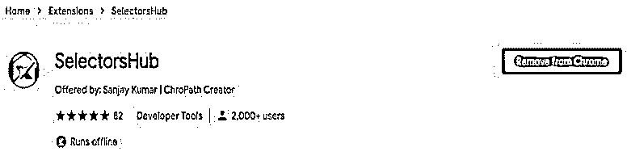
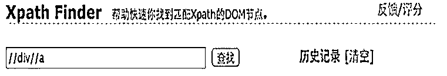

# XPath 助手

> 原文：<https://www.educba.com/xpath-helper/>

## XPath 助手简介

XPath 帮助器通过使用网页可以很容易地编辑、提取和评估 XPath 的查询。我们需要安装 XPath 助手扩展，以便在我们的程序中使用它；如果不安装这个扩展，我们就不能在代码中使用它。安装 XPath helper 的扩展后，我们需要重新加载现有的选项卡或重启 Chrome 浏览器来处理这个扩展。

### 什么是 XPath 助手？

使用 helper，我们可以在 helper 的帮助下提取和评估任何网页上的 XPath 查询。与 XPath 的其他插件相比，它非常易于使用，并且更加以用户为中心。要使用 helper，我们只需点击控制台，然后编辑或编写 XPath。

<small>网页开发、编程语言、软件测试&其他</small>

我们也可以使用 helper 编写自己的 XPath。要使用助手插件，我们需要在 chrome 浏览器中添加相同的扩展。下面的例子显示了添加 helper 的扩展如下。在下面的例子中，我们将帮助器添加到 chrome 浏览器，如下所示。打开 helper 的网站后，我们通过点击添加到 chrome 按钮标签来添加插件。

现在打开 helper 页面后，我们点击“添加到 chrome”按钮，点击此页面后，下面的窗口将打开，说明我们正在 chrome 浏览器中添加 XPath helper 扩展。点击添加扩展按钮后，插件被添加到我们的 chrome 浏览器。在将扩展添加到浏览器中时，我们可以通过再次打开相同的链接来删除它。打开同一个链接后，会直接显示为从 chrome 浏览器中移除。我们可以随时从 chrome 浏览器中删除。

我们还可以通过再次单击同一链接来删除助手。下面的例子显示了如何从 chrome 浏览器中删除 XPath 助手，如下所示。

当打开 helper 的链接时，它会打开上面的页面，显示从 chrome 中移除的选项卡。点击从 chrome 中移除后，它将从我们的 chrome 浏览器中移除 helper 插件，如下所示。移除插件后，它会显示相同的页面，以便在我们的 chrome 浏览器中再次添加相同的插件。

### 它是如何工作的？

下面的步骤显示了如何使用如下的助手工作。为了使用助手，我们使用 google.com 网站进行测试。要使用助手，我们需要安装助手插件，但我们已经安装了它，所以我们不需要再次安装它。

1.在这一步中，我们打开 chrome 浏览器并打开 google.com 的网页，如下所示。

2.打开网页后，您需要点击工具栏中的助手按钮来打开助手控制台，如下所示。

3.打开 helper 后，我们现在按页面的鼠标元素按住 shift 键。在下图中，我们可以看到它将显示查询，我们编辑如下。

4.如果假设我们想要编辑 XPath 查询，我们可以直接在 chrome 浏览器中编辑 XPath 来打开页面。

5.编辑完助手后，我们可以关闭它或重复步骤 2 来打开编辑助手。

如果控制台挡了我们的路，我们需要按住 shift 键并将鼠标移到它上面。它会把我们的鼠标移到页面的另一边。

### 最佳助手工具

众所周知，selenium 在自动化领域越来越受欢迎。更多的公司将采用这种工具。

以下是 XPath 中可用的最佳助手工具:

**1。选择器中枢-**选择器中枢用于自动建议属性和文本以完成选择器。我们没有必要复制 DOM。

**2。chro path–**该工具用于验证唯一的选择器，如相对和绝对路径。

**3。Scraper-**Scraper 将从电子表格的网页中获取数据。这是非常简单的数据挖掘扩展。

**4。relative XPath Helper–**用于找出两个 web 元素的相对 XPath 的扩展。通过单击第一个和第二个元素，我们可以获得相对的 XPath 帮助器。

**5。XPath 助手向导–**XPath 助手向导正在创建 XPath，它很短，不太可能破坏网站中的更改。

**6。XPath Finder-**XPath Finder 用于根据我们的 XPath 查找元素；它将使匹配的元素具有突出显示的背景。

7 .**。x pather–**这个扩展正在当前元素上运行。

**8。eskry–**它用于帮助定位符指向，并用于捕获 HTML 元素的方法。

### 结论

XPath helper 非常容易使用，与 XPath 的其他插件相比，它是以用户为中心的。它用于通过使用网页方便地编辑、提取和评估 XPath 的查询。我们需要安装 XPath 助手扩展，以便在我们的程序中使用它。

### 推荐文章

这是 XPath 帮助器的指南。这里我们讨论一下 XPath 助手的介绍和使用方法？和更好理解的工具。您也可以看看以下文章，了解更多信息–

1.  [XPath 兄弟](https://www.educba.com/xpath-sibling/)
2.  [XPath 祖先](https://www.educba.com/xpath-ancestor/)
3.  [XPath 正则表达式](https://www.educba.com/xpath-regex/)
4.  [XPath 名称空间](https://www.educba.com/xpath-namespace/)

