# 3D Max 快捷方式

> 原文：<https://www.educba.com/3d-max-shortcuts/>

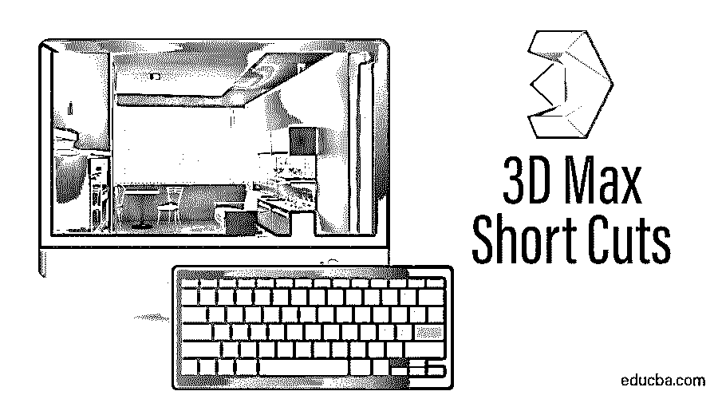

## 3D Max 软件中的快捷键

3D max 软件被不同的公司用于建模，这些公司包括动画公司、视频游戏公司、电视和电影工作室。3D max 中的快捷方式为您提供了项目中的第一个快速工作空间。快捷键是通过使用键盘按钮中的快捷键来激活任何命令的快捷方式。

当你从事一个非常大的商业项目时，你必须以最大的准确性按时完成你的项目。知道捷径对你来说是一个加分点，可以帮助你在你的工作领域建立你的声望。

<small>3D 动画、建模、仿真、游戏开发&其他</small>

### 用于在 3D Max 中绘图的视口

3D max 软件中有四个视口工作区，分别是顶视口、前视口、左视口，最后一个是透视视口。我们可以随时选择其中任何一个来绘制我们的模型。

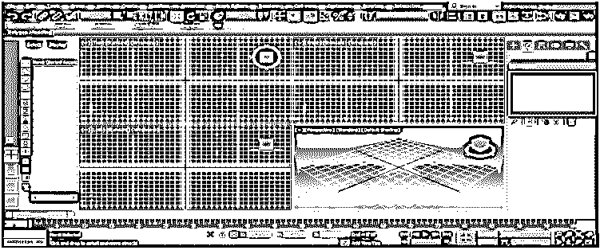

为了在这里使用快捷方式，首先，我们需要在我们的视口中绘制一些对象。

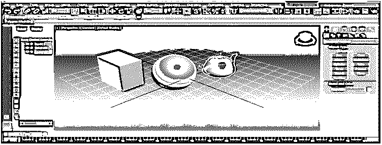

*   **选择所有快捷方式:**用于选择模型中存在的所有对象。要同时选择所有对象，按键盘上的**Ctrl+A**；所有选择都可以在所选对象周围以天蓝色线条的形式看到。

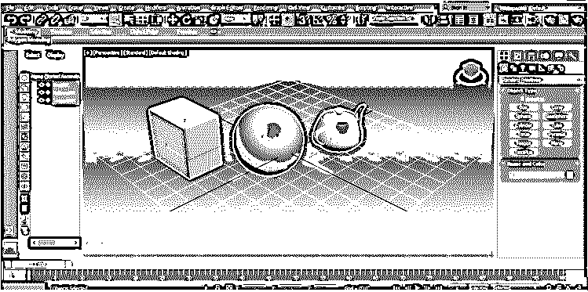

要取消选择，请按键盘上的 **Ctrl + D** 。

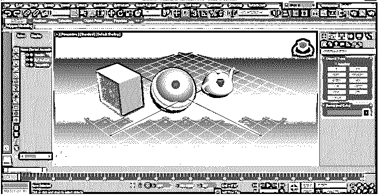

*   **切换锁定快捷键:**用于选择单个对象，并将我们的选择锁定到该对象。激活此选项后，我们将无法同时选择任何其他对象。按键盘上的空格键；单击要锁定的对象以激活此选项。

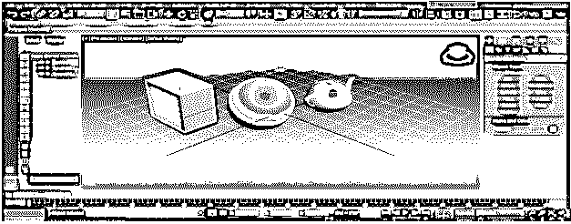

*   **线框模式快捷方式:**按键盘上的 F3 键进入对象的线框模式。

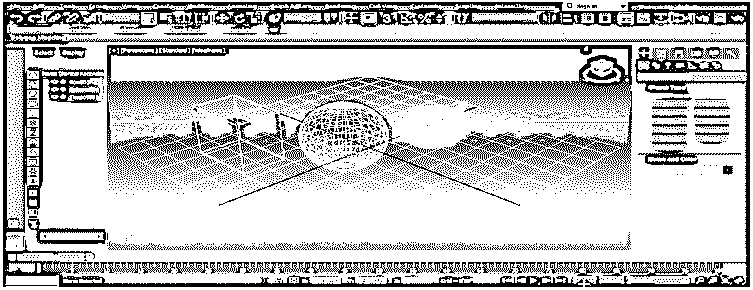

再次按下键盘上的 F3 键，返回到对象的阴影模式。

*   **边缘面快捷方式:**从键盘上按下 F4，同时查看物体的边缘面和阴影面。

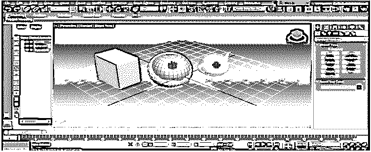

*   **选择任何具有名称的对象的快捷方式:**我们可以选择任何具有名称的对象，也可以选择按键盘上的 **H** 。将打开一个名为**的对话框，从场景**标题中选择。

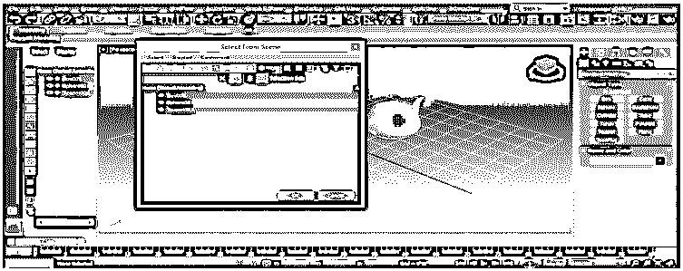

单击对象名称将其选中。

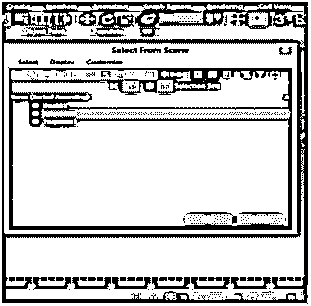

按确定。

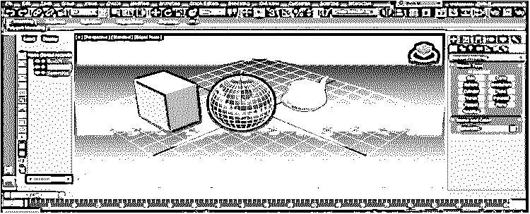

对于下一个快捷方式，我们将单击盒子模型来选择并右键单击它；将打开一个下拉对话框，选择**转换为**选项。点击**转化为可编辑多边形**选项。

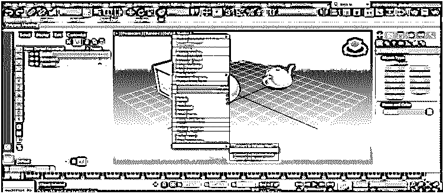

现在我们将在这里看到一些快捷方式。按键盘上的 **1** 可以看到顶点模式。

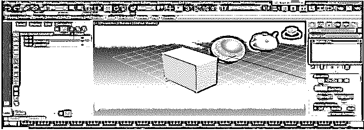

按键盘上的 **2** 进入边缘模式。

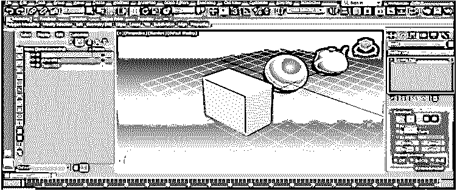

按下键盘上的 **3** 键，显示边框。

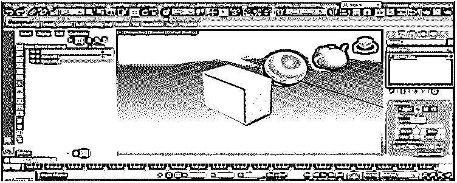

按下键盘上的 **4** 以显示多边形。

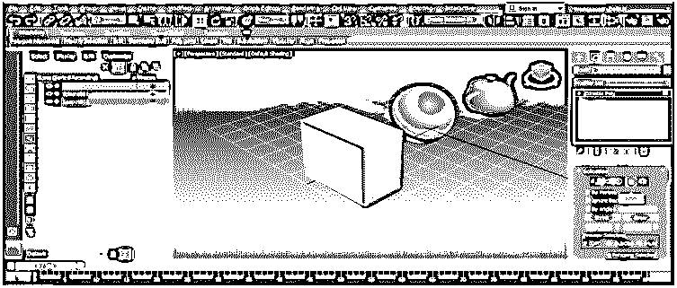

按下元件键盘上的 **5** 。

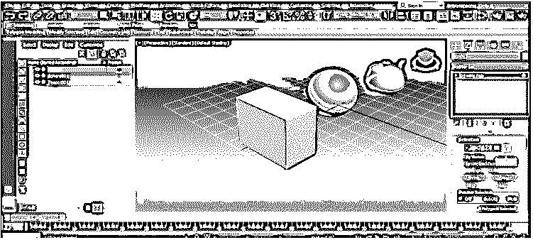

按下键盘上的 **7** ，在 3D max 中查看多边形建模场景中的多边形数。

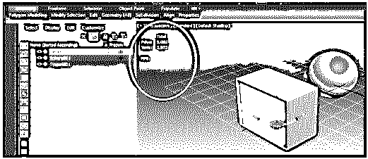

以上这一点的所有快捷方式将有助于我们在多边形建模期间的工作。

*   **环境和效果快捷键:**按键盘上的 **8** 进行环境和效果；我们可以在这里设置任何位图的背景，改变颜色，给一些效果。

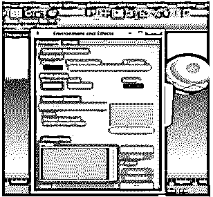

*   在工作区重新定位我们的隐藏对象:当我们绘制的对象不知何故从我们的工作区看不见时，这就成了我们的主要问题。

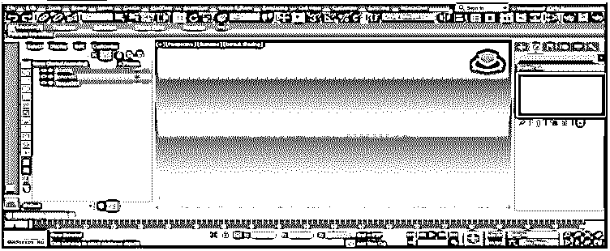

要在屏幕上找到或重新定位我们的对象，只需按键盘上的 **Z** 即可。

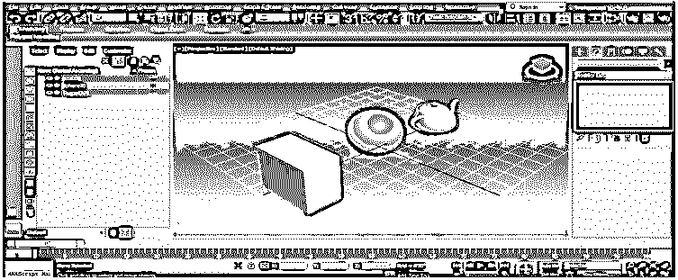

*   **专家模式快捷键:**按键盘上的 **X** 进入专家模式；这样，你可以在你的模型中搜索你所做的任何动作。

*   **隔离模式快捷键:**按键盘上的 **Alt + Q** 激活隔离模式。隔离模式为我们提供了任何单个对象的深度视图。

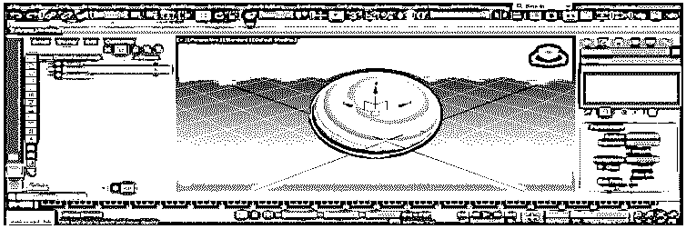

按“退出”按钮，从屏幕右下角的可用按钮中出来。

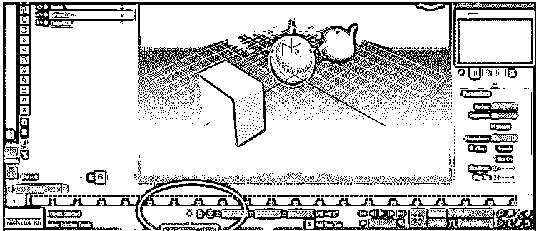

*   **增加和减小坐标符号大小的快捷方式:**按键盘上的 **+** 按钮增加坐标符号的大小。

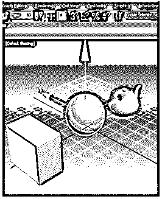

并按下**–**按钮缩小坐标符号。

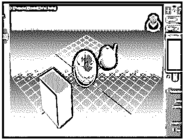

*   **渲染快捷键:**按键盘上的 **Shift + Q** 查看渲染效果。

*   **渲染设置快捷键:**按键盘上的 **F10** ，渲染设置对话框将会打开。

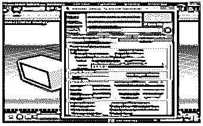

在这里，我们可以根据我们的要求设置一些渲染设置。

*   **素材编辑快捷键:**对于素材编辑按键盘上的**M**；将打开一个对话框或材质编辑器。

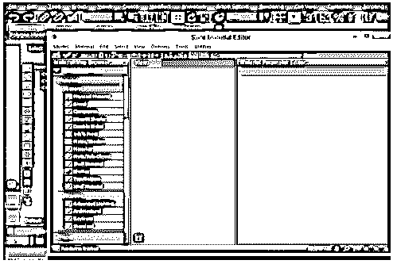

我们可以在这里为我们的对象设置材质，设置对象的颜色和许多其他设置，以给我们的对象一个真实有效的视图。

*   **圆锥体快捷方式:**圆锥体是指用相同的大小和形状制作物体的相同副本。选中对象后，按下键盘上的 **Ctrl + V** 键，将对象锥化。

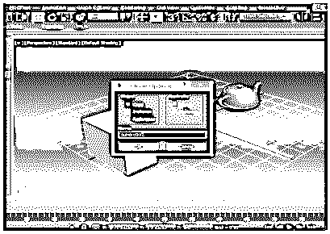

或者您可以简单地点击对象，并通过按住键盘的 shift 键拖动鼠标指针来使该对象变成锥形。

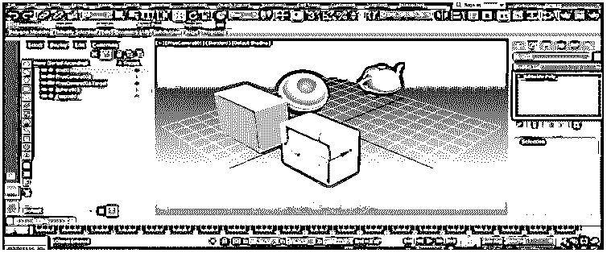

*   **X 射线模式快捷方式:** X 射线模式是指我们可以通过激活该模式来透视物体。透明意味着我们可以看到第二个物体，它在第一个物体的后面。在主动 X 射线模式下，按键盘上的 **Alt + X** 。

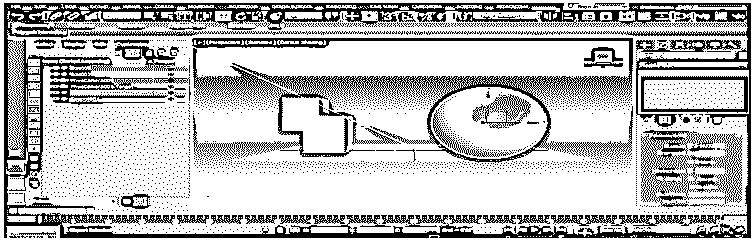

*   **切割工具快捷方式:**下一个快捷方式是多边模式，可通过按键盘上的 2 个按钮激活。按下键盘上的 **Alt + C** 激活剪切工具，在我们的对象中进行任何剪切。

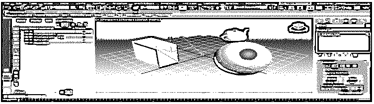

*   **捕捉工具快捷键:**捕捉使建模变得简单。要激活对象的捕捉，请按键盘上的 **S** 。

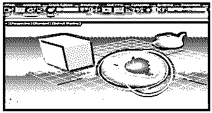

这些都是 3D max 软件中经常使用的快捷方式

### 结论

在看了 3D max 软件的快捷方式后，你会发现在你的项目工作中对你的对象建模有很大的帮助。快捷方式加快了您的工作方式，增强了您对 3D max 软件的专业知识。

### 推荐文章

这是 3D Max 快捷方式指南。在这里，我们讨论 3D Max 快捷方式，它会成为你的加分项，帮助你在你的工作区域建立你的声誉。您也可以阅读以下文章，了解更多信息——

1.  [Photoshop 中的 3D 文本](https://www.educba.com/3d-text-in-photoshop/)
2.  [3D Max 模型](https://www.educba.com/3d-max-models/)
3.  [Adobe Illustrator 工具](https://www.educba.com/adobe-illustrator-tool/)
4.  [在 Illustrator 中移除背景](https://www.educba.com/remove-background-in-illustrator/)

