# 3Ds Max 挤出

> 原文：<https://www.educba.com/3ds-max-extrude/>

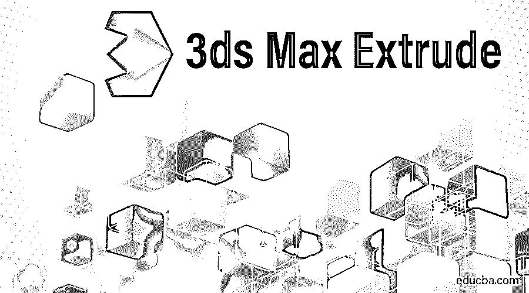

## 3Ds Max 挤出的定义

3Ds Max 是一款专业的 3D 电脑设计软件，用于[创作 3D 动画](https://www.educba.com/animation-in-3ds-max/)，游戏，模型，图像等。并且在视频游戏开发者、电影和电视工作室的工作中起主要作用。挤出是 3ds max 软件中 3D 形状建模的一个非常基本的部分。它是 3Ds max 软件的修改器命令的一部分，在绘制任何 2D 图形后使用，以进行修改。“挤出”修改器主要用于从 2D 图形到对象创建 3D 图形。

### 在 3Ds Max 中学习挤出修改器的步骤

“挤出”修改器给出了模型的真实视图。在这里，您将逐步学习如何在项目中使用“挤出”修改器。让我们以一种非常有趣的方式开始我们的教程。

<small>3D 动画、建模、仿真、游戏开发&其他</small>

*   3Ds max 软件中有四个视口工作在[区域，分别是顶视口、前视口、左视口，最后一个是透视视口。我们可以随时选择其中任何一个来绘制我们的模型。](https://www.educba.com/3ds-max-architecture/)

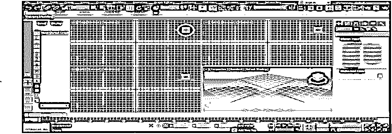

*   我们将在这里绘制一些 2d 形状；对于绘制 2d 形状，我将转到公共面板。

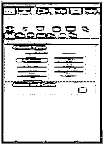

*   单击公共面板中的形状选项卡。

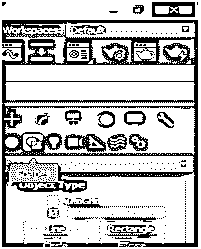

*   我们将从公共面板中选择一些 2d 形状命令来绘制一些基本的 2d 形状。你可以画任何形状供你学习。我们将进入这个视窗的全屏模式，在全屏模式下按键盘上的 **Alt+W** 可以得到更好的视图。

*   现在，我将单击顶视区网格上的任意位置；你可以在网格上或网格外点击以绘制你的 2d 形状，并拖动鼠标指针以根据其参数给出形状的长度和宽度，点击左键离开，点击右键退出命令。

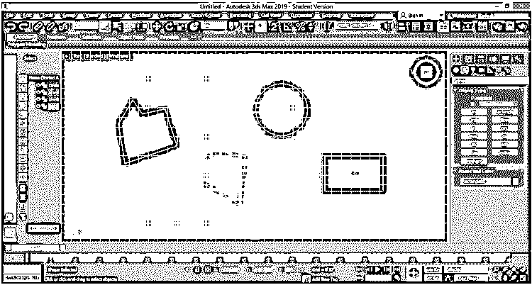

*   我们将在这里看到两种不同类型的挤压，第一种是封闭的 2d 形状，第二种是开放的 2d 形状，正如我在上面的截图中所画的那样。要挤出，请选择要挤出对象。我将一一展示给你看。点击公共面板的修改选项卡按钮。

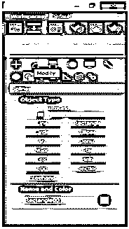

*   我将选择矩形，然后单击公共面板的修改选项卡按钮。单击修改列表选项，将打开一个下拉选项卡。

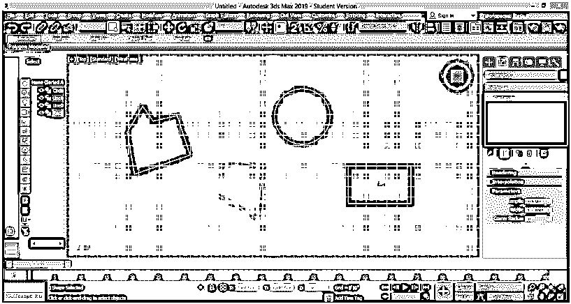

*   在该选项卡中，我们有不同类型的修改命令；挤压指令按键盘上的 **E** 按钮，也可以用鼠标指针向下滚动挤压。单击挤出。

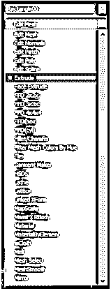

*   您可以在“透视”视口中看到挤出效果。通过按键盘上的 **Alt +W** 进入透视视口，再次按 **Alt + W** 全屏。

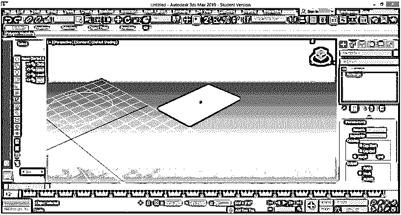

*   在这里的参数部分，我们可以用正数据和负数据给出这个矩形的高度，以给出它的三维形状。要更改数据，您可以手动输入任何数据，或者直接转到您想要更改的数据，单击该数据的小箭头按钮，按住鼠标指针向上拖动以增加数据量，向下拖动以减少数据量。

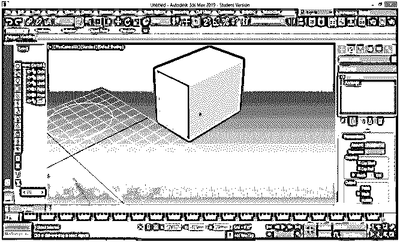

*   我们在参数部分有一个段参数。我们可以在我们的三维形状中给出许多段。线段有助于 3d 形状的建模。对于应用段，更改段框的数据；如果我给 data 5，那么我们的对象中将有 5 个段，要查看对象中的段，请按键盘上的 **F4** 。

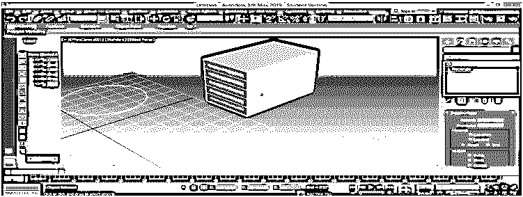

*   或者单击工作形状左上角的默认阴影选项。将会打开一个下拉框。在此选择边面选项表单，查看该对象中的线段。

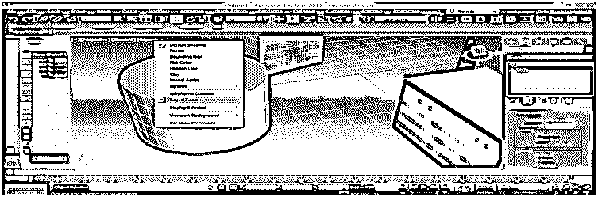

*   同样，您可以按照相同的步骤对其他对象进行挤出。

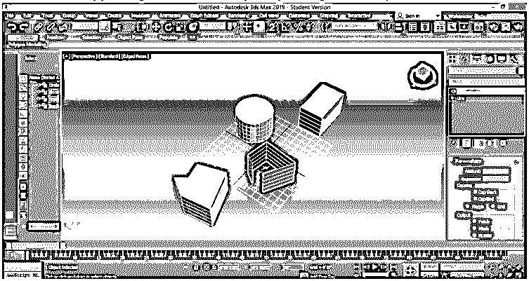

*   这里你可以看到所有封闭的物体都有相同类型的挤出，但是我们只在开放形状的壁上挤出。这是在 2d 封闭和开放形状中使用挤出的主要区别。我们可以从任何对象中移除“挤出”修改器。用于从物体上去除挤出物。选择对象。转到“堆栈”选项的“移动”修改器并点击它来移除。

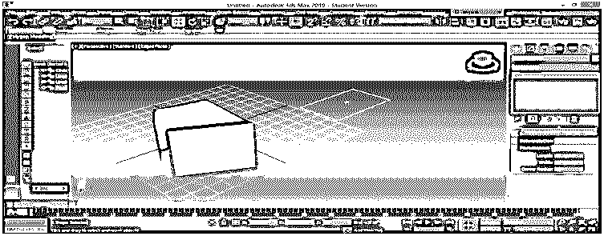

*   在这里，我们可以用相同的参数为其他 2d 形状复制任何 3d 对象的挤出。转到参数部分，并单击用于复制挤出的挤出对象；点击如下图所示的挤压。

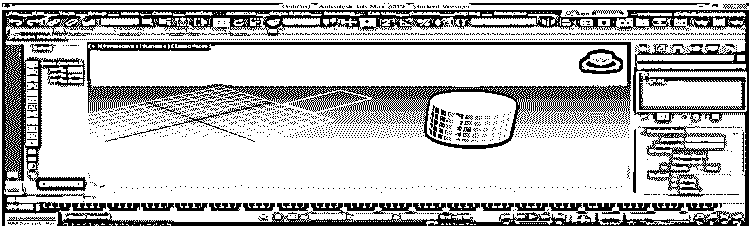

*   现在，通过按住鼠标左键拖动挤出选项，并将其留在要应用相同挤出的 2d 形状上。

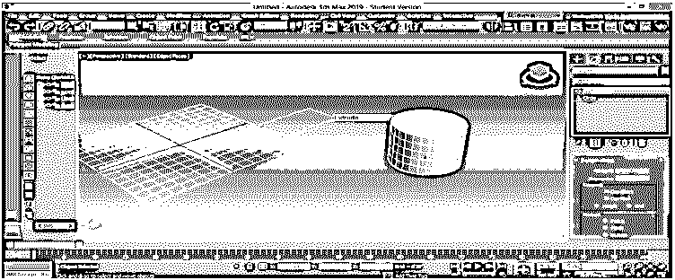

*   现在，该 2d 形状也具有相同参数的相同类型的挤出。

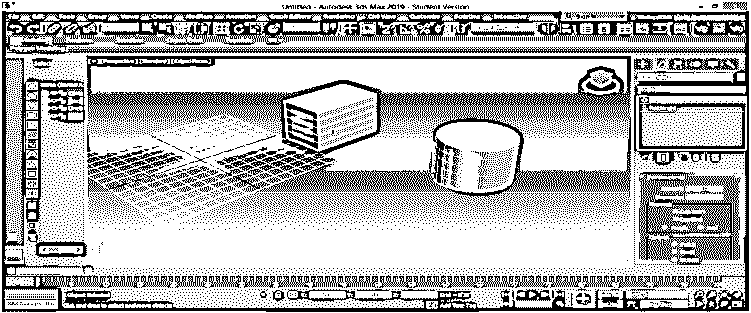

*   在参数部分，我们有一个上限选项。这里有两种类型的参数，封口开始和封口结束。使用“封口开始”选项，我们可以关闭任何 3d 造型的顶部/开始面。取消选中顶部面外的封口开始框，并选中顶部面上的。

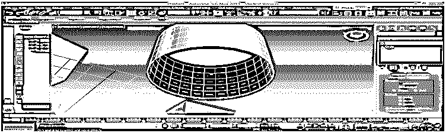

*   通过“封口端”选项，我们可以关闭任何 3d 造型的底面/端面。取消选中底面外的封口端框，并选中底面上的。

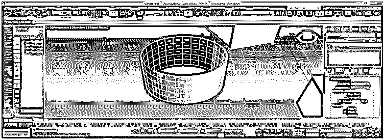

这些是 3d 形状的 3ds max 建模中挤出修改器的基础。可以使用该“挤出”修改器创建不同类型的模型，例如创建房间、吊顶等模型。您很容易理解拉伸是在模型中创建任何 3d 形状的基本命令。

### 结论

在和我一起看了 3Ds max 软件的[的挤压修改器后，你会发现在你的项目工作中，在建模你的对象时有很大的帮助。挤压给你的二维形状一个三维的外观，当你给你的二维形状挤压，它变得越来越有效。了解挤压机修改器后，您将进入 3ds max 中建模区域的下一步。](https://www.educba.com/3ds-max-alternatives/)

### 推荐文章

这是 3Ds Max 挤出的指南。在这里，我们讨论如何挤出修改器主要用于创建三维形状的对象从 2D 形状。您也可以查看我们的其他相关文章，了解更多信息——

1.  [3ds Max 工具](https://www.educba.com/3ds-max-tools/)
2.  [安装 3Ds Max](https://www.educba.com/install-3ds-max/)
3.  [3ds Max 是什么？](https://www.educba.com/what-is-3ds-max/)
4.  [3D Max 模型](https://www.educba.com/3d-max-models/)

