# 3Ds Max 中的纹理

> 原文：<https://www.educba.com/texture-in-3ds-max/>

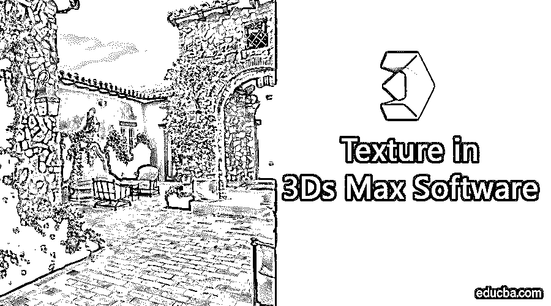

## 3Ds Max 的定义

3Ds Max 是一款专业的 3Ds 电脑设计软件，用于 3Ds 动画、游戏、模型、图像等的制作。并且在视频游戏开发者、电影和电视工作室的工作中起主要作用。3Ds max 中的纹理是[建模](https://www.educba.com/3d-modeling-software/)工作中有趣的一部分。纹理赋予我们项目的任何模型一种外观，就像我们在日常生活中看到的物体一样，如桌子纹理、石头纹理等。您可以根据项目中的需求选择任何类型的纹理。纹理为模型提供了非常逼真的外观，并且很容易与现实生活中的对象相协调。在本主题中，我们将学习 3Ds Max 中的纹理。

### 3Ds Max 中如何设置单位？

首先，我们会根据我们的要求设置单位。要设置单位，请点击右上角的自定义按钮。

<small>3D 动画、建模、仿真、游戏开发&其他</small>

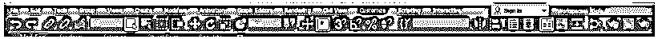

并点击单位设置选项。

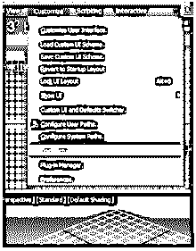

将打开一个对话框；设置单位有两种选择。

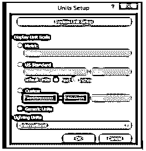

设置单位的公制单位为米、厘米等。

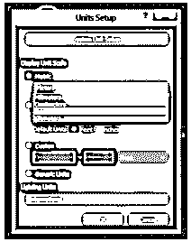

另一个是以英尺和英寸为单位的美国标准。

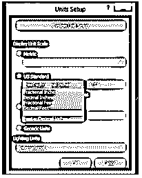

这里我们有一个系统单元步骤选项；我们通常以英寸为单位，因为当我们在或项目中导入任何其他模型时，导入模型的单位不会发生变化。现在按 Ok 来设置单位。

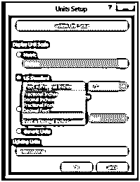

### 如何在 3Ds Max 中应用纹理？

在这里，我们将了解 3Ds max 中的纹理。对于纹理，我们将遵循一些步骤。让我们以一种非常简单的学习方式开始你的教程。

在我们开始纹理步骤之前，从网上下载一些纹理图案到你的电脑上，或者如果你的电脑上已经有了这些图案就更好了。您可以下载任意多的应用于您的模型。

*   3Ds max 中有四个视口工作区:顶视口、前视口、左视口，最后一个是透视视口。我们可以随时选择其中任何一个来绘制我们的模型。

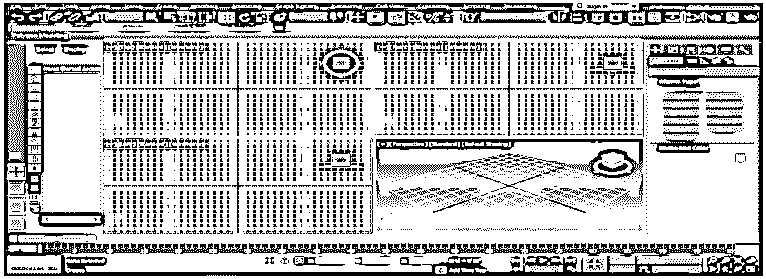

*   在本教程中，我将在透视视口中绘制一些对象，如长方体和平面；你可以根据你的需要在任何视窗中绘制它。现在，我将通过按下键盘上的 **Alt+W** 按钮，在全屏模式下创建一个透视视口。

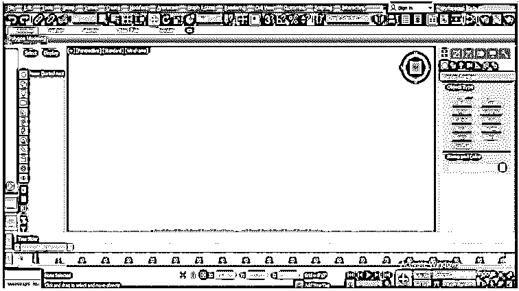

*   现在，我将转到公共面板。

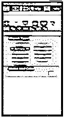

*   单击创建选项卡。

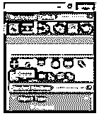

*   单击公共面板的标准基本选项。

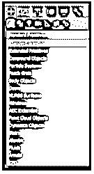

*   单击公共面板的“盒子”选项卡，使用“盒子”命令。

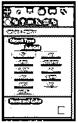

*   我将点击网格上的任何地方；你可以在网格上或网格外点击来绘制你的对象，拖动鼠标指针给出盒子的长度和宽度，左键点击离开，然后向上拖动鼠标指针给出盒子的高度，右键点击退出命令。

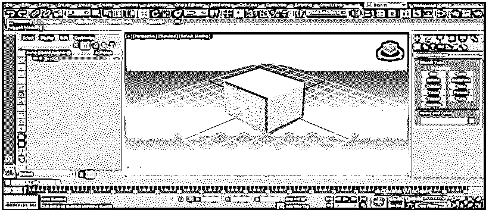

*   再次转到公共面板，从这里通过点击平面选项卡使用平面命令。

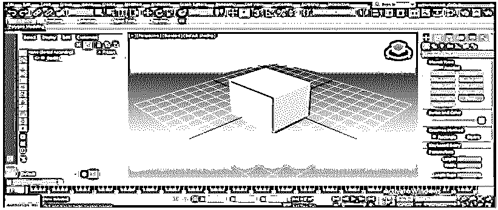

*   单击我们在上一步中绘制的框所在区域的任意位置，并拖动鼠标指针以给出平面的长度和宽度。

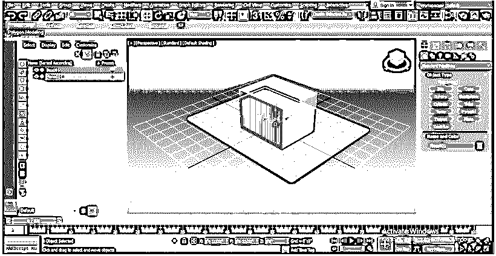

*   按键盘上的 M 键进入材质编辑器，或单击材质编辑器选项，选择平面后，该选项出现在工作区的右上角。

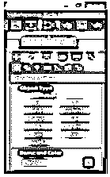

*   将打开一个材料编辑器对话框；从这里选择精简材质编辑器。

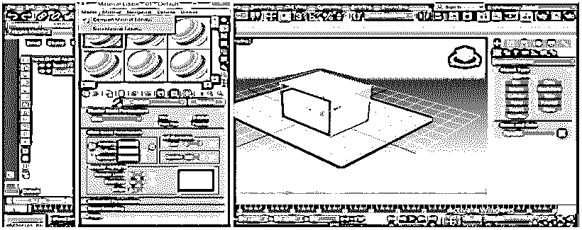

*   选择要在其中显示材质纹理的材质圆，该材质圆将从计算机文件夹中选择。

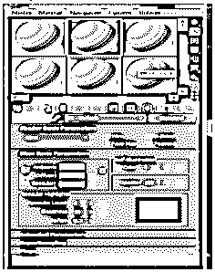

*   点击漫射选项，在打开的对话框中双击选择位图。

*   再次打开一个新的对话框，名为“选择位图图像文件”,转到你计算机中保存纹理图案的文件夹，从这里选择一个你想应用到你的平面中的纹理，点击它。

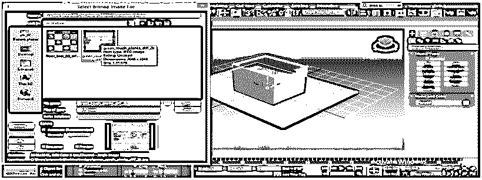

*   当你选择了纹理，它会显示在方框区域；如果没有显示，请勾选预览的勾号。点击“打开”选项卡，在“材质圆圈”框中查看该纹理。

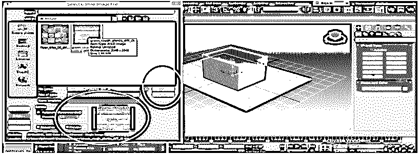

*   我们再次选择另一个纹理，在材质编辑框中点击选择另一个圆。

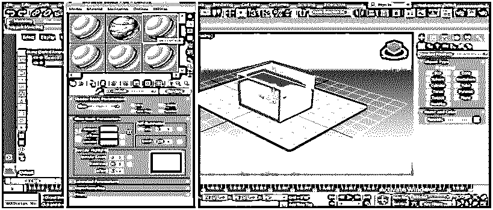

*   单击材质/贴图浏览器框的位图。

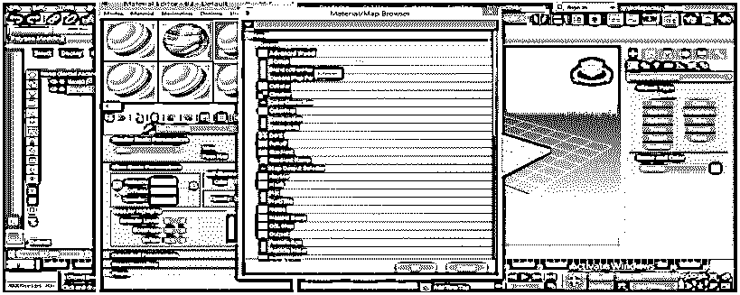

*   再次进入你电脑的纹理文件夹，选择一个不同于之前纹理的纹理来选择，所以只需点击它。

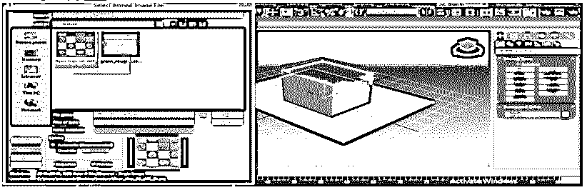

*   我们可以在盒子上给定的区域看到预览；很好看，给人木头的感觉。你可以给你的物体任何你喜欢的纹理。在这里，我给你一个例子，再次点击打开标签。

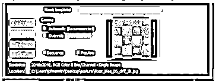

*   我们可以在材质编辑器框的选定圆中再次看到这个纹理。

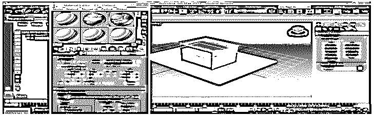

*   现在我们将把这些纹理一个一个地应用到我们的物体上。要应用，选择平面，通过单击选择第一个纹理。

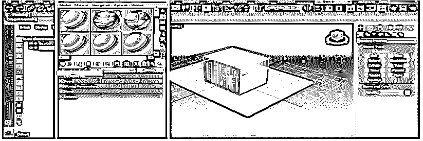

*   点击“材质编辑器”框的“将材质指定给选择”选项卡，将该纹理指定给所选对象。

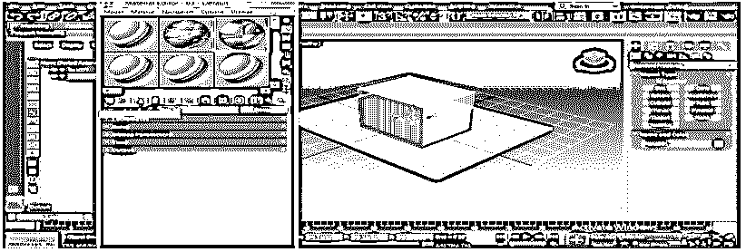

*   单击“视口”选项卡中的“显示着色材质”来查看我们所选对象中的纹理。

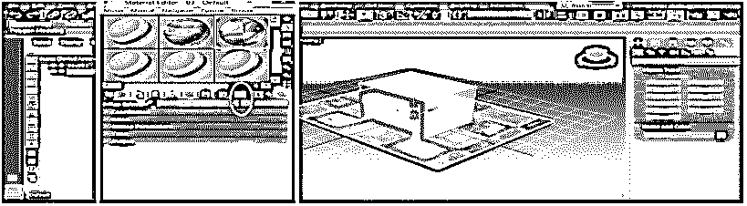

*   看起来像地板图案。

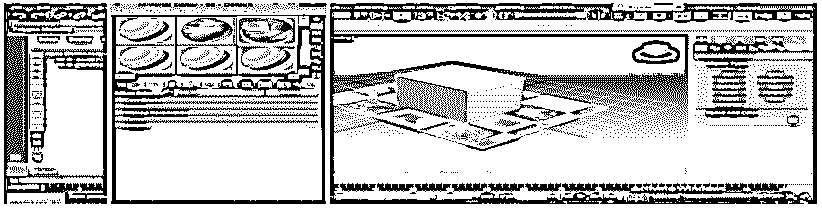

*   现在我们将纹理应用到盒子上。申请时，请点击选择框，点击下一个纹理的圆圈选择第二个纹理材料。

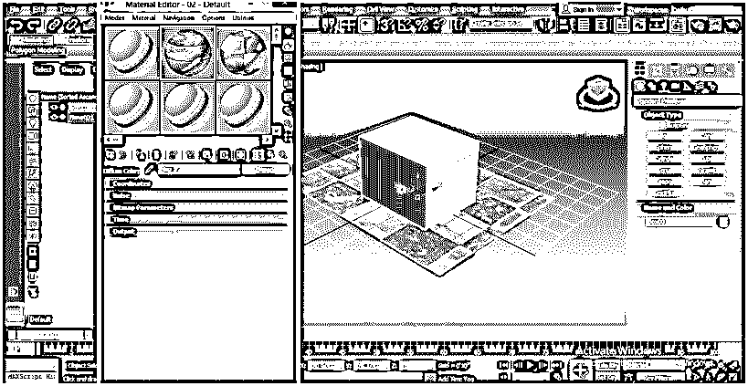

*   再次点击“材质编辑器”框的“选择”选项卡中的“指定材质”,将该纹理指定给选定的对象。

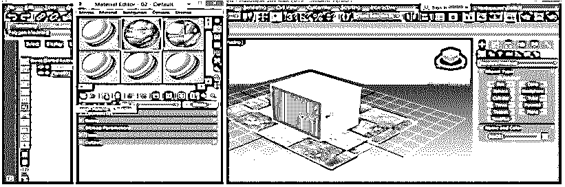

*   单击“视口”选项卡中的“显示着色材质”来查看我们所选对象中的纹理。

*   这是我们最后的盒子和平面的纹理对象。

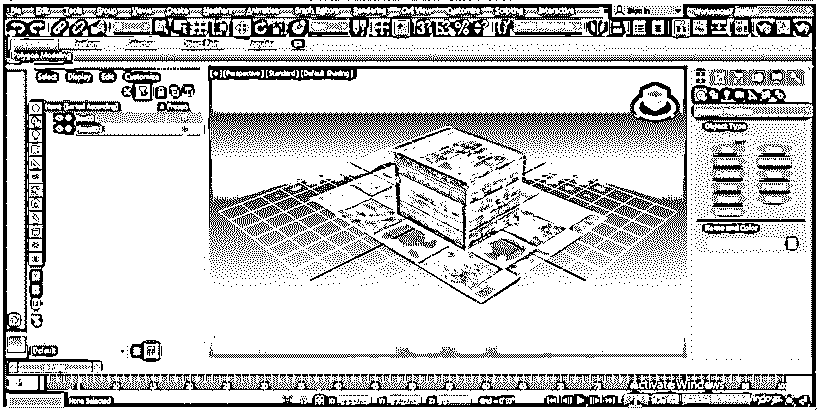

### 结论

在本教程中，你可以很容易地给你的物体添加任何类型的纹理，并使它对观众来说非常逼真。当您了解 3Ds max 中不同类型的纹理时，您将在您的工作领域中获得加分，并使您的模型比以前更有效。

### 推荐文章

这是 3Ds Max 中的纹理指南。这里我们讨论如何在 3Ds max 中给出纹理，以及如何在 3D Max 中设置单位。您也可以看看以下文章，了解更多信息–

1.  [十大免费 3D 软件设计](https://www.educba.com/3d-software-design/)
2.  [在 3D Max 模型中设置单位](https://www.educba.com/3d-max-models/)
3.  [3Ds Max 工具概述](https://www.educba.com/3ds-max-tools/)
4.  [如何安装 Adobe Illustrator？](https://www.educba.com/install-adobe-illustrator/)
5.  [3ds Max 替代品](https://www.educba.com/3ds-max-alternatives/)
6.  [动画原理](https://www.educba.com/principles-of-animation/)
7.  [Flash 中的动画](https://www.educba.com/animation-in-flash/)
8.  [3ds Max 架构](https://www.educba.com/3ds-max-architecture/)
9.  [安装 Adobe Creative Cloud](https://www.educba.com/install-adobe-creative-cloud/)
10.  [3ds Max 室内设计|如何创作？](https://www.educba.com/3ds-max-interior-design/)
11.  [如何在 Illustrator 中添加纹理？](https://www.educba.com/how-to-add-texture-in-illustrator/)

