# 3ds Max 块

> 原文：<https://www.educba.com/3ds-max-blocks/>

## 3ds Max 块简介

3ds Max 是设计 3d 模型的软件，在 3d 建模图形专业人员中最受欢迎。我们可以在这个软件中导入不同类型的预设计三维模型，使我们的工作变得容易。块是不同类型 3d 模型，您可以从互联网上下载，然后将其导入到 3ds Max 软件的项目工作中，以节省您的时间。在本文中，我们将了解如何从互联网下载 3d 模型块，以及如何将它们与它们的整个资源一起导入 3ds max 软件。因此，让我们通过一个例子来了解 3ds Max 中的 Block，并分析一些正确导入模型的参数。

### 3ds Max 中如何使用块？

在 3ds Max 软件中使用块并不是一件非常困难的事情。简单几步我们就能理解，没有任何问题。我们先从网上下载一个模型，我们可以称之为 block。

<small>3D 动画、建模、仿真、游戏开发&其他</small>

**第一步:**我将在 Goggle 搜索框中搜索“3ds Max Table file ”,并通过此网站和任何其他网站下载此块。这里有许多家具清单，你可以从中任意选择。我将点击列表中的“椅子、桌子、沙发”选项。从给定的模型中选择一个您想要在项目工作中使用的模型。

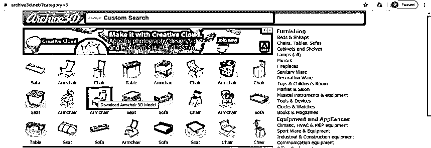

**第二步:**一旦你点击任何模型，这种下载模型的页面就会打开。点击下载按钮，你的下载将在几秒钟后开始。

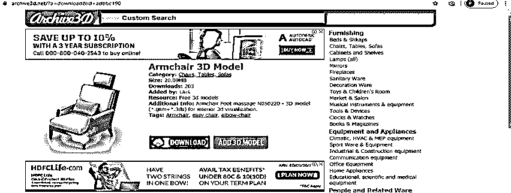

**第三步:**完成后，您选择的块的 zip 文件将被下载。解压此 zip 文件以获取扶手椅的此下载文件的所有文件夹。

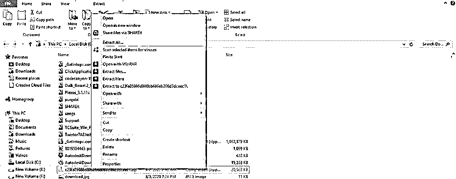

**第四步:**现在打开 3ds max 软件，进入菜单栏的‘文件’菜单，它位于工作屏幕的顶部。将会打开一个下拉列表。转到此列表的导入选项。在导入选项中，我们有两种方法可以导入任何文件，第一种是导入，第二种是合并。如果您选取“导入”选项，则项目中以前导入的所有文件都将被替换为新导入的文件；如果您选取“合并”选项，则新导入的文件将与以前的文件合并，而不会损坏它们。

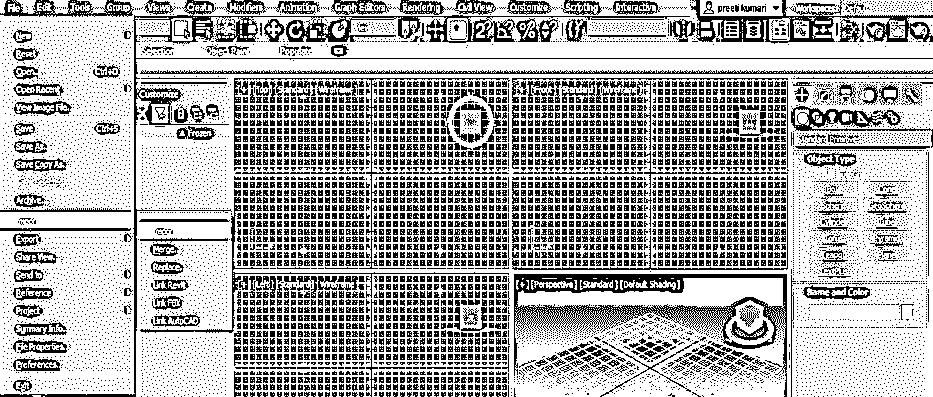

**步骤 5:** 因此，我将单击导入文件，在此处导入我的块文件。

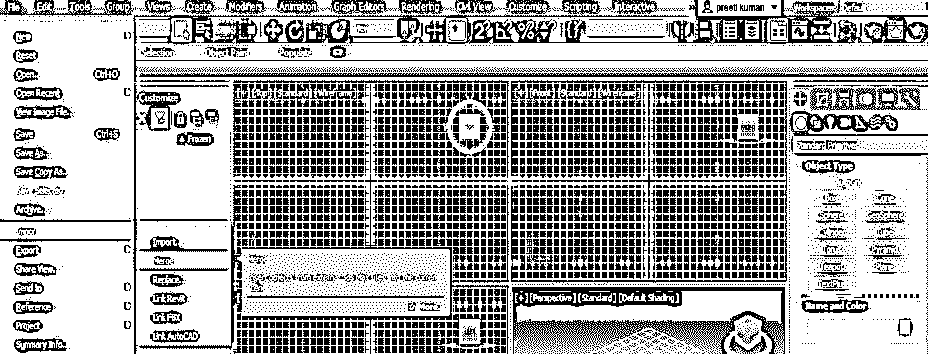

**第六步:**合并文件的对话框将被打开。现在打开保存您下载的模型文件的文件夹，从该文件夹中选择模型文件，然后单击对话框的 open 按钮。

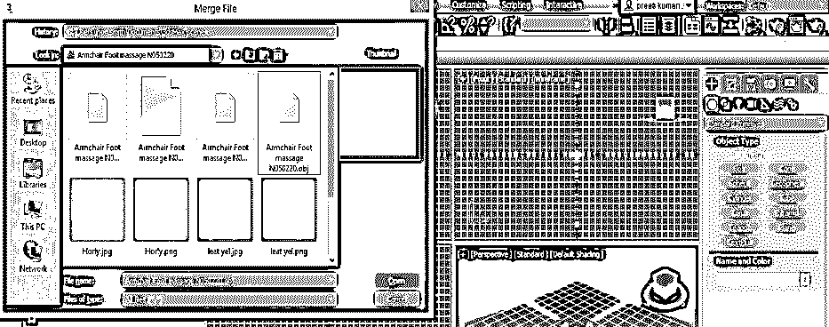

**第 7 步:**一旦你点击打开按钮，一个确认你想要合并这个文件的消息框将会打开。点击那个框的是按钮，你的模型就会像这样导入到这个软件里。

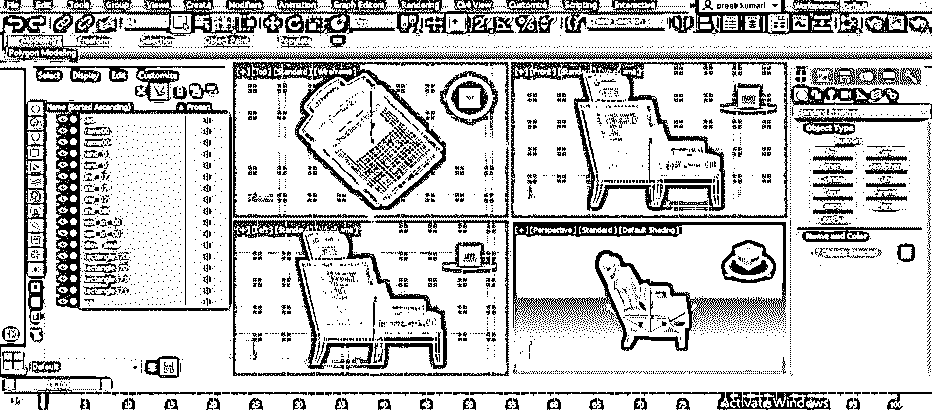

**第 8 步:**如果导入的模型规模非常大，那么根据您的项目工作需要的规模对其进行缩放。对于缩放，它转到工具面板的缩放工具，该工具位于该软件工作屏幕的顶部。

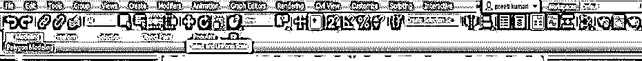

**第九步:**现在点击你的模型比例手柄的内三角，根据你的情况缩小模型的尺寸。

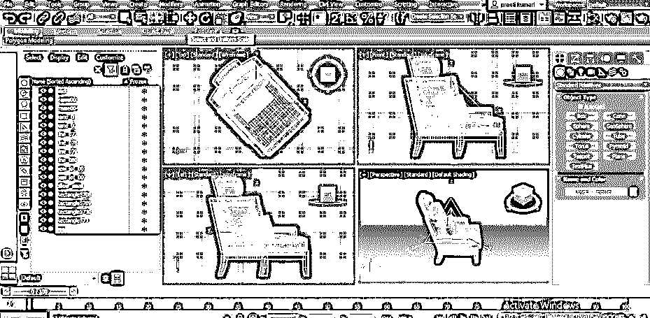

**第十步:**不要从任何人的方向箭头手柄缩小尺寸；否则，模型尺寸将仅从一个方向减小。例如，如果我单击 Z 箭头手柄并从 Z 箭头减小尺寸，那么模型尺寸将仅从 Z 方向减小，这将使模型的形状变形。

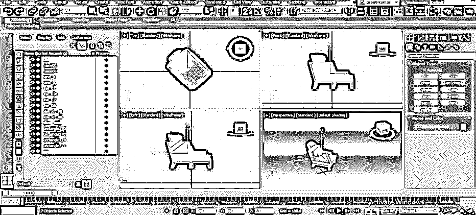

**第十一步:**现在，你可以看到这个模型和我们从网上下载的不一样，因为扶手椅的纹理不见了。因为在合并过程中没有正确导入纹理文件，所以它丢失了。

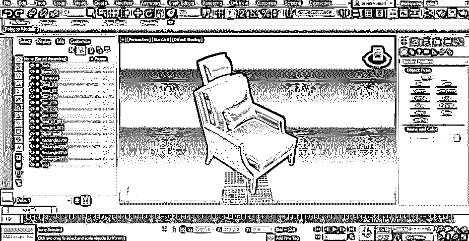

第 12 步:要添加这些文件，请点击该软件右上方的渲染设置按钮。一旦你点击这个按钮，一个渲染设置框将被打开。点击这个框的渲染按钮，当你点击它时，一个丢失的地图文件对话框将被打开，用于添加丢失的文件。

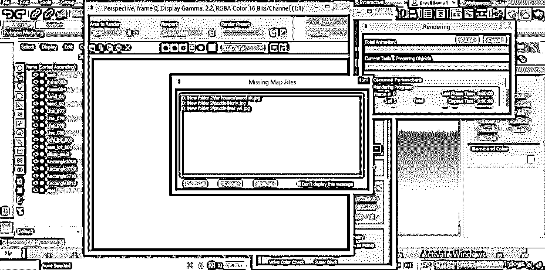

**步骤 13:** 现在点击该对话框的浏览按钮，打开路径文件框。

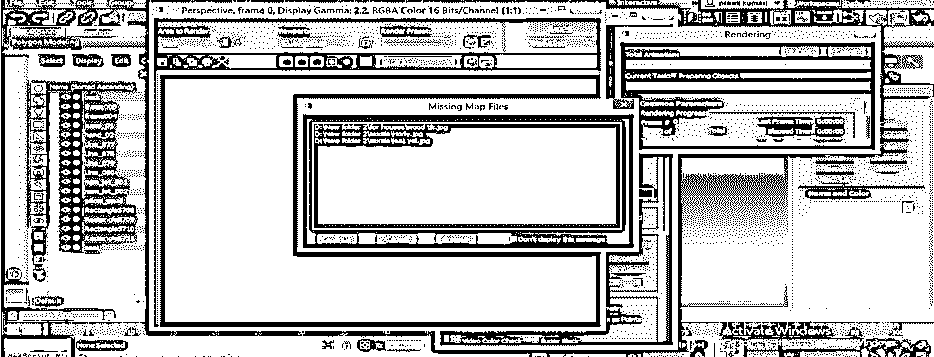

**第 14 步:**点击此对话框的浏览按钮后。添加文件路径框将被打开，名为“配置外部文件路径”。单击此对话框的添加按钮。

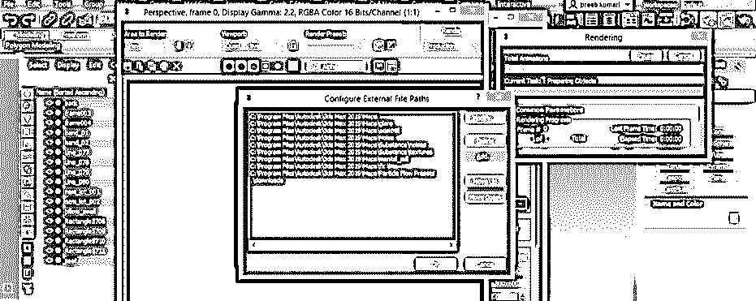

**步骤 15:** 点击该对话框的添加按钮，将会打开一个新的对话框，名为“选择新的外部文件路径”。打开保存模型下载文件的文件夹，从那里选择纹理文件。一旦你选择了纹理文件，点击新建对话框的使用路径按钮。

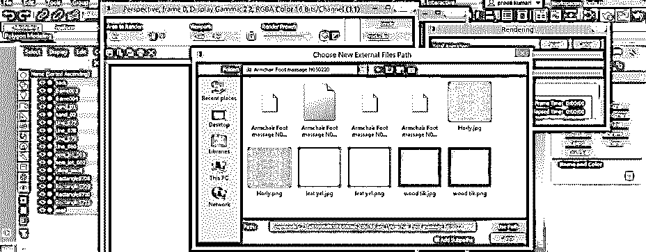

**步骤 16:** 纹理文件的路径将被添加到“配置外部文件路径”框中。现在点击该对话框的确定按钮，为该块分配该块或模型的纹理路径。

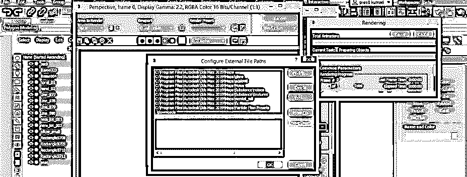

**步骤 17:** 当您点击该框的确定按钮时，您将返回缺失地图文件对话框屏幕。现在点击这个丢失地图文件对话框的继续按钮。

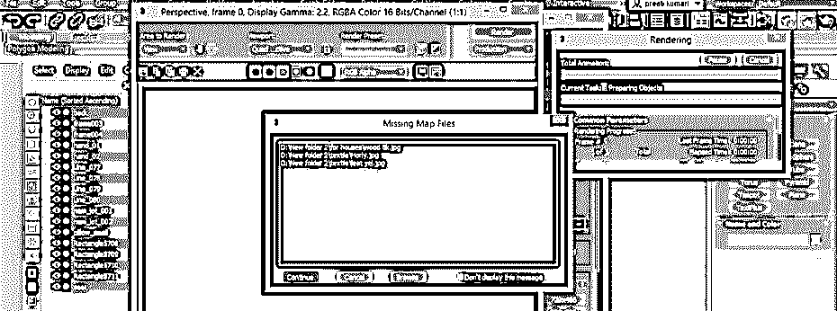

**步骤 18:** 现在，你可以在渲染框中看到你的模型的纹理和其他资产，和我们下载的块一样。

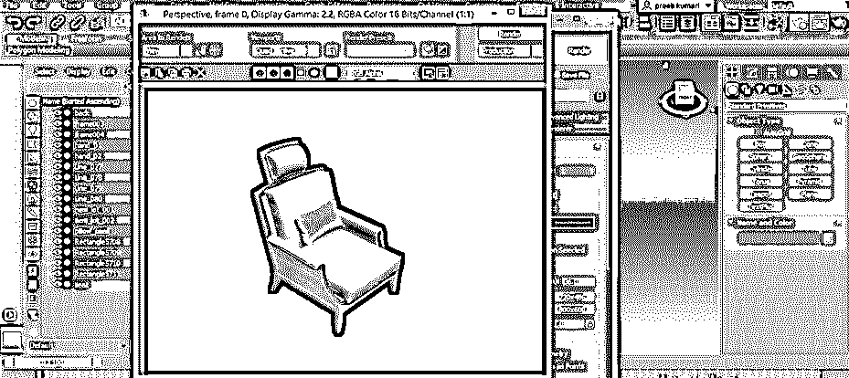

这样，您可以按照相同的步骤在 3ds max 软件中使用任何类型的块，如家具模型、树模型、汽车模型和许多其他类型的模型，并利用它们来节省时间。

### 结论

现在，通读本文后，您可以理解“3ds max 软件环境中的块是什么”以及“如何在 3ds max 的项目工作中使用块来获得最佳工作结果”。您可以在一个项目工作中使用多个模型，并根据您的需求来管理它们。

### 推荐文章

这是 3ds Max 块的指南。在这里，我们讨论介绍，如何在 3ds max 中一步一步地使用块。您也可以浏览我们的其他相关文章，了解更多信息——

1.  [3ds Max 室内设计](https://www.educba.com/3ds-max-interior-design/)
2.  [3Ds Max 挤出](https://www.educba.com/3ds-max-extrude/)
3.  [3ds Max 插件](https://www.educba.com/3ds-max-plugins/)
4.  [3ds Max 架构](https://www.educba.com/3ds-max-architecture/)

