# 3ds Max 放样

> 原文：<https://www.educba.com/3ds-max-loft/>

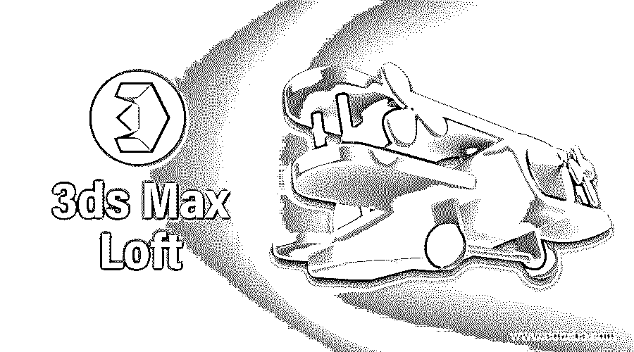

## 3ds Max 放样简介

3ds Max 是由 Autodesk 开发的 3d 建模软件，由不同的建模专业人员用于他们的专业工作。在这个软件中，我们有一个不同类型的 3d 建模设计命令。放样是帮助我们制作任何特定对象的 3d 形状的命令之一。它可以是任何瓶子形状、圆柱形物体、矩形物体以及许多其他形状。本文将了解 3ds max 软件的 Loft 命令，并学习如何使用该命令处理其参数来制作 3d 对象。所以让我们从一个例子开始我们的学习。

### 如何在 3ds Max 中使用 Loft 命令？

放样类似于这个软件的另一个命令，但是你可以用这个命令制作任何 3d 物体。这里我们将通过一个 3d 瓶子模型的例子来理解它。在开始学习之前，让我们快速浏览一下这个软件的工作界面，以便更好地理解本文。

<small>3D 动画、建模、仿真、游戏开发&其他</small>

**第一步:**在 3ds max 软件的顶部，我们有两个主功能区，分别是菜单栏和不同的命令栏；下面是主屏幕，它分为四个视口，即顶视口、前视口、左视口和透视视口。在这个视口旁边，工作屏幕右侧有控制面板，它有不同类型的工具和命令，使我们在这个软件中的工作变得容易。在这个软件屏幕的按钮端，我们有时间轴帧面板，用于制作这个软件中任何对象的动画。

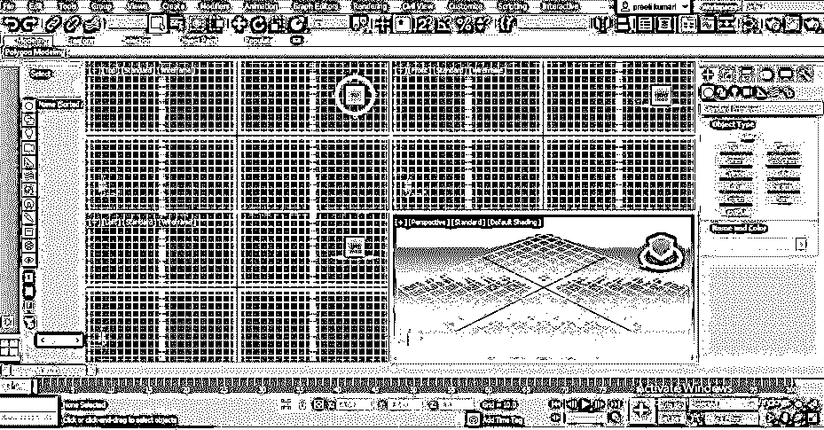

**步骤 2:** 现在转到控制面板，它位于该软件工作屏幕的左侧，点击该面板的创建选项卡。

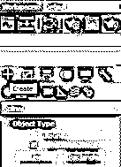

**步骤 3:** 现在点击这个面板的创建标签的形状标签。

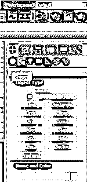

**步骤 4:** 现在，通过点击 2d 形状捕捉切换选项卡的图标，使 2d 形状捕捉打开，该选项卡位于该软件的第二个顶部功能区，用于制作直线，然后点击该软件的控制面板部分中的线条命令选项卡。

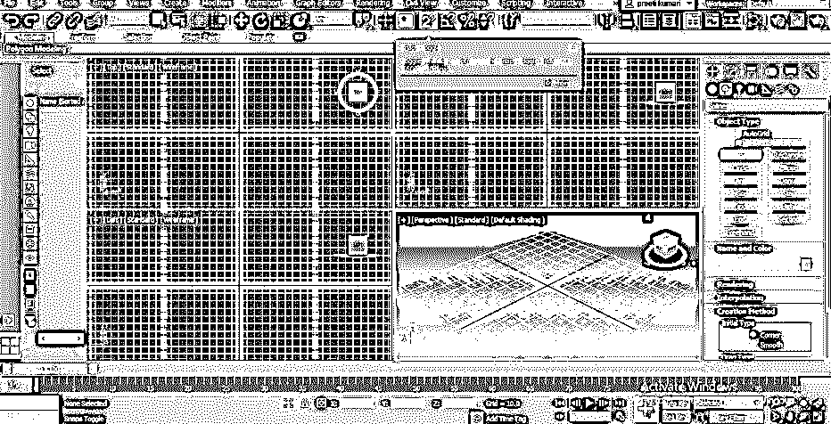

**第五步:**现在，为我们的学习做一条任意维度的线。您可以在任何视窗中创建它；我会把它放在视窗前面。一旦你做了线，从键盘上按 Esc 键离开这条线命令。

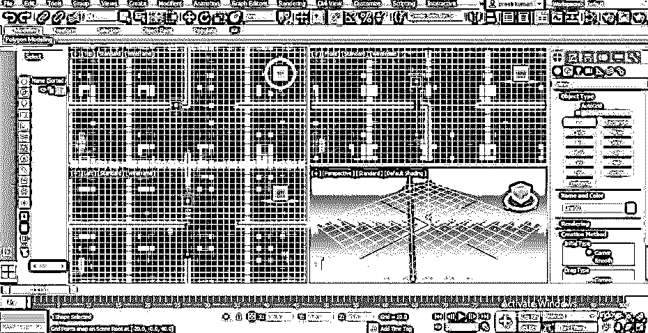

第六步:现在点击控制面板的形状标签的椭圆命令，在软件的前视图中画一个椭圆，就像这样。

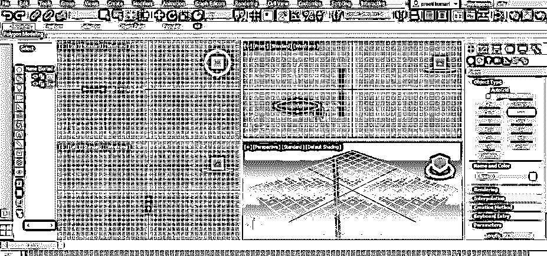

**第七步:**现在，从这个软件的控制面板的形状选项卡中取圆形命令，在椭圆内部画一个圆，就像这样。

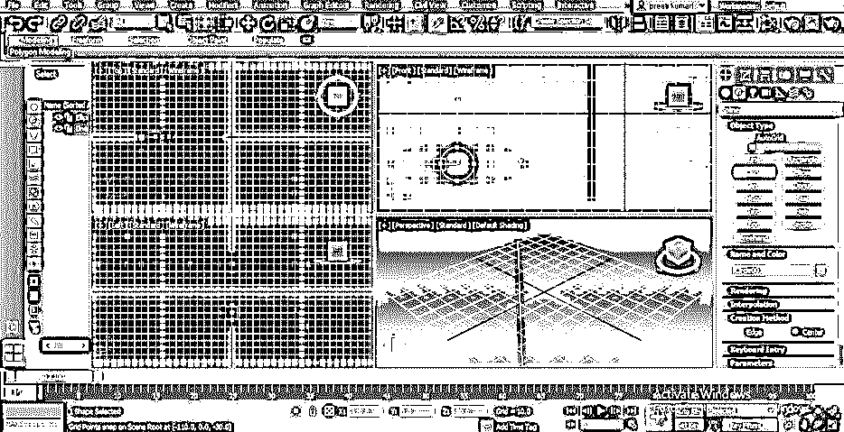

**步骤 8:** 现在点击控制面板的创建选项卡的几何选项卡。

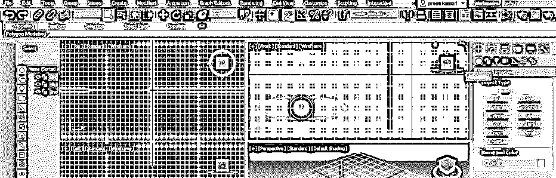

**步骤 9:** 现在点击几何图形选项卡的标准图元选项的下拉箭头按钮，并点击它从下拉列表中选择复合对象选项。

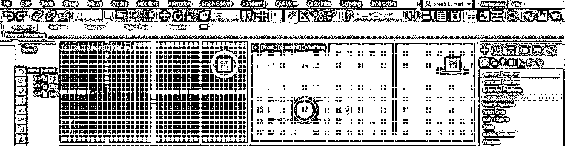

**步骤 10:** 现在点击复合对象选项的放样命令。该放样命令的参数将在这些命令部分下面打开。

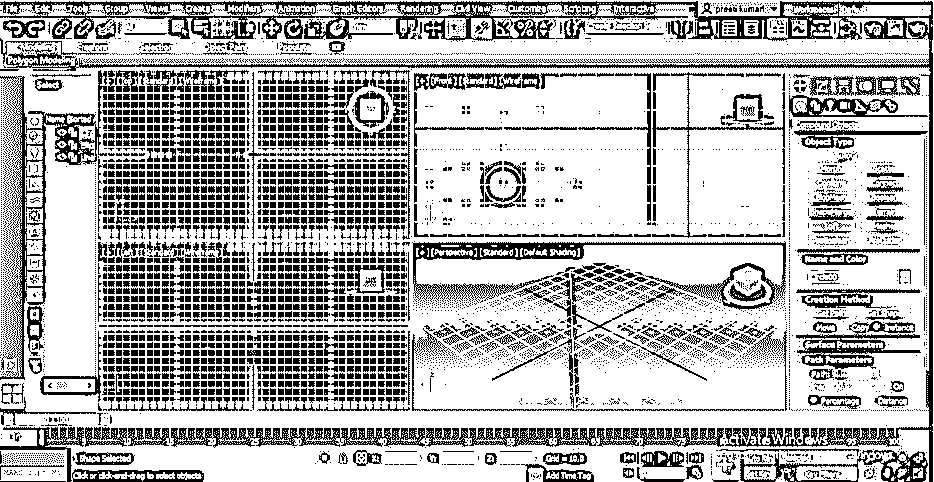

**步骤 11:** 现在点击前视口部分中的线条形状，并点击放样命令参数的获取形状选项卡。

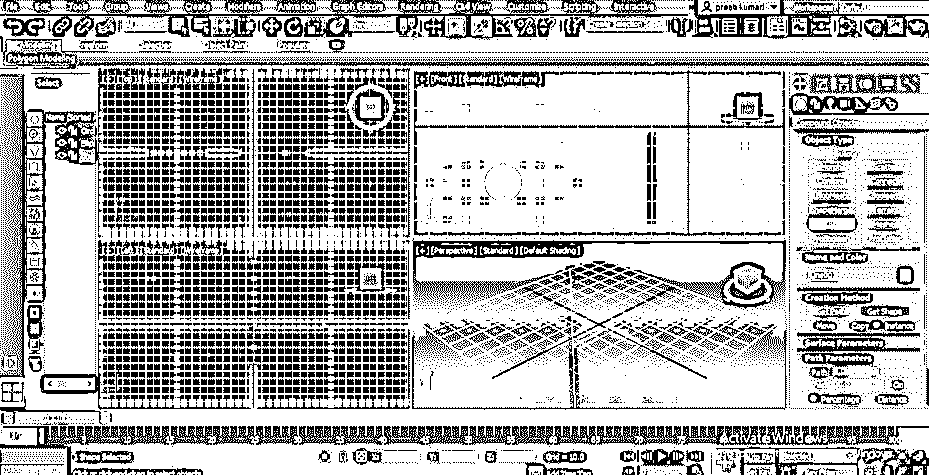

**步骤 12:** 用鼠标键点击前视区中的椭圆形状。这里椭圆作为线条形状的引导形状。

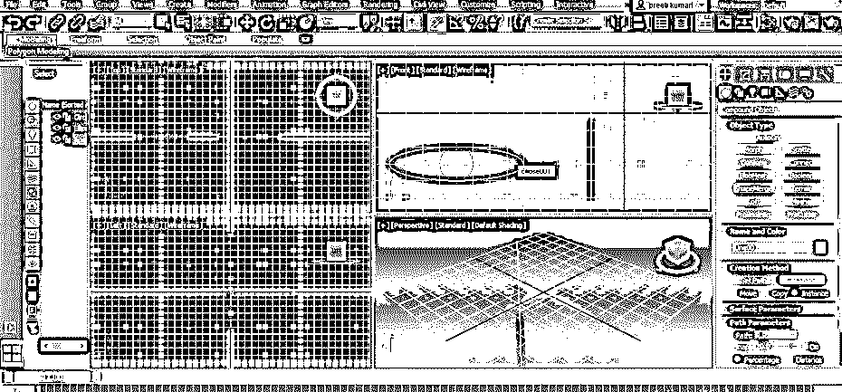

**步骤 13:** 一旦你点击椭圆形状，一个类似瓶子的结构将会围绕着线的形状形成，就像这样。

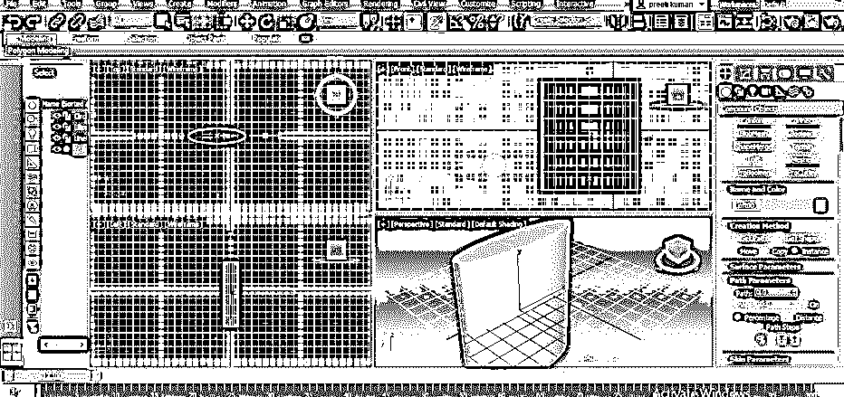

**步骤 14:** 现在，让我们将这个 3d 形状的路径百分比值增加 10 %。

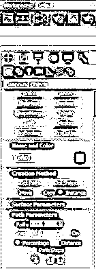

**步骤 15:** 然后再次点击放样命令参数的获取形状选项卡，并点击前视口部分的椭圆形状。

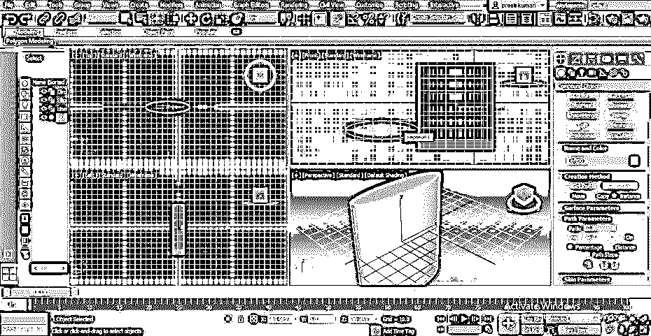

**第 16 步:**再次将路径选项的值依次增加 40%、60 %、80 %，这样我们就可以做出这个 3d 形状的瓶状结构了。

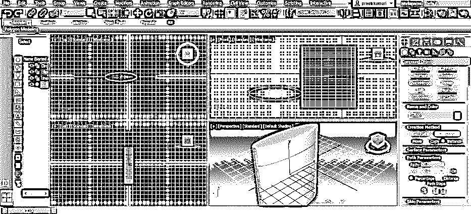

**步骤 17:** 现在将圆形的路径值也设为 80 %，点击放样命令的获取形状选项卡，然后点击椭圆工具内的圆形。

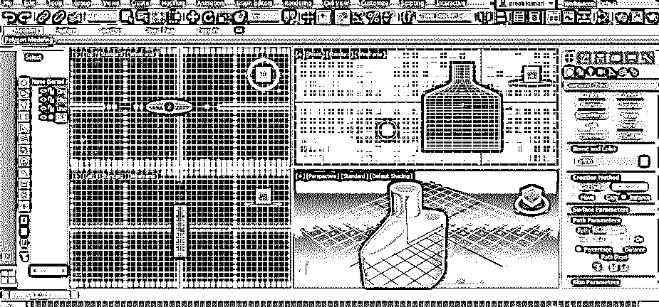

**步骤 18:** 你可以在这个 3d 形状中进行修改。要进行修改，请单击控制面板中创建选项卡旁边的控制面板的修改选项卡。

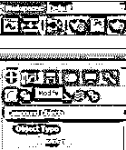

**步骤 19:** 现在点击修改选项卡中放样选项的小箭头图标。

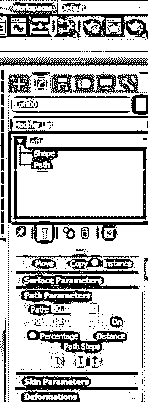

**步骤 20:** 现在点击这个放样修改选项的形状选项，然后点击工作屏幕顶部的移动选项卡。现在你可以通过移动这三个方向的箭头，从 X，Y，Z 方向的顶点移动这个瓶子的形状。

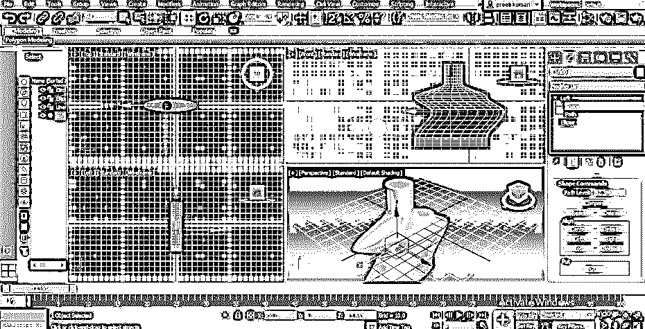

**步骤 21:** 你可以给这个形状添加更多的顶点。我们在当前形状中有两个顶点，它们位于这个 3d 形状的线条形状的两端。要添加更多的顶点，单击放样修改选项的路径选项。

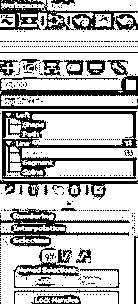

**步骤 22:** 现在点击这个路径选项的直线选项上的小箭头图标，点击顶点选项。现在转到这个顶点选项的参数部分，搜索插入选项卡。单击此插入选项卡。

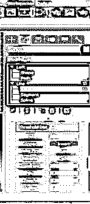

第 23 步:进入前视口，点击你想要在这个形状中添加一个顶点的地方，然后根据你的需要移动这个顶点。

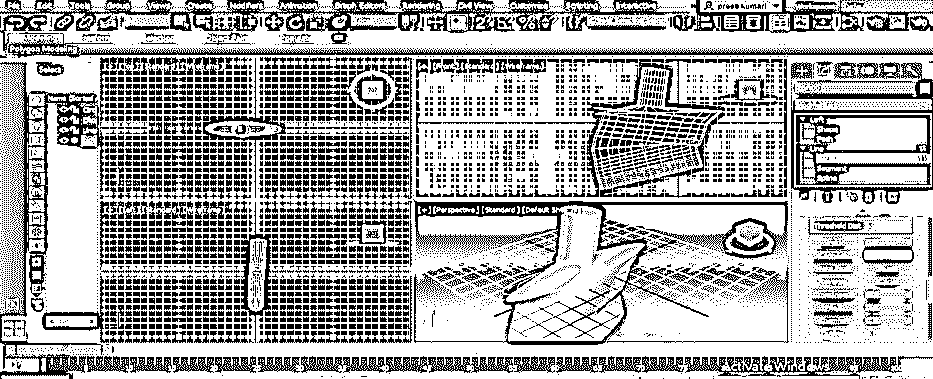

**步骤 24:** 你可以在这个瓶子形状上平滑掉这个顶点做出的褶皱。右键单击此顶点；将打开一个下拉列表；现在点击下拉列表中的平滑选项。

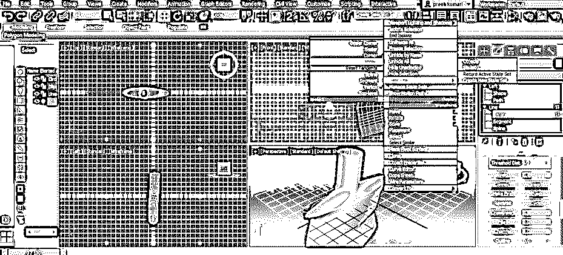

步骤 25: 一旦你点击这个平滑选项，你将在顶点得到这种平滑的形状。

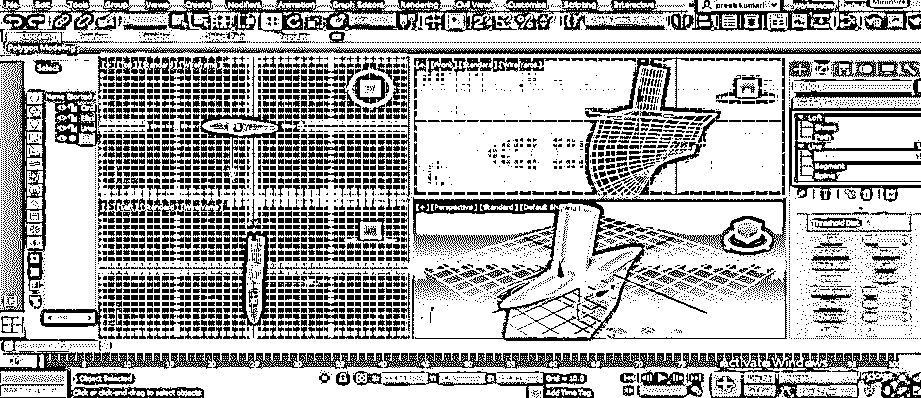

### 结论

现在，通过这篇文章，你可以理解什么是 3ds Max 软件中的放样，以及如何在这个软件中处理这个命令的参数。一旦你很好的掌握了 3ds max 软件的 loft 命令，你就可以很容易的使用这个命令来制作不同类型的 3d 模型。

### 推荐文章

这是 3ds Max 放样指南。在这里，我们讨论介绍并以循序渐进的方式轻松使用 3ds Max 放样。您也可以浏览我们的其他相关文章，了解更多信息——

1.  [3Ds Max 挤出](https://www.educba.com/3ds-max-extrude/)
2.  [3ds Max 中的索具](https://www.educba.com/rigging-in-3ds-max/)
3.  [3ds Max 中的样条线](https://www.educba.com/spline-in-3ds-max/)
4.  [3Ds Max 中的纹理](https://www.educba.com/texture-in-3ds-max/)

