# 3ds Max 室内设计

> 原文：<https://www.educba.com/3ds-max-interior-design/>

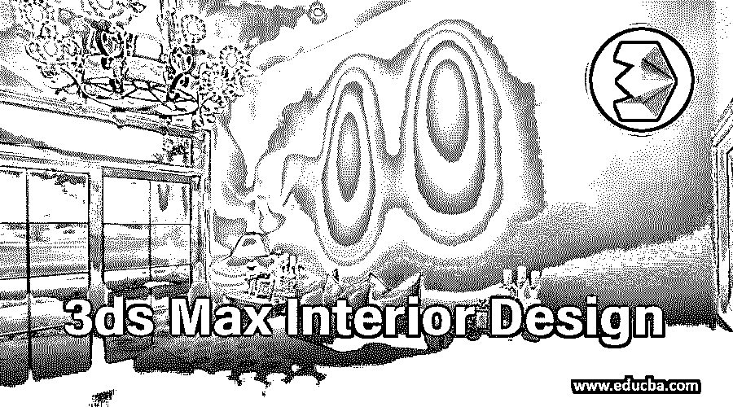

## 3ds Max 室内设计简介

3ds Max 是 3d 建模图形专业人员广泛使用的 3d 建模软件。它是由 Autodesk 公司于 1996 年开发的。我们将该软件用于不同类型的工作，例如室内设计，视频游戏开发人员用于角色建模和游戏设计，建筑设计师用于建筑工作和其他数字媒体工作。在这篇文章中，我们将讨论“什么是室内设计？”以及“我们如何在 3ds max 软件中创建室内设计？”以一种非常有趣的方式。

室内设计是一种装饰任何建筑区域或在该区域中融入一些东西的想法。这里我们将通过实例来了解室内设计，学习室内设计的基础知识来更好地理解这一点。

<small>3D 动画、建模、仿真、游戏开发&其他</small>

### 如何创作一个室内设计？

我们将通过一些简单的步骤，以一种非常简单的学习方式来学习这一点。让我们开始吧:

**第一步:**这是 3ds max 软件的用户界面。其用户界面区域有四个视口:顶视口、前视口、左视口和透视视口。此视口帮助您从不同角度定位 3d 对象。

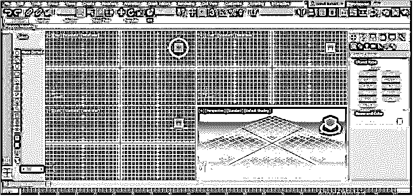

**第二步:**你可以通过按键盘上的 Alt + w 按钮全屏显示任何视窗，再按 **Alt + W** 回到正常屏幕。

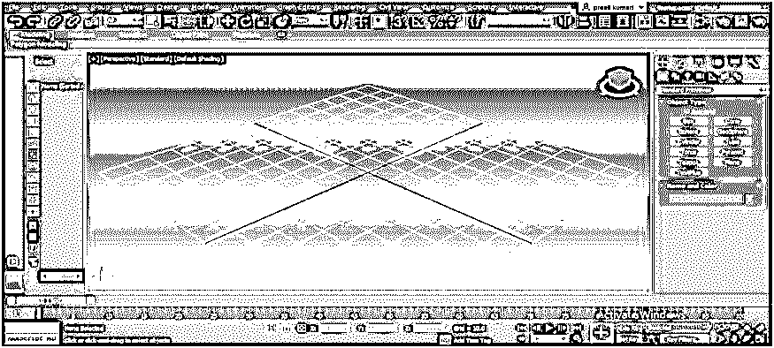

**第三步:**在本软件中开始任何建模之前，我们应该设置单位。对于单位设置，请转到菜单栏的“自定义”选项，该选项位于工作区的顶部，然后单击下拉列表中的单位设置选项。

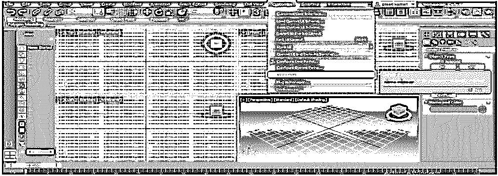

**第四步:**机组设置箱将打开。此处为单元设置框；我们有不同类型的单位参数，如公制、美制、定制和通用单位。

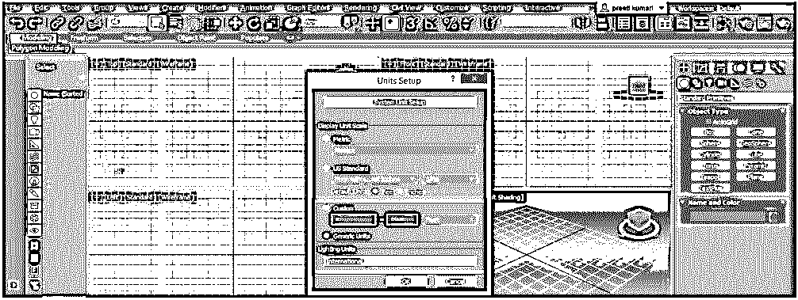

**第 5 步:**我们将单击通用单元，并在其中选择国际选项。我们选择此选项，以便当我们从其他软件将任何布局规划导入此软件时，不会对该布局规划的单元产生影响。现在，单击“设备设置”对话框中的“确定”按钮，应用设置:

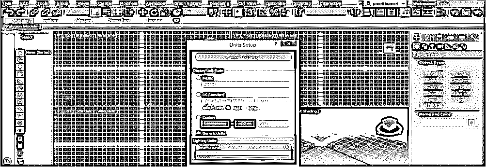

第六步:让我们为室内设计学习腾出空间。为了设计房间的布局，我将从这个软件的控制面板中选择一个线条命令。您可以从 Auto Cad 软件中导入预先设计的房间布局。

**步骤 7:** 现在点击顶视口，按下 **Alt + W** 按钮，全屏显示该视口:

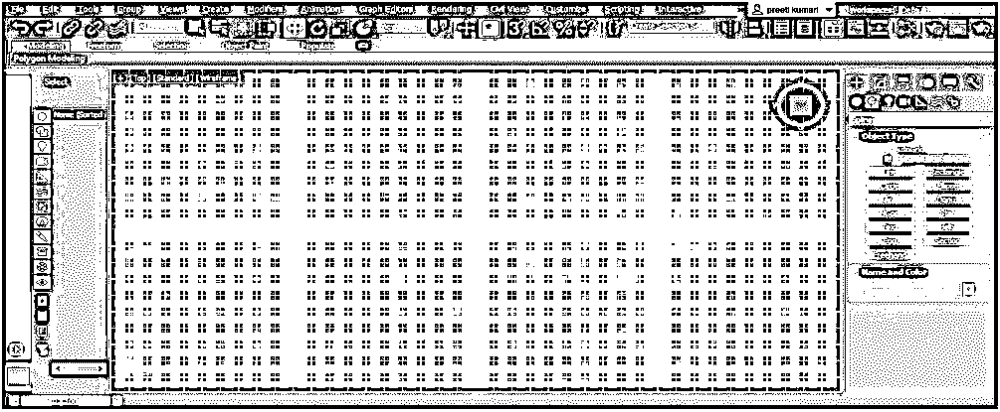

*   对于线路命令，请转到控制面板。单击形状选项。

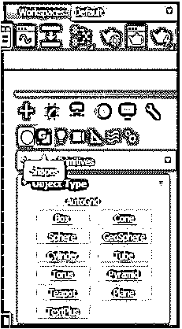

*   从这里选择行命令。

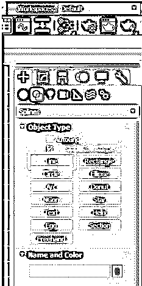

**第 8 步:**为了更好地对齐，我将制作一个 2d 快照，它位于该软件工作区的顶部。

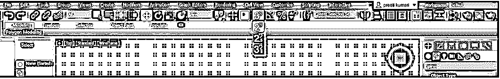

**第九步:**现在，把房间的墙壁布局做成这样。当您关闭线条形状时，它会显示这样一个对话框，询问您是否要关闭该形状。然后单击该框中的“是”选项卡:

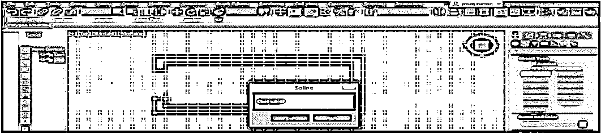

**步骤 10:** 现在选择墙壁布局，再次进入控制面板，点击修改选项。

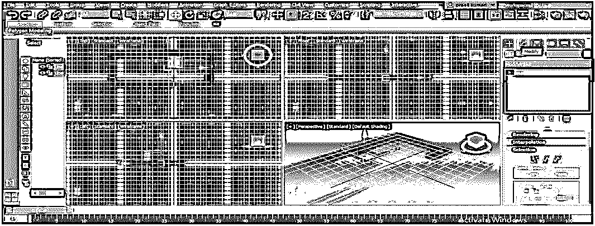

*   现在单击修改列表选项的向下箭头键。

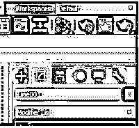

*   并搜索“挤出”选项。

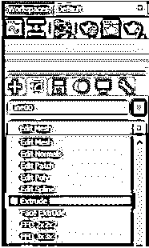

**步骤 11:** 一旦你点击“挤压”按钮，高度将被添加到墙壁区域的布局中。

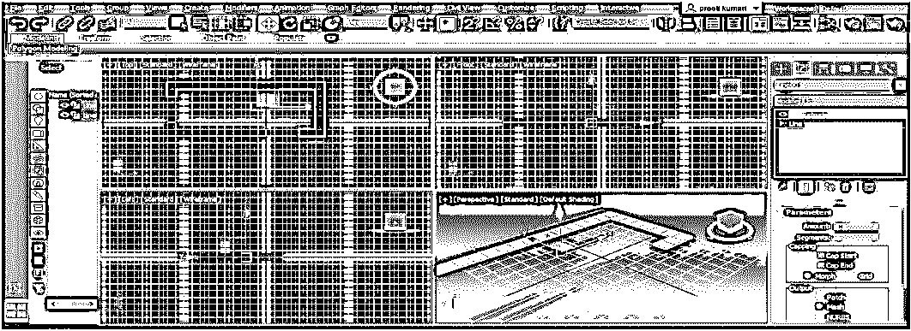

**第十二步:**现在，在参数部分根据你给出墙的高度。如果是做专业项目，可以手动给出高度值。

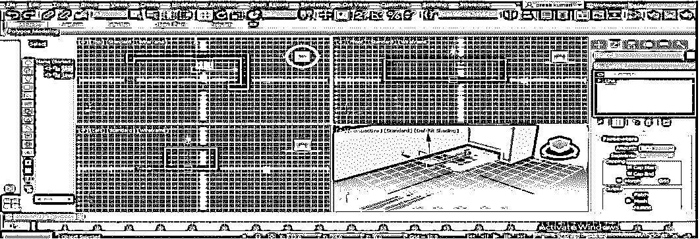

第 13 步:现在，选择墙的另一个区域，像上一步一样在这个区域增加高度。

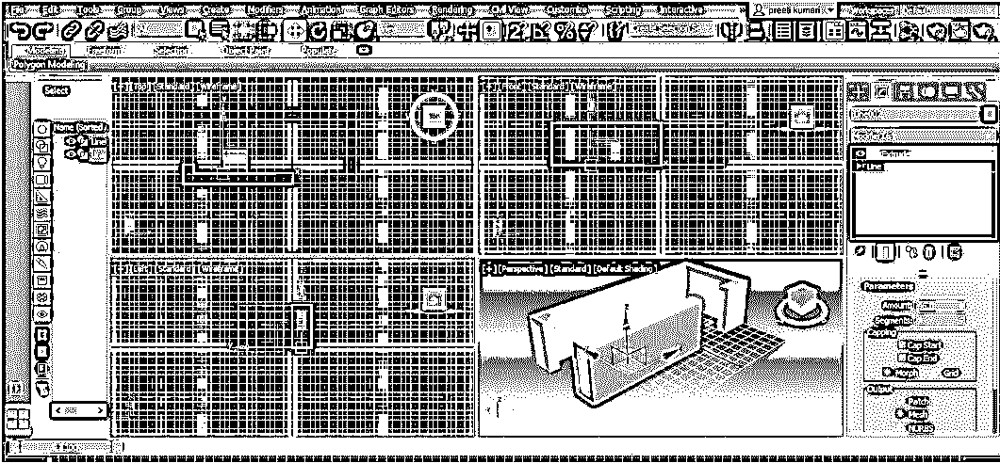

**第十四步:**我在这个房间做一个窗户；我将用一个简单的平面来做一个窗户。对于平面，转到这个软件的控制面板，点击这个面板的几何选项。

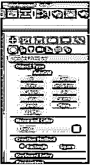

**步骤 15:** 打开 2d 捕捉，从左视口画一个平面。

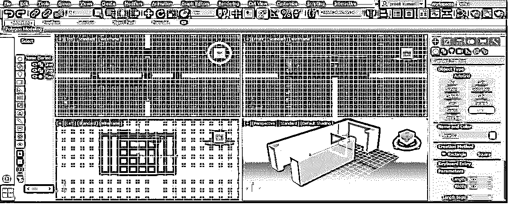

**步骤 16:** 现在，通过从不同的视口管理平面，调整平面的位置。

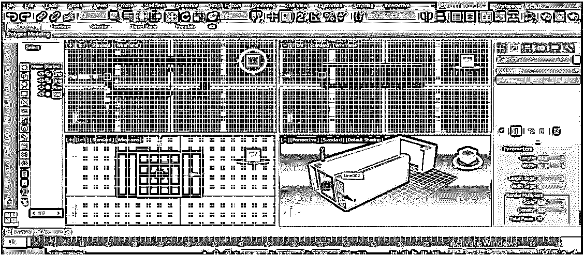

*   您可以在工作中的任何时候在这个房间的窗户部分添加玻璃、门和其他亮点。
*   您也可以使用“标准原型”选项中预先设计的门窗。单击此选项的向下箭头键，并从这里选择“Windows”选项:

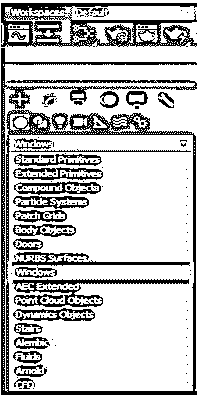

**步骤 17:** 从对象类型部分选择窗口类型，并在窗口区域绘制:

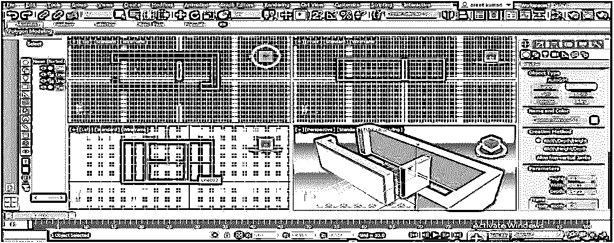

**步骤 18:** 如果不在该选项上，按其选项调整。

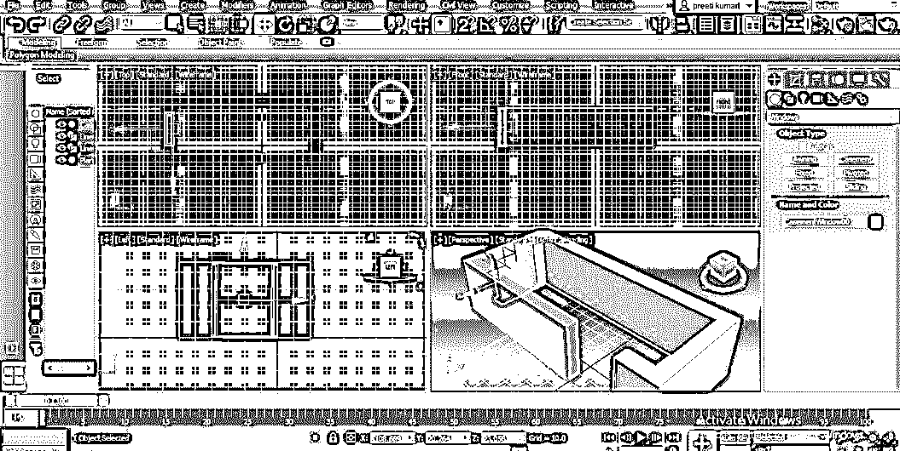

**第 19 步:**现在，我们将为这个房间添加门。同样，对于预先设计的门，单击几何选项，并单击标准基本选项的向下箭头键。现在从这里选择门选项。

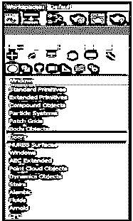

**步骤 20:** 从门的对象类型部分选择门的类型，并通过给出门的高度和宽度来绘制门:

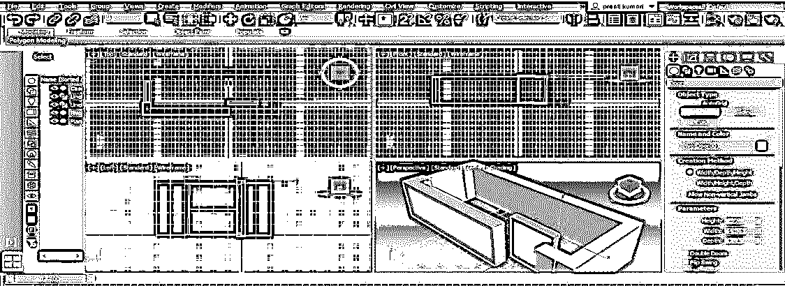

第 21 步:现在点击移动工具，通过在不同的视口管理来调整门。

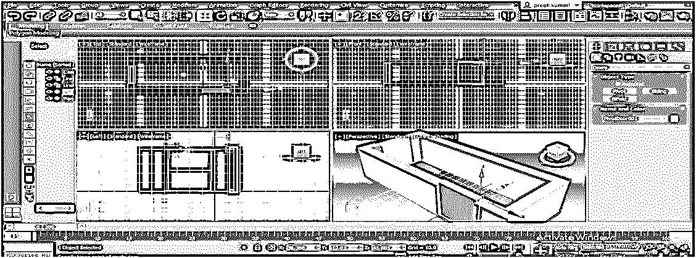

第 22 步:你可以制作不同类型的物品放在房间里，比如架子、电视机、桌子、椅子和其他装饰品。在这个软件上练习后，你会熟悉这些东西的。

**第 23 步:**你还可以给房间增加灯光。要添加灯光，请点击控制面板中的灯光图标，并选择您想要在房间中使用的灯光类型。

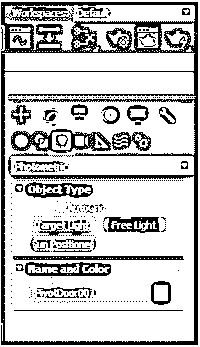

*   把灯放在你想要的地方。

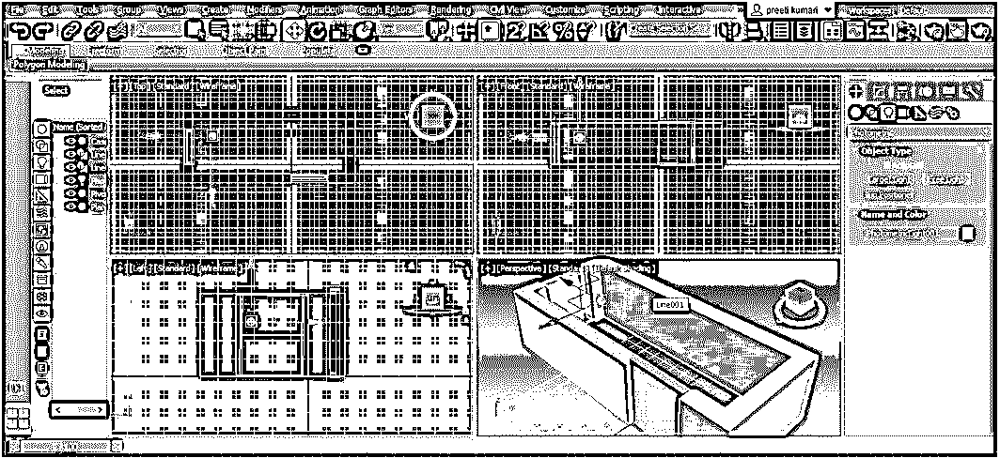

*   现在点击渲染帧窗口选项来查看房间中的灯光效果。

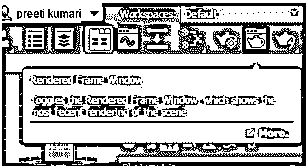

*   点击打开的窗口的渲染按钮，你可以看到你房间里光线的效果。

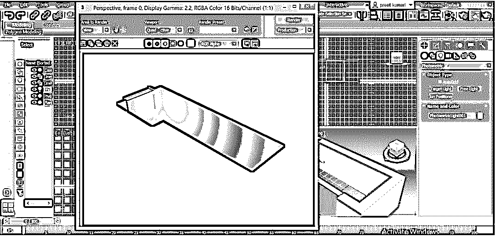

这是室内设计的基础。通过使用这个想法，你可以对任何布局进行非常专业的室内设计。

### 结论

读完这篇文章，你会很容易理解“什么是室内设计？”以及“如何在 3ds max 软件中创建室内设计”？你可以通过实践来提高你的室内设计技能，一旦你掌握了它，你就可以轻松地做一个非常专业的室内设计。

### 推荐文章

这是 3ds Max 室内设计指南。在这里，我们将一步步地讨论如何在 3ds max 软件中创建和增强室内设计。您也可以浏览我们的其他相关文章，了解更多信息——

1.  [3ds Max 中的 Spline | Spline 命令中的 Tools](https://www.educba.com/spline-in-3ds-max/)
2.  [如何在 Max 中创建 3D 建筑？](https://www.educba.com/3ds-max-architecture/)
3.  [将 Mental Ray 效果应用到我们的对象](https://www.educba.com/mental-ray-in-3ds-max/)
4.  [3Ds Max 中的纹理教程](https://www.educba.com/texture-in-3ds-max/)

