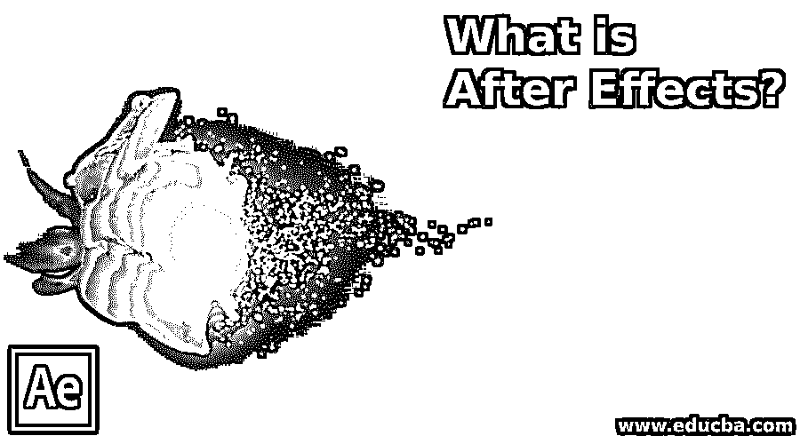

# 什么是后效？

> 原文：<https://www.educba.com/what-is-after-effects/>

## 后效概述

After Effects 是数字技术世界中常用的程序，该程序用于创建运动图形、视觉效果和合成。该程序由 Adobe Systems 创建和开发。它主要用于在电影剪辑的视频和动画拍摄后给它们添加效果。Adobe After Effects 最基本的[用途是编辑和增强视频的质量和视觉效果。该计划还用于电影制作工作室和公司制作电影的后期制作过程中。](https://www.educba.com/adobe-after-effects-plugins/)

After Effects 帮助图形设计师和运动艺术家在关键帧过程的帮助下为徽标、卡通和对象制作动画。Adobe After Effects 允许用户将他们的想象力和创造力付诸实践，开发出令人惊叹的视觉效果和图形。该程序是专门设计的，这样创建的文件不会被破坏，因此该程序支持非线性编辑器。

<small>3D 动画、建模、仿真、游戏开发&其他</small>

### After Effects 如何让工作变得如此简单？

After Effects 支持的工具和功能使用户的工作变得更加容易和简单。虽然该程序对初学者来说不是一个简单的软件，但它有如此多的编辑工具和功能，使 Adobe After Effects 成为一个重要而有吸引力的软件。该程序具有摄像头跟踪功能，可以帮助用户编辑原始视频，并在原始视频剪辑之间修改和添加任何文本或视频。它还具有运动图形动画，帮助用户将运动应用到静止图像，并将其添加到任何视频剪辑中；after Effects 具有一个称为 Expression 的特殊功能，该功能通过使用代码和线条作为值来控制动画序列，从而帮助用户加速动画过程。

### 后效有什么用？

After Effects 通常用于借助程序本身提供的工具和功能创作作品；在 360 合成编辑器的帮助下，用户可以编辑和合成视频，也可以在 VR 视频上工作。该计划还具有一个可视化的键盘快捷键编辑器。这个编辑器帮助用户创建他们自己的键盘快捷键，这有助于他们更容易和快速地修改视频和制作动画。After Effects 具有 VR 合成编辑器、VR 转换器、VR 旋转球体、数据驱动动画、增强的 3D 管道、文本输入改进和 GPU 加速效果。除此之外，After Effects 还支持交互式界面和高效的工作流程。用户可以在键盘用户界面上查看快捷方式，并相应地编辑它们。

除了这些功能之外，该程序还帮助用户从用于路径制作的面板创建空值，并且特殊的功能表达式帮助他们相应地创建遮罩、形状和画笔线条。

### 后效的优势

该计划是专门创建和设计，以帮助艺术家和编辑创造高质量的视频和逼真的效果和图形。该计划可以编辑和重建任何视频序列或剪辑，甚至添加浮动和运动文本的视频。简而言之，该程序帮助用户轻松创建专业项目和演示。

该计划还具有旋转刷工具，帮助和简化背景的变化和修改过程。以前，用户很难编辑运动中的背景，但在 Roto Brush 工具的帮助下，用户可以轻松地编辑背景，只需简单的一笔。

该程序的 CC 版本有许多更新的工具和升级的功能来帮助用户。用户现在可以使用细化边缘工具，细化软遮罩，遮罩跟踪器，内容感知填充，修改表达式编辑器。许多这样的定期更新帮助用户和艺术家与最新的工具和技术保持协调。

### 为什么我们要使用 After Effects？

After Effects 并不是一个容易学习的程序，但是一旦实践和学习了程序的基础，它可以帮助用户创建许多现实的项目。我们应该使用该程序，因为 After Effects 是唯一一个因其键控、跟踪、合成和动画的动画工具而受欢迎和要求高的程序。该程序有助于同时修改音频和视频。它还帮助用户进行媒体代码转换和编辑。

### 范围

后效的范围是明亮和良好的。这是 Adobe Systems 开发的唯一一个程序，它让用户可以根据自己的需要，借助合成技术和方法，自由编辑和重新创建任何视频剪辑。After Effects 目前被每个动画师、图形艺术家、[运动图形编辑](https://www.educba.com/what-is-motion-graphics/)以及 3d 艺术家使用，它也被用于电影制作的后期制作过程。

### 所需技能

这个程序不要求用户具备任何特定的技能。虽然，如果用户知道动画过程，例如使用关键帧或添加和编辑运动图形，这被认为是一个优势。网上有很多教程可以让你与这个程序同步，甚至掌握它。

### 职业成长

几乎所有的动画产业和公司目前都使用这种数字技术。After Effects 为用户提供了一个学习和获取电影制作后期制作过程知识的平台，用户可以用它来提高自己的技能，并在以后用作职业道路。不仅仅是电影制作，它还教授动画制作过程的许多方面和其中使用的技术。这个程序很受欢迎，学习它将帮助用户创造他们自己选择的职业。

### 结论

Adobe After Effects 是一个加载了强大工具和功能的高效程序。它将帮助用户获得知识和学习；这个项目将帮助他们掌握动画和运动图形技能。

### 推荐文章

这是一个什么是后效的指南。在这里，我们讨论基本概念、范围、所需技能和职业发展。您也可以阅读以下文章，了解更多信息——

1.  [后效快捷键](https://www.educba.com/after-effects-shortcuts/)
2.  [后效时间线](https://www.educba.com/after-effects-timeline/)
3.  [后效替代品](https://www.educba.com/after-effect-alternatives/)
4.  [特效跟踪后](https://www.educba.com/after-effects-tracking/)

