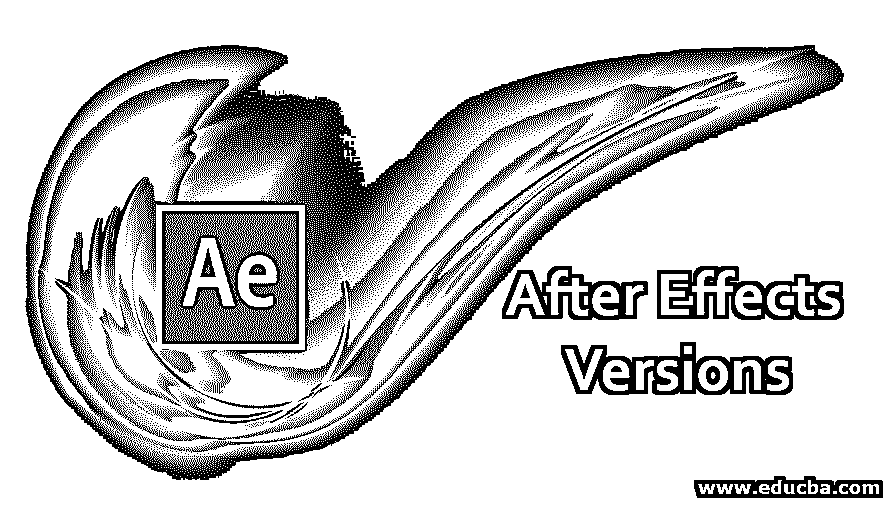

# After Effects 版本

> 原文：<https://www.educba.com/after-effects-versions/>

## 后效介绍

effects 于 1993 年 1 月发布，距今已有 26 年，在这 26 年中，Effects 开发了许多版本，从 1993 年到 1996 年，After Effects 仅在 Mac 上可用，第一个 Windows 版本于 1997 年 5 月推出，该软件由三家公司开发，从 1992 年到 1993 年，CoSA 是该软件的开发者，在此期间，effects 1.0 和 1.1 于 1994 年开发出来。 Aldus 开发了 after effects 2.0 和 2.0.1 两个版本，然后从 1995 年到现在 Adobe 交出[after effects](https://www.educba.com/how-to-use-after-effects/)并开发了很多版本，Adobe after effects 的第一个版本是 3.0。

### 不同版本的后效

好了，我们来详细看看到目前为止 after effects 的版本和特点:

<small>3D 动画、建模、仿真、游戏开发&其他</small>

#### 1.开发商 CoSA

CoSA 在 1993 年 1 月开发了第一个 After-effects 1.0 版本，它只在 Mac 上运行，这个版本的代号是 Egg。

| **After Effects 1.1** 于 1993 年 5 月开发，拥有比 1.0 更多的功能。它的特点是效果，关键帧，变换，图层合成与面具。 |

#### 2.开发商 Aldus

Aldus Corporation 是一家开发桌面出版软件的软件公司。它以生产 PageMaker 而闻名，page maker 是桌面出版领域的早期应用程序。

| **Effects 2.0**由 Aldus 于 1994 年 1 月开发后，该版本的代号为红烧，功能有运动模糊、多机渲染、帧融合、代理、时间布局窗口、图像序列支持。 |

| **后效 2.0.1** 是 1994 年 5 月开发的。而且这个版本只增加了一个功能，叫做 Power Macintosh 版(PPC)。 |

#### 3.开发商 Adobe

从 1994 年开始，Adobe 移交了 After effects，并开发了许多具有许多功能的版本。

| **Adobe After Effects 3.0** 于 1995 年 10 月推出；这个版本的代号是 Nimchow。它的功能是关键帧辅助(摆动器，运动草图，平滑器)，渲染队列，每层多个效果，高级键控，层转移模式，连续光栅化 illustrator 文件，运动数学，贝塞尔遮罩，时间重新映射，速度图，1/2/4 点运动跟踪。 |

adobe 开发 after-effects 时，他们添加了许多可以直接从 photoshop 和 illustrator 导入的功能，因为那两个产品属于 adobe。

| Adobe After Effects 3.1 于 1996 年 4 月推出，它的最后一个 Mac 64×0 版本。它的特点是多重处理和文件格式化。 |

| **Adobe After Effects 3.1(windows 95/NT)**1997 年 5 月的第一个 windows 版本，也是 1997 年 11 月的第一个法语和德语版本，这个版本的代号是 Dancing monkey，功能是为 3.1 的免费注册用户提供路径文本和动画 gif 输出，上下文菜单。 |

| **Adobe After Effects 4.0**1999 年 1 月这个版本的代号是 beer，功能有 Ram 预览、选项卡式窗口、可移动时间布局窗口、变换效果、可调图层、premier 导入、illustrator 图层。 |

| **Adobe After Effects 4.1**1999 年 9 月，代号 Batnip，特点是3 万 x 3 万图像支持，单独文字填充/描边；我们可以保存喜欢的效果(。ffx)、流程图视图、3D 通道效果、序列层。 |

| **Adobe After Effects 5.0**2001 年 4 月，代号 Melmet 在这个版本中，他们引入了更多的 3D 功能，如 3D 光，3D 层，动态预览，矢量疼痛，表情。 |

| **Adobe After Effects 5.5**2002 年 1 月 7 日，日，代号 Fauxfu，它的第一个 OS X 版本，其特点是高级 3D 渲染，多 3D 视图，调整层光，zaxwerkes 3D 补脑，导入相机数据。 |

| Adobe After Effects 6.0 于 2003 年 8 月发布，这个版本的代号是 Foodfite。其特点是开放的 GL，Rotobezire，液化，关键轻，使照片文字层。 |

| Adobe After Effects 6.52004 年 6 月 16 日日代号为 Chambant。它的功能包括 Firewire 的视频输出、磁盘缓存、按比例跟踪运动、高级克隆工具、颗粒管理。 |

| **Adobe After Effects 7.0**2006 年 1 月，代号 clamchop，第一个意大利语和西班牙语版本，功能有时间缠绕、图形编辑器、自动保存、逐字符模糊。 |

| 2007 年 6 月 2 日日土坯后效 CS3(8.0)；从这个版本开始，他们在每个版本中都加入了 CS，他们引入了创意套装。 |

| **Adobe After effects CS3(8 . 0 . 2)**2008 年 2 月代号为 loafdot，他们引入了松下·P2 的支持。 |

下面列出了更多版本的 After Effects:

**Adobe After Effects CS4(9.0)**2008 年 2 月，代号为 chinchillada。
**土坯 After Effects CS4(9 . 0 . 1)**2008 年 12 月 10 日 th 代号 chinchidotta。
**Adobe After Effects CS4(9 . 0 . 2)**2009 年 5 月 29 日，代号 lottadotta。
**Adobe After Effects CS(9 . 0 . 3)**2010 年 10 月 6 日代号为 Yaddadotta。
**Adobe After Effects CS5(10.0)**2010 年 4 月 30 日，代号 esgocart。
**Adobe After Effects CS5(10 . 0 . 1)**2010 年 9 月 3 日代号为 esgodot。
**Adobe After Effects CS5(10 . 0 . 2)**2011 年 4 月 8 日，代号 Egsodoh。
**Adobe After Effects cs 5.5(10.5)**2011 年 4 月 11 日，代号为 Codname。
**Adobe After Effects cs 5.5(10 . 5 . 1)**2011 年 6 月 30 日，代号 codot。
**Adobe After Effects CS6(11.0)**2012 年 4 月 23 日，代号 Sinaltapas。
**Adobe After Effects CS6(11 . 0 . 1)**2012 年 5 月 25 日，代号 Bigdottom。
**Adobe After Effects CS6(11 . 0 . 2)**2012 年 10 月 12 日，代号为 NoneMoredot。
**Adobe After Effects CC(12.0)o**n 2013 年 6 月 17 日，代号 Sconehenge 从这个版本开始，adobe 版本以 CC 开头，表示创意云。
**Adobe After Effects CC(12.1)**2013 年 10 月 31 日，代号 plabt 蓝带。
**Adobe After Effects CC(12.2)**2013 年 12 月 13 日，代号为皮诺黄油。
**土坯 After Effects CC 2014(13.0)**2014 年 6 月 18 日，代号为 Goatmeal stout。
**Adobe After Effects CC 2014.1(13.1)**2014 年 9 月 17 日，代号为 Hefe 马拉松。
**Adobe After Effects cc 2014.2(13.2)**2014 年 12 月，代号为 Finish lime。
**Adobe After Effects cc 2015.0(13 . 5 . 0 . 347)**2015 年 6 月 15 日，代号为贻贝车。
**Adobe After Effects cc 2015.1(13 . 6 . 0)**2015 年 11 月 30 日，代号为当前时间。
**Adobe After Effects cc 2015.2(13 . 7 . 0)**2016 年 1 月 27 日，代号为 fibonachos。
**Adobe After Effects cc 2015.3(13 . 8 . 0)**2016 年 6 月 21 日，代号 Abbacore。
**Adobe After Effects cc 2017(14.0)o**n 2016 年 11 月 2 日，代号 codfather。
**Adobe After Effects cc 2017.1(14.1)**2017 年 1 月 18 日，代号为 codfather part tuna。
**Adobe After Effects cc 2017.2(14.2)**2017 年 4 月 19 日，代号 plabtjacks。
**Adobe After Effects cc 2017.2(14 . 2 . 1)**2017 年 6 月 13 日，代号蓝莓 plabjacks。
**Adobe After Effects CC(15.0)**2017 年 10 月 18 日，代号 DarthTater。
**Adobe After Effects CC(15 . 0 . 1)**2018 . 1 . 22，Tater Dots '代号。
**Adobe After Effects CC(15.1)**2018 . 04 . 03，代号 Annivercelery。
**Adobe After Effects CC(15 . 1 . 1)**2018 年 4 月 24 日，代号为《原木上的行军蚂蚁》。
**Adobe After Effects CC(15 . 1 . 2)**2018 年 6 月 16 日，代号为花生 Dotter。
**Adobe After Effects CC(16.0)**2018 年 10 月，代号为 Double expresso。
**Adobe After Effects CC(16 . 0 . 1)**2018 年 12 月，代号 Macchidotto。
**Adobe After Effects CC(16.1)**2019 年 4 月 02 日，代号为斗篷-o-坚果。

### 推荐文章

这是一个关于 After Effects 版本的指南。在这里，我们讨论所有版本的 after effect 升级到目前为止，包括他们的开发商和功能说明。您也可以浏览我们的其他相关文章，了解更多信息——

1.  [如何设计后期特效？](https://www.educba.com/how-to-use-after-effects/)
2.  [什么是 Adobe After Effects 软件？](https://www.educba.com/after-effects-software/)
3.  [在 Adobe After Effects 中制作对象动画](https://www.educba.com/animation-in-after-effects/)
4.  [在后效中产生毛刺效果](https://www.educba.com/glitch-effect-in-after-effects/)
5.  [后效过渡指南](https://www.educba.com/after-effects-transitions/)
6.  [特效后的滑块控制|示例](https://www.educba.com/slider-control-after-effects/)
7.  [After Effects 表情|怎么用？](https://www.educba.com/after-effects-expressions/)

