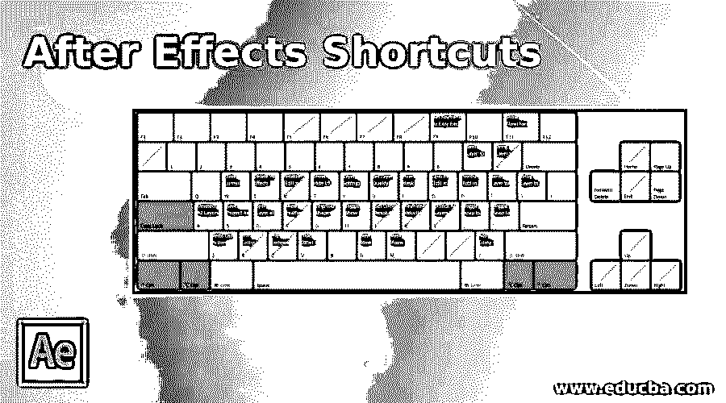

# 特效快捷键

> 原文：<https://www.educba.com/after-effects-shortcuts/>

## After Effects 快捷键概述

Adobe After Effects 可以定义为一个程序应用程序，用于制作内容中使用的特殊效果和[运动图形](https://www.educba.com/what-is-motion-graphics/)，这些内容可以在在线、视频和演示文稿中获得。虽然 after Effects 快捷方式在 Windows 和 Mac OS 平台上都可用，但它被广泛用于电影、电视、DVD、视频、动画的数字后期制作，以及 after Effects 形成 Adobe Creative Cloud 的[部分的特殊效果的制作。](https://www.educba.com/what-is-adobe-creative-cloud/)

它附带了一套广泛的 [2D 和 3D 工具](https://www.educba.com/2d-and-3d-shapes/)，可用于视觉效果艺术家、运动图形专业人员、电影和视频专业人员以及网页设计师所需的动画、效果和合成。此外，在使用任何软件时，快捷键有助于节省时间，从而提高效率和速度。许多快捷键是由 After Effects 提供的。

<small>3D 动画、建模、仿真、游戏开发&其他</small>

### 用于后期效果的快捷键

| **结果** | **快捷键** |
| **基本快捷键** |
| 允许您选择全部 | CtrlA |
| 允许您取消全选。 | F2/ctrlshift |
| 允许您复制所选的遮罩、图层、效果等 | CtrlD |
| 要退出工具 | CtrlQ |
| 重命名选定的文件夹、层等。 | 进入 |
| 打开所选的合成、层或素材项目 | 数字小键盘 |
| 在排列顺序中向前或向后移动选定的层或其他元素。 | ctrl 箭头向上 |
| 排列顺序中向前或向后的元素 | ctrl 键向上箭头向下箭头 |
| 您可以用它打开首选项对话框。 | CtrlAlt |
| **变换属性** |
| 用于兴趣点、灯光和摄像机等。 | 英语字母表中第一个字母 |
| 使用此键显示位置属性。 | 英语字母表中第十六个字母 |
| 使用此键显示缩放属性 | 英语字母表的第 19 个字母 |
| 使用该键显示强度和灯光的不透明度属性 | 英语字母表中第二十个字母 |
| 使用此键可以显示音量的属性。 | 英语字母表中第十二个字母 |
| 使用此键可以显示遮罩羽化属性 | 英语字母表中第六个字母 |
| 可以使用此键显示掩码路径属性 | 英语字母表中第十三个字母 |
| 使用此键可以显示效果属性组 | 英语字母表中第五个字母 |
| 使用此键仅显示带有表达式或关键帧的属性 | 英语字母表中第二十一个字母 |
| 它帮助你隐藏团体或财产。 | 变化 |
| **工作区、查看器、窗口和面板的快捷方式** |
| 这将打开或关闭项目面板。 | Ctrl0 |
| 这会打开或关闭“渲染队列”面板。 | CtrlAlt0 |
| 这将打开或关闭工具面板。 | Ctrl1 |
| 这将打开或关闭信息面板。 | Ctrl2 |
| 这将打开或关闭预览面板 | Ctrl3 |
| 这将打开或关闭音频面板 | Ctrl4 |
| 这将打开或关闭“预设和效果”面板 | Ctrl5 |
| 这将打开或关闭“字符”面板 | Ctrl6 |
| 这将打开或关闭段落面板 | Ctrl7 |
| 这将打开或关闭“绘画”面板 | Ctrl8 |
| 这将打开或关闭“画笔”面板 | Ctrl9 |
| 这将打开用于项目流程图的流程图面板 | ctrl f11 |
| 这将关闭活动面板或查看器 | CtrlW |
| **快速使用手持工具** |
| 选择手形工具，你可以按住空格键拖动 | 空格键 |
| **放大至时间轴** |
| 您可以通过按+或-来放大或缩小时间线上的重要区域 | +- |
| **工作区域和组成** |
| 这将打开一个新的组合 | CtrlN |
| b 设置工作区域的开始，N 将工作区域的结束设置为当前时间。 | 十亿 |
| 这将打开所选组合的“组合设置”对话框 | ctrl lk |
| 这将打开活动合成的合成迷你流程图 | 标签 |
| **工具激活** |
| 这有助于您循环使用这些工具 | 按住 Alt 键并单击“工具”面板中的工具按钮 |
| 这有助于激活选择工具。 | 英语字母表中第二十二个字母 |
| 这有助于手动工具的启动 | 英语字母表中第八个字母 |
| 这有助于激活旋转工具 | 英语字母表中第二十三个字母 |
| 这有助于根笔刷工具的激活 | AltW |
| 这有助于激活和浏览相机工具 | 英语字母表中第三个字母 |
| 这有助于激活工具后面的平移 | 英语字母表中第二十五个字母 |
| 这有助于激活和移动蒙版和形状工具。 | 英语字母表中第十七个字母 |
| 这有助于激活和浏览文字工具 | CtrlT |
| 这有助于激活钢笔和遮罩羽化工具并在它们之间移动。 | 英语字母表第七个字母 |
| 这有助于激活和移动克隆图章、笔刷和橡皮擦工具。 | CtrlB |
| 这有助于激活和移动木偶工具。 | CtrlP |
| **时间导航快捷键** |
| 如果你想到达一个特定的时间，那么你可以使用这个快捷方式。 | AltShiftJ |
| 它有助于到达工作区域的起点或终点。 | 轮班制 |
| 这有助于找到时间标尺中的上一项。 | 英语字母表中第十个字母 |
| 这有助于触及时间标尺中可见的下一个项目 | 英语字母表中第十一个字母 |
| 有助于达到层出点 | 英语字母表中第十五个字母 |
| 有助于深入到层的入点 | 英语字母表中第九个字母 |
| 它有助于在时间轴面板中找到当前时间 | 英语字母表中第四个字母 |
| **图层快捷方式** |
| 它有助于创建一个新的固体层 | CtrlY |
| 这有助于创建一个新的调整层 | ctrlalta |
| 有助于取消选择所有层 | CtrlShiftA |
| 这有助于创建新的零层 | CtrlAltShiftY |
| 它帮助你移动到最上面的选择层 | 英语字母表中第二十四个字母 |
| **三维图层** |
| 这将切换到 3D 视图 1 | F10 |
| 这将切换到 3D 视图 2 | F11 |
| 这将切换到 3D 视图 3 | F12 |
| 这有助于您回到之前的视图 | 转义字符 |
| 它有助于创造一种新的光。 | CtrlAltShiftL |
| 帮助创建新相机 | CtrlAltShift C |

### 结论

After Effects 有许多用途，如 3D 跟踪、2D 跟踪、遮罩、抠像、合成、视觉效果、动画等。，为了有效地执行这些任务并节省时间，您可以使用快捷键。您可以使用这些重要的快捷键来快速完成手头的任务，而不是一直使用鼠标。

### 推荐文章

这是一个关于特效捷径的指南。在这里，我们讨论的是在键盘的帮助下，我们可以使用的最上面的特效快捷键。您也可以看看以下文章——

1.  [特效跟踪后](https://www.educba.com/after-effects-tracking/)
2.  [特效后的木偶工具](https://www.educba.com/puppet-tool-in-after-effects/)
3.  [后效替代品](https://www.educba.com/after-effect-alternatives/)
4.  [后效时间线](https://www.educba.com/after-effects-timeline/)

