# 如何使用 After Effects？

> 原文：<https://www.educba.com/how-to-use-after-effects/>

## 如何使用 After Effects？

在使用效果软件为任何镜头创建构图、[运动图形](https://www.educba.com/what-is-motion-graphics/)和视觉效果之后。该软件也是 Adobe system 的 creative Cloud 应用程序的[部分，由 Adobe system 维护。这是一个非常有趣的图形设计软件，你可以很容易地学会它。在这篇文章中，我们将看到这个软件的不同部分，如它的用户界面，工作，以及其他一些重要的功能。一旦你知道这个软件的所有重要方面，为你操作这个软件对你来说就变得容易了，你可以在你的图形设计工作中从中受益。](https://www.educba.com/what-is-adobe-creative-cloud/)

### 在特效软件中设计

现在，您将学习在 After Effects 中创建设计的步骤。

<small>3D 动画、建模、仿真、游戏开发&其他</small>

**步骤 1:** 这是 After Effects 的欢迎画面。在这个屏幕上，我们有“新项目”选项。您可以为预先保存的项目选择“新建”或“转到”。项目是指您将进行平面设计的区域及其内容。

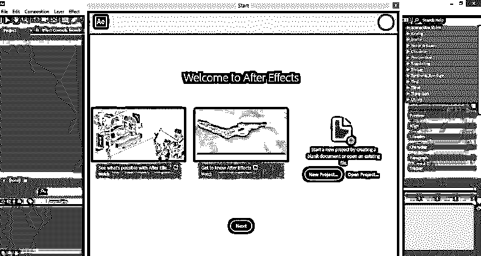

**第二步:**当您关闭此窗口时，该软件的用户界面将被打开。这是该软件的工作屏幕。

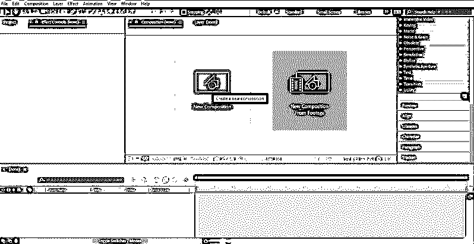

第三步:或者你可以从菜单栏的文件菜单中选择新建项目。

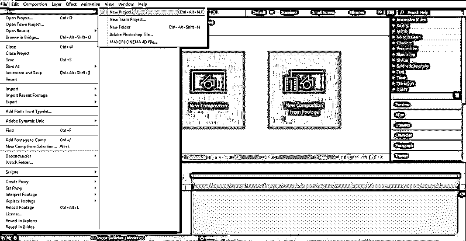

**第四步:**我们在工作区的中央有一个构图区。

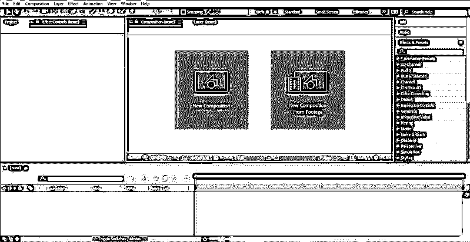

**第五步:**我们在工作区的左侧有一个项目窗口，显示了这个部分所有导入的东西。

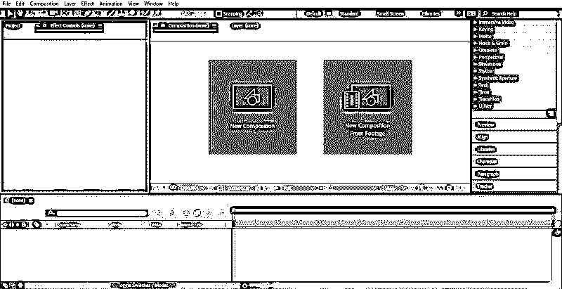

**第六步:**我们在工作区的底部有一个时间轴，显示了这个软件中动画作品的时间和帧。

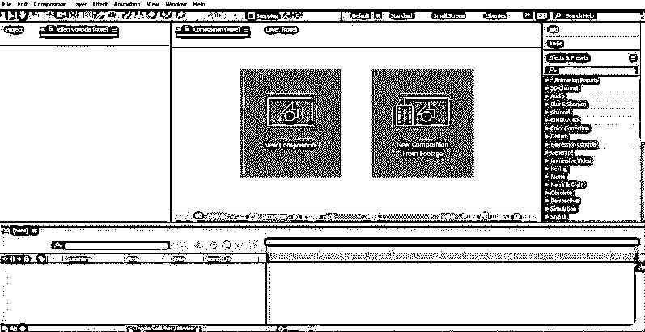

**第七步:**在工作区的右侧，我们有不同的选项，用于在这个软件中给出效果和操纵我们的动画。

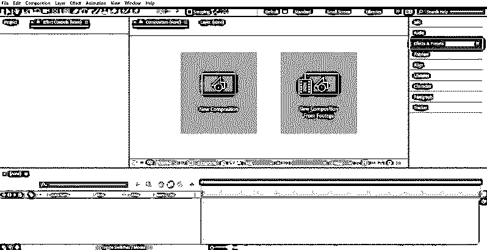

**第 8 步:**现在点击“New composition ”,这是我们在这个软件中开始工作的排版区域。

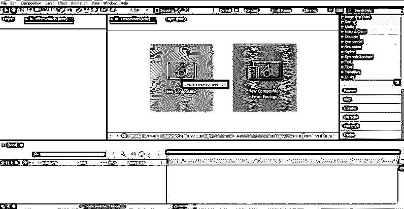

**第九步:**或者你可以去菜单栏点击构图菜单。点击“新建组合”将打开一个下拉列表。

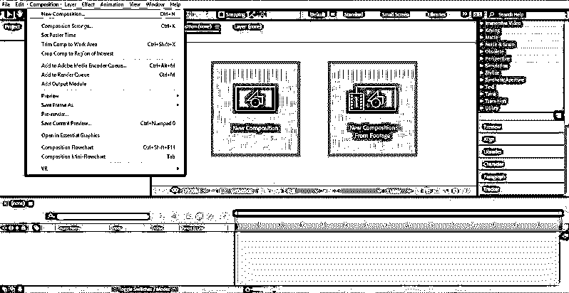

**步骤 10:** 或者您可以从“从素材中新建合成”选项中选择任何素材作为新合成。

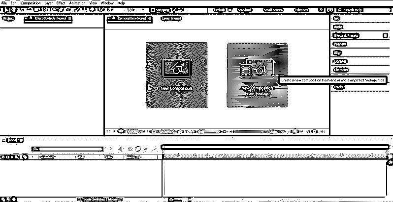

**第 11 步:**点击新建组合选项后。构图设置中会打开一个对话框。你想叫它什么都可以。我将它命名为“动画”。

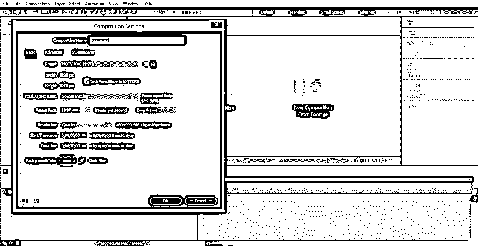

**步骤 12:** 在这里，我们有一个预设选项，我们将根据我们最终的项目屏幕来选择它，它将在那里显示。

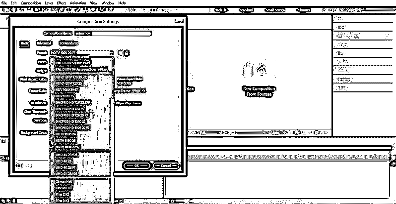

**第十三步:**我们可以设置一个带时间的框架。帧意味着每秒钟显示的我们运动的镜头。

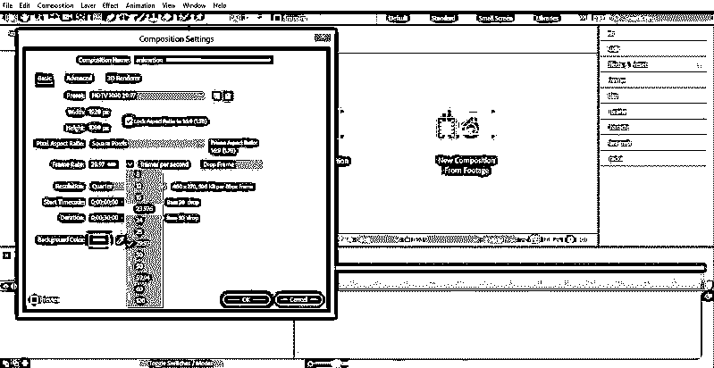

**第十四步:**接下来是解析。分辨率是指我们项目的画面在动画后的质量。我们这里一般用半或三分之一选项是因为这个软件的工作屏幕不是很大，所以用半分辨率是可以的。

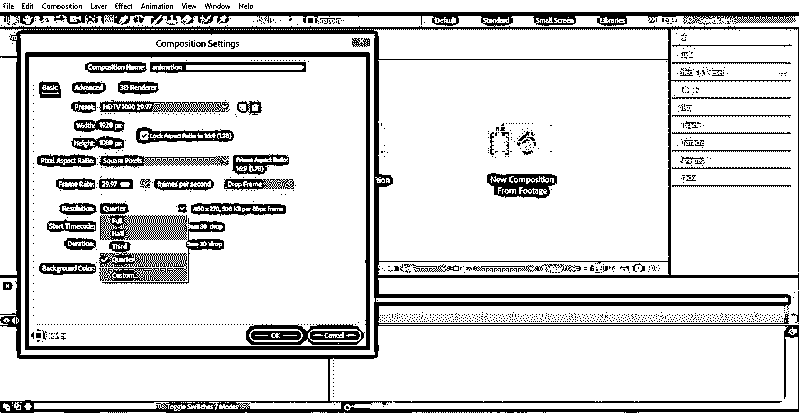

第 15 步:你可以在持续时间选项部分设置动画的持续时间。

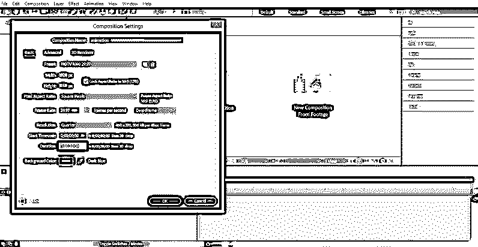

**第十六步:**你可以根据你的情况改变背景的颜色。我会选择黑色作为我的背景。

**第 17 步:**点击颜色框即可。将会打开颜色面板的一个对话框。从这里选择你想要的颜色。

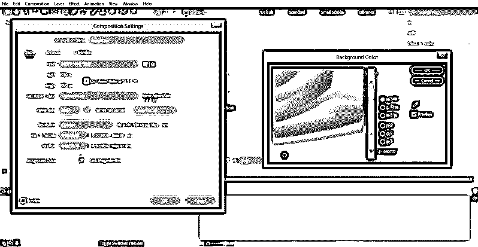

**步骤 18:** 你的构图已经做好了黑色的准备，时间线也激活了。

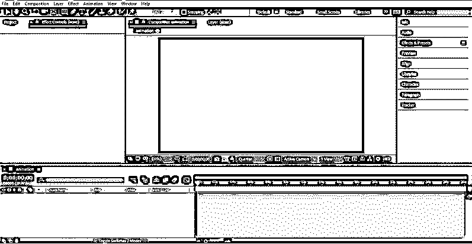

**第 19 步:**当你点击项目窗口的项目选项时，它会显示你在项目中创建的作品及其名称。项目窗口显示您在项目中导入的任何内容。

**第 20 步:**让我们将一个对象导入到这个软件中。对于导入，只需右键单击项目窗口中的任意位置。将会打开一个下拉列表。转到导入选项；同样，将会打开一个下拉列表。点击文件选项。

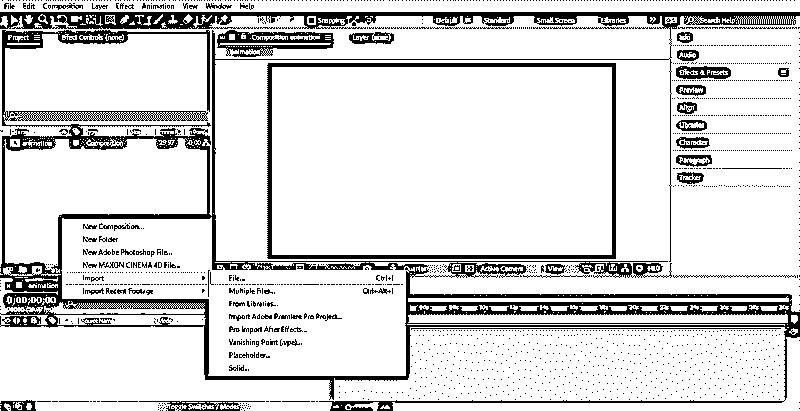

**步骤 21:** 或者双击项目窗口导入图像。导入文件的对话框将会打开。

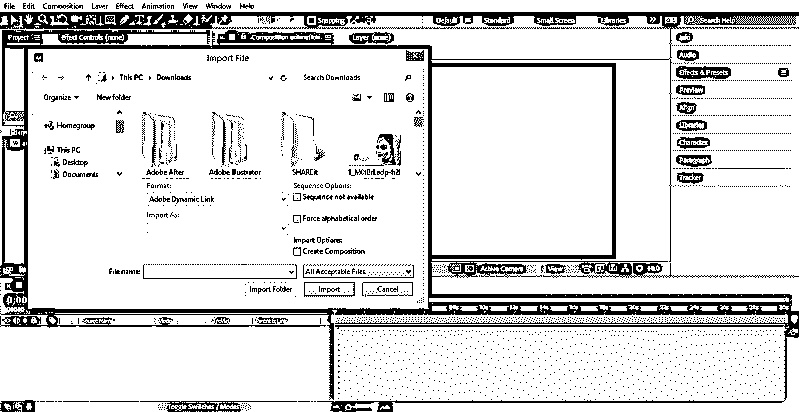

步骤 22: 选择你想要的动画对象，点击这个对话框的导入按钮。

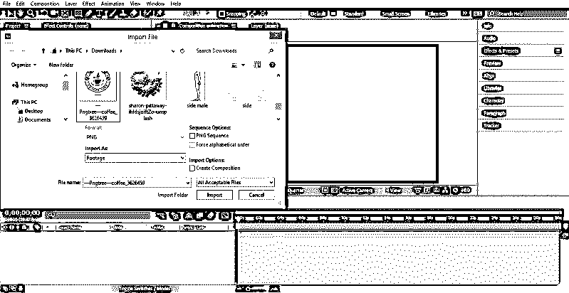

**步骤 23:** 导入的项目将出现在项目窗口中。将其拖动到合成区域，将其放置在该区域中。

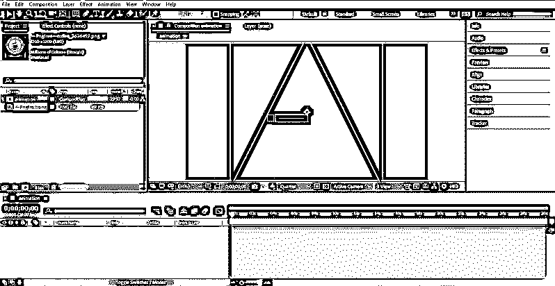

**步骤 24:** 或者您可以在图层区拖动该图像，将其放置在构图区域的中央。

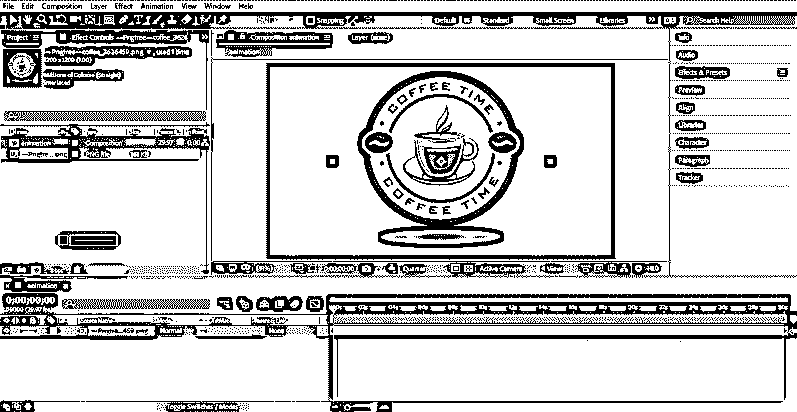

**第 25 步:**要在工作区内移动该对象，只需点击并按住点击，然后向您想要的方向移动即可。

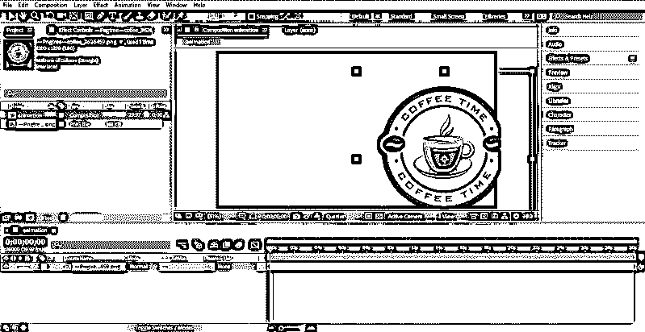

**步骤 26:** 我们在导入对象的图层部分有了眼睛按钮。当你点击这个对象的眼睛按钮时，它将变得不可见，或者当你再次点击它时，该对象将再次可见。

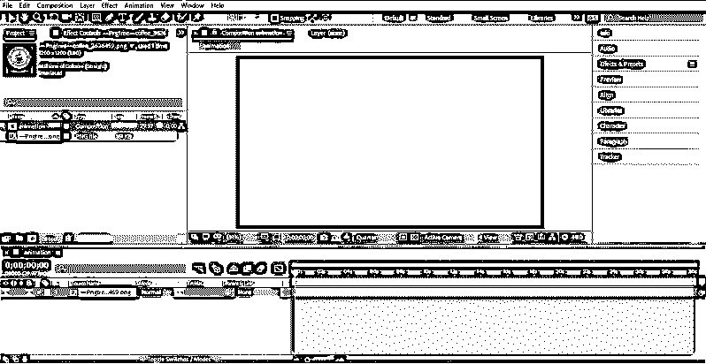

步骤 27: 我们在这个图层部分也有一个锁图标。当我们在另一个层上工作时，如果不干扰这个层，它将锁定这个层。

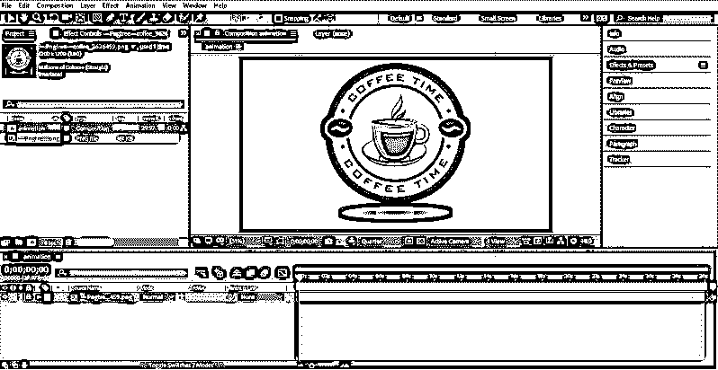

**步骤 28:** 当你点击这一层的小箭头按钮。将打开该层不同属性的下拉列表。在变换选项中，我们有对象的位置属性，对象的比例属性和其他属性，我们可以根据自己的需要制作动画。

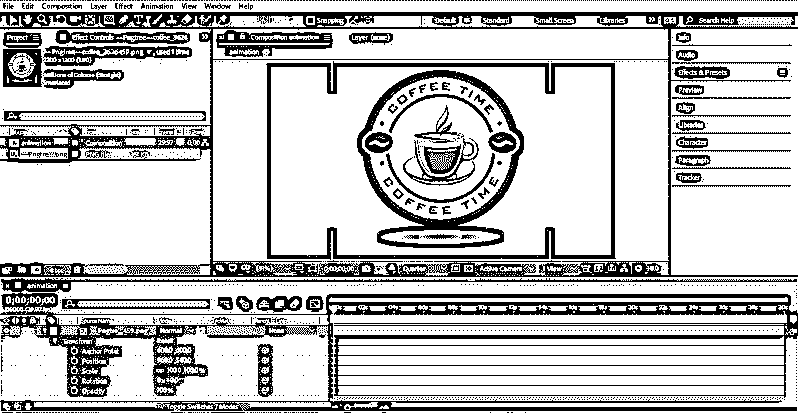

**步骤 29:** 这是时间轴的播放头，显示动画对象的动画时间。

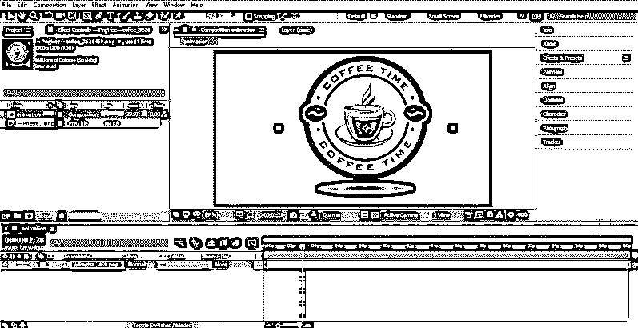

**步骤 30:** 我们在对象的所有属性附近都有一个小时钟图标。当我们点击这个时钟图标时，时间轴键将被激活，开始我们的动画。

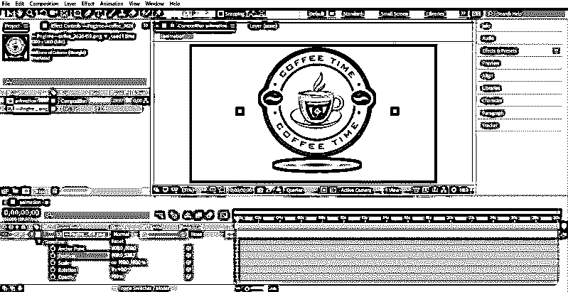

**步骤 31:** 比如你要动画这个对象的 Scale 属性。单击刻度属性的时钟图标。

**步骤 32:** 一个键将被激活，在该属性的左上角以蓝色突出显示。

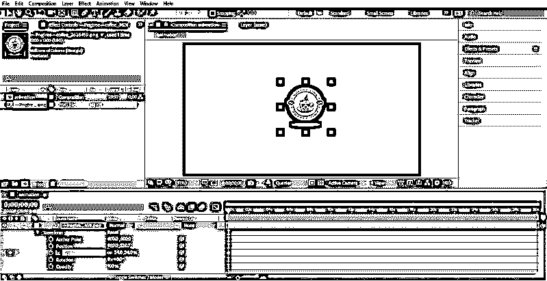

第 33 步:我将减少我们的物体动画的比例值。现在播放头的时间是从这个键开始的。

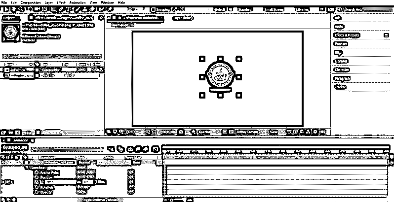

**步骤 34:** 现在，我将拖动播放头 2 秒，并通过增加 scale 属性的值来增加对象的大小。

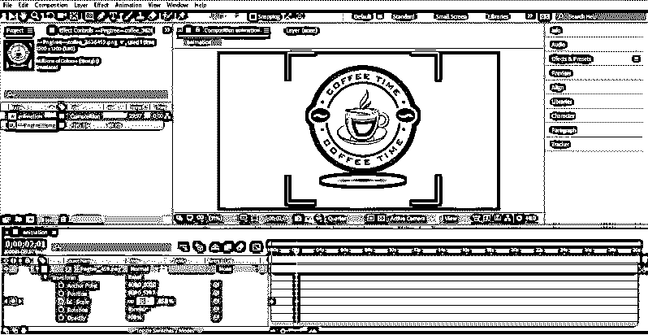

**步骤 35:** 现在按键盘上的空格键播放动画，你会看到物体的大小会随着时间的推移而增大。

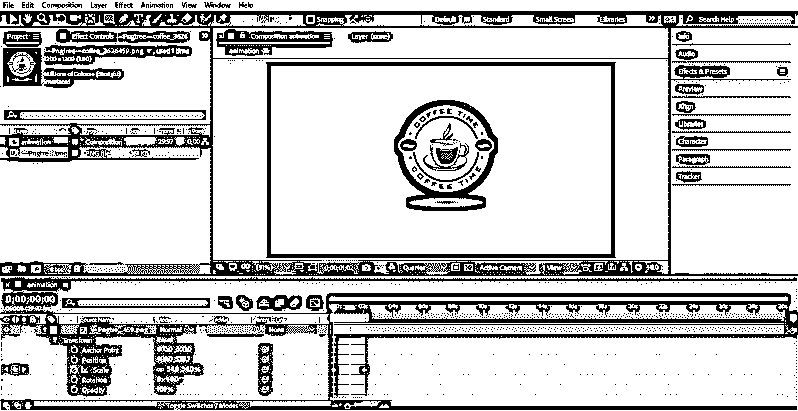

通过这种方式，您可以激活该对象的其他属性。一次可以制作多个对象的动画。

### 结论

现在你可以了解 Adobe After Effect 的工作原理，并在你的图形设计工作中使用它。使用 Adobe After Effect 将提高您在图形设计方面的工作技能。一旦您熟悉该软件，您就可以增加您的承运人机会。

### 推荐文章

这是一个如何使用后效的指南？在这里，我们讨论了介绍和步骤，就如何使用后的影响，以及一些插图。您也可以阅读以下文章，了解更多信息——

1.  [在 After Effects 中制作徽标动画的教程](https://www.educba.com/logo-animation-in-after-effects/)
2.  [在 After Effects 中导出的介绍](https://www.educba.com/export-in-after-effects/)
3.  [在 Photoshop 中创建金色文本效果](https://www.educba.com/gold-text-effect-in-photoshop/)
4.  [如何在 Illustrator 中插入图片？](https://www.educba.com/insert-image-in-illustrator/)

