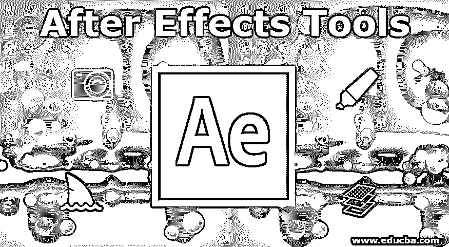
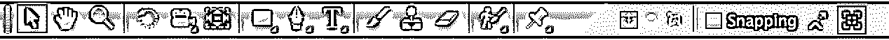
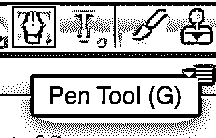
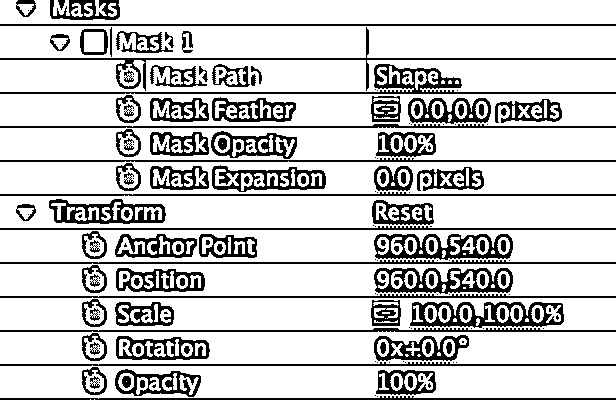

# 特效工具

> 原文：<https://www.educba.com/after-effects-tools/>

## 特效工具简介

After Effects 是 Adobe Creative Cloud 的一部分，它因 VFX 和 3D 艺术家、运动图形和动画师工作流而闻名，因为它提供了广泛的工具，可以针对大量任务进行调整，从简单的下三分之一标题和文本到完成电影的三维立体合成。只要您将视频拖到 After Effects 工作区或制作合成，After Effects 软件窗口最顶部的工具面板中的工具就可以访问了。

After Effects 涵盖了允许您更改构图元素的工具，如果您使用过 Photoshop 等其他 Adobe 软件，您将能够识别诸如手形工具和[选择工具](https://www.educba.com/selection-tool-in-illustrator/)等工具。工具面板包括几个可点击的图标，使您能够在工具之间移动，并以视觉方式确认当前选择的工具。此外，这些工具中的许多都有弹出菜单，允许您在该工具的选项中进行选择，例如形状的不同基本形式和[遮罩层](https://www.educba.com/mask-in-after-effects/)。

<small>3D 动画、建模、仿真、游戏开发&其他</small>

“后期效果工具”面板

### 特效工具列表

以下是后效工具的列表

#### 1)钢笔工具/遮罩

[钢笔工具允许](https://www.educba.com/pen-tool-in-after-effects/)你通过一个接一个地画出一条线或一个形状。我们可以用它来隐藏一个均匀图层的特定区域，也可以用它来绘制一个新的图层。这些可以被认为是他们最基本的动机，但是这个工具也允许你画草图和改变路径。

我们可以使用这些路径作为位置指令，以便层可以前进，也可以用于文本，如果需要，将它缩小到离散字符。同样，您可以将描边效果注册到一个具有路径的均匀层，并沿着所提到的路径绘制一条可更改的线，这是一种更有条理的替代方法，可以将形状层的内建描边赋予生命。

在这些众多应用程序的帮助下，笔工具可用于旋转镜、制作艺术品以及获得各种令人耳目一新的文本效果，如曲线运动或模仿手写。

钢笔工具

#### 2)摄像机

将一个场景的一些前景放在一起有助于销售，并且经常需要，主要是在 3D 工作时。相机层按照光学相机来构建构图，通常建立在实际的相机技术上。就相机而言，你可以利用你的摄影技巧，拍出好的动作和角度。虽然相机在技术上可以作为一个三维层，但你可以利用它们通过从画面的一部分切换到另一部分来使二维系列更加有效。

相机工具

#### 3)形状层

形状层是开始的最好地方。形状层是二维、统一的对象，或者由消费者[使用钢笔工具](https://www.educba.com/pen-tool-in-illustrator/)物理生成，或者具有 After Effects 提供的固定形状，如椭圆形、矩形或五边形。

形状层允许您个性化属性，如它们的描边(形状的轮廓)、填充(轮廓内形状的内部区域)，甚至是特殊的细节，如角的圆度。因为它们的大量个性化非常适合于快速创建一致的形状、复杂的图案和二维艺术。

然而，重要的是要记住[形状层](https://www.educba.com/shape-layers-in-after-effects/)对处理能力的要求很高，应该主要用于过度使用。如果你只是需要一些非常简单的东西，换成固体层可能是一个更好的选择。

固体层也非常方便，但还没有复杂到足以证明彻底的澄清。除了颜色、尺寸和标准的二维变换属性(如比例、位置和旋转)之外，它们只是一个没有自定义构建属性的形状层。

#### 4)嵌套组合/预组合

随着时间的推移，你的项目变得越来越复杂，你会意识到你的工作会变得错综复杂，因此很难驾驭。预先排版是项目计划的重要特征，它允许你将工作分成紧凑的部分。

如果用专业术语来说，pre-comp 可以被视为一个组成部分。然而，在你自己的项目环境中，预构图是一种有助于在提供最终结果的主要构图中达到紧凑目的的构图。

对于要预先合成的一类图层，强调它们，单击右键，然后选择预先合成。这将把它们放入它们自己的组合中，你可以改变它们，就像你对层所做的那样。

#### 5)调整层

它们提供了与组合类似的动机，虽然它们并不是完全必需的，但是与复杂的操作相比，它们提供了一种更快捷、更合理的方法。这些层像固体层一样精确地工作，但是它们只能用来改变其下面的层。这一层本身将作为一个空白的图片，但当放置在其他层，每一个效果，它已经注册到层。它可以被隐藏，可以设置尺寸，就像每个固体层一样，调整层的变换属性可以改变，它所包围的任何区域都将受到它的影响。过度使用它将迫使预压缩功能延长您的渲染时间，因此调整层非常适合您希望注册一个效果的情况。

#### 6)轨道垫

钢笔工具同样对轨道遮罩很重要[。轨道遮罩根据被遮罩层的亮度或可见性，利用一个层来隐藏另一个层。例如，如果您将一个层放置为 Alpha 蒙版，它会将其出现限制在它上面的层的不透明区域。Alpha 反转遮罩会将层的出现限制在它上面的层的透明区域。亮度遮罩的工作方式类似，但它会将底层的出现限制在顶层的发光区域。](https://www.educba.com/track-matte-in-after-effects/)

### 结论

你可以在网上购买更多的工具。最大的优势之一就是统一的拍照工具。这个工具帮助消费者开发三键鼠标，这样他们可以有更本能和更容易接受的三维命令。键盘快捷键使得感知所有东西或者只是选择层变得非常简单。

### 推荐文章

这是一个后效工具的指南。在这里，我们讨论一系列的后效工具，它们位于后效软件的最顶端。您也可以阅读以下文章，了解更多信息——

1.  [Adobe After Effects 插件](https://www.educba.com/adobe-after-effects-plugins/)
2.  [后效快捷键](https://www.educba.com/after-effects-shortcuts/)
3.  [后效复读机](https://www.educba.com/after-effects-repeater/)
4.  [后效粒子](https://www.educba.com/after-effects-particles/)

