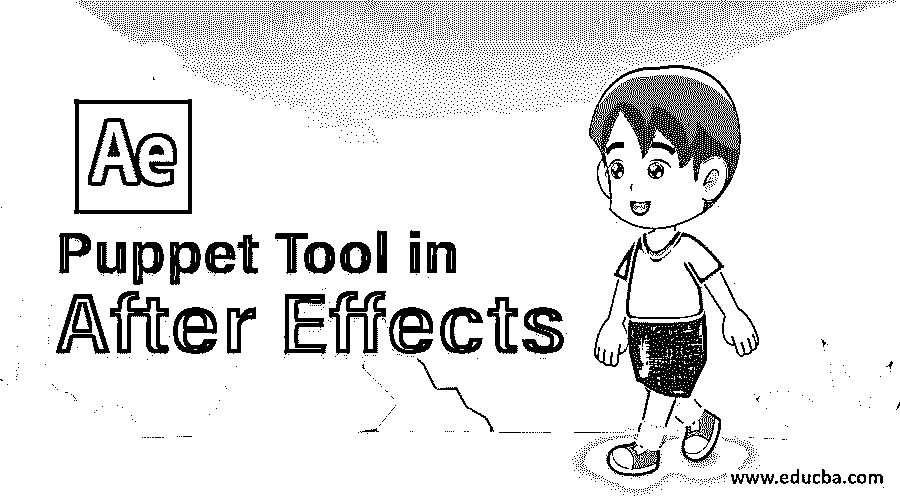
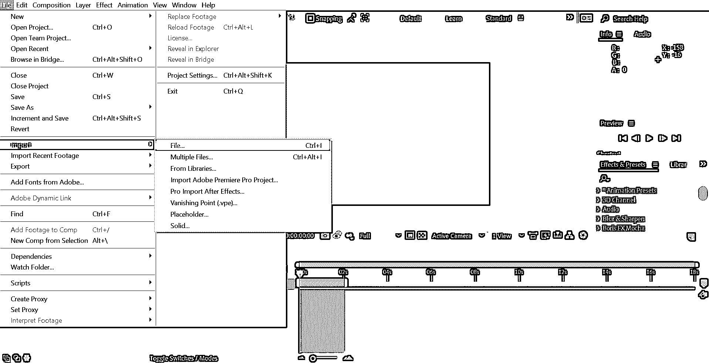
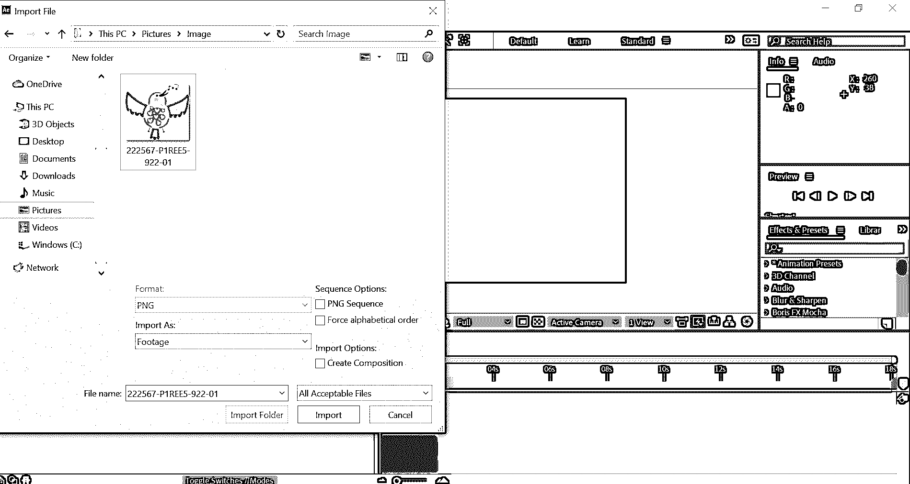
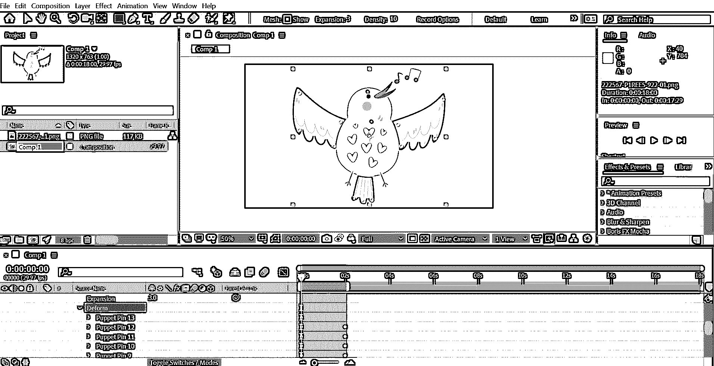
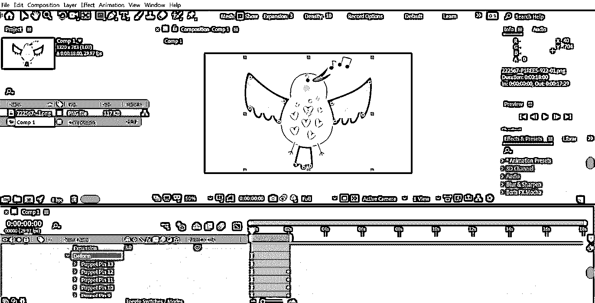
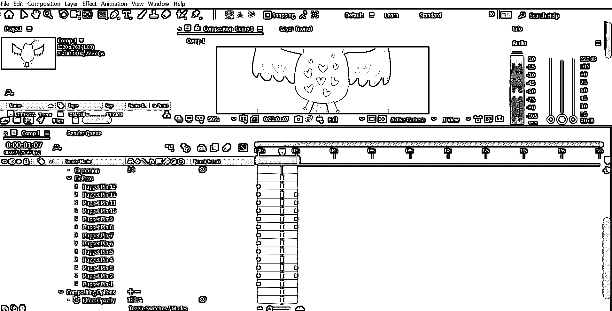
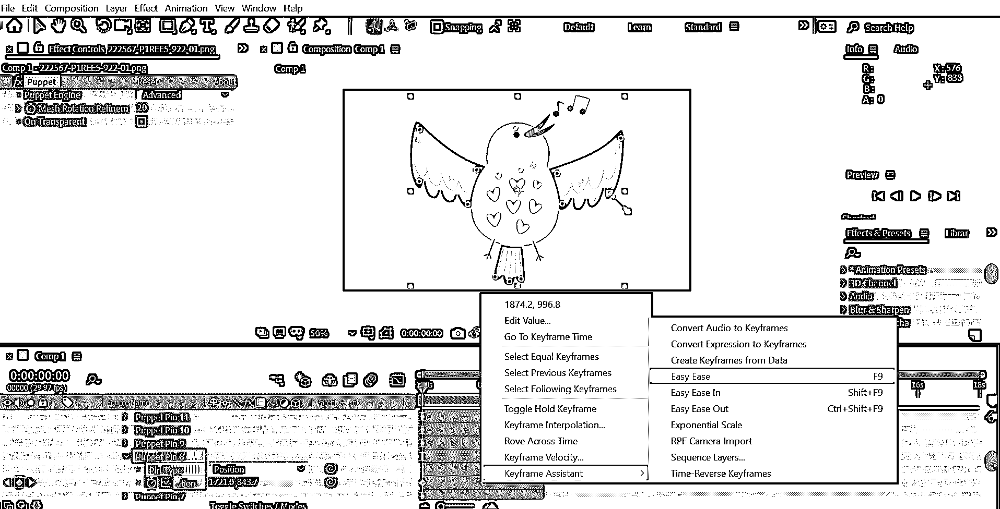
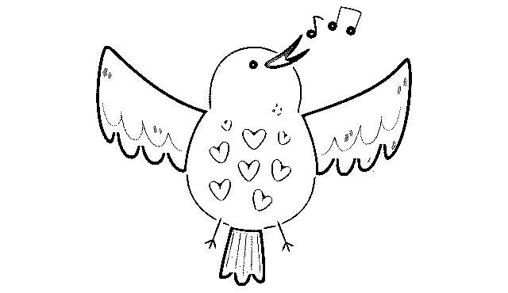

# After Effects 中的木偶工具

> 原文：<https://www.educba.com/puppet-tool-in-after-effects/>

## After Effects 中木偶工具的介绍

在 Adobe After Effects 中，木偶工具用于为您的图像添加动画；after Effects 具有用户用来操纵动画控件的大头针。应用木偶效果后，图像形状会根据添加大头针的位置发生变化。大头针控制图像的完整动画。您可以添加这样的大头针来移动图像的一部分。

### 如何在 After Effects 中使用木偶工具？

在这篇文章的下面，我们将讨论和学习如何在 After Effects 中使用木偶工具。此外，将动画效果添加到图像中，并在效果后使用木偶工具增强设计。

<small>3D 动画、建模、仿真、游戏开发&其他</small>

根据大头针的放置和移动，木偶工具会改变图像的结构。这些引脚控制图像的各个方面，并决定图片的哪些区域移动，哪些区域保持实心，并在出现重叠组件的情况下决定图像的各个部分。创建初始销时，轮廓内的区域以三角形网格的形式生成。应用木偶工具后，轮廓将可见。木偶工具指针将位于轮廓所在的零件上。网格将连接到图像的像素。因此，当您选择木偶指针时，像素会移动。

根据用户的特定要求，可以使用不同类型的木偶工具:

#### 1.木偶大头针工具

使用木偶固定工具，可以在图像上定位固定，以选择将创建关节的位置。当尝试用手和腿来制作角色动画时，建议将大头针放置在肘部、膝盖或任何其他易于运动的身体部位；您还可以选择控制这个王子，甚至使用时间轴窗口记录您的动画。

#### 2.木偶重叠工具

在处理本质上复杂的角色时，您可能会遇到一些元素，这些元素会妨碍您正在制作动画的部分。使用木偶重叠工具，可以绘制角色的深度信息，并告知 Illustrator 各部分的渲染顺序。

### toScale-up图片 ofa鸟？

当您想要为图像资源添加微妙的动画效果时，木偶工具非常有效。下面是一个如何放大一只鸟的动画的例子。

**第一步:**选择一张图像，用于在 After Effects 中添加木偶工具。为此，打开 After Effects 并进入文件>导入>选择包含您想要处理的图像的文件夹。

**步骤 2:** 现在，图像将在源面板中可见。接下来，只需在后期效果的时间线部分向下拖动图像。

现在，这只鸟感觉非常静止，毫无生气。使用木偶工具，我将应用一些动作到图像上。

**步骤 3:** 从菜单选项中可用的图钉图标中选择木偶工具。第一部分是我们必须在图像的正确位置添加大头针。我们将能够利用应用于图像的大头针来移动和包装图像。你必须记住，每次你点击图片，都会生成一个新的 pin，可以用来添加软链接。这种软连接可以用来防止图像的一部分移动的所有链接。

**步骤 4:** 在关键区域添加图钉时要小心，例如图像的开头、中间部分以及所有需要制作动画或移动的重要部分。在效果之后，自动将关键帧添加到新添加的大头针上，无论播放头在那个时间点。

第五步:我把大头针放在一些地方，比如尖端，中间的关节，羽毛的部分，颈部和头部，最后是尾部。之后，在下一帧，我将改变关键帧的属性，以便有一个轻微的动画效果，鸟试图展开翅膀。因为，我将更改与羽化区域相关联的大头针，并拉伸以获得所需的结果。

**第六步:**在预览时做了这些修改后，看起来效果不错。然而，随着动画看起来怪异，问题出现了。您可以通过放松帧来解决此问题。为此，您必须选择所有变形的关键帧，右键单击并选择“Easy Ease”选项。

**步骤 7:** 你可以进一步使用曲线编辑器来更好地平滑运动。为此，使用快捷键 Shift + F3 打开图形编辑器。将整个帧的影响设置为 50%左右。输出看起来更好，有一个漂亮和流畅的运动。这演示了木偶工具在创建像女人一样的轻微和微妙的动画中的效果，这完全改变了图像。你可以在任何你觉得需要的地方应用这种效果来增加一点动感，让图形更有趣。

### 结论——后效中的木偶工具

After Effects 中的木偶工具允许您将静态图像转换为生动的动画。添加动作并不涉及复杂的步骤，一旦您学会使用木偶工具，您就可以轻松完成。开始尝试新的工具，创造出真正出众的令人惊叹的艺术品。

### 推荐文章

这是一个在 After Effects 中使用木偶工具的指南。在这里，我们讨论在 after effects 中木偶工具的介绍，以及放大鸟的图片的步骤。您也可以阅读以下文章，了解更多信息——

1.  [在 After Effects 中制作对象动画](https://www.educba.com/animation-in-after-effects/)
2.  [在后效中屏蔽图像](https://www.educba.com/mask-in-after-effects/)
3.  [在 After Effects 中添加关键帧的步骤](https://www.educba.com/keyframes-in-after-effects/)
4.  [Adobe After Effects 的 9 大插件](https://www.educba.com/adobe-after-effects-plugins/)
5.  [雨后效果](https://www.educba.com/rain-in-after-effects/)
6.  [特效转场后|如何制作？](https://www.educba.com/after-effects-transitions/)

