# 后期效果中的关键帧

> 原文：<https://www.educba.com/keyframes-in-after-effects/>

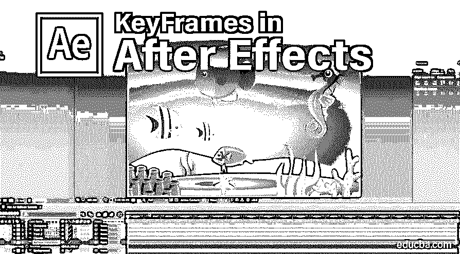

## After Effects 中关键帧的介绍

Adobe after effects 一直是最常用的软件，用于视频和电影片头的 [VFX 编辑、运动图形以及电视和电影制作的所有后期制作工作的合成。今天，我们将看到该应用程序的一个重要特性，即关键帧。关键帧用于设置内容的限制或参数，如运动、音频、效果和许多其他属性。在视频中从一个场景切换到另一个场景。默认情况下，在载入 after effects 时有两个键，一个在开始，另一个在结束。下面我们将看到更多的细节和](https://www.educba.com/what-is-vfx/)[在特效](https://www.educba.com/adding-keyframes-in-after-effects/)中关键帧的使用。

### 如何在 After Effects 中添加关键帧？

处理关键帧一直是动画图形编辑器的基本用法。

<small>3D 动画、建模、仿真、游戏开发&其他</small>

*   通过使用键盘上的**“0”**按钮，可以看到预览。如下图所示，在开始和结束处有 2 个关键帧，预览模式在给定的时间线中在它们之间运行，以检查从哪个时间开始发生变化。

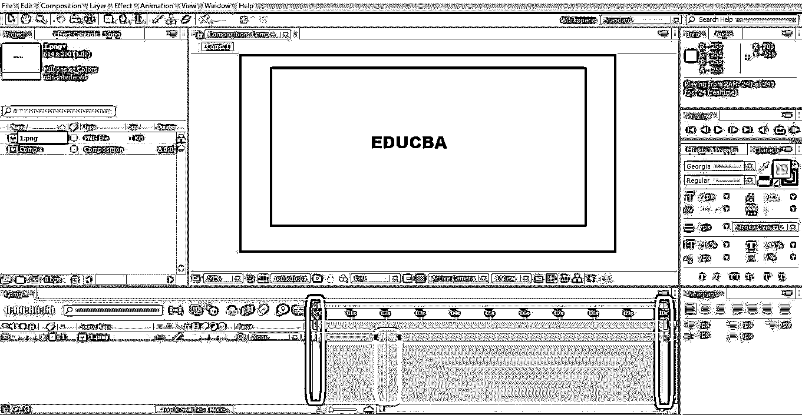

这有助于在所需的时间范围内准确地校正效果、场景或图形的位置变化。

*   空格键可用于开始和停止预览。我们可以将关键帧添加到项目中每个层的变换属性中。

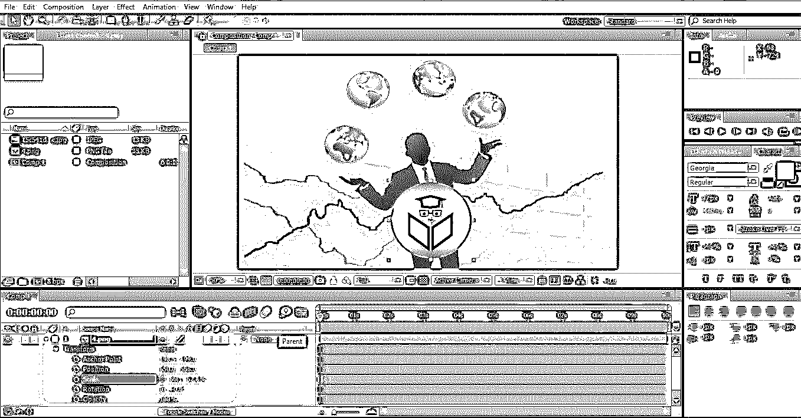

*   在这里，我们将添加关键帧到下面的项目。关键帧有助于给帧中的内容添加运动。因此，在这里，我们将添加运动到圆形 Educba 标志。
*   我们必须首先计划如何在你的框架中喊层移动。在演示中，我们将把徽标从框架的左侧移到右侧。

**步骤 1:** 打开 After Effects，将所有图层加载到图层面板，开始关键帧设置。打开图层的变换属性，必须通过单击图层名称旁边的小三角形来移动图层。检查可用的定位选项。

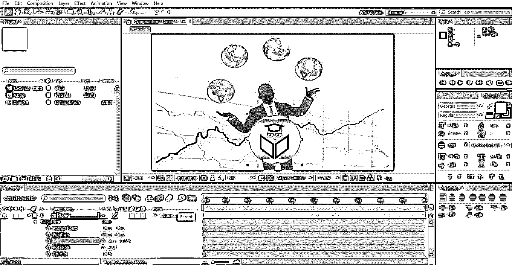

**第二步:**我们要改变标志的位置。通过选择并拖动光标，将徽标左上角移出框架。点击位置旁边的秒表符号 **o** ，并点击我们希望我们的标志到达中心的时间线。在下面的例子中，总持续时间是 10 秒，我希望我的标志在 3 秒内到达中心。

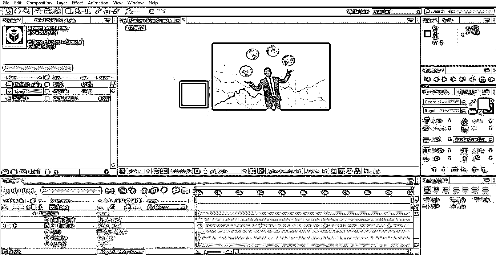

**第三步:**点击 3 秒时间线，按住 Shift 键拖动图标，移动到下一个关键帧应该停留的位置。

**步骤 4:** 由于我们已经停止拖动图标直到中心，一个新的关键帧将在放下的位置生成。现在我们有一个 0 秒的关键帧，另一个 3 秒的关键帧使用空格键来播放运动，以检查运动的速度。

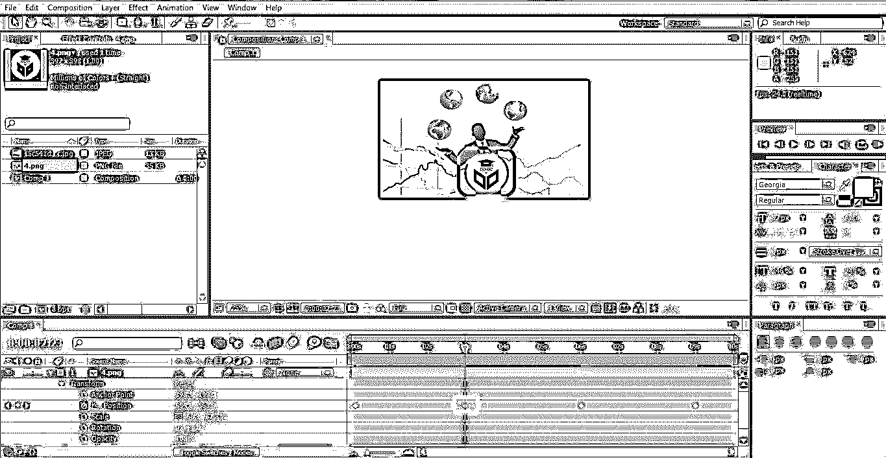

**步骤 5:** 对钥匙的最后一个位置重复同样的步骤。将时间线移动到 9 秒，并使用 shift +拖动将徽标从中心移动到右上角，直到移出框架。

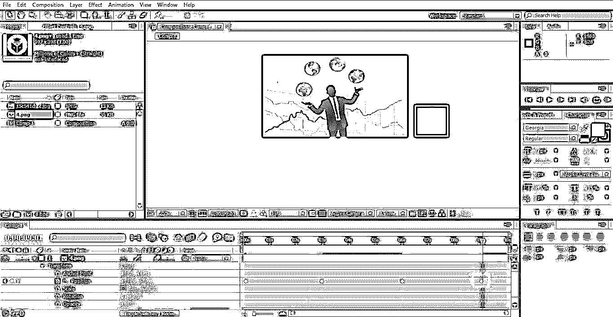

**步骤 6:** 当我们播放这段视频时，我们可以看到徽标会从左到中快速移动，从中到右缓慢移动，这是因为持续时间为 0 到 3 秒和 3 到 9 秒。我们甚至可以通过拖动和选择所有键，在徽标键的线性运动中观察到这一点。

**步骤 7:** 为了调整时间间隔，徽标也不能连续播放，因为它需要在一段时间内处于中心位置，所以让我们计划徽标从 3 秒到 6 秒处于中心位置，以便徽标运动时间或关键帧如下所示

*   从左到中:–0 到 3 秒。
*   中间:–3 到 6 秒。
*   从中心到右侧:–6 到 9 秒。

**步骤 8:** 点击时间线性 6 秒，在 3 秒处拖动按键，我们可以看到按键被选中。单击键盘上的 Ctrl + C 和 Ctrl + V，使徽标在 3 秒到 6 秒内保持在中心位置。

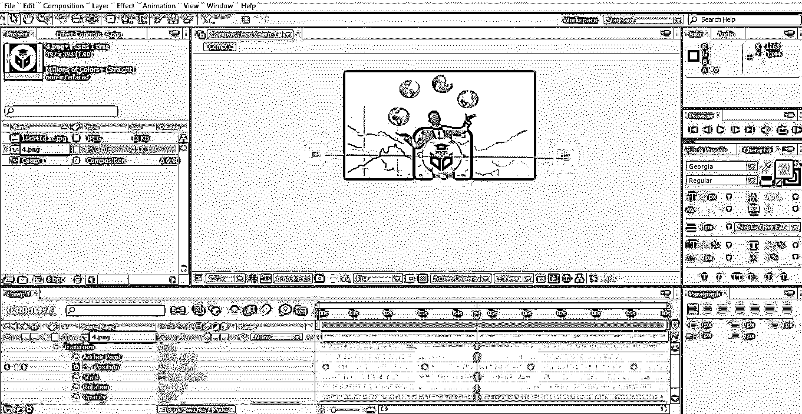

在这个项目中，我们为层的运动创建了 4 个关键帧。

**第九步:**如果任何其他对象也需要和 logo 一起移动到相同的路径，那么其他对象可以**成为 logo 层的**父对象。要启用父选项，从图层窗格中选择图层，该图层必须是徽标的父图层，然后单击父图标，该图标位于无旁边，如上图所示。甚至通过右键单击层窗格，我们发现亲子选项可用。

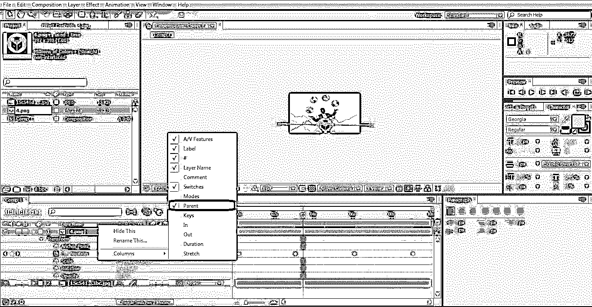

第十步:给移动的图层添加**动作**对于获得移动的外观和感觉也很重要。该选项存在于 3 个框中的层中；启用第一个框，如下所示。

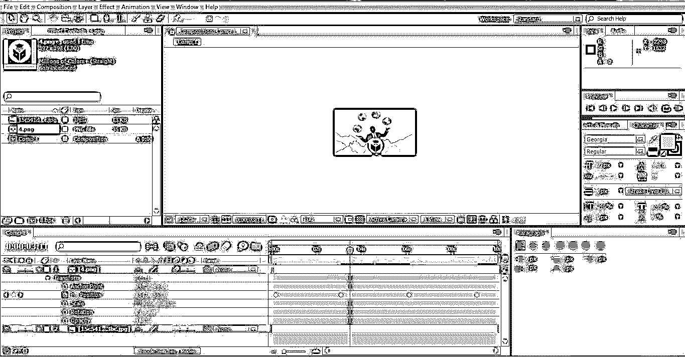

**步骤 11:** 为 After Effects 中的关键帧菜单命令。设定关键帧最常用的命令有:

1.  “0”或空格键来播放动作。
2.  使用鼠标按住 Shift 键拖动。
3.  Ctrl+C 和 Ctrl+V 用于复制粘贴关键帧
4.  键盘的导航箭头。
5.  k 和 J 移动到时间规则中的下一项。
6.  定位用秒表图标。

**步骤 12:** 一次删除一个或多个关键帧，方法是拖动关键帧并选择删除按钮。

**步骤 13** :为了在 after effects 中选择或调整关键帧，我们需要确定需要调整的关键帧，并在必须移动关键帧时放置时间线。它从时间线向左或向右移动。检查在以下情况下，关键帧必须向时间线的哪个方向移动。我想向左移动我选择的关键帧。因此，单击左箭头按钮，关键帧将相应地移动到时间线性。

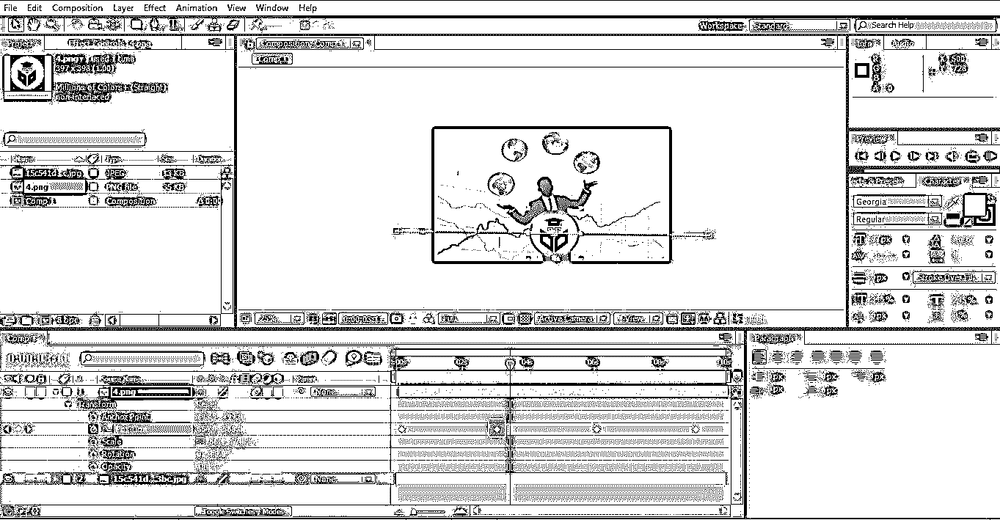

### 结论

所有的动画编辑、标题制作者和许多其他人都使用 after effects 关键帧来获得屏幕上的图块或对象，通过修剪和在帧上定位来给它们添加运动。我们可以添加位置，不透明度，运动，音量，音频，时间和许多其他属性来丰富视频的图形。

### 推荐文章

这是 After Effects 中关键帧的指南。在这里，我们讨论如何添加关键帧，一步一步的解释和关键帧的使用后的效果。您也可以浏览我们的其他相关文章，了解更多信息——

1.  [After Effects 中的文本效果](https://www.educba.com/text-effects-in-after-effects/)
2.  [后效工具](https://www.educba.com/after-effects-tools/)
3.  [Adobe After Effects 插件](https://www.educba.com/adobe-after-effects-plugins/)
4.  [后效复读机](https://www.educba.com/after-effects-repeater/)

