# 裁剪后的效果

> 原文：<https://www.educba.com/crop-in-after-effects/>

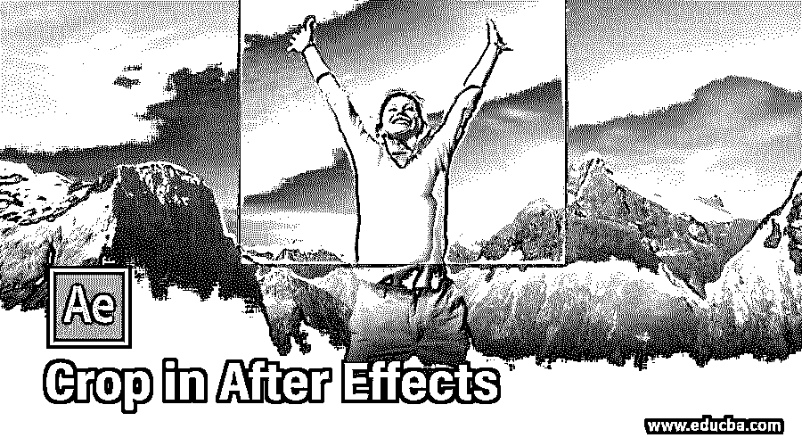

## 后效作物介绍

Adobe After Effects 是一款动画和视频编辑软件，在本文中，我们将学习如何根据感兴趣的区域来裁剪我们的作品。裁剪的好处是显而易见的，因为如果有空白空间，渲染输出会花费更多的时间。但是如果我们裁剪，那么它将减少渲染时间和文件大小。移除部分的另一个选择是进行遮罩，这将保持文件大小不变，但只移除您不想显示的部分。除此之外，你还可以添加裁剪效果，所以让我们来看看裁剪的效果。

### 如何在 After Effects 中使用裁剪？

**第一步:**让我们先熟悉一下界面，再开始深入了解。顶部是菜单栏，如文件、编辑等。，每个都有自己的子菜单。接下来，就在它的下面，我们有一个工具面板和它们的属性。在左侧，项目面板由项目文件和效果控制面板组成，显示应用于特定层的效果。然后是显示动画或视频预览的合成面板。在右上方，我们有各种布局预设，会根据作品类型进行排列。我们甚至可以创建自己的自定义布局。右边是用于编辑视频的各个部分。在底部，有用于添加媒体和添加动画关键帧的层和时间轴面板。

<small>3D 动画、建模、仿真、游戏开发&其他</small>

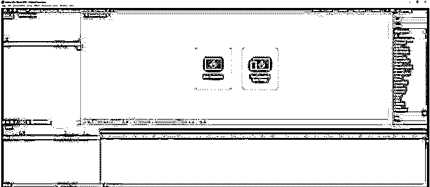

**第二步:**我已经打开了一个已有的作文。如果你有一个现有的作文，那么你可以打开它从文件- >打开项目。如果您没有现有的构图，那么您可以创建一个新的构图并从头开始。在本文中，我们正在研究如何使用裁剪功能，因此我们已经打开了一个现有的组合。

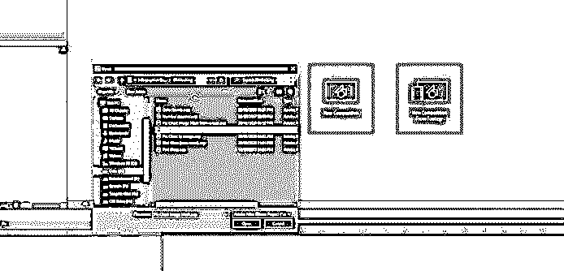

第三步:下面是桌面格式的构图尺寸。我们将看看第一种裁剪方法，在这种方法中，我们将制作桌面版本的移动版本。为此，我们需要裁剪和调整一些东西。

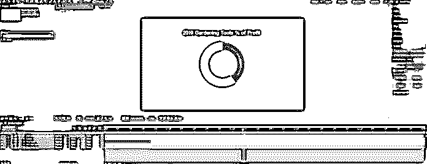

**第四步:**转到字符面板，减小文字的字体，使其适合手机版。如果你知道一个具体的数字，你可以点击像素字段，或者你可以拖动数字，如果你想吸引眼球，得到适当的大小。

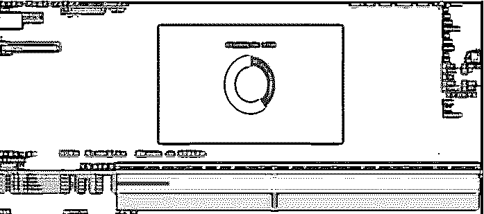

**第五步:**分辨率选择器旁边有一个叫做感兴趣区域的按钮；单击该区域，然后在“合成”面板中拖动要保留的区域。

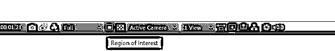

**第六步:**拖动您想要保留在构图中的区域。

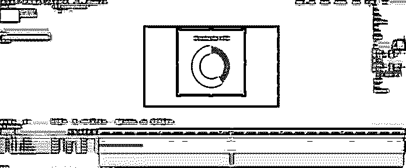

**步骤 7:** 确定区域后，进入构图菜单- >感兴趣区域的作物构图。

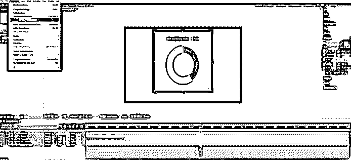

第 8 步:这将适当地调整您的排版。

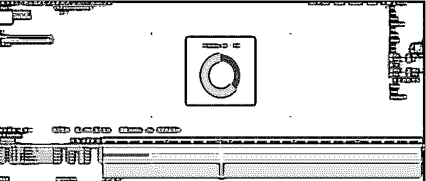

**第九步:**现在，如果你想检查你的构图的原始尺寸，进入构图- >构图设置或按 Ctrl + K

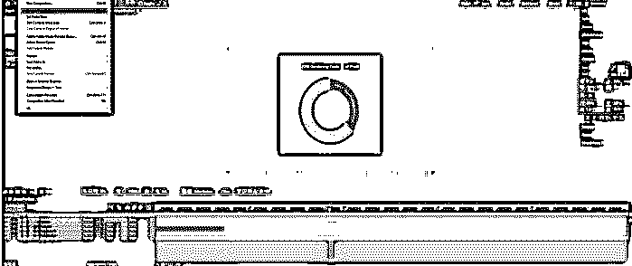

**第十步:**我们可以看到宽度和高度。如果您想要调整复合大小，请保持预览打开，然后拖移宽度和高度。

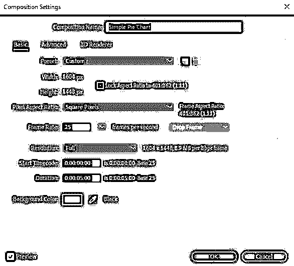

**第十一步:**现在，我们调整了 1080 px 的宽度和 1920 px 的高度。这将把桌面排版转换成移动排版。

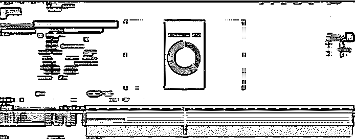

**步骤 12:** 现在，假设您不想裁剪实际的构图，但是您想将动画或视频的一部分制作成一种风格或电影效果。这次让我们从一篇新的作文开始。双击项目面板导入素材，或者可以进入【文件-】导入- >文件。

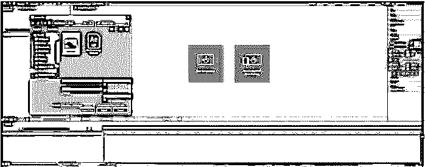

**步骤 13:** 导入素材后，我们将从如图所示的选区创建一个新的构图，或者您可以在“图层”面板中拖动视频，这将创建一个构图。

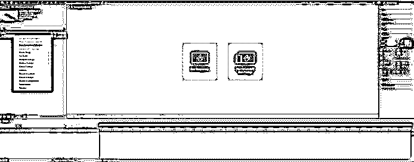

**第 14 步:**我已经通过右键单击公司名称并重命名或点击回车键将公司名称更改为 Cinematic mountain。同样，我已经改变了层的名称为山。

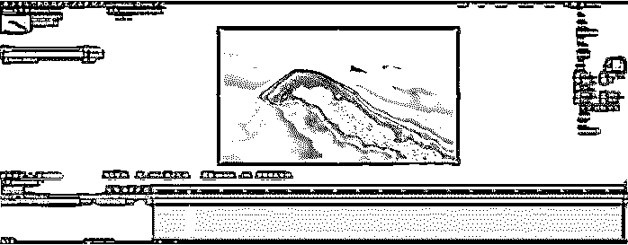

**第十五步:**添加效果到效果- >风格化- >运动磁贴。这将激活效果控制面板。

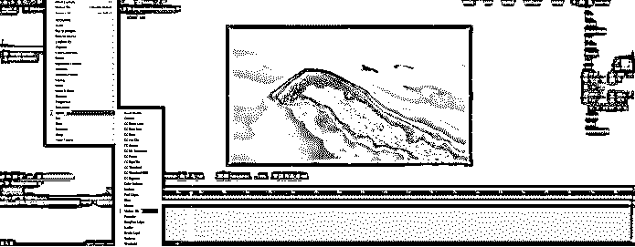

步骤 16: 如果效果控制面板没有显示，那么进入窗口- >效果控制。

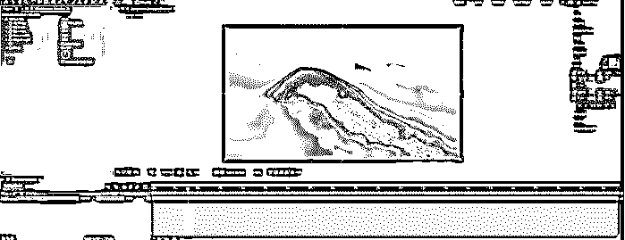

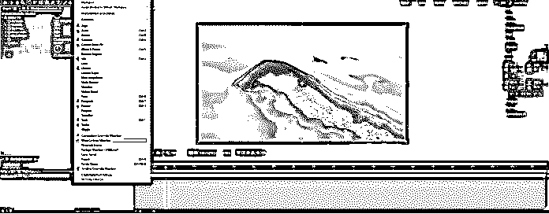

**第 17 步:**现在输出高度并将值改为 70。这一步将隐藏顶部和底部的长条，给我们一个电影效果。我们甚至可以玩瓷砖中心，以获得适当的看法。

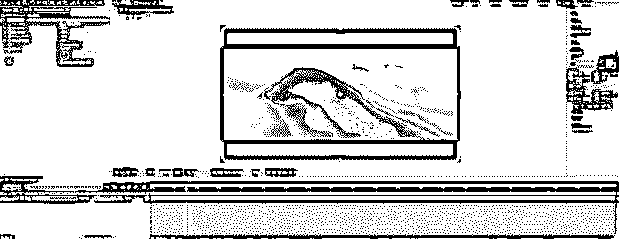

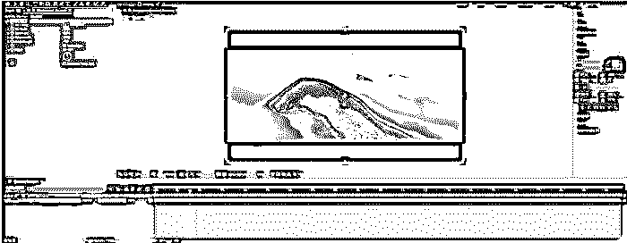

**第 19 步:**为了提高效率，我们将在所示示例文件的 x 轴和 y 轴上裁剪功能。为此，我们将进行预合成。

**步骤 20:** 右键点击轴，选择预合成。

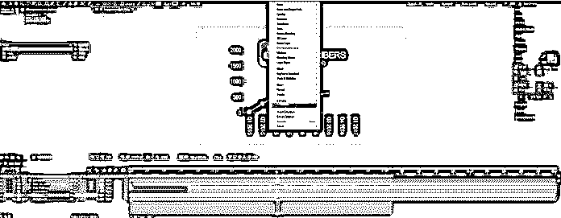

**步骤 21:** 确保选择了调整构图，它将创建一个新的构图。

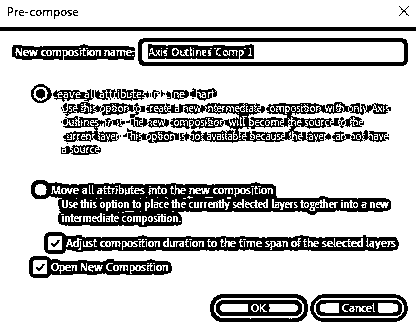

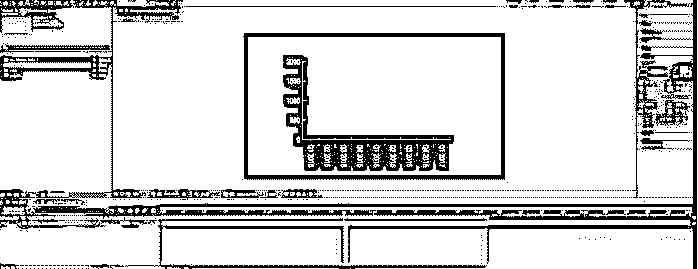

**步骤 22:** 接下来，我们将裁剪感兴趣的区域。

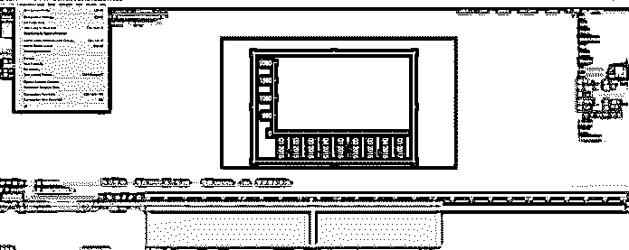

**第 23 步:**我们还会将排版裁剪到工作区。

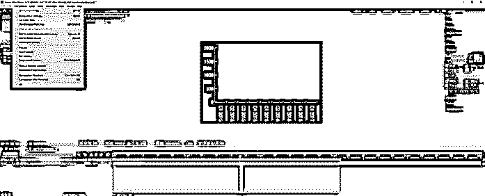

**第 24 步:**我们可以看到，x 轴和 y 轴被转换成了一个 comp。如果它们没有正确对齐，您可能需要调整轴的位置。

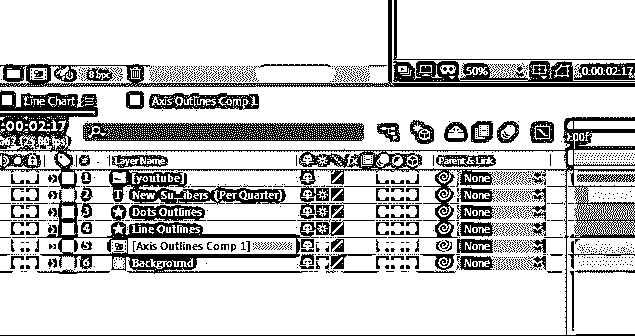

### 有用的提示

*   使用快捷方式，如“a”代表锚点，“p”代表位置，等等。，您可以在“帮助”菜单中找到键盘快捷键。
*   更改预览分辨率以加快预览速度。如果您将它保持为最大，根据您的分辨率，渲染需要一些时间，因此您可以将它保持为三分之一或四分之一，以便在预览时获得更好的性能。
*   组织项目面板会很有帮助，因为你可以根据你正在使用的媒体类型创建一个文件夹，这有助于找到你要的东西。

### 结论

在本文中，我们学习了如何在 Adobe After Effects 中裁剪感兴趣的区域，除此之外，我们还了解了如何应用风格效果来进行裁剪，而不实际改变排版的大小。如果您有大量的 comps 并且需要一些优化，那么整体裁剪是非常有用的。

### 推荐文章

这是一个裁剪后效果的指南。在这里，我们讨论如何一步一步地加入后效。您也可以浏览我们的其他相关文章，了解更多信息——

1.  [后效中的毛刺效应](https://www.educba.com/glitch-effect-in-after-effects/)
2.  [降雪后的影响](https://www.educba.com/snowfall-in-after-effects/)
3.  [摩卡在后效](https://www.educba.com/mocha-in-after-effects/)
4.  [输出后效](https://www.educba.com/export-in-after-effects/)

