# 效果后反弹表达式

> 原文：<https://www.educba.com/after-effects-bounce-expression/>

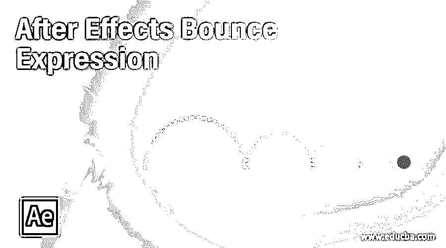

## After Effects 反弹表达式简介

After Effects 中的反弹表达式是一种表达式，通过它可以在对象上添加反弹效果，以便用它制作反弹动画。要使用反弹表达式，您必须在任何对象的特定属性的表达式框中键入计算机编码语言的表达式。您可以从任何免费的互联网网站复制免费的表达式代码，以获得对象的不同属性的反弹效果。因此，让我们了解这个表达式的不同参数，以轻松理解这个主题，并掌握反弹表达式的代码，我们将在这个主题中应用于任何动画后效对象的不同变换属性。

### 如何在 After Effects 中使用弹跳表情？

我们可以学习在 After effects 中使用这个表达式来为我们的对象添加反弹表达式，方法是遵循 After effects 的这个特性的应用过程的一些步骤。但是在我们开始学习后效这个话题之前，我们必须看看这个软件的工作屏幕，以便更好地理解这个话题。

<small>3D 动画、建模、仿真、游戏开发&其他</small>

在这个软件的用户界面顶部，我们有一个菜单栏，里面有几个菜单。在这下面，我们有一个活动工具或图像的属性栏。在这个栏下面，我们有三个部分，在左侧我们有项目面板和效果控制选项卡，在中心，我们有合成窗口，我们可以在其中看到我们当前的工作，在右侧我们有一些选项卡，如预览，对齐，效果和预设，还有一些其他的选项卡。您可以根据自己的选择，在该软件的用户屏幕上的任何地方调整所有这些部分。

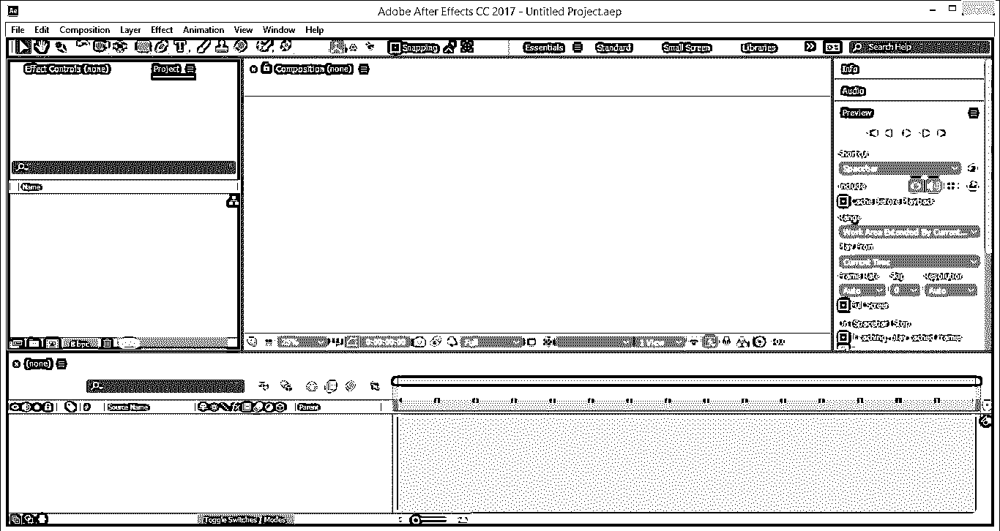

现在让我们用一篇新的作文来学习这个话题。对于新组合，请转到菜单栏的组合菜单并单击它。从下拉列表中选择“新建作文”选项，或者您可以按键盘上的 Ctrl + N 按钮作为新建作文的快捷键。

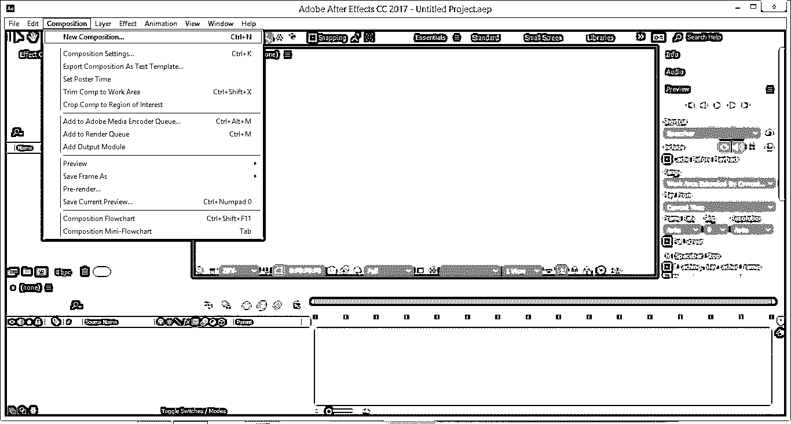

将打开一个新的合成设置框。根据您想要的合成属性调整此框的参数，并单击“确定”按钮应用想要的设置。

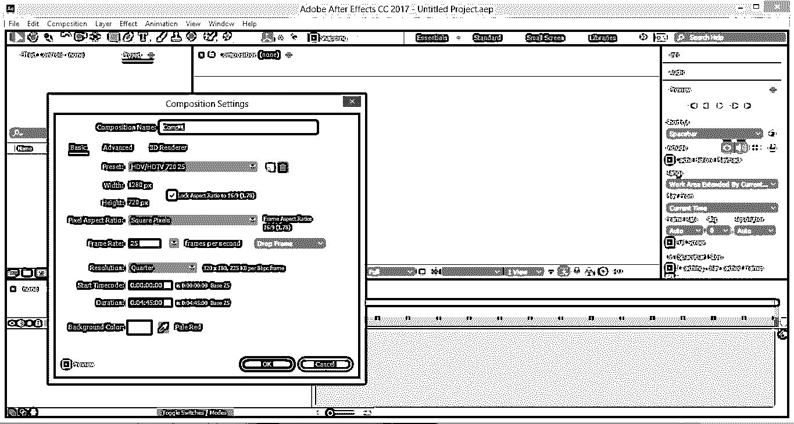

一篇新的作文会这样创作。现在转到这个软件的工具面板，点击矩形工具的图标来激活这个工具。我将在这个工具制作的矩形的不同变换属性上应用反弹表达式。

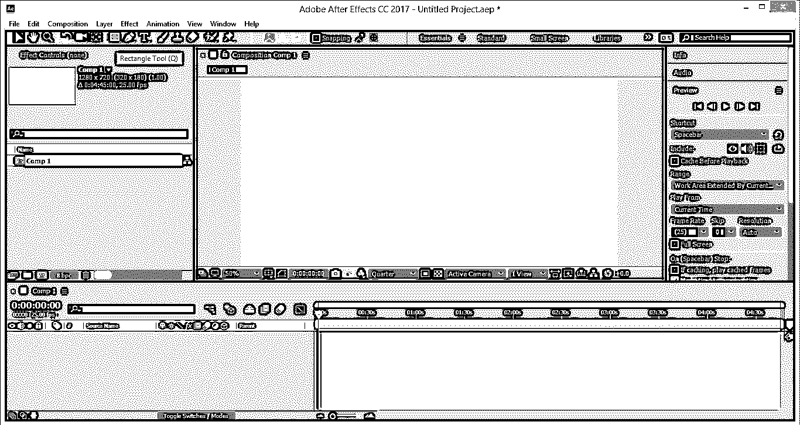

现在像这样画一个任意大小的矩形。

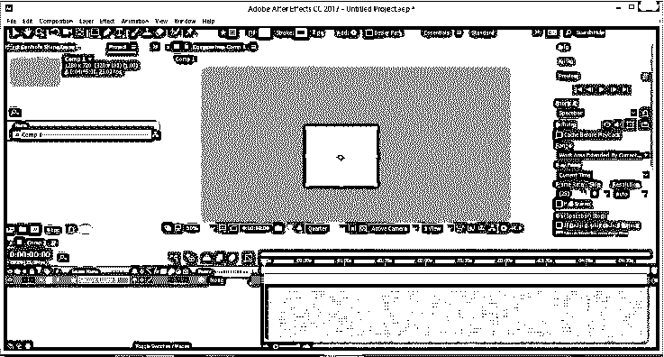

现在进入这个软件的图层面板，点击形状图层 1，然后按键盘上的 S 键，打开这个形状的缩放属性标签。现在将两个关键点设置为 0 到 100 %,这意味着在第一个关键点设置 0 比例值。

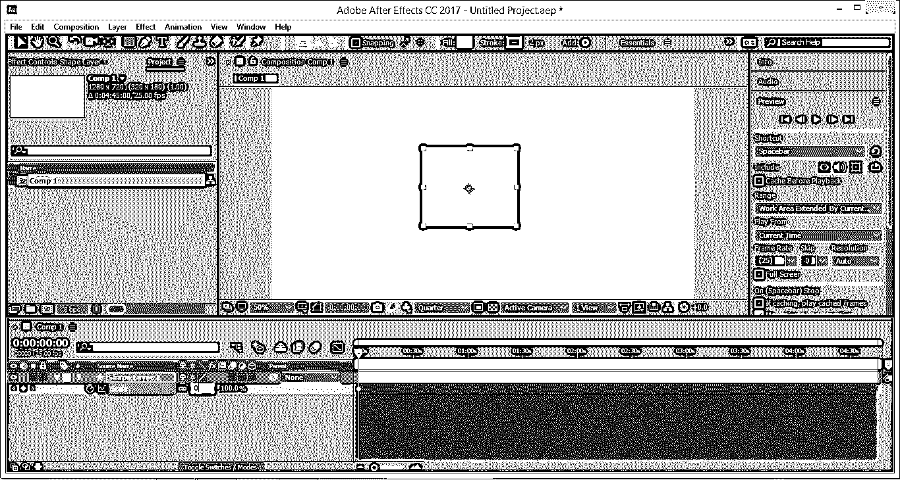

在第二个键上显示 100%的刻度值。

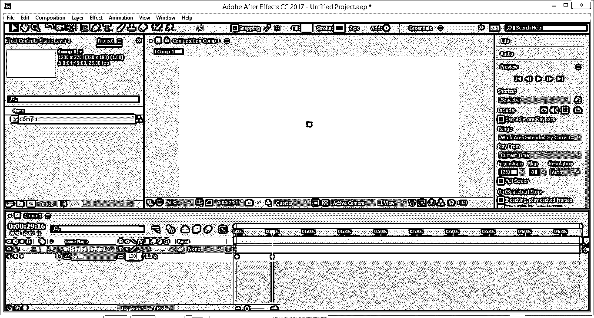

现在按住键盘上的 Alt 键，用鼠标键单击 scale 属性的秒表图标。单击后，表达式框将出现在此 scale 属性的关键帧部分。

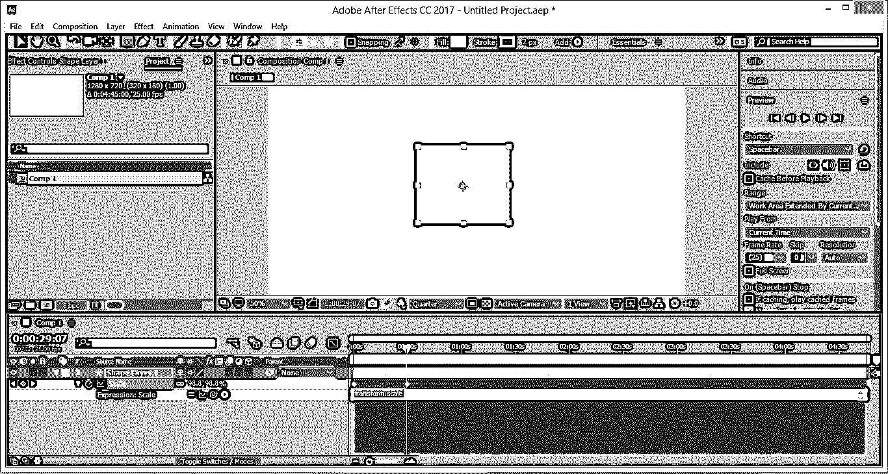

现在在这个框中键入这个表达式，或者您可以从这里复制粘贴它。此外，你可以从免费的互联网网站获得这种类型的表达。

`n = 0;
if (numKeys > 0){
n = nearestKey(time).index;
if (key(n).time > time){
n--;
}
}
if (n == 0){
t = 0;
}else{
t = time – key(n).time;
}
if (n > 0 && t < 1){
v = velocityAtTime(key(n).time – thisComp.frameDuration/10);
amp = .05;
freq = 4.0;
decay = 8.0;
value + v*amp*Math.sin(freq*t*2*Math.Pl)/Math.exp(decay*t);
}else{
value;
}`

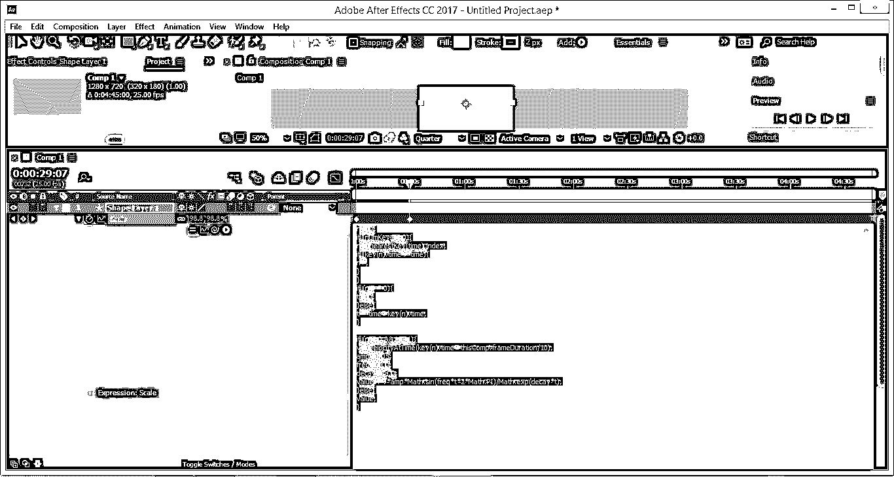

现在，您可以通过播放来查看 scale 属性中的反弹效果。此外，您可以根据自己的选择，通过更改该表达式的这三个值中的任何一个来更改反弹效果。

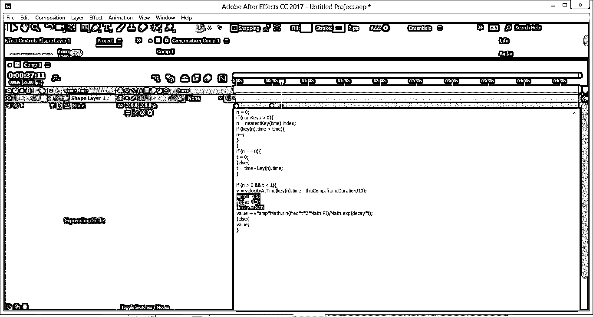

现在让我们键入代码，在这个形状的 position 属性上添加反弹表达式。首先，到图层面板，再次选择图层的形状，然后按下键盘上的 P 键进行定位属性。

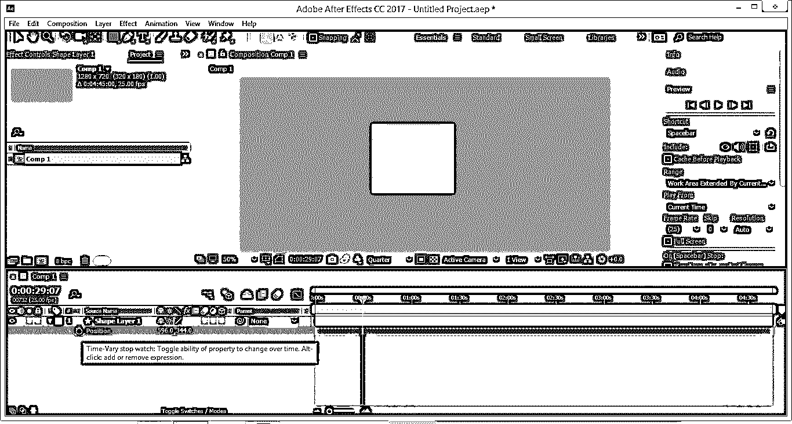

现在，在 position 属性中添加两个关键点，并将其从合成窗口的中间动画到底部，这意味着在第一个关键点，将这个矩形放在合成窗口的中心，第二个关键点，将它放在合成窗口的底部。

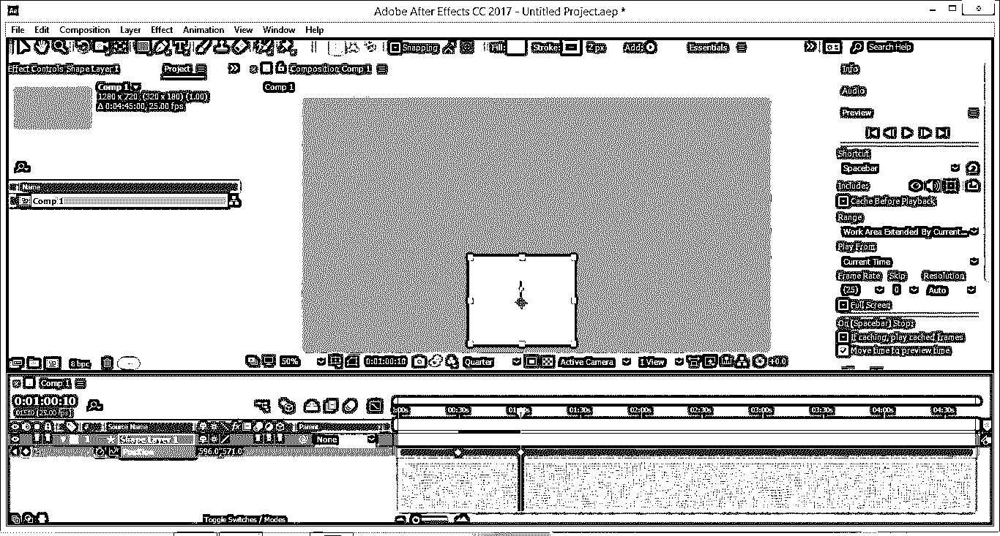

现在，按住键盘上的 Alt 键，单击该形状的 position 属性的秒表图标，一个表达式框将添加到该软件时间轴的关键帧部分。

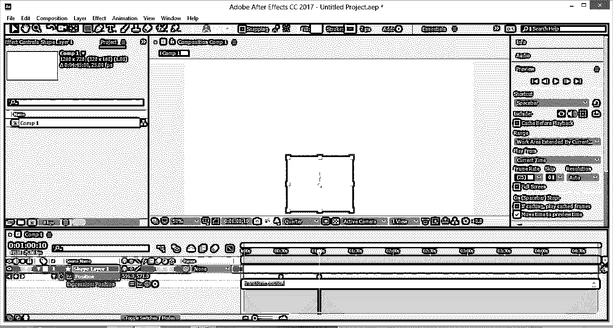

现在在这个框中键入这个表达式，或者您可以从这里复制粘贴它。此外，你可以从免费的互联网网站获得这种类型的表达。

`e = .7;
g = 5000;
nMax = 9;
n = 0;
if (numKeys > 0){
n = nearestKey(time).index;
if (key(n).time > time) n--;
}
if (n > 0){
t = time - key(n).time;
v = -velocityAtTime(key(n).time - .001)*e;
vl = length(v);
if (value instanceof Array){
vu = (vl > 0) ? normalize (v) : [0,0,0];
}else{
vu = (v < 0) ? -1 : 1;
}
tCur = 0;
segDur = 2*vl/g;
tNext = segDur;
nb = 1; // number of bounces
while (tNext < t && nb <= nMax){
vl *= e;
segDur *= e;
tCur = tNext;
tNext += segDur;
nb++
}
if(nb <= nMax){
delta = t - tCur;
value + vu*delta*(vl - g*delta/2);
}else{
value
}
}else
value`

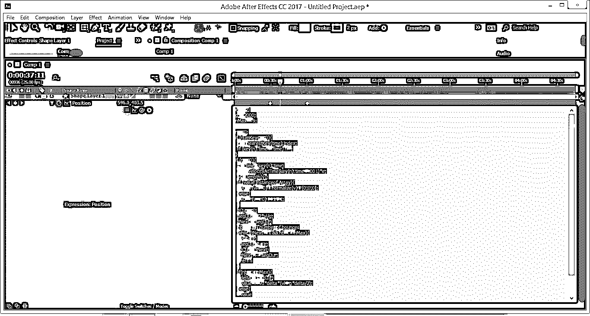

现在，您可以通过播放来查看反弹表达式对该形状的位置属性的影响。

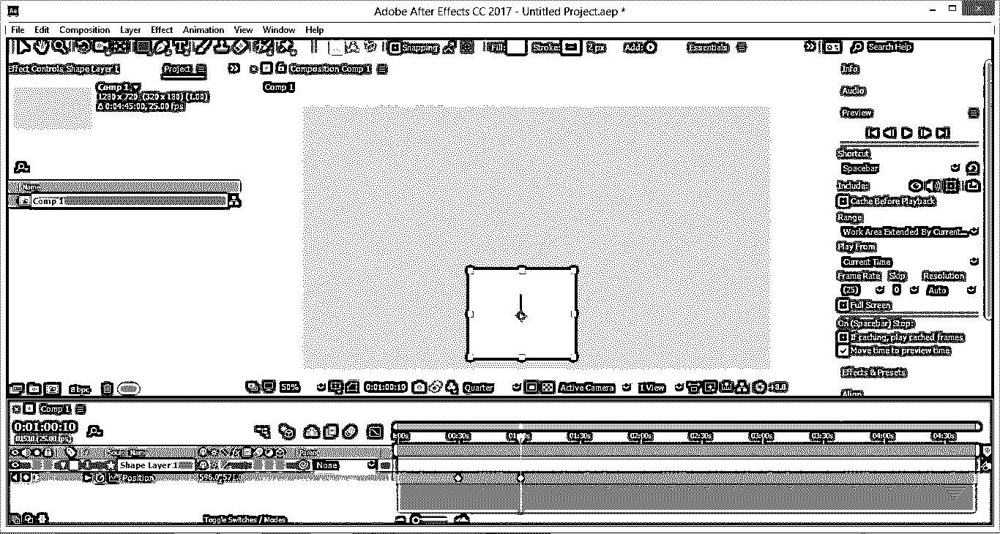

您可以更改该表达式的这两个值，以更改位置反弹属性。

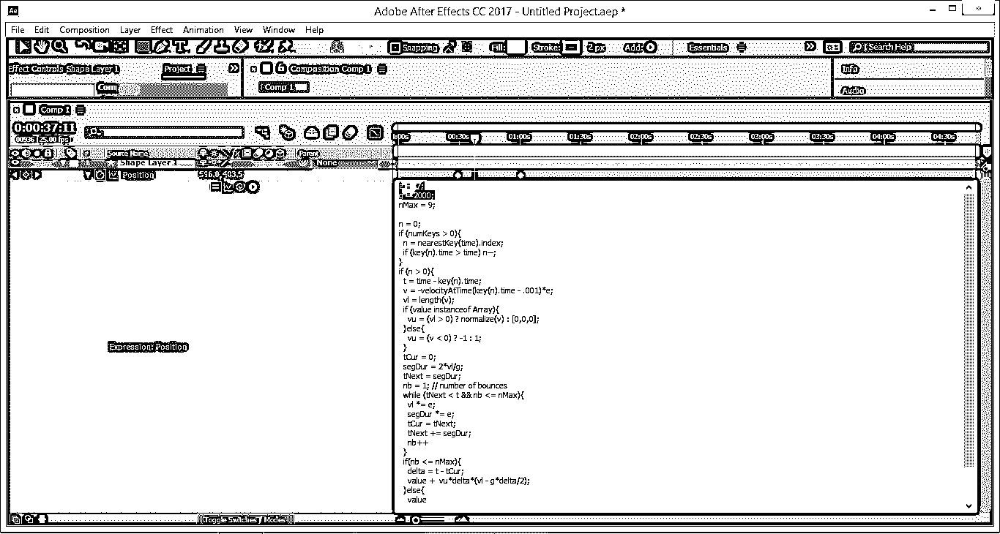

这样就可以在 After 效果中使用弹跳表情。

### 结论

现在，看完这篇文章，你可以理解什么是 After Effects 中的反弹表达式，以及如何输入表达式来得到它。您还可以了解如何更改这些表达式的值，以便在任何形状的后期效果的不同属性上产生不同的反弹效果。

### 推荐文章

这是一个后效应反弹表达式的指南。这里我们讨论如何在 After Effects 中使用反弹表达式，以及如何更改这些表达式的值。您也可以看看以下文章，了解更多信息–

1.  [后效中的陷码](https://www.educba.com/trapcode-in-after-effects/)
2.  [后效中的扭曲](https://www.educba.com/twixtor-in-after-effects/)
3.  [后效便携](https://www.educba.com/after-effects-portable/)
4.  [丛后效应](https://www.educba.com/plexus-after-effects/)

