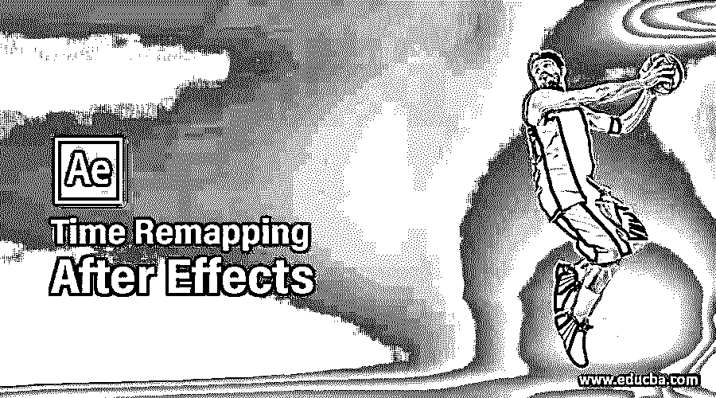
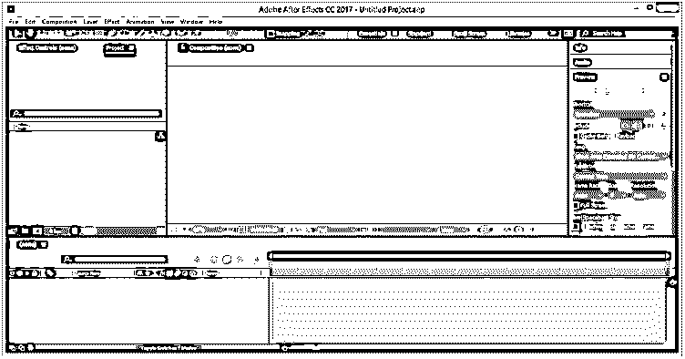
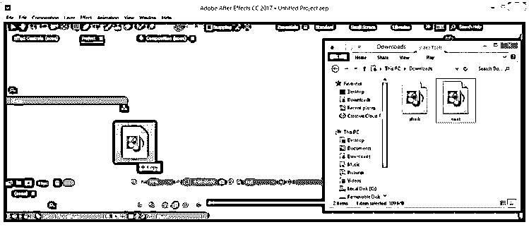
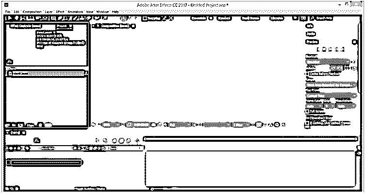
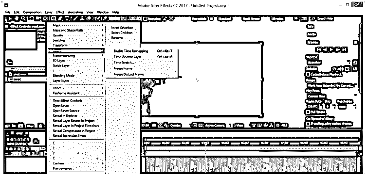
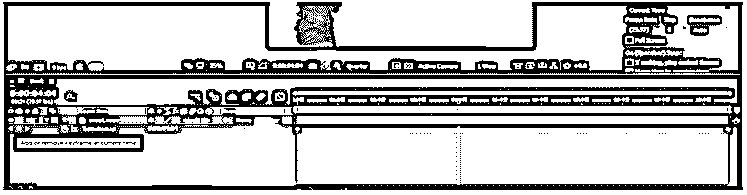
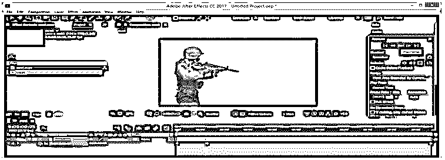
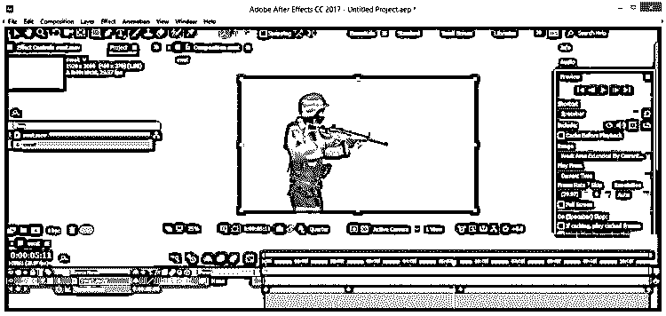
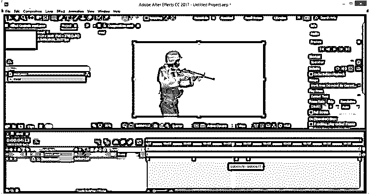
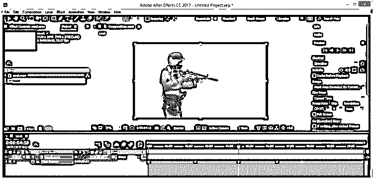

# 效果后的时间重映射

> 原文：<https://www.educba.com/time-remapping-after-effects/>

## 效果后时间重映射介绍

After Effects 的时间重映射是该软件的一项技术，通过该技术，您可以管理您制作的任何视频镜头或任何动画视频的时间帧，以便在您选择的关键帧之间加速时间帧或减慢时间帧的速度，或者您也可以通过该软件的时间重映射技术反向播放您的动画或视频镜头。为了学习时间重映射，我们必须了解时间框架的一些重要参数，通过处理这些参数，我们可以轻松地为您的视频片段或动画安排时间。

### 如何在 After Effect 中做时间重映射？

对于这个软件来说，这是一个有趣而简单的学习技巧。通过遵循这项技术的一些简单步骤，并了解重要的参数，我们可以很容易地学会它。但在开始之前，我认为我们应该了解这个软件的工作界面，这样我们就可以很容易地熟悉这个软件的不同术语，我们将在本文中使用这些术语来理解这个主题。

<small>3D 动画、建模、仿真、游戏开发&其他</small>

在工作屏幕的顶部，有一个称为菜单栏的栏。在第一个栏下面，是用户屏幕的第二个栏，这是一个工具栏。在第二个栏下面，用户屏幕分为三个部分，在左侧我们有项目面板，在中心，我们有合成窗口，我们可以在其中看到我们的工作，在右侧，我们有一些参数的标签，如预览标签，对齐标签，效果和预设以及其他一些重要的标签。最后，这个屏幕的下端分为两个重要的部分:左侧的图层面板和右侧的时间轴帧部分。

现在让我们有录像或动画视频供我们学习。我从一个互联网网站下载了视频片段。你也可以下载它或为此拍摄你的视频片段或动画视频。要在此软件中导入视频素材，请打开您个人计算机中保存视频的文件夹，选择您想要的视频并从中选取，然后将其放在此软件的项目面板中。

现在，借助鼠标左键，将这个视频素材从项目面板拖动到该软件的图层面板。

一旦你把它放到图层部分，它就会像这样显示在合成窗口中。您可以根据此列表的百分比值调整视频素材的显示区域。例如，我会选择 25 %来正确观看我的视频片段。您可以根据视频素材的大小选择任何其他百分比。

现在转到这个软件的图层面板，右键单击这个视频片段的图层。一旦你点击，一个下拉列表就会像这样打开。转到此列表的时间选项，并从新的弹出列表中选择“启用时间重新映射”选项，或者您可以简单地按下键盘上的 Ctrl + Alt + T 按钮作为启用此选项的快捷键。

一旦您启用此选项，两个关键点将被添加到时间轴的关键帧部分区域，并且时间重映射选项将出现在这样的图层部分中。

时间重映射选项的第一个键将在 0 秒时添加。

时间重映射选项的第二个键将添加到视频素材的结束帧。

现在，我们将在这两个键之间添加一个键，以加快视频片段的播放速度。所以把关键帧的播放头放在这个帧上，拖动它，然后点击这个软件图层部分的添加按钮。

现在将该关键点拖动到时间重映射选项的第一个关键点附近。这样做时，第一个关键点和添加的关键点之间的时间将被压缩。现在，通过点击预览选项卡的播放按钮来播放视频，或者您可以按空格键作为播放视频的快捷键，当您播放该视频时，这两个键之间的视频播放速度会变快。

现在，假设您将该关键点拖动到远离时间重映射选项的第一个关键点的某个帧处。在这种情况下，这些键之间的视频播放速度会变慢，或者您可以添加更多的键，并增加添加的键与现在播放视频之间的帧距离。由于所选按键之间的时间消耗，设置按键之间的视频速度变慢。

您可以使用该软件的时间重新映射选项来反向播放您的视频。您可以在视频片段的某些部分使用这种技术，因此，让我们从这里拖动关键帧播放头；你想扭转你的视频，并在这两个添加的关键点之间再添加一个关键点，通过点击这个软件的图层面板中的关键点的添加按钮。

现在，用鼠标按钮选择该关键帧并按住鼠标按钮，然后在该视频素材的层中向前拖动该关键帧，然后将其放置在该层的第二个添加的关键帧之后，就像这样。现在，当你按下这个软件的预览选项卡的播放按钮来播放它时，它将从你选择的帧反向播放。

您也可以将最后一个关键帧拖到添加的关键帧附近，以加快这些关键帧之间的视频速度，或者将添加的关键帧拖离最后一个关键帧，以减慢这些关键帧之间的素材速度，然后在最后一个关键帧之后，您的视频将以正常播放速度播放。

这样，您可以使用 After Effects 的时间重新映射选项。

### 结论

在这篇文章之后，你现在可以理解什么是 After Effect 中的时间重映射，以及你如何处理 After Effect 的这个特性的参数。此外，您可以通过一次又一次地用您的想法练习来增加您在这个特性上的专业知识。

### 推荐文章

这是一个在效果后重新映射时间的指南。这里我们讨论如何在 After Effect 中进行时间重映射，以及如何处理 After Effect 的这个特性的参数。您也可以看看以下文章，了解更多信息–

1.  [后效时间线](https://www.educba.com/after-effects-timeline/)
2.  [Logo 展示后效果](https://www.educba.com/logo-reveal-after-effects/)
3.  [后期特效中的变形](https://www.educba.com/morphing-in-after-effects/)
4.  [特效后摆动](https://www.educba.com/wiggle-in-after-effects/)

